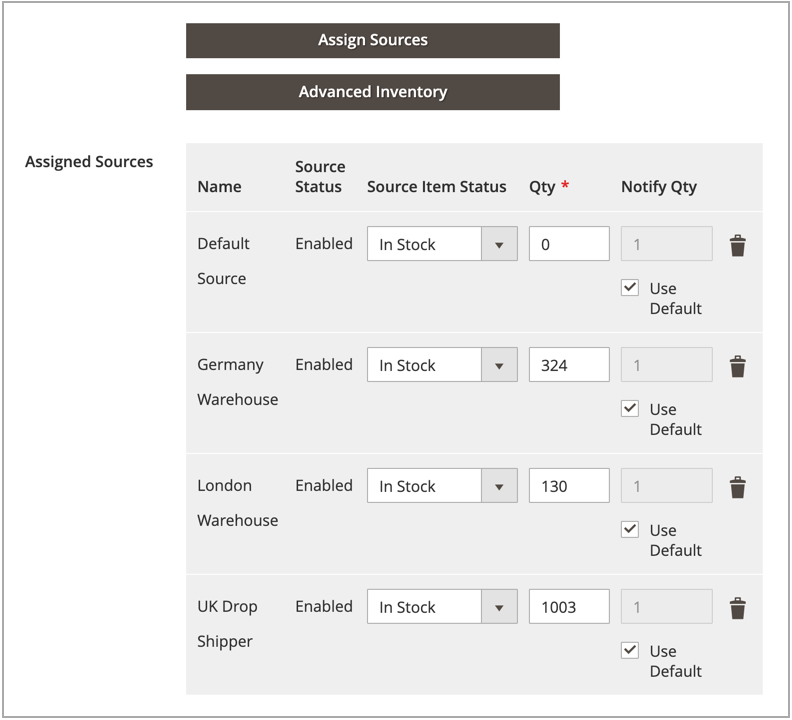

# Asignar cantidades por producto

Después de agregar [orígenes](sources-assign-per-product.md), actualice las cantidades de inventario del producto. Estos valores hacen un seguimiento de las existencias disponibles.

Para ocultar el inventario de un origen de los envíos sin quitar el origen, establezca _[!UICONTROL Source Item Status]_&#x200B;en `Out of Stock`. Las opciones de SSA y envío solo acceden a los orígenes enumerados como `In Stock` con la cantidad de inventario disponible.

Todas las cantidades y orígenes actualizados se muestran en la cuadrícula del producto.

## Actualización de cantidades

1. En la barra lateral _Admin_, vaya a **[!UICONTROL Catalog]** > **[!UICONTROL Products]**.

1. Busque y abra un producto en modo de edición.

1. Expanda  en la sección **[!UICONTROL Sources]**.

1. Establezca **[!UICONTROL Source Item Status]** en `In Stock`.

1. para actualizar la cantidad de existencias disponibles, escriba una cantidad para **[!UICONTROL Qty]**.

1. Para establecer una notificación para cantidades de inventario, siga uno de estos procedimientos:

   - Cantidad de notificación personalizada - Anule la selección de la casilla de verificación **[!UICONTROL Use Default]** e introduzca una cantidad en **[!UICONTROL Notify Qty]**.
   - Cantidad de notificación predeterminada: seleccione la casilla **[!UICONTROL Use Default]**. [!DNL Commerce] comprueba y usa la configuración de _[!UICONTROL Advanced Inventory]_&#x200B;o de la configuración del almacén global.

   {width="350" zoomable="yes"}

1. Realice una de las siguientes acciones para guardar:

   - Haga clic en **[!UICONTROL Save]**.

   - En el menú **[!UICONTROL Save]** (), elija **[!UICONTROL Save & Close]**.

La cuadrícula de producto se actualiza con una lista de todos los orígenes y las cantidades relacionadas. Para los productos con más de cinco orígenes asignados, pase el ratón sobre la columna _[!UICONTROL Quantity per Source]_&#x200B;para ver la lista completa.

{width="600" zoomable="yes"}
