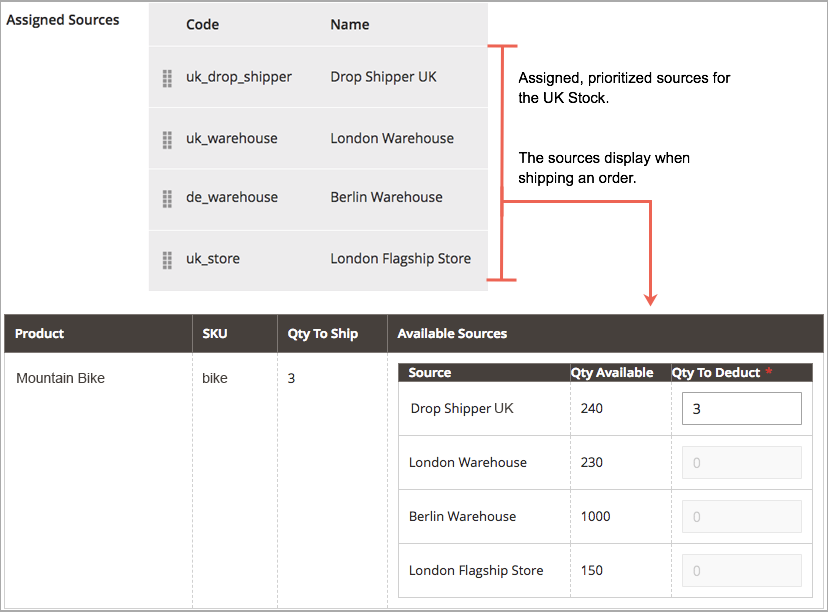

# Algoritmos y reservas de Source

El corazón de [!DNL Inventory Management] rastrea todos los productos disponibles de forma virtual y disponible en sus almacenes y tiendas. Los sistemas de Algoritmo de Selección y Reservas de Source se ejecutan en segundo plano, manteniendo las cantidades disponibles actualizadas, sin colisiones ni opciones de envío recomendadas.

>[!NOTE]
>
>Consulte la [documentación para desarrolladores](https://developer.adobe.com/commerce/php/development/framework/inventory-management/) para obtener información sobre cómo trabajar con el sistema [!DNL Inventory Management] mediante programación.

## Algoritmo de selección de Source

El algoritmo de selección de Source (SSA) analiza y determina la mejor coincidencia para los orígenes y envíos utilizando el orden de prioridad de los orígenes configurados en una acción. Durante el envío del pedido, el algoritmo proporciona una lista recomendada de orígenes, cantidades disponibles e importes a deducir según el algoritmo seleccionado. [!DNL Inventory Management] proporciona un algoritmo de Prioridad y admite extensiones para las nuevas opciones.

Con múltiples ubicaciones de origen, clientes globales y proveedores de servicios con diversas opciones y tarifas de envío, conocer el inventario disponible real y encontrar la mejor opción de envío puede ser difícil. SSA realiza el trabajo por usted, desde el seguimiento de las cantidades comercializables en inventario en todas las fuentes hasta el cálculo y la realización de recomendaciones para los envíos.

**Seguimiento del inventario**: usando existencias y orígenes, el SSA comprueba el canal de ventas de las solicitudes de productos entrantes y determina el inventario disponible:

- Calcula la cantidad vendible virtual agregada de todos los orígenes asignados por stock: agregados Cantidad - Umbral de Agotado por origen
- Resta la cantidad del umbral de falta de existencias de la cantidad vendible para protegerla contra las ventas excesivas
- Reserva las cantidades de inventario en la presentación del pedido, deduciendo del inventario en existencias en el procesamiento y envío del pedido
- Admite pedidos pendientes con opciones mejoradas para umbrales negativos

**Administrar envíos**: el algoritmo ayuda a procesar y enviar pedidos. Puede ejecutar el algoritmo para obtener recomendaciones sobre las mejores fuentes para enviar el producto o anular las selecciones para:

- Envíe envíos parciales, enviando solo unos pocos productos desde ubicaciones específicas y completando el pedido completo más tarde
- Enviar todo el pedido desde un origen
- Divida los envíos entre múltiples fuentes en diferentes cantidades, manteniendo un stock equilibrado en todos los almacenes y tiendas

SSA es extensible para soporte de terceros y algoritmos personalizados para recomendar envíos rentables.

>[!NOTE]
>
>SSA funciona de manera diferente para productos virtuales y descargables, que pueden no incurrir en gastos de envío. En estos casos, el sistema ejecuta el algoritmo de forma implícita cuando crea facturas y siempre utiliza los resultados sugeridos. No puede ajustar estos resultados para productos virtuales y descargables.

### Algoritmo de prioridad de Source

Las existencias personalizadas incluyen una lista asignada de fuentes para vender y enviar el inventario de productos disponible a través de su tienda. El algoritmo de prioridad de Source utiliza el orden de los orígenes asignados en el inventario para recomendar deducciones de productos por origen al facturar y enviar el pedido.

Cuando se ejecuta, el algoritmo:

- Funciona según el orden configurado de las fuentes en el nivel de stock, empezando por la parte superior
- Recomienda una cantidad a enviar y una fuente por producto en función del pedido de la lista, la cantidad disponible y la cantidad pedida
- Continúa en la lista hasta que se completa el envío del pedido
- Omite los orígenes deshabilitados si se encuentran en la lista

Para configurar, asignar y ordenar orígenes a un stock personalizado. Consulte [Priorización de orígenes para un recurso](stocks-prioritize-sources.md).

En el siguiente ejemplo se detallan los orígenes asignados en orden, la cantidad disponible y el origen y la cantidad recomendados para deducir y enviar. La fuente principal es un Drop Shipper en el Reino Unido con una cantidad disponible de 240.

{width="600" zoomable="yes"}

### Algoritmo de prioridad de distancia

El algoritmo de prioridad de distancia compara la ubicación de la dirección de destino de envío con las ubicaciones de origen para determinar el origen más cercano para realizar envíos. La distancia puede determinarse por la distancia física o el tiempo que se pasa viajando de un lugar a otro, utilizando ubicaciones importadas de la base de datos o direcciones de Google (conducir, caminar o montar en bicicleta).

Tiene dos opciones para calcular la distancia y el tiempo para encontrar el origen más cercano para la satisfacción del envío:

- **Google MAP** - Usa los servicios de [Google Maps Platform](https://cloud.google.com/maps-platform/) para calcular la distancia y el tiempo entre la dirección de destino de envío y las ubicaciones de origen (dirección y coordenadas GPS). Esta opción utiliza la latitud y la longitud de origen. Se requiere una clave de API de Google con [API de geocodificación](https://developers.google.com/maps/documentation/geocoding/start) y [API de matriz de distancia](https://developers.google.com/maps/documentation/distance-matrix/start) habilitadas. Esta opción requiere un plan de facturación de Google y puede incurrir en cargos a través de Google.

- **Cálculo sin conexión**: calcula la distancia mediante datos de geocódigo descargados e importados para determinar el origen más cercano a la dirección de destino de envío. Esta opción utiliza los códigos de país de la dirección de envío y el origen. Para configurar esta opción, es posible que necesite asistencia del desarrollador para descargar e importar inicialmente geocódigos mediante una línea de comandos.

Para configurarlo, seleccione las configuraciones y complete los pasos adicionales, como la clave de API de Google o la descarga de datos de envío. Consulte [Configurar el algoritmo de prioridad de distancia](distance-priority-algorithm.md).

### Algoritmos personalizados

[!DNL Commerce] admite desarrollo personalizado y extensiones para agregar algoritmos alternativos para priorizar los orígenes. Por ejemplo, puede tener un algoritmo de prioridad basado en la ubicación geográfica y otro basado en el gasto de existencias o en un atributo del cliente. Cuando el coste de las existencias cambia, la implementación puede cambiar fácilmente los algoritmos para garantizar el coste más bajo.

## Reservas

En lugar de deducir o añadir inmediatamente las cantidades de inventario de productos, las reservas retienen los importes de inventario hasta que los pedidos se envían o cancelan. Las reservas funcionan completamente en el backend para actualizar automáticamente la cantidad vendible en el nivel de stock.

>[!NOTE]
>
>[!BADGE Solo PaaS]{type=Informative url="https://experienceleague.adobe.com/en/docs/commerce/user-guides/product-solutions" tooltip="Se aplica solo a proyectos de Adobe Commerce en la nube (infraestructura PaaS administrada por Adobe) y a proyectos locales."} La capacidad de reserva requiere que el consumidor de cola de mensajes `inventory.reservations.updateSalabilityStatus` se ejecute continuamente. Para comprobar si se está ejecutando, utilice el comando `bin/magento queue:consumers:list`. Si el consumidor de cola de mensajes no aparece en la lista, inícielo: `bin/magento queue:consumers:start inventory.reservations.updateSalabilityStatus`.

### Reservas de pedidos

Las reservas retienen las cantidades de inventario deducidas de la cantidad vendible al ejecutar un pedido. Las reservas se encuentran en el nivel de stock, contando las cantidades hasta que el pedido se factura y envía, se cancela, etc. Al enviar el pedido, puede utilizar las recomendaciones de SSA o introducir manualmente deducciones de cantidad por origen. Cuando se envían, las reservas se compensan automáticamente y se deduce la cantidad. La cantidad vendible vuelve a calcular para el stock con una cantidad actualizada y los importes de reserva restantes en el sistema.

El siguiente diagrama ayuda a definir el proceso de reservas durante un pedido y hasta el envío.

{width="600" zoomable="yes"}

Un cliente envía una solicitud. [!DNL Commerce] comprueba la cantidad vendible de inventario actual. Si hay suficiente inventario disponible en el nivel de stock, una reserva introduce una retención temporal para el SKU del producto (para ese stock) y vuelve a calcular la cantidad vendible.

Después de facturar el pedido, determina las cantidades de productos que se deben deducir y enviar de sus orígenes. El envío se procesa y se envía desde uno o varios orígenes seleccionados al cliente. Las cantidades se deducen automáticamente de la cantidad de inventario de origen y las reservas se borran. Para obtener detalles y ejemplos completos, consulte [Acerca del estado del pedido y las reservas](order-status.md).

## Cálculos de reservas

El sistema crea una reserva para cada producto cuando se producen los siguientes eventos:

- Un cliente o comerciante realiza un pedido.
- Un cliente o comerciante cancela un pedido total o parcialmente.
- El comerciante crea un envío para un producto físico.
- El comerciante crea una factura para un producto virtual o descargable.
- El comerciante emite un abono.

Las reservas son operaciones de solo anexar, similares a un registro de eventos. A la reserva inicial se le asigna un valor de cantidad negativo. Todas las reservas posteriores creadas al procesar el pedido son valores positivos. Una vez finalizado el pedido, la suma de todas las reservas del producto es 0.

Antes de que el sistema pueda emitir una reserva en respuesta a un nuevo pedido, determina si hay suficientes artículos vendibles para cumplir el pedido. Las cantidades siguientes se tienen en cuenta en el cálculo:

- **Cantidad de StockItem**. La cantidad de StockItem es la cantidad agregada de inventario de todos los orígenes físicos para el canal de ventas actual. Veamos un ejemplo en el que la fuente de Baltimore tiene 20 unidades de un producto, la fuente de Austin tiene 25 unidades del mismo producto y la fuente de Reno tiene 10. Cuando todos estos orígenes están vinculados a Stock A, el recuento de StockItem de este producto es 55 (20 + 25 + 10). (Cuando se envían artículos, el indexador de inventario actualiza las cantidades disponibles en cada origen).

- **Reservas pendientes**. El sistema totaliza todas las reservas iniciales que no han sido compensadas. Este número siempre es negativo. Si el cliente A tiene una reserva de diez artículos y el cliente B tiene una reserva de cinco para los artículos, las reservas pendientes del producto totalizan -15.

Por lo tanto, el comerciante puede satisfacer un pedido entrante siempre y cuando el cliente pida menos de 40 unidades (55 + -15).

Al finalizar el procesamiento de un pedido (Completo, Cancelado, Cerrado), todas las reservas en el ámbito de ese pedido deben resolverse en `0`. Esto borra todas las retenciones de cantidad vendible.

>[!NOTE]
>
>Los pedidos no satisfechos (con umbrales de existencias) y la configuración Notificar para cantidad por debajo de los umbrales también afectan al cálculo de las cantidades vendibles, pero están fuera del ámbito de este tema. Para obtener más información acerca de esta configuración, consulte [Configurar [!DNL Inventory Management]](./configuration.md).

## Objetos de reserva

Una reserva contiene la siguiente información:

| Parámetro | Tipo de datos | Descripción |
| --- | --- | --- |
| `reservation_id` | Entero | Un ID generado por el sistema |
| `stock_id` | Entero | El ID de stock al que está asignado el producto |
| `sku` | Cadena | El SKU del producto |
| `quantity` | Flotante | El número de elementos de esta reserva |
| `metadata` | Cadena | El tipo de evento, el tipo de objeto y el ID de objeto de esta reserva. Por ejemplo, `{"event_type":"order_placed","object_type":"order",| "object_id":"8"}` |

{style="table-layout:auto"}

Los metadatos `event_type` pueden tener los siguientes valores:

- `order_placed`
- `order_canceled`
- `shipment_created`
- `creditmemo_created`
- `invoice_created`

Actualmente, el tipo de objeto de metadatos debe ser `order` y el identificador de objeto es el identificador de pedido.

En futuras versiones, podría ser posible crear una reserva cuando un cliente añada un artículo a un carro de compras. Cada artículo puede reservarse por un tiempo fijo, como 15 minutos, lo que permite al cliente reservar artículos mientras continúa comprando. Cuando este tipo de reserva está habilitado, los metadatos pueden contener tipos de información adicionales.

## Ciclo de reserva

El siguiente ejemplo muestra la secuencia de reservas generadas para un pedido simple.

1. El cliente hace un pedido de compra de 25 unidades del producto `SKU-1`. La reserva contiene la siguiente información:

   ```text
   reservation_id = 1
   stock_id = 1
   sku = SKU-1
   quantity = -25
   event_type = order_placed
   ```

1. El cliente envía una factura de 20 artículos, básicamente cancelando 5 de las unidades solicitadas.

   ```text
   reservation_id = 2
   stock_id = 1
   sku = SKU-1
   quantity = 5
   event_type = order_canceled
   ```

1. El comerciante envía las 20 unidades compradas.

   ```text
   reservation_id = 3
   stock_id = 1
   sku = `SKU-1`
   quantity = 20
   event_type = shipment_created
   ```

Los tres valores de `quantity` suman 0 (-25 + 5 + 20). El sistema no modifica ninguna reserva existente.

## Eliminación de reservas procesadas

El trabajo cron `inventory_cleanup_reservations` ejecuta consultas SQL para borrar la tabla de la base de datos de reservas. De forma predeterminada, se ejecuta a diario a medianoche, pero puede configurar las horas y la frecuencia. El trabajo cron ejecuta un script que consulta la base de datos para encontrar secuencias de reserva completas en las que la suma de los valores de cantidad es 0. Cuando se hayan compensado todas las reservas de un producto determinado originado el mismo día (u otra hora configurada), el trabajo cron elimina todas las reservas a la vez.

El trabajo cron `inventory_reservations_cleanup` no es el mismo que el consumidor de cola de mensajes `inventory.reservations.cleanup`. El consumidor elimina las reservas de forma asíncrona por SKU de producto después de eliminar un producto, mientras que el trabajo cron borra toda la tabla de reservas. El consumidor es necesario cuando se habilita la opción de existencias [**Sincronizar con el catálogo**](../configuration-reference/catalog/inventory.md) en la configuración de la tienda. Consulte [Administrar colas de mensajes](https://experienceleague.adobe.com/docs/commerce-operations/configuration-guide/message-queues/manage-message-queues.html) en la _Guía de configuración_.

A menudo, todas las reservas iniciales producidas en un solo día no pueden compensarse ese mismo día. Esta situación puede ocurrir cuando un cliente realiza un pedido justo antes de que comience el trabajo cron o realiza la compra con un método de pago sin conexión, como una transferencia bancaria. Las secuencias de reservas compensadas permanecen en la base de datos hasta que todas se compensan. Esta práctica no interfiere con los cálculos de reserva, ya que el total de cada reserva es 0.

>[!NOTE]
>
>Hay comandos CLI que puede utilizar para detectar y administrar incoherencias en las reservas (consulte la [[!DNL Inventory Management] Referencia de CLI](cli.md)).

### Actualizaciones de reservas

A medida que se completan los cambios en los pedidos e importes del producto, [!DNL Commerce] introduce automáticamente las compensaciones de reserva. No es necesario introducir compensaciones a través del administrador o del código para actualizar o borrar estas retenciones. Las reservas solo se ven afectadas por reservas introducidas para retener una cantidad o para compensar una cantidad retenida (compensando las reservas).

Así es como funcionan:

- **Pedido enviado**: cuando se envía un pedido de varios productos, se introduce una reserva por esa cantidad. Por ejemplo, al pedir cinco mochilas desde un sitio web de EE. UU., se introduce una reserva de `-5` para ese SKU y existencias. La cantidad vendible se reduce en 5.

- **Pedido cancelado**: cuando se cancela un pedido (total o parcialmente), se introduce una reserva de compensación para borrar esa cantidad. Por ejemplo, si cancela tres mochilas, se introduce una reserva +3 para ese SKU y stock y se borra la retención. La cantidad vendible se incrementa en 3.

- **Pedido enviado**: cuando se envía un pedido (total o parcialmente), se introduce una reserva de compensación para borrar esa cantidad. Por ejemplo, si se envían dos mochilas, se introduce una reserva +2 para ese SKU y stock y se elimina la retención. La cantidad del producto se reduce directamente en 2 para el envío. La cantidad vendible calculada también se actualiza para la cantidad de stock reducida, pero ya no se ve afectada por la reserva.

{width="600" zoomable="yes"}

Todas las reservas deben ser compensadas por compensaciones cuando los pedidos completan el cumplimiento, los productos cancelan, se emiten notas de crédito, etc. Si las compensaciones no liquidan las reservas, podría tener cantidades retenidas en estasis (no disponibles para la venta y nunca para el envío).

>[!NOTE]
>
>Si desea revisar las reservas, hay disponibles una serie de opciones de línea de comandos. Sólo se pueden revisar reservas a través de una interfaz de línea de comandos. El uso de comandos CLI puede requerir la asistencia del desarrollador. Consulte [[!DNL Inventory Management] Referencia de CLI](cli.md).

Si elimina todas las fuentes de un producto para un stock con pedidos pendientes, es posible que tenga reservas atascadas.

{{$include /help/_includes/unassign-source.md}}


<!-- Last updated from includes: 2022-08-30 15:36:09 -->
