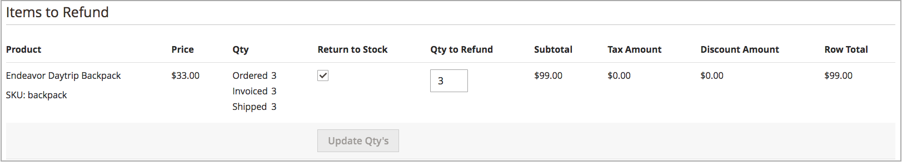

# Administrar pedidos y envíos

[!DNL Inventory Management] incluye funciones y opciones adicionales para gestionar las cantidades de inventario mediante el proceso de envío. A medida que revisa y satisface envíos, cancela pedidos y emite notas de abono, las cantidades disponibles y disponibles del producto se actualizan automáticamente.

Esta información incluye datos específicos de [!DNL Inventory Management]. Para obtener más información, consulte la [Pedidos](../stores-purchase/orders.md){target="_blank"} tema en la _Guía de ventas y experiencia de compra_.

## Pedidos

[!DNL Commerce] admite pedidos únicos y pedidos de varias direcciones predefinidos sin configuraciones adicionales. A medida que los clientes o el personal ingresan pedidos, [!DNL Inventory Management] realiza un seguimiento del inventario mediante reservas en relación con la cantidad vendible, deduciendo de la cantidad de inventario los productos facturados y enviados.

### Pedidos de varias direcciones

Para los pedidos de varias direcciones, se genera una serie de pedidos únicos, uno para cada dirección de destino introducida. Durante el cierre de compra, los clientes seleccionan cada conjunto de productos asociados por dirección durante el cierre de compra y generan como pedidos únicos según la dirección de destino. Cada pedido incluye los productos asociados por dirección.

[!DNL Commerce] administra el inventario de estos pedidos de varias direcciones exactamente igual que los pedidos únicos. Permite realizar recomendaciones o sustituciones del algoritmo de selección de origen durante el envío, los envíos parciales, la cancelación de pedidos y el reembolso con actualizaciones de stock.

{width="350" zoomable="yes"}

### Reembolsos

Al introducir un [nota de crédito](../stores-purchase/credit-memo-create.md){target="_blank"} para emitir un reembolso, puede devolver la cantidad del producto a la fuente deducida. La información del pedido incluye el origen de inventario que envió el producto. Se recomienda asignar la cantidad de producto devuelto mediante un abono cuando reciba el producto devuelto.

{width="350" zoomable="yes"}

### Cancelar pedidos no enviados

Si un pedido no se ha enviado y se cancela (total o parcialmente), [!DNL Inventory Management] devuelve automáticamente el stock del producto a la cantidad vendible. Hasta la factura y el envío, los productos comprados se reservan contra la cantidad vendible, no deducida de la cantidad real. En el momento de facturar y enviar el pedido, el sistema convierte la reserva en una deducción de inventario.

Entre bastidores, [!DNL Inventory Management] introduce automáticamente una reserva de compensación eliminando la retención en la cantidad del producto. La cantidad vuelve a la cantidad virtual vendible agregada.

## Envíos

Con [!DNL Inventory Management] si está activada, puede enviar envíos parciales o completos desde uno o varios orígenes para satisfacer pedidos. Controle el inventario saliente para cada pedido, configurando las cantidades a deducir, enviando uno o más envíos y entregando el stock y los pedidos pendientes a medida que el inventario esté disponible. Para cada artículo de línea del pedido, introduzca una cantidad que deducir de la cantidad de origen. Genere un envío por origen, ya que tiene stock de inventario, hasta que se satisfaga todo el pedido.

### Envíos parciales

Para comerciantes de varias fuentes, [!DNL Commerce] genera un envío para cada origen seleccionado. El flujo de trabajo general permite seleccionar un origen, definir la cantidad de productos que se debe deducir para satisfacer el pedido y continuar con el envío. Cuando finalice, cree envíos adicionales para cada origen hasta que haya satisfecho el pedido.

Los comerciantes de origen único también pueden enviar envíos parciales para respaldar pedidos pendientes o equilibrar el inventario a medida que llegan pedidos de artículos populares.

### Algoritmo de selección de origen y Recommendations

El [Algoritmo de selección de origen](selection-reservations.md) (SSA) ofrece recomendaciones para envíos parciales y completos. Puede acceder a los algoritmos de selección de origen al crear facturas de envío para un pedido. A través de la página Envío, ejecute el algoritmo Prioridad de Origen o Prioridad de Distancia en cualquier momento para determinar las mejores opciones para confrontar cantidades pedidas y orígenes disponibles. El sistema permite enviar un pedido completo desde un origen y dividir el pedido en varios envíos parciales a través de varios orígenes. Puede acceder a estas opciones para el cumplimiento inmediato y envíos escalonados para enviar cantidades más pequeñas a lo largo del tiempo.

Para completar y enviar un pedido, debe haber completado el pago y ser facturado. Actualmente, puede volver a ejecutar el SSA para recomendaciones y envíos desde uno o varios orígenes, o sustituir las recomendaciones del SSA con orígenes y cantidades definidos manualmente para satisfacer envíos.

- Se recomienda volver a ejecutar la SSA para revisar las recomendaciones de cada envío.

- Si desea cambiar las selecciones, puede sustituir con deducciones de origen manuales.

### Envíos y reservas

A medida que se generan los envíos, se eliminan las reservas de productos y se deduce la cantidad de productos. La cantidad física actual por stock se actualiza en función de los detalles de envío. Por ejemplo, si envía envíos de diez productos de dos fuentes, las cantidades de esas fuentes deducen 10 cada una. La cantidad vendible se actualiza automáticamente para las existencias asociadas, proporcionando a los clientes y al personal las cantidades de productos más recientes. Y las reservas se aclaran por completo, sin contar con la cantidad vendible.
