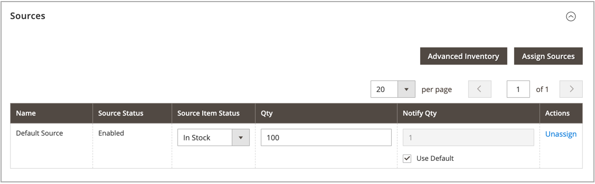

# Asignación de fuentes por producto

Antes de modificar cantidades y configuraciones, debe asignar [orígenes](sources-manage.md) a los productos.

{{$include /help/_includes/unassign-source.md}}

## Asignación de fuentes a un producto

1. En el _Administrador_ barra lateral, vaya a **[!UICONTROL Catalog]** > **[!UICONTROL Products]**.

1. Abra un producto en _Editar_ modo.

1. Expandir  el **[!UICONTROL Sources]** sección.

   Esta sección le permite modificar el origen, actualizar las cantidades de inventario y mucho más.

   >[!NOTE]
   >
   >Actualmente, solo los productos simples, configurables, virtuales, descargables y agrupados admiten varias fuentes. Los productos agrupados se pueden crear y administrar con solo el origen y las existencias predeterminados.

   {width="600" zoomable="yes"}

1. Para añadir una fuente, haga clic en **[!UICONTROL Assign Sources]**.

1. En el _[!UICONTROL Assign Sources]_, active la casilla situada junto a cada origen que desee asignar al producto.

   {width="600" zoomable="yes"}

1. Clic **[!UICONTROL Done]** para añadir las fuentes.

1. Realice una de las siguientes acciones para guardar:

   - Haga clic **[!UICONTROL Save]**.
   - En el _[!UICONTROL Save]_ (), seleccione **[!UICONTROL Save & Close]**.

Después de asignar orígenes, actualice el [cantidad inventario](quantities-assign-per-product.md) para cada origen de producto.
