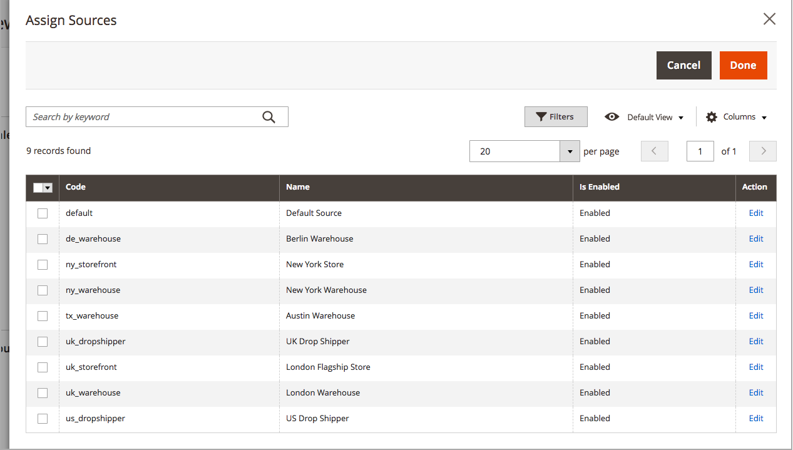

# Asignación de fuentes por producto

Antes de modificar cantidades y configuraciones, debe asignar [orígenes](sources-manage.md) a los productos.

{{$include /help/_includes/unassign-source.md}}

## Asignación de fuentes a un producto

1. En la barra lateral _Admin_, vaya a **[!UICONTROL Catalog]** > **[!UICONTROL Products]**.

1. Abra un producto en modo _Editar_.

1. Expanda  en la sección **[!UICONTROL Sources]**.

   Esta sección le permite modificar el origen, actualizar las cantidades de inventario y mucho más.

   >[!NOTE]
   >
   >Actualmente, solo los productos simples, configurables, virtuales, descargables y agrupados admiten varias fuentes. Los productos agrupados se pueden crear y administrar con solo las etiquetas predeterminadas Source y Stock.

   {width="600" zoomable="yes"}

1. Para agregar un origen, haga clic en **[!UICONTROL Assign Sources]**.

1. En la página _[!UICONTROL Assign Sources]_, active la casilla de verificación situada junto a cada origen que desee asignar al producto.

   {width="600" zoomable="yes"}

1. Haga clic en **[!UICONTROL Done]** para agregar los orígenes.

1. Realice una de las siguientes acciones para guardar:

   - Haga clic en **[!UICONTROL Save]**.
   - En el menú _[!UICONTROL Save]_(), elija **[!UICONTROL Save & Close]**.

Después de asignar orígenes, actualice la [cantidad de inventario](quantities-assign-per-product.md) para cada origen de producto.

<!-- Last updated from includes: 2022-08-30 15:36:09 -->
