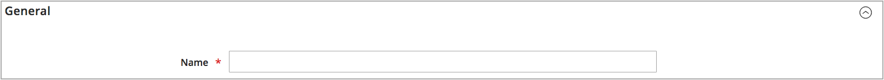

# Añadir un stock

Las existencias asignan sus fuentes a canales de venta (o sitios web), lo que proporciona un vínculo directo a cantidades vendibles e inventarios de productos.

Al crear un inventario personalizado, puede asignar sitios web y fuentes. Las fuentes pueden incluir fuentes habilitadas y deshabilitadas. Por ejemplo, puede añadir un almacén a sus existencias, preparándose para abrir la ubicación para administrar el inventario y completar los envíos.

Después de agregar orígenes, debe priorizar el orden de los orígenes de arriba (primero) a abajo (último). Este pedido afecta a las recomendaciones durante el envío del pedido.

{width="600" zoomable="yes"}

## Agregar las existencias de inventario

1. En el _Administrador_ barra lateral, vaya a **[!UICONTROL Stores]** > _[!UICONTROL Inventory]_>**[!UICONTROL Stock]**.

1. Haga clic **[!UICONTROL Add New Stock]**.

1. Expandir  el **[!UICONTROL General]** y escriba un valor único **[!UICONTROL Name]** para identificar las nuevas existencias.

   {width="350" zoomable="yes"}

1. Expandir  el **[!UICONTROL Sales Channels]** y seleccione la sección **[!UICONTROL Websites]** donde este stock esté disponible.

   Para una instalación multisitio, mantenga presionada la tecla Ctrl (PC) o la tecla Comando (Mac) y haga clic en cada sitio web.

   >[!NOTE]
   >
   >Si selecciona un sitio web o canal de ventas asignado a otro inventario, se anula su asignación de ese inventario. Todas las Sales Channel que no estén asignadas a un inventario personalizado se asignan al inventario de stock predeterminado.

   {width="350" zoomable="yes"}

1. Expandir  el **[!UICONTROL Sources]** y haga lo siguiente para cualquier stock que no sea el predeterminado:

   - Haga clic **[!UICONTROL Assign Sources]**.

   {width="350" zoomable="yes"}

   - Seleccione las casillas de verificación de todos los orígenes que desee asignar al inventario.

   >[!IMPORTANT]
   >
   >Si asigna el mismo origen a varias existencias, podría provocar una venta excesiva de los productos asignados a ese origen.

   - Haga clic **[!UICONTROL Done]**.

     Los orígenes agregados se muestran en Orígenes asignados.

     {width="600" zoomable="yes"}

1. Uso  para arrastrar y soltar los orígenes en una prioridad de arriba (primero) a abajo (último).

   El pedido de origen es importante cuando se envían pedidos.

   {width="600" zoomable="yes"}

1. En el _[!UICONTROL Save]_(), seleccione **[!UICONTROL Save & Close]**.

## Descripciones de campos

| Campo | Descripción |
|--|--|
| **[!UICONTROL General]** | |
| [!UICONTROL Name] | Nombre de la acción. Por ejemplo: `UK Stock`, `US Stock` |
| **[!UICONTROL Sales Channels]** | |
| [!UICONTROL Websites] | Define el [ámbito](../getting-started/websites-stores-views.md#scope-settings) del inventario asignando el inventario a sitios web específicos como _canales de ventas_. Seleccione uno o varios sitios web por acción. Cada sitio web solo puede asignarse a un inventario. |
| **[!UICONTROL Sources]** | |
| [!UICONTROL Assign Sources] | Asigna orígenes de inventario a este stock. Los orígenes personalizados no se pueden asignar a Stock predeterminado. |
| [!UICONTROL Assigned Sources] | Lista de orígenes asignados. Arrastre y suelte las fuentes utilizando  en un pedido priorizado para el cumplimiento y envío de pedidos.  **[!UICONTROL Code]**: ID de código único para el origen. **[!UICONTROL Name]** - Descripción del nombre del origen. **[!UICONTROL Unassign]**- Elimine el origen asignado del inventario utilizando . |
