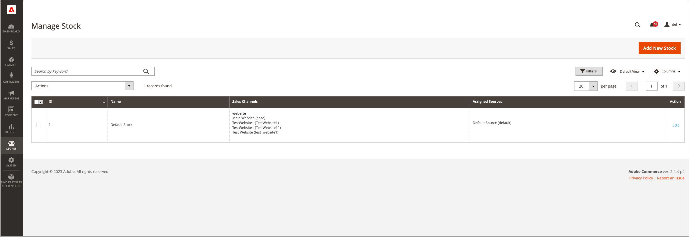

# Administrar stock

Stock representa un inventario virtual agregado de productos para las fuentes de sus canales de ventas (sitios web). Según la configuración del sitio, las existencias se pueden asignar a uno o más canales de ventas. Cada canal de ventas solo puede tener un único inventario asignado, y un solo inventario se puede asignar a varios canales de ventas. A través de las existencias, puede modificar la priorización de las fuentes utilizadas como pedidos que llegan a través de un canal de ventas.

Comience con un Stock predeterminado que no se puede eliminar ni deshabilitar. Solo puede añadir canales de ventas adicionales a las existencias. El único origen asignado es Source predeterminado. Este stock lo utilizan comerciantes de un solo origen, integraciones de terceros y productos importados.

Los canales de ventas representan entidades que venden su inventario. De manera predeterminada, [!DNL Commerce] proporciona los sitios web de la tienda como canales de ventas. Los canales de ventas se pueden ampliar para admitir canales adicionales, como grupos de clientes B2B y vistas de tiendas. Cada canal de ventas solo puede asociarse a un Stock.

- **Soporte de Sales Channel**: los canales de ventas actualmente incluyen sitios web listos para usar. Puede ampliar los canales de ventas para incluir opciones personalizadas como grupos de clientes B2B y vistas de tiendas. Cada canal de ventas solo puede tener un único inventario asignado. Se puede asignar un único inventario a varios canales de ventas.
- **Asignar a orígenes**: cada inventario puede tener uno o más orígenes habilitados o deshabilitados asignados, calculando el inventario agregado virtual por producto.
- **Cumplimiento de pedidos con prioridad**: el algoritmo de prioridad predeterminado para el algoritmo de selección de Source usa la lista de origen de stock de arriba a abajo al cumplir pedidos.

El siguiente diagrama ayuda a definir el funcionamiento de un Stock en relación con las fuentes y los canales de venta de un comerciante de tienda de bicicletas.

{width="600" zoomable="yes"}

## Ejemplo de existencias para una bicicleta de montaña y una tienda

Todas las tiendas comienzan con un Stock predeterminado. Debe permanecer `Enabled` por los siguientes motivos:

- Se utiliza al importar nuevos productos, asignando automáticamente los productos al origen y stock predeterminados para el acceso inmediato a [!DNL Inventory Management].
- No puede añadir fuentes adicionales a estas existencias aparte de la Source predeterminada.
- Los comerciantes de un solo origen, los productos agrupados y los productos agrupados la necesitan y la utilizan.

Para los comerciantes de varias fuentes, cree y configure las existencias para que se ajusten mejor a sus tiendas y a la satisfacción de pedidos. Al asignar nuevas existencias a un canal de ventas, se anula la asignación de cualquier stock preexistente en ese canal de ventas.

Para una instalación de varias tiendas, el Stock predeterminado se asigna inicialmente al [Sitio web principal](../stores-purchase/stores.md#add-websites){target="_blank"} y al almacén predeterminado. Se muestran las existencias y cantidades correctas para los productos habilitados y deshabilitados en la vista de cuadrícula **[!UICONTROL Products]**.

{width="600" zoomable="yes"}

## Barra de botones

| Botón | Descripción |
|--|--|
| [!UICONTROL Add New Stock] | Abre el formulario _[!UICONTROL New Stock]_que se usa para especificar un nuevo inventario de existencias para asignar el inventario al canal de ventas. |

## Administración de descripciones de columnas de Stock

| Columna | Descripción |
|--|--|
| [!UICONTROL ID] | ID numérico único generado para la entrada de stock. |
| [!UICONTROL Name] | Nombre único que identifica el inventario de stock. |
| [!UICONTROL Sales Channels] | Define el ámbito de las existencias al asignar las existencias a sitios web específicos como _canales de ventas_. |
| [!UICONTROL Assigned sources] | Orígenes asignados al stock que suministran todas las cantidades de productos. |
| [!UICONTROL Action] | **[!UICONTROL Edit]**: abre el registro de existencias de inventario en modo de edición. |
