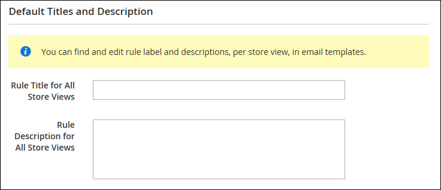

# Crear recordatorios de correo electrónico

Antes de configurar una regla de recordatorio de correo electrónico, primero debe configurar una regla de precio del carro de compras para definir la promoción que se ofrece. Las condiciones de regla que almacenan en déclencheur un recordatorio de correo electrónico se pueden basar en las propiedades del carro de compras, las propiedades de la lista de deseos o ambas.

>[!NOTE]
>
>Los recordatorios de correo electrónico pueden promocionar una regla de precio del carro de compras con o sin cupón. Una regla de precio de carro de compras que define un cupón generado automáticamente genera un código de cupón aleatorio para cada cliente.

1. En el _Administrador_ barra lateral, vaya a **[!UICONTROL Marketing]** > _[!UICONTROL Communications]_>**[!UICONTROL Email Reminder Rules]**.

1. En la esquina superior derecha, haga clic en **[!UICONTROL Add New Rule]**.

1. Complete la _[!UICONTROL Rule Information]_, como se indica a continuación:

   {width="700" zoomable="yes"}

   - Introduzca una **[!UICONTROL Rule Name]** para identificar la regla internamente.

   - Escriba una descripción breve **[!UICONTROL Description]** de la regla.

   - Para elegir el **[!UICONTROL Cart Price Rule]** promoción en la que se va a anunciar este recordatorio, haga clic en **[!UICONTROL Select Rule…]** y seleccione la regla.

     {width="600" zoomable="yes"}

   - Si desea que la regla entre en vigor inmediatamente, establezca **[!UICONTROL Status]** hasta `Active`.

   - Para configurar un intervalo de fechas para que la regla esté activa, introduzca la variable **[!UICONTROL From]** y **[!UICONTROL To]** fechas.

     También puede elegir la fecha en el Calendario (  ).

   - Para enviar el recordatorio más de una vez, introduzca el número de días antes de la siguiente explosión de correo electrónico en la **[!UICONTROL Repeat Schedule]** field.

1. En el panel de la izquierda, elija **[!UICONTROL Conditions]**.

   Se debe definir al menos una condición para la regla. El proceso es similar a la creación de una [regla de precios de catálogo.](price-rules-catalog.md)

   {width="600" zoomable="yes"}

   Clic _Añadir_ ( ) para mostrar la lista de opciones y, a continuación, elija una de las siguientes condiciones:

   - Lista de deseos
   - Carro de compras

   >[!NOTE]
   >
   >Si un cliente tiene más de un carro de compras abandonado, una lista de deseos o una combinación de ambos coincidentes, el recordatorio de correo electrónico se activa solo una vez para ese cliente. Para almacenar en déclencheur el mismo recordatorio de correo electrónico de nuevo, utilice el _[!UICONTROL Repeat Schedule]_para establecer el número de días entre correos electrónicos.

   Complete la condición para describir el escenario que almacena en déclencheur el recordatorio de correo electrónico.

   {width="600" zoomable="yes"}

1. En el panel de la izquierda, elija **[!UICONTROL Emails and Labels]**.

   {width="600" zoomable="yes"}

1. En el **[!UICONTROL Email Templates]** , elija la plantilla de correo electrónico que se utilizará para cada sitio web y la vista de la tienda en su [jerarquía de tienda](../getting-started/websites-stores-views.md).

   Si no desea enviar el correo electrónico de recordatorio a los clientes de una vista de tienda, deje el valor `Not Selected`.

1. En el _Títulos y descripción predeterminados_ , haga lo siguiente:

   - Introduzca el **[!UICONTROL Rule Title for All Store Views]**.

     >[!NOTE]
     >
     >Este valor se puede incorporar a las plantillas de correo electrónico utilizando `promotion_name` variable.

   - Introduzca el **[!UICONTROL Rule Description for All Store Views]**.

     {width="500" zoomable="yes"}

   - En el _[!UICONTROL Titles and Descriptions Per Store View]_, introduzca la **[!UICONTROL Rule Title]**y **[!UICONTROL Description]**para el_ Vista de tienda predeterminada _. Para varias vistas de tienda, introduzca el título y la descripción adecuados para cada una.

     >[!NOTE]
     >
     >La descripción se puede incorporar a las plantillas de correo electrónico mediante la variable promotion_description.

     {width="500" zoomable="yes"}

1. Cuando termine, haga clic en **[!UICONTROL Save]**.

## condiciones de déclencheur

| Origen | Déclencheur |
|--- |--- |
| [!UICONTROL Wish List] | [!UICONTROL Conditions Combination] [!UICONTROL Sharing] [!UICONTROL Number of Items] [!UICONTROL Items Sub selection] |
| [!UICONTROL Shopping Cart] | [!UICONTROL Conditions Combination] [!UICONTROL Coupon Code] [!UICONTROL Cart Line Items] [!UICONTROL Items Quantity] [!UICONTROL Virtual Only] [!UICONTROL Total Amount] [!UICONTROL Items Subselection] |

{style="table-layout:auto"}

## Descripciones de campos

| Campo | Descripción |
|--- |--- |
| [!UICONTROL Rule Name] | El nombre de la regla de recordatorio automatizada identifica la regla internamente. |
| [!UICONTROL Description] | Una descripción de la regla para referencia interna. |
| [!UICONTROL Shopping Cart Price Rule] | La regla del carro de compras asociada con este recordatorio de correo electrónico. Los correos electrónicos de recordatorio pueden promocionar una regla de precio del carro de compras con o sin cupón. Si una regla de precios del carro de compras incluye un cupón generado automáticamente, la regla de recordatorio genera un código de cupón aleatorio y único para cada cliente. |
| [!UICONTROL Assigned to Website] | Los sitios web que reciben un correo electrónico de recordatorio automatizado según esta regla. |
| [!UICONTROL Status] | Activa la regla. Si el estado es Inactivo, el resto de la configuración se ignora y la regla no se activa. Opciones: `Active` / `Inactive` |
| [!UICONTROL From Date] | La fecha de inicio de esta regla de recordatorio automatizada. Si no se especifica ninguna fecha, la regla se activa inmediatamente. |
| [!UICONTROL To Date] | La fecha final de esta regla de recordatorio automatizado. Si no se especifica ninguna fecha, la regla se activa indefinidamente. |
| [!UICONTROL Repeat Schedule] | La cantidad de días antes de que se active la regla y de que se vuelva a enviar el correo electrónico de recordatorio, siempre que se cumplan las condiciones. Para almacenar en déclencheur la regla más de una vez, introduzca el número de días antes de la siguiente ráfaga de correo electrónico, separados por una coma. Por ejemplo, introduzca `7` para volver a activar la regla siete días después; introduzca. `7,14` para que la regla se active en siete días y, de nuevo, 14 días después. |
| [!UICONTROL Email Templates] | Determina la plantilla de correo electrónico que se utilizará para cada vista de tienda. |
| [!UICONTROL Rule Title for All Store Views] | Determina el título de la regla para cada vista de tienda. |
| [!UICONTROL Rule Description for All Store Views] | Determina la descripción de la regla para cada vista de tienda. |

{style="table-layout:auto"}
