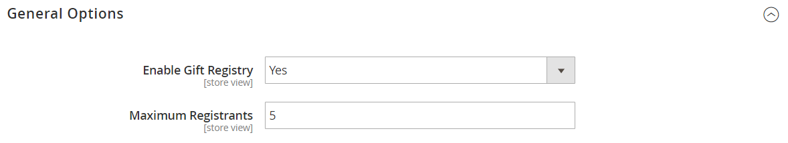

# Configurar registros de regalos

{{ee-feature}}

Antes de poder ofrecer registros de regalos a sus clientes, debe habilitar los registros de regalos y configurar las notificaciones de correo electrónico relacionadas. Adobe Commerce envía las siguientes notificaciones por correo electrónico en respuesta a los eventos del flujo de trabajo del registro de regalos.

- Cuando se crea un nuevo registro de regalos, se envía un correo electrónico al propietario con un vínculo al registro que se puede compartir.
- Opcionalmente, la tienda puede enviar una notificación con un vínculo al registro de regalos a los amigos y familiares del propietario del registro de regalos.
- Se notifica al propietario cuando se compran artículos en el registro de regalos, pero no se indica el comprador.

Adobe Commerce tiene plantillas predefinidas para cada uno de estos mensajes de correo electrónico que se pueden personalizar para su marca.

## Paso 1. Activar registros de regalos

1. En la barra lateral _Admin_, vaya a **[!UICONTROL Stores]** > _[!UICONTROL Settings]_>**[!UICONTROL Configuration]**.

1. En el panel izquierdo, expanda **[!UICONTROL Customers]** y elija **[!UICONTROL Gift Registry]**

1. Expanda  en la sección **[!UICONTROL General Options]** y haga lo siguiente:

   {width="600" zoomable="yes"}

   - El Registro de regalos está habilitado de forma predeterminada. Si es necesario, establezca **[!UICONTROL Enable Gift Registry]** en `Yes`.

   - Para **[!UICONTROL Maximum Registrants]**, escriba el número máximo de personas que pueden ser invitadas a participar en un evento del registro de regalos.

## Paso 2. Configurar notificaciones por correo electrónico

1. Expanda  en la sección **[!UICONTROL Owner Notification]** y haga lo siguiente:

   {width="600" zoomable="yes"}

   - Elija el **[!UICONTROL Email Template]** que notifica a los propietarios del registro de regalos cuando se crean sus registros.

   - Elija el [contacto de tienda](../getting-started/store-details.md#store-email-addresses) que aparece como **[!UICONTROL Email Sender]** del mensaje.

1. Expanda  en la sección **[!UICONTROL Gift Registry Sharing]** y haga lo siguiente:

   {width="600" zoomable="yes"}

   - Elija el **[!UICONTROL Email Template]** que notifica a los destinatarios del registro de regalos cuando se comparte un registro con ellos.

   - Elija el identificador de almacén que aparece como **[!UICONTROL Email Sender]** del mensaje.

   - Para **[!UICONTROL Maximum Sent Emails Threshold]**, escriba el número máximo de correos electrónicos que se pueden enviar al mismo tiempo.

1. Expanda  en la sección **[!UICONTROL Gift Registry Update]** y haga lo siguiente:

   {width="600" zoomable="yes"}

   - Elija el **[!UICONTROL Email Template]** que notifica a los propietarios del registro de regalos de los cambios realizados en el registro.

   - Elija el identificador de almacén que aparece como **[!UICONTROL Email Sender]** del mensaje.

1. Una vez finalizado, haga clic en **[!UICONTROL Save Config]**.

1. Cuando se le solicite, actualice la caché.

   Una vez que se actualiza la caché, el Registro de regalos aparece en el menú Tiendas en Otras configuraciones y está disponible en las cuentas de los clientes.
