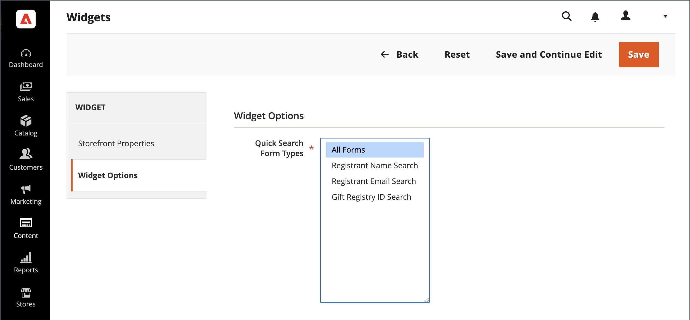

# Agregar búsqueda del registro de regalos

{{ee-feature}}

La herramienta [Widget](../content-design/widgets.md) se puede usar para colocar un cuadro de búsqueda del registro de regalos en cualquier parte de la tienda. Puede especificar las opciones de búsqueda que estarán disponibles para los clientes, como el nombre, la dirección de correo electrónico y el ID del registro de regalos. Cuando el cliente hace clic en el botón Buscar, los resultados aparecen en la página Buscar del Registro de regalos. Si la búsqueda no devuelve resultados, el cliente puede intentarlo de nuevo con otros parámetros.

{width="700" zoomable="yes"}

## Configurar la búsqueda del registro de regalos

1. En la barra lateral _Admin_, vaya a **[!UICONTROL Content]** > _[!UICONTROL Elements]_>**[!UICONTROL Widgets]**.

1. En la esquina superior derecha, haga clic en **[!UICONTROL Add Widget]**.

1. Elija la ficha **[!UICONTROL Settings]** y haga lo siguiente:

   - Establezca **[!UICONTROL Type]** en `Gift Registry Search`.

   - Establezca **[!UICONTROL Design Theme]** en el tema que usa la tienda.

   - Haga clic en **[!UICONTROL Continue]**.

   {width="700" zoomable="yes"}

1. En la sección _[!UICONTROL Storefront Properties]_, haga lo siguiente:

   - Escriba un(a) **[!UICONTROL Widget Title]** como referencia interna.

   - Establezca **[!UICONTROL Assign to Store Views]** en las vistas del almacén donde la búsqueda del Registro de regalos estará disponible.

   - Establezca **[!UICONTROL Sort Order]** para determinar el orden en que aparece el bloque de búsqueda del Registro de regalos cuando hay otros bloques asignados a la misma ubicación en la página.

   {width="700" zoomable="yes"}

1. En la sección **[!UICONTROL Layout Updates]**, haga clic en **[!UICONTROL Add Layout Update]**.

1. Para determinar dónde aparece la búsqueda del Registro de regalos en el almacén, haga lo siguiente:

   - Establece **[!UICONTROL Display On]** en las páginas de tu tienda en las que quieras que aparezca el bloque de búsqueda del Registro de regalos.

   - Si corresponde, elija el(la) **[!UICONTROL Categories]** en el lugar donde desea que aparezca.

   - Establezca **[!UICONTROL Container]** en la ubicación de la página para colocar el bloque de búsqueda del Registro de regalos.

   {width="500" zoomable="yes"}

1. En el panel izquierdo, elija **[!UICONTROL Widget Options]**.

1. Para determinar cómo pueden buscar los visitantes del sitio los registros de regalos, seleccione tantas de las opciones siguientes como corresponda:

   - [!UICONTROL All Forms]
   - [!UICONTROL Registrant Name Search]
   - [!UICONTROL Registrant Email Search]
   - [!UICONTROL Gift Registry ID Search]

   {width="700" zoomable="yes"}

1. Una vez finalizado, haga clic en **[!UICONTROL Save]**.

1. Cuando se le pida que actualice la caché de la página, haga clic en el vínculo del mensaje en la parte superior del espacio de trabajo y siga las instrucciones.

## Descripciones de campos

### [!UICONTROL Settings]

| Campo | Descripción |
|--- |--- |
| [!UICONTROL Type] | Identifica `Gift Registry Search` como el tipo de widget. |
| [!UICONTROL Design Theme] | El tema que usa la tienda donde va a aparecer la búsqueda del Registro de regalos. |

{style="table-layout:auto"}

### [!UICONTROL Storefront Properties]

| Campo | Descripción |
|--- |--- |
| [!UICONTROL Widget Title] | Un nombre para referencia interna. |
| [!UICONTROL Assign to Store Views] | Identifica las vistas del almacén en las que la búsqueda del Registro de regalos va a estar disponible. |
| [!UICONTROL Sort Order] | Indica el orden en que aparece el bloque de búsqueda del Registro de regalos si hay otros bloques asignados para que aparezcan en la misma ubicación. |

{style="table-layout:auto"}

### [!UICONTROL Layout Updates]

| Campo | Descripción |
|--- |--- |
| [!UICONTROL Display On] | Indique las páginas específicas o los tipos de páginas en las que aparece el bloque de búsqueda del Registro de regalos. |
| [!UICONTROL Categories] | Si procede, identifica las páginas de categoría en las que aparece Búsqueda en el registro de regalos. |
| [!UICONTROL Container] | Indica el bloque de diseño de página en el que se coloca la búsqueda del Registro de regalos. Las opciones varían según la plantilla y la temática. |

{style="table-layout:auto"}

### [!UICONTROL Widget Options]

| Campo | Descripción |
|--- |--- |
| [!UICONTROL Quick Search Form Types] | Determina los tipos de búsquedas que se pueden realizar con la búsqueda del Registro de regalos. Opciones: `All Forms` / `Registrant Name Search` /` Registrant Email Search` / `Gift Registry ID Search` |

{style="table-layout:auto"}
