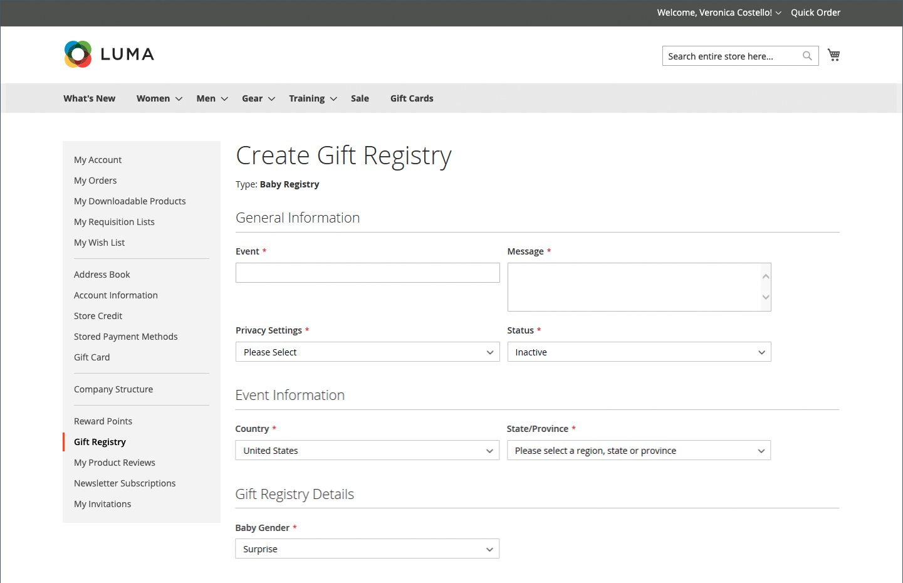

# Experiencia de tienda de registro de regalos

{{ee-feature}}

El [Registro de regalos](gift-registries.md) de la cuenta del cliente enumera los registros de regalos actuales del cliente y el evento asociado. Los clientes pueden administrar los registros actuales y agregar otros nuevos.

{width="700" zoomable="yes"}

## Información del registro de regalos

Los clientes pueden crear y administrar registros de regalos desde sus cuentas. Toda la información asociada a cada tipo de registro está disponible en la cuenta del cliente.

{width="700" zoomable="yes"}

| Sección | Descripción |
|--- |--- |
| [!UICONTROL General Information] | Esta sección suele incluir el nombre del evento, un mensaje o una descripción del evento, la configuración de privacidad y el estado del evento. |
| [!UICONTROL Event Information] | Esta sección incluye la ubicación y la fecha del evento. Para una boda, también puede incluir el número de invitados que cada persona puede traer. |
| [!UICONTROL Gift Registry Details] | Esto puede incluir información adicional específica para la ocasión. |
| [!UICONTROL Registrant Information] | Esta sección incluye el nombre y la información de contacto de cada persona que va a recibir una notificación del Registro. Para un registro de bodas, se puede incluir el campo Rol para asociar al solicitante de registro como amigo de la novia o el novio. |
| [!UICONTROL Shipping Address] | Esta sección muestra dónde se enviarán los regalos e incluye la información que un transportista necesita para entregar el paquete. |

{style="table-layout:auto"}

>[!NOTE]
>
>Cuando un registro de regalos está inactivo, la búsqueda y el vínculo no funcionan en el registro. Si el registro se reactiva posteriormente, los vínculos siguen dañados.

## Crear un registro de regalos

1. El cliente selecciona **[!UICONTROL Gift Registry]** en su panel de cuentas.

1. En el _Registro de regalos_ página, clics **[!UICONTROL Add New]**.

1. Elige un **[!UICONTROL Gift Registry Type]**, como:

   - Cumpleaños

   - Registro de bebés

   - Boda

1. Clics **[!UICONTROL Next]**.

1. Introduzca la información necesaria y haga clic en **[!UICONTROL Save]**.

## Agregar un producto a un registro

1. El cliente abre el producto que desea agregar al evento de registro de regalos.

1. Clics **[!UICONTROL Add to Cart]**.

1. Clics **[!UICONTROL View and Edit Cart]** en el minicarrito.

1. En la página Carro de compras, selecciona el evento que desea y pulsa o hace clic en **[!UICONTROL Add All To Gift Registry]**.

   Los elementos se agregan al registro de regalos del evento seleccionado.

## Compartir un registro de regalos

1. Desde su panel de cuentas, el cliente va a **[!UICONTROL Gift Registry]**.

1. Busca el evento del Registro que desea administrar y hace clic en **[!UICONTROL Share]**.

1. Introduce la información necesaria y hace clic en **[!UICONTROL Share Gift Registry]**.

## Editar un registro de regalos

1. Desde su panel de cuentas, el cliente va a **[!UICONTROL Gift Registry]**.

1. Busca el evento del Registro que desea administrar y hace clic en **[!UICONTROL Edit]**.

1. Cambia las opciones según sea necesario.

1. Edita las opciones y los clics necesarios **[!UICONTROL Save]**.

## Administrar elementos del registro de regalos

1. Desde su panel de cuentas, el cliente va a **[!UICONTROL Gift Registry]**.

   {width="700" zoomable="yes"}

1. Busca el evento del Registro, selecciona los elementos que desea administrar y hace clic en **[!DNL Manage Items]**.

1. Cambia las opciones necesarias, como **[!UICONTROL Note]** y **[!UICONTROL Qty]**.

1. Si es necesario, quita un elemento del registro de regalos seleccionando la casilla de verificación y haciendo clic en **[!UICONTROL Delete]**.

1. Clics **[!UICONTROL Update Gift Registry]** para guardar los cambios.

## Eliminar un registro de regalos

1. Desde su panel de cuentas, el cliente va a **[!UICONTROL Gift Registry]**.

1. Busca el evento del Registro que desea administrar y hace clic en **[!UICONTROL Delete]**.

1. Clics **[!UICONTROL OK]** para confirmar.
