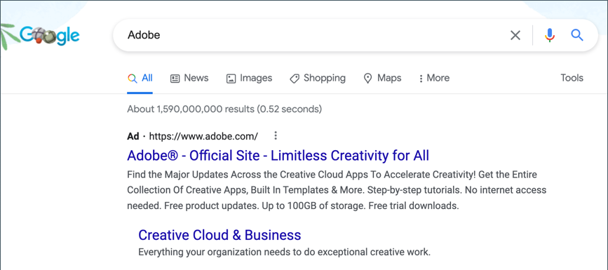

# Google AdWords

[Google AdWords][1] es un servicio que puede utilizar para colocar anuncios en los resultados de búsqueda de Google y en las páginas de empresas en la red de visualización de Google. El panel de AdWords incluye herramientas para administrar sus campañas, rastrear las respuestas y medir los resultados.

El seguimiento de conversión muestra el número de clics en publicidad que conducen a una venta u otra acción valiosa. El _Correcto_ La página que se muestra al cliente después de enviar un pedido se utiliza para realizar un seguimiento de las conversiones, ya que solo aparece después de una venta. Después de completar la configuración de Google AdWords para su tienda, no es necesario copiar el script de seguimiento de conversión en la página de éxito, porque Commerce ya tiene la información necesaria. Para obtener más información, consulte [Ayuda de Google AdWords][2].

{width="500"}

## Paso 1. Creación de una campaña de Google AdWords

1. Visita [Google AdWords][3]y regístrese para obtener una cuenta.

1. Siga las instrucciones para crear una campaña.

1. Para configurar el seguimiento de conversión de la campaña, haga lo siguiente:

   - En el **[!UICONTROL Tools]** de su panel de AdWords, elija **[!UICONTROL Conversions]** y haga clic en **[!UICONTROL Conversion]**.

   - Cuando se le solicite el origen de conversión, elija **[!UICONTROL Website]**.

   - Introduzca un nombre para la acción de conversión que desea rastrear y haga clic en **[!UICONTROL Done]**.

   - Clic **[!UICONTROL Value]** y, si procede, asigne un valor a la conversión. Por ejemplo:

      - Si gana $5 en cada venta, elija `Each time it happens` y asigne un valor de `$5`.
      - Si el valor de cada venta varía, deje el valor en blanco.

     Para completar, haga clic en **[!UICONTROL Done]**.

   - Clic **[!UICONTROL Conversion windows]** y complete la configuración para determinar cuánto tiempo se rastrearán las conversiones, la categoría de informes y el modelo de atribución.

1. Cuando termine, haga clic en **[!UICONTROL Save and Continue]**.

## Paso 2. Obtenga su etiqueta de conversión

1. En **[!UICONTROL Install your tag]**, elija contar las conversiones en **[!UICONTROL Page load]**.

1. Como opción, puede agregar la variable **[!UICONTROL Google Site Stats]** a la página de conversión.

   La notificación aparece en la esquina inferior con un vínculo a los estándares de seguridad de Google y al uso de cookies.

1. Para elegir cómo desea administrar la etiqueta de AdWords, siga uno de estos procedimientos:

   - Si planea agregar la secuencia de comandos a la tienda usted mismo, elija **[!UICONTROL Save instructions and tag]**.
   - Si planea que otra persona agregue el script a su tienda, elija **[!UICONTROL Email instructions and tag]**.

1. Cuando termine, haga clic en **[!UICONTROL Done]**.

## Paso 3. Configurar la tienda

{{gtag-api-note}}

1. En el _Administrador_ barra lateral, vaya a **[!UICONTROL Stores]** > _[!UICONTROL Settings]_>**[!UICONTROL Configuration]**.

1. Si configura Google AdWords para una vista de tienda específica, haga lo siguiente:

   - En la esquina superior izquierda, seleccione la opción **[!UICONTROL Store View]** que se va a configurar.

   - Cuando se le pida que confirme el cambio de ámbito, haga clic en **[!UICONTROL OK]**.

1. En el panel izquierdo, expanda **[!UICONTROL Sales]** y elija **[!UICONTROL Google API]**.

1. Expandir  el **[!UICONTROL Google AdWords]** y haga lo siguiente:

   - Establecer **[!UICONTROL Enable]** hasta `Yes`.

   - Introduzca el **[!UICONTROL Conversion ID]** desde el script de Google AdWords.

   {width="600" zoomable="yes"}

1. Para dar formato a la notificación de estado de Google Sites, haga lo siguiente:

   - Establecer **[!UICONTROL Conversion Language]** al idioma identificado en el script de Google AdWords.

   - Introduzca el **[!UICONTROL Conversion Format]** para que se utilice en la notificación de estado de Google Sites en la página de conversión.

      - `1`  : Muestra una notificación de una línea con un vínculo para obtener más información sobre el seguimiento de Google.
      - `2` : Muestra una notificación de dos líneas con un vínculo para obtener más información sobre el seguimiento de Google.
      - `3` - No muestra ninguna notificación al cliente.

   - Introduzca el [código hexadecimal][4]{:target=&quot;_blank&quot;} para **[!UICONTROL Conversion Color]** que desee utilizar para la etiqueta de notificación Google Site Stats.

   - Introduzca el texto cifrado para **[!UICONTROL Conversion Label]** que aparece en la notificación de estado de Google Sites.

     Por ejemplo: `MlEYCOKBnGoQz6CZoAM`

     **Ejemplo de código de etiqueta de Google AdWords**

     ```html
     <!-- Google Code for Back to School Sale Conversion Page -->
     <script type="text/javascript">
     /* <![CDATA[ */
     var google_conversion_id = 999999999;
     var google_conversion_language = "en";
     var google_conversion_format = "3";
     var google_conversion_color = "ffffff";
     var google_conversion_label = "MlEYCOKBnGoQz6CZoAM";
     var google_remarketing_only = false;
     /* ]]> */
     </script>
     
     <script type="text/javascript" src="//www.googleadservices.com/pagead/conversion.js">
     </script>
     <noscript>
     <div style="display:inline;">
     
     
     </noscript>
     ```

1. Establecer **[!UICONTROL Conversion Value Type]** a uno de los siguientes:

   - `Dynamic` : Determina que se ha producido una conversión en función del valor de importe de pedido dinámico.
   - `Constant` : Determina que se ha producido una conversión en función de un valor específico introducido.

   Para un _Constante_ tipo de valor de conversión, introduzca un valor específico **[!UICONTROL Value]** para el _[!UICONTROL Order Amount]_para calificarse como una conversión.

1. Cuando termine, haga clic en **[!UICONTROL Save Config]**.

## Paso 4. Compruebe la configuración

En unas horas, el estado de seguimiento en su panel de Google AdWords cambiará de `Unverified` hasta `No recent conversions` o `Recording conversions`. Cuando alguien hace clic en su anuncio y realiza una compra, la conversión aparece en la página Acciones de conversión del tablero y el informe de campaña.

[1]: https://www.google.com/adwords/
[2]: https://support.google.com/adwords/answer/6095821
[3]: https://ads.google.com/
[4]: https://www.w3schools.com/colors/colors_picker.asp
