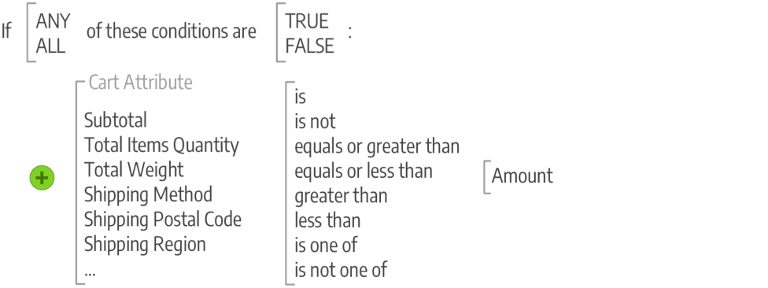

# Introducción a las promociones y comercialización de Commerce

Dirija promociones y cree oportunidades para la participación de los clientes, y convierta a los compradores en compradores. Administre las relaciones con los clientes apoyando las actividades posteriores a la compra y ofreciendo descuentos especiales a los clientes que regresan. Conozca las prácticas recomendadas y las técnicas para apoyar sus iniciativas de SEO.

## Comercialización

_Comercialización_ es un término que se usa en el comercio minorista para describir el arte y la ciencia del desarrollo de planos de planta y la presentación de productos. Podríamos considerar la navegación basada en [categorías](../catalog/navigation-top.md) como el plano de planta de la tienda, y la presentación dinámica de productos como las condiciones que se pueden aplicar a la lista de productos en la tienda. Además, puede implementar programas que impulsen más ventas de productos:

- [!BADGE Solo PaaS]{type=Informative url="https://experienceleague.adobe.com/es/docs/commerce/user-guides/product-solutions" tooltip="Se aplica solo a proyectos de Adobe Commerce en la nube (infraestructura PaaS administrada por Adobe) y a proyectos locales."} [Visual Merchandiser](visual-merchandiser.md): conjunto de herramientas avanzadas que le permiten colocar productos y aplicar condiciones que determinan qué productos aparecen en la lista de categorías.

- [Registros de regalos](gift-registries.md) - Proporcione a sus clientes la capacidad de crear registros de regalos para ocasiones especiales y de invitar a sus amigos y familiares a comprar sus regalos del registro de regalos.

- [Recompensas y lealtad](rewards-loyalty.md): use un sistema de puntos para implementar programas únicos que promuevan la participación del cliente y la lealtad de este. Puede otorgar puntos por una amplia gama de actividades de transacciones y clientes, y controlar la asignación de puntos, el saldo y la caducidad.

- [Ventas privadas y eventos](events-private-sales.md) - Use su base de clientes existente para generar rumores y nuevos clientes potenciales, o para descargar el inventario excedente a través de ventas privadas y otros eventos de catálogo.

>[!TIP]
>
>Para obtener más información sobre Product Recommendations y cómo pueden proporcionarte el control y la insight que necesitas para crear la mejor experiencia para tus compradores, consulta la [Guía del usuario de Product Recommendations](https://experienceleague.adobe.com/docs/commerce/product-recommendations/guide-overview.html?lang=es).

## Promociones

En Adobe Commerce, utilice las funciones de promociones para configurar relaciones de producto y utilice reglas de precios para generar déclencheur de descuentos según diversas condiciones. Puede utilizar las reglas de precios para ofrecer incentivos al cliente, como:

- Envíe a sus mejores clientes un cupón de descuento en un producto específico
- Ofrecer envío gratuito para compras superiores a una determinada cantidad
- Programar una promoción para un período de tiempo específico

Una regla es un conjunto de condiciones (una o más) que aplican cambios en los precios de los productos cuando se cumplen una o todas. Cada regla puede tener varias condiciones, que se aplican cuando todas o cualquiera de las instrucciones (una o más, pero no todas) son verdaderas o falsas.

### Condiciones

Las condiciones son instrucciones que refinan la lista de productos y situaciones para aplicar la regla. Los atributos y las opciones de las condiciones difieren entre los tipos de reglas disponibles. Cuando se cumple, la acción se completa, como descuentos, buy-one-get-one (BOGO) y otras opciones. Las reglas pueden ser tan sencillas o complicadas como sea necesario para adaptarse a sus necesidades comerciales, descuentos y promociones de temporada y oportunidades de todo el año. Por ejemplo: es posible que desee agregar algunas opciones más para los días festivos, a la vez que proporciona envío gratuito durante todo el año cuando los carros de compras tienen un subtotal alto.

>[!NOTE]
>
>Si desea definir una condición basada en un atributo de producto específico, **[!UICONTROL Use for Promo Rule Conditions]** debe establecerse en `Yes` para el atributo en sus [propiedades de tienda](../catalog/attribute-product-create.md).

### Reglas de precios

Para [reglas de precios de catálogo](price-rules-catalog.md), usted genera condiciones basadas en [conjuntos de atributos](../catalog/attribute-sets.md) en su catálogo, funciones de comparación y atributos seleccionados. Las condiciones se crean como frases seleccionando unas pocas instrucciones. Por ejemplo, puede crear dos reglas de precio para aplicar descuentos en ropa infantil y ropa de hombre/mujer según la categoría.

{width="500"}

[Las condiciones de la regla de precio del carro de compras](price-rules-cart.md) pueden basarse en cualquier categoría que sea secundaria de la tienda [root](../catalog/category-root.md). Las reglas de precios se establecen por adelantado y entran en vigor cuando se cumplen las condiciones requeridas. Estas reglas utilizan atributos, incluidas combinaciones de atributos de producto, como hacer coincidir un SKU en el carro de compras con atributos de producto. Estas reglas también pueden utilizar condiciones de cantidad de selección de productos, combinaciones de condiciones para reglas complicadas y atributos del carro de compras como el subtotal.

{width="500"}

## Comunicaciones y SEO

Dominar la [optimización de los motores de búsqueda (SEO)](seo-overview.md) es crucial para atraer compradores potenciales. Obtenga información acerca de la optimización de los motores de búsqueda y ajuste del contenido y la presentación del sitio para mejorar la forma en que los motores de búsqueda indexan las páginas.

Una de las tareas a completar antes de lanzar su tienda es revisar las plantillas de correo electrónico que se utilizan para todas las comunicaciones enviadas desde su tienda para asegurarse de que reflejen su marca. Sin embargo, debe llevar esto un paso más allá y desarrollar otras comunicaciones que promocionen su marca y productos para los clientes existentes. Puede personalizar el contenido con variables y etiquetas de marcado.

>[!NOTE]
>
>Las versiones 2.4.0 a 2.4.3 de Adobe Commerce y Magento Open Source incluían la extensión dotdigital desarrollada por el proveedor que se utilizó para integrarse con dotdigital Engagement Cloud. A partir de la versión 2.4.4, esta extensión ya no se integra con la versión principal y debe instalarse y actualizarse desde Commerce Marketplace. Marketplace también proporciona acceso a la documentación actual proporcionada por el desarrollador de extensiones.
>  >Si tiene la extensión agrupada habilitada y configurada, debe actualizar el archivo composer.json como parte del proceso de actualización 2.4.4 y administrar las actualizaciones de extensión a partir de ahora. Consulte [Módulos de actualización](https://experienceleague.adobe.com/docs/commerce-operations/upgrade-guide/modules/upgrade.html?lang=es) en la _Guía de actualización_ para obtener más información.

- [Boletines](newsletters.md): produce boletines informativos, administra tu lista de suscriptores, desarrolla contenido y lleva el tráfico a tu tienda.

- [Fuentes RSS](social-rss.md#rss-feeds): utilice fuentes RSS para publicar la información del producto en sitios de agregación de compras e incluso incluirlas en sus boletines. Los clientes pueden suscribirse a sus fuentes RSS para conocer nuevos productos y promociones.

- [Redes sociales](social-rss.md#social-networks): integra tu tienda con tus redes sociales instalando una extensión de Marketplace o agregando un complemento a tus páginas de contenido.

## Herramientas de marketing de Google

La configuración de su tienda está integrada con las siguientes herramientas de Google para ayudarle a optimizar su contenido, analizar el tráfico y conectar su catálogo a los agregadores de compras y a los mercados.

>[!NOTE]
>
>A partir de la versión 2.4.5, la integración de servicios de Google se actualiza para admitir el uso de las API de GTag. GTag es un mecanismo unificado para la integración con la funcionalidad de Google para páginas web y admite las funciones y oportunidades más recientes para el seguimiento y la administración de contenido mediante los servicios de Google. Para obtener más información, consulte la [documentación para desarrolladores de Google Analytics](https://developers.google.com/analytics/devguides/collection/gtagjs).

- [Google Analytics](google-analytics.md): utiliza Google Universal Analytics para definir dimensiones y métricas personalizadas adicionales para el seguimiento, con compatibilidad para interacciones de aplicaciones móviles y sin conexión, y acceso a actualizaciones en curso.

- [Administrador de etiquetas de Google](google-tag-manager.md) -  (solo Adobe Commerce) Use el Administrador de etiquetas de Google para administrar las muchas etiquetas relacionadas con los eventos de campañas de marketing.

- [Google AdWords](google-adwords.md): crea una campaña de Google AdWords y realiza un seguimiento de las conversiones de tu tienda.
