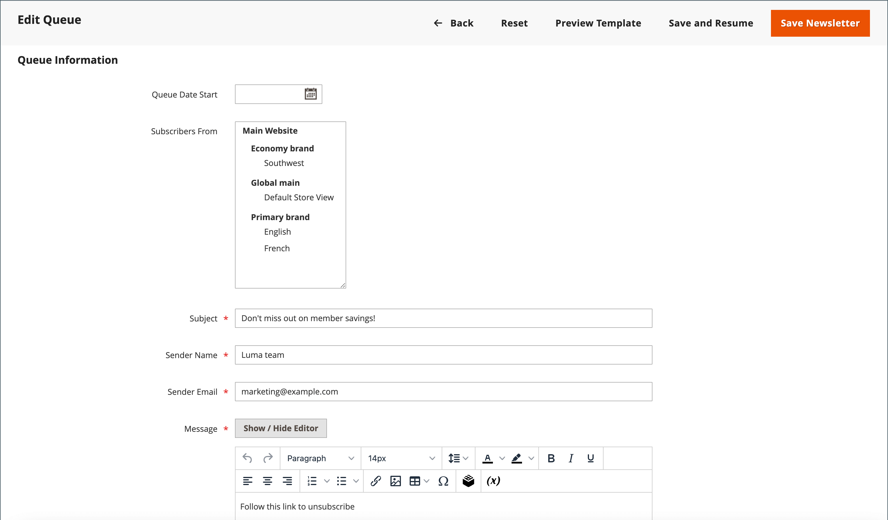

# Colas de newsletter

Para administrar la carga en el servidor, los boletines informativos con muchos suscriptores se envían en una cola de varios lotes. Puede comprobar la cola del boletín informativo periódicamente para comprobar el estado y ver cuántos se han procesado. Cualquier problema que se produzca durante la transmisión aparece en la _Problema de newsletter_ informe.

## Enviar una newsletter

1. En el _Administrador_ , vaya a **[!UICONTROL Marketing]** > _[!UICONTROL Communications]_>**[!UICONTROL Newsletter Template]**.

1. En la cuadrícula, busque [plantilla de newsletter](newsletter-template.md) que se va a enviar y configure el **[!UICONTROL Action]** columna a `Queue Newsletter`.

1. Para **[!UICONTROL Queue Date Start]**, seleccione la fecha en la que la transmisión va a comenzar desde el calendario ().

1. Para **[!UICONTROL Subscribers From]**, seleccione cada vista de tienda que desee incluir en la explosión de correo electrónico.

1. Rellene la información del encabezado del correo electrónico:

   - Escriba una breve descripción de la newsletter para **[!UICONTROL Subject]** línea del encabezado del correo electrónico.

   - Introduzca el **[!UICONTROL Sender Name]**.

   - Para **[!UICONTROL Sender Email]**, introduzca la dirección de correo electrónico del remitente.

     El nombre y la dirección de correo electrónico predeterminados del remitente se especifican en la configuración.

     {width="600" zoomable="yes"}

1. Si procede, introduzca una nota en la **[!UICONTROL Message]** sobre las instrucciones para cancelar la suscripción.

   >[!NOTE]
   >
   >No elimine las instrucciones, que son requeridas por la ley en muchas jurisdicciones.

1. Para aplicar estilos personalizados a un boletín informativo, agréguelos al **[!UICONTROL Newsletter Styles]** field.

1. Cuando termine, haga clic en **[!UICONTROL Save and Resume]**.

   La newsletter aparece en la cola de espera para procesarse.

## Compruebe si hay problemas

En el _Administrador_ , vaya a **[!UICONTROL Reports]** > _[!UICONTROL Marketing]_>**[!UICONTROL Newsletter Problem Reports]**.

## Barra de botones

| Botón | Descripción |
|--- |--- |
| **[!UICONTROL Back]** | Vuelve a la página Plantillas de newsletter sin guardar los cambios. |
| **[!UICONTROL Reset]** | Restablece cualquier cambio no guardado en el formulario de información de cola a sus valores anteriores. |
| **[!UICONTROL Preview Template]** | Abre una página de vista previa en una pestaña independiente. |
| **[!UICONTROL Save and Resume]** | Guarda todos los cambios realizados. Pone la newsletter en cola. |
| **[!UICONTROL Save Newsletter]** | Guarda todos los cambios realizados. Pone la newsletter en cola. |

{style="table-layout:auto"}

## Columnas

| Columna | Descripción |
|--- |--- |
| [!UICONTROL ID] | Identificador numérico único asignado a cada plantilla de boletín informativo. |
| [!UICONTROL Queue Start] | La fecha en la que se envió la newsletter. |
| [!UICONTROL Queue End] | La fecha en la que terminó de enviarse el boletín informativo. |
| [!UICONTROL Subject] | Asunto de la plantilla de la newsletter. |
| [!UICONTROL Status] | Indica el estado del correo del boletín informativo. Valores posibles: `Sent`, `Canceled`, `Not Sent`, `Sending`, o `Paused`. |
| [!UICONTROL Processed] | Indica cuántos boletines se han enviado. |
| [!UICONTROL Recipients] | Indica cuántos boletines recibieron los suscriptores. |
| [!UICONTROL Actions] | **[!UICONTROL Preview]**: abre una ventana independiente para previsualizar la plantilla. |

{style="table-layout:auto"}
