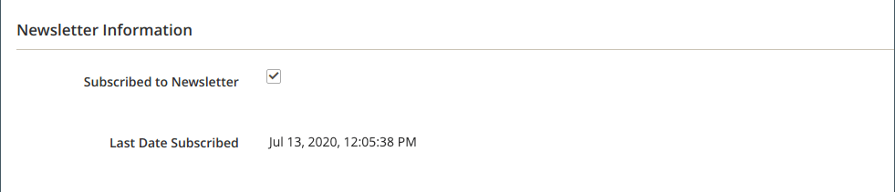

# Administrar suscriptores del boletín

Como práctica recomendada, debe administrar la lista de suscripción regularmente y asegurarse de procesar cualquier solicitud de cancelación de suscripción. En algunas jurisdicciones, la ley exige que las solicitudes de cancelación de suscripción se procesen dentro de un período de tiempo específico.

Puede administrar fácilmente sus suscriptores con una sencilla lista de suscripciones activas. Cuando un cliente envía una solicitud de cancelación de suscripción, simplemente puede aplicar una acción _Cancelar la suscripción_ a una o más suscripciones seleccionadas.

En configuraciones de un solo sitio con varias vistas de tienda, una suscripción de cuenta de cliente se puede asociar con una vista de tienda específica.

En configuraciones de varias tiendas y sitios con un [ámbito de cuenta de cliente](../customers/customer-account-scope.md) global, se puede suscribir una cuenta de cliente a boletines para varios sitios o tiendas. En este caso, es posible que desee editar la cuenta del cliente para administrar un grupo de suscripciones o cancelar una suscripción de un sitio o tienda específicos para satisfacer una solicitud.

Si desea utilizar un servicio de terceros para enviar boletines informativos, puede exportar la lista de suscripción como archivo CSV o XML.

## Administración de suscripciones para un cliente

1. En la barra lateral _Admin_, vaya a **[!UICONTROL Customers]** > **[!UICONTROL All Customers]**.

1. Busque al cliente en la cuadrícula y haga clic en **[!UICONTROL Edit]** en la columna _[!UICONTROL Action]_.

1. Haga clic en **[!UICONTROL Newsletter]** en el panel izquierdo.

1. Modifique las suscripciones del cliente según la configuración del sitio o la tienda.

   Para una configuración de sitio único/tienda única, simplemente puede seleccionar o desactivar la casilla de verificación **[!UICONTROL Subscribed to Newsletter]**.

   {width="500" zoomable="yes"}

   Para una configuración de un solo sitio o de varias tiendas, puede activar o desactivar la casilla de verificación **[!UICONTROL Subscribed to Newsletter]** y establecer **[!UICONTROL Subscribed on Store View]** en la vista de tienda correcta para la suscripción.

   {width="500" zoomable="yes"}

   Para una configuración de varios sitios o tiendas con un ámbito de cuenta de cliente global, la página muestra el estado de suscripción de todos los sitios. Puede activar o desactivar la casilla de verificación **[!UICONTROL Subscribed]** o cambiar el **[!UICONTROL Store View]** de la suscripción.

   {width="500" zoomable="yes"}

1. Haga clic en **[!UICONTROL Save Customer]**.

## Cancelar una suscripción de la lista de suscriptores

1. En la barra lateral _Admin_, vaya a **[!UICONTROL Marketing]** > _[!UICONTROL Communications]_>**[!UICONTROL Newsletter Subscribers]**.

   En una configuración de varios sitios en la que algunos clientes tienen suscripciones para más de un sitio, cada suscripción se muestra como un elemento de línea en la cuadrícula.

1. Busque el suscriptor en la cuadrícula y seleccione la casilla de verificación en la primera columna.

   >[!NOTE]
   >
   >Para cancelar la suscripción de forma masiva, seleccione la casilla de cada suscriptor que desee cancelar.

1. Establezca el control _[!UICONTROL Action]_en **[!UICONTROL Unsubscribe]**y haga clic en **[!UICONTROL Submit]**.

   {width="600" zoomable="yes"}

   El estado del registro cambia a `Unsubscribed`.

## Exportación de la lista de suscriptores

1. Desde la lista _[!UICONTROL Newsletter Subscribers]_, use los controles de filtro para incluir solo los registros con un_ estado _de `Subscribed` y para el sitio web, tienda o vista de tienda correspondiente.

1. Establezca el control **[!UICONTROL Export to]** en uno de los siguientes:

   - `CSV`
   - `XML`

1. Haga clic en **[!UICONTROL Export]**, busque el mensaje en la parte inferior de la pantalla y guarde el archivo.

   {width="600" zoomable="yes"}

## Eliminar un suscriptor de la lista de suscriptores

1. En la barra lateral _Admin_, vaya a **[!UICONTROL Marketing]** > _[!UICONTROL Communications]_>**[!UICONTROL Newsletter Subscribers]**.

1. Busque el suscriptor en la cuadrícula y seleccione la casilla de verificación en la primera columna.

1. Establezca el control _[!UICONTROL Action]_en **[!UICONTROL Delete]**y haga clic en **[!UICONTROL Submit]**.

1. Cuando se le pida que confirme, haga clic en **[!UICONTROL OK]**.
