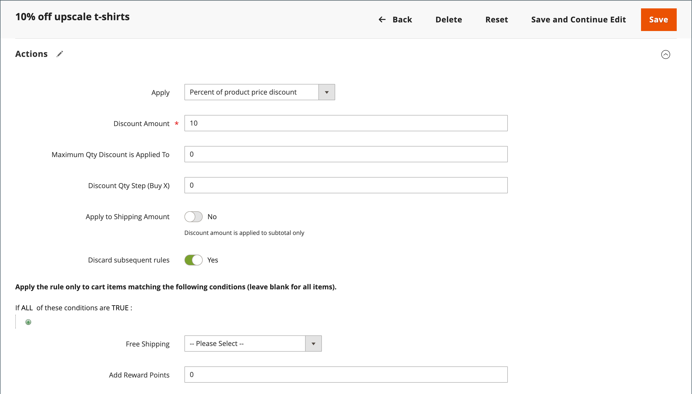

# Ejemplo de regla de precio del carro de compras: descuento con precio mínimo del producto

Las reglas de precio del carro de compras se pueden usar para ofrecer un descuento porcentual basado en un precio mínimo del producto en el carro de compras. En el siguiente ejemplo, se aplica un descuento del 10 % a todos los productos de todo el carro de compras cuando se agrega al menos un producto con un precio superior a 30,00 $ de una categoría especificada. El formato del descuento es el siguiente:

X% carrito entero cuando al menos 1 producto es de la categoría Y, y su precio es de más de $ Z dólares.

## Paso 1. Crear una regla de carro de compras

Siga las [instrucciones](price-rules-cart.md) básicas para crear una regla de carro de compras.

## Paso 2. Definición de las condiciones

1. Desplácese hacia abajo y expanda  en la sección **[!UICONTROL Conditions]**.

1. Haga clic en _Agregar_ () y elija **[!UICONTROL Product Attribute Combination]**.

   {width="500" zoomable="yes"}

1. Haga clic en _Agregar_ () al principio de la línea siguiente y en la lista bajo **[!UICONTROL Product Attribute]**, elija **[!UICONTROL Category]**.

   - Haga clic en el vínculo (**...**) _más_ para mostrar opciones adicionales.

     {width="600" zoomable="yes"}

   - Haga clic en el icono _Selector_ () para ver las categorías disponibles. En el árbol de categorías, active la casilla de verificación de cada categoría que desee incluir. Haga clic en el icono de verificación para aceptar las selecciones de categoría.

     {width="600" zoomable="yes"}

1. Haga clic en _Agregar_ () al principio de la línea siguiente y haga lo siguiente:

   - En la lista debajo de **[!UICONTROL Cart Item Attribute]**, elija **[!UICONTROL Price in cart]**.

     {width="500"}

   - Haga clic en **is** y elija `equals or greater than`.

   - Haga clic en **...** e introduzca la cantidad que debe estar el precio en el carro de compras para cumplir la condición. Por ejemplo, escriba `30`.

     {width="500"}

1. Haga clic en **[!UICONTROL Save and Continue Edit]**.

## Paso 3. Definición de las acciones

1. Expanda  en la sección **[!UICONTROL Actions]** y haga lo siguiente:

   {width="600" zoomable="yes"}

   - Establezca **[!UICONTROL Apply]** en `Percent of product price discount`.

   - Escriba **[!UICONTROL Discount Amount]**. Por ejemplo, escriba `10` para obtener un descuento del 10%.

   - Para evitar que se apliquen promociones adicionales a la compra, establezca **[!UICONTROL Discard subsequent rules]** en `Yes`.

1. Haga clic en **[!UICONTROL Save and Continue Edit]** y complete la regla según sea necesario.

## Paso 4. Completar las etiquetas

Complete [Paso 4](price-rules-cart.md) de las instrucciones de la regla de precios del carro de compras para ingresar las etiquetas que aparezcan durante el cierre de compra.

## Paso 5: Guardar y probar la regla

{{new-price-rule}}

1. Una vez completada la regla, haga clic en **[!UICONTROL Save Rule]**.

1. Pruebe la regla para asegurarse de que funciona correctamente.
