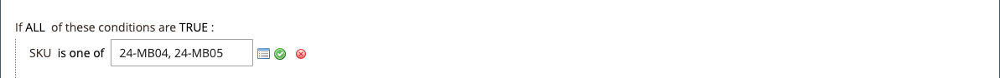

# Regla de precio de catálogo con varios SKU

Se puede aplicar una única regla de precio de catálogo a varios SKU, lo que permite crear varias promociones basadas en un producto, una marca o una categoría. Al crear esta regla, desea establecer condiciones que coincidan con los SKU seleccionados. Al crear la regla, puede examinar y seleccionar fácilmente los SKU de la cuadrícula.

## Paso 1. Verificar las propiedades de tienda del atributo de producto

Antes de comenzar, asegúrese de que las [propiedades de tienda](../catalog/attribute-product-create.md#step-4-describe-the-storefront-properties) del atributo `sku` están establecidas en `Use in Promo Rules`.

1. En la barra lateral _Admin_, vaya a **[!UICONTROL Stores]** > _[!UICONTROL Attributes]_>**[!UICONTROL Product]**.

1. En el filtro de búsqueda en la parte superior de la columna _[!UICONTROL Attribute Code]_, escriba `sku` y haga clic en **[!UICONTROL Search]**.

1. Haga clic para abrir el atributo `sku` en el modo de edición.

1. En el panel izquierdo, haga clic en **[!UICONTROL Storefront Properties]** y asegúrese de que **[!UICONTROL Use for Promo Rule Conditions]** está establecido en `Yes`.

1. Si cambió el valor de la propiedad, haga clic en **[!UICONTROL Save Attribute]**.

## Paso 2. Aplicar una regla de precio a varios SKU

1. En la barra lateral _Admin_, vaya a **[!UICONTROL Marketing]** > _[!UICONTROL Promotions]_>**[!UICONTROL Catalog Price Rules]**.

1. Realice una de las siguientes acciones:

   - Siga las instrucciones para crear una [regla de precio de catálogo](price-rules-catalog.md).
   - Abra una regla de precios de catálogo existente.

1. Expanda  en la sección **[!UICONTROL Conditions]** y haga lo siguiente:

   - En la primera línea, establezca el primer parámetro en `ANY`.

     {width="600" zoomable="yes"}

   - Haga clic en _Agregar_ () al principio de la línea siguiente y en la lista bajo **[!UICONTROL Product Attribute]**, haga clic en `SKU`.

     {width="600" zoomable="yes"}

   - Para la comparación, tiene opciones. Si desea localizar al menos uno de una lista de SKU, `select is one of`. Si desea encontrar un grupo de SKU que se deben encontrar todas, seleccione `is`. Se recomienda seleccionar `is one of`.

     {width="600" zoomable="yes"}

   - Para completar la condición, haga clic en el vínculo más (**...**) y luego en el icono _Selector_ () para ver la lista de productos disponibles.

     {width="600" zoomable="yes"}

   - Examine, filtre o busque para encontrar los SKU que desea agregar. En la lista, seleccione la casilla de verificación de cada producto que se va a incluir.

   - Haga clic en **[!UICONTROL Save and Apply]** para agregar los SKU a la condición.

     {width="600" zoomable="yes"}

1. Complete la regla, incluidas las [Acciones](price-rules-catalog.md) que se deban realizar cuando se cumplan las condiciones.

1. Una vez completada la regla, haga clic en **[!UICONTROL Save]**.

{{new-price-rule}}
