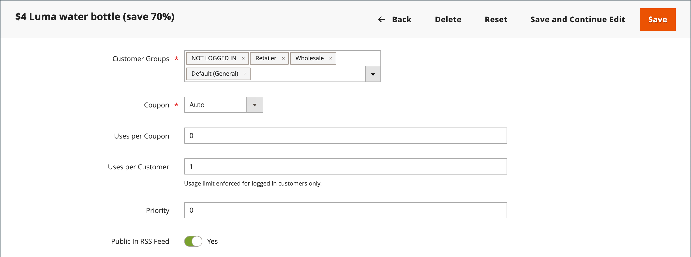
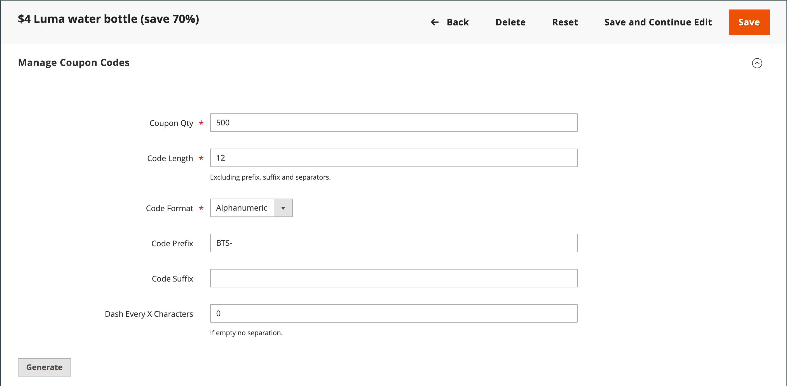

# Códigos de cupón

Los códigos de cupones se utilizan con [reglas de precios de carrito](price-rules-cart.md) para aplicar un descuento cuando se cumpla un conjunto de condiciones. Por ejemplo, se puede crear un código de cupón para un grupo de clientes específico o para cualquier persona que realice una compra de más de una cantidad determinada. Para aplicar el cupón a una compra, el cliente puede introducir el código del cupón en el carro de compras o, posiblemente, en la caja registradora de su _ladrillo y mortero_ tienda. A continuación se indican algunas formas de utilizar cupones en una tienda:

- Envíos de cupones por correo electrónico a clientes
- Producir cupones impresos
- Creación de cupones en tienda para usuarios móviles

Los códigos de cupones se pueden enviar por correo electrónico o incluir en boletines informativos, catálogos y anuncios. La lista de códigos de cupones se puede exportar y enviar a una imprenta comercial. También puede crear cupones en la tienda con un código de respuesta rápida que los compradores pueden escanear con sus teléfonos inteligentes. El código QR puede vincular a una página del sitio con más información sobre la promoción.

A partir de Commerce 2.4.7, los compradores pueden aplicar varios cupones a un carro de compras. Los comerciantes también pueden aplicar varios cupones utilizando la asistencia de compras.

## Configuración de códigos de cupones

La configuración controla la longitud y el formato de los códigos de cupón generados automáticamente. Los caracteres se pueden definir en todos los números, en todas las letras o en una combinación. Puede insertar un guión a intervalos establecidos para facilitar la lectura y agregar un prefijo y un sufijo para asociar el código a una campaña o iniciativa específica.

1. En el _Administrador_ barra lateral, vaya a **[!UICONTROL Stores]** > _[!UICONTROL Settings]_>**[!UICONTROL Configuration]**.

1. En el panel izquierdo, expanda **[!UICONTROL Customers]** y elija **[!UICONTROL Promotions]**.

   {width="600" zoomable="yes"}

1. Expanda el **[!UICONTROL Auto Generated Specific Coupon Codes]** sección.

   {width="600" zoomable="yes"}

1. Introduzca el **[!UICONTROL Code Length]**, incluidos prefijo, sufijo y separadores.

1. Configure las variables **[!UICONTROL Code Format]** a uno de los siguientes:

   - `Alphanumeric`
   - `Alphabetical`
   - `Numeric`

1. Para **[!UICONTROL Code Prefix]**, introduzca el valor que desea que aparezca al principio de todos los códigos de cupones.

1. Para **[!UICONTROL Code Suffix]**, introduzca el valor que desea que aparezca al final de todos los códigos de cupones.

1. Para **[!UICONTROL Dash Every X Characters]**, introduzca el número de caracteres entre cada guión.

   Los códigos de cupones con diferentes patrones de guión se consideran códigos diferentes, incluso si los números son los mismos.

1. Cuando termine, haga clic en **[!UICONTROL Save Config]**.

## Creación de cupones

>[!NOTE]
>
>Antes de crear cupones, utilice el `bin/magento cron:run` para verificar que cron se está ejecutando. Consulte [Ejecute cron desde la línea de comandos](https://experienceleague.adobe.com/docs/commerce-operations/configuration-guide/cli/configure-cron-jobs.html#run-cron-from-the-command-line) en el _Guía de configuración_ para obtener más información.

### Método 1: Creación de un cupón específico

1. Siga las instrucciones para crear un [regla de precios de carrito](price-rules-cart.md).

1. En el **[!UICONTROL Rule Information]** sección, conjunto **[!UICONTROL Coupon]** hasta `Specific Coupon`.

1. Introduzca una **[!UICONTROL Coupon Code]** para usar con la promoción.

   El formato del código (numérico, alfanumérico o alfabético) viene determinado por la variable [configuración](#configure-coupon-codes).

1. Para limitar el número de veces que se puede utilizar el cupón, haga lo siguiente:

   - Introduzca el número de **[!UICONTROL Uses per Coupon]**.
   - Introduzca el número de **[!UICONTROL Uses per Customer]**.

   Para un uso ilimitado, deje estos campos en blanco.

   {width="600" zoomable="yes"}

   >[!NOTE]
   >
   >Si varios clientes utilizan simultáneamente el mismo cupón al mismo tiempo, es posible que se supere el límite de uso establecido debido al retraso en el procesamiento de los cupones.

1. Para que el cupón sea válido durante un período de tiempo, haga lo siguiente:

   -  (Solo Magento Open Source) Complete el **Desde** y **Hasta** fechas. Para seleccionar la fecha, haga clic en **Calendario** () junto a cada campo. Si deja vacío el intervalo de fechas, la regla no caduca.

   -  (Solo Adobe Commerce) Realice una de las siguientes acciones:

     **Opción 1:** Programar una nueva actualización

      - Clic **[!UICONTROL Schedule New Update]** en la esquina superior derecha de la página.

        {width="600" zoomable="yes"}

      - Introduzca el **[!UICONTROL Update Name]** y **[!UICONTROL Description]**.

      - Elija la **Fecha de inicio** y **[!UICONTROL End Date]** del Calendario (  ). Si deja vacío el intervalo de fechas, la regla no caduca.

      - Cuando termine, haga clic en **[!UICONTROL Save]**.

        {width="600" zoomable="yes"}

     **Opción 2:** Asignar a una actualización existente:

      - Seleccionar **[!UICONTROL Assign to Another Update]**.

      - Busque la actualización en la lista y haga clic en **[!UICONTROL Select]**.

1. Complete la [regla de precios de carrito](price-rules-cart.md) según sea necesario.

### Método 2: Generación de un lote de cupones

La generación de cupones de descuento es una operación asincrónica, que se ejecuta en segundo plano para que pueda seguir trabajando en el administrador sin esperar a que finalice la operación. El sistema muestra un mensaje cuando se completa la tarea.

1. Siga las instrucciones para crear un [regla de precios de carrito](price-rules-cart.md).

1. En **[!UICONTROL Coupon Code]**, seleccione la **[!UICONTROL Use Auto Generation]** casilla de verificación

1. Para limitar el número de veces que cada cliente puede utilizar el cupón, introduzca el número de **[!UICONTROL Uses per Customer]**.

   {width="600" zoomable="yes"}

   >[!NOTE]
   >
   >Si varios clientes utilizan simultáneamente el mismo cupón al mismo tiempo, es posible que se supere el límite de uso establecido debido al retraso en el procesamiento de los cupones.

1. Desplazarse hacia abajo y expandir  el **[!UICONTROL Manage Coupon Codes]** y haga lo siguiente:

   {width="600" zoomable="yes"}

   - Para **[!UICONTROL Coupons Qty]**, introduzca el número de cupones que desea generar.

   - Introduzca el **[!UICONTROL Code Length]**, sin incluir el prefijo, el sufijo ni los separadores.

   - Configure las variables **[!UICONTROL Code Format]** a uno de los siguientes:

      - `Alphanumeric`
      - `Alphabetical`
      - `Numeric`

   - (Opcional) Introduzca una **[!UICONTROL Code Prefix]** para que se añada al principio del código.

   - (Opcional) Introduzca una **[!UICONTROL Code Suffix]** para que se añada al final del código.

   - (Opcional) Para **[!UICONTROL Dash Every X Characters]**, introduzca el número de caracteres entre cada guión. Por ejemplo, si el código tiene 12 caracteres de longitud y hay un guión cada cuatro caracteres, tiene el siguiente aspecto `xxxx-xxxx-xxxx`. Los guiones facilitan la lectura y la introducción de códigos.

1. Cuando termine, haga clic en **[!UICONTROL Generate]**.

   El sistema muestra `Message is added to queue, wait to get your coupons soon`.

   Una vez finalizado el trabajo de cron, se muestra la lista de códigos generados.

   | Campo | Descripción |
   |-------------|-------------|
   | [!UICONTROL Coupon Code] | Un código de cupón único que se creó y que puede utilizarse para recibir condiciones especiales. |
   | [!UICONTROL Created] | La fecha en la que se creó el código de cupón. |
   | [!UICONTROL Used] | Indica si se ha utilizado el cupón. |
   | [!UICONTROL Times Used] | Indica cuántas veces se ha utilizado el código de cupón. |

   {style="table-layout:auto"}

Puede exportar códigos de cupón a un archivo CSV o XML de Excel seleccionando el formato de archivo y haciendo clic en **[!UICONTROL Export]**.

Para eliminar códigos de cupones, seleccione uno o varios códigos de la lista. Seleccionar `Delete` desde el **[!UICONTROL Actions]**  y haga clic en **[!UICONTROL Submit]**.

>[!NOTE]
>
>Aunque Commerce permite configurar varios códigos de cupón, los clientes solo pueden utilizar un código de cupón en el carro de compras. Para permitir el uso de más de un código de cupón en el carro de compras simultáneamente, puede considerar el uso de una extensión correspondiente de [Commerce Marketplace](https://marketplace.magento.com/).

## Informe de cupones

El _Cupones_ report agrega datos de cada cupón que se utiliza durante un intervalo de fechas específico. Dado que los cupones se aplican desde el carro de compras, el informe incluye datos de todos los cupones canjeados, independientemente de [estado del pedido](../stores-purchase/order-status.md). En consecuencia, el informe podría incluir tanto los totales previstos como los reales. El informe se puede filtrar para una vista de tienda, un período de tiempo, un estado de pedido y una regla de precio de carro de compras específicos.

En el ejemplo siguiente, dos clientes utilizaron el código de cupón &quot;H20&quot;. Uno de los pedidos se factura, pero el otro sigue _pendiente_. Las columnas Subtotal de Ventas proyectadas, Descuento de Ventas y Total de Ventas muestran los importes agregados de ambos pedidos, pero sólo aparece el pedido facturado real en las columnas Subtotal, Descuento y Total. Cada fila del informe representa una sola promoción de cupones.

{width="600" zoomable="yes"}

### Ejecutar el informe

1. En el _Administrador_ barra lateral, vaya a **[!UICONTROL Reports]** > _[!UICONTROL Sales]_>**[!UICONTROL Coupons]**.

1. Si tiene varias vistas de tienda, establezca **[!DNL Store View]** en la esquina superior izquierda para establecer el ámbito del informe.

1. Para actualizar las ventas [estadísticas](../getting-started/sales-reports.md#refresh-statistics) para el día, haga clic en _Última actualización_ en la parte superior del espacio de trabajo.

   A continuación, haga clic en para seleccionar **[!UICONTROL Coupons]** y haga clic en **[!UICONTROL Refresh]**.

   {width="600" zoomable="yes"}

1. Para filtrar los datos, haga lo siguiente:

   {width="600" zoomable="yes"}

   - Establecer **[!UICONTROL Date Used]** a uno de los siguientes:

      - `Order Created`
      - `Order Updated`

     El _Pedido actualizado_ El informe se crea en tiempo real y no requiere una actualización.

   - Para definir el período de tiempo que abarca el informe, establezca **[!UICONTROL Period]** a uno de los siguientes:

      - `Day`
      - `Month`
      - `Year`

   - Para definir el intervalo de fechas del informe, introduzca la variable **Desde** y **Hasta** fechas en formato M/D/AA.

   - Para imprimir un informe de un informe específico [estado del pedido](../stores-purchase/order-status.md), configurado **[!UICONTROL Order Status]** hasta `Specified` y elija el estado del pedido en la lista.

   - Para omitir filas sin datos del informe, establezca **[!UICONTROL Empty Rows]** hasta `No`.

   - Para definir la actividad de cupones incluida en el informe, realice una de las siguientes acciones:

      - Para incluir toda la actividad de cupones de todas las reglas de precios, establezca **[!UICONTROL Cart Price Rule]** hasta `Any`.
      - Para incluir solo la actividad relacionada con una regla de precio específica, establezca **[!UICONTROL Cart Price Rule]** hasta `Specified` y seleccione la regla de precio del carro de compras en la lista.

1. Cuando esté listo para ejecutar el informe, haga clic en **[!UICONTROL Show Report]**.

   El informe aparece en la parte inferior de la página.

### Opciones de filtro

| Campo | Descripción |
|--- |--- |
| [!UICONTROL Date Used] | Identifica el campo de fecha que se utiliza como base del informe. Opciones: **[!UICONTROL Order Created]**: genera el informe en función de la fecha en la que el cliente realizó el pedido. Para asegurarse de que se incluyen los datos más actuales, haga clic en el vínculo del mensaje para actualizar las estadísticas. **[!UICONTROL Order Updated]**: genera el informe en función de la última actualización de los pedidos. Este informe utiliza datos en tiempo real y no requiere que se actualicen las estadísticas. |
| [!UICONTROL Period] | Determina el tipo de intervalo de fecha que se utiliza para el informe. Opciones: `Day` / `Month` / `Year` |
| [!UICONTROL From] | Indica la primera fecha del rango de datos de pedido que se incluye en el informe. |
| [!UICONTROL To] | Indica la última fecha del rango de datos de pedido que se incluye en el informe. |
| [!UICONTROL Order Status] | Filtra el informe por estado de pedido. El informe se puede generar para todos los pedidos o se puede limitar a un estado de pedido específico. Opciones:  **[!UICONTROL Any]**: incluye todos los pedidos independientemente del estado. **[!UICONTROL Specified]**: incluye solo pedidos con el estado especificado. Los pedidos cancelados no se incluyen en el informe. |
| [!UICONTROL Empty Rows] | Determina si el informe incluye filas de datos vacíos que podrían recuperarse. Opciones: `Yes` / `No` |
| [!UICONTROL Cart Price Rules] | Determina qué promociones de cupones se incluyen en el informe. Opciones: **[!UICONTROL Any]**: Incluye información de pedido de cualquier promoción de cupones que se haya utilizado durante el intervalo de fechas especificado. **[!UICONTROL Specified]**: incluye solo información de pedido para la promoción de cupones seleccionada durante el intervalo de fechas especificado. |

{style="table-layout:auto"}

### Columnas del informe

| Columna | Descripción |
|--- |--- |
| [!UICONTROL Interval] | Indica el intervalo de fechas de uso de cupones que se va a incluir en el informe. El intervalo puede ser un día, mes o año específico o un intervalo de fechas. La fecha del intervalo tiene el formato que se muestra en los ejemplos siguientes, según el valor establecido en **[!UICONTROL Period]** configuración: `Day`: 21/6/19 `Month`: 6/2019 `Year`: 2019 |
| [!UICONTROL Coupon Code] | El código de descuento que introducen los clientes en el carro de compras para recibir el descuento. |
| [!UICONTROL Price Rule] | El nombre de la regla de precio asociada al cupón. |
| [!UICONTROL Uses] | El número de veces que se ha utilizado el cupón durante el intervalo de fechas especificado para el informe. |
| [!UICONTROL Sales Subtotal] | El subtotal proyectado de todos los pedidos realizados con el cupón.  El subtotal de ventas representa el subtotal agregado de todos los pedidos aptos e incluye `Pending` pedidos de venta que aún no se han facturado. |
| [!UICONTROL Sales Discount] | El importe de descuento proyectado de todos los pedidos realizados con el cupón.  El descuento representa el importe de descuento agregado de todos los pedidos aptos e incluye `Pending` pedidos de venta que aún no se han facturado. |
| [!UICONTROL Sales Total] | El total general proyectado de todos los pedidos realizados con el cupón. El total de ventas incluye cualquier tarifa de envío y manipulación, menos el importe del descuento.  El total de ventas representa el importe total general agregado de todos los pedidos aptos e incluye `Pending` pedidos de venta que aún no se han facturado. El valor incluye el subtotal más gastos de envío y manipulación, menos el descuento, más impuestos.   Calculado por: `((Subtotal + Shipping & Handling) - Discount) + Tax` |
| [!UICONTROL Subtotal] | El subtotal agregado de todos los pedidos facturados que utilizaron el cupón. |
| [!UICONTROL Discount] | El descuento agregado de todos los pedidos facturados que utilizaron el cupón. |
| [!UICONTROL Total] | El total del pedido agregado de todos los pedidos facturados que utilizaron el cupón. |

{style="table-layout:auto"}
