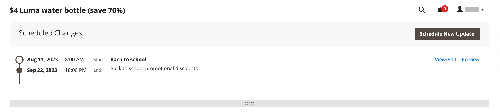
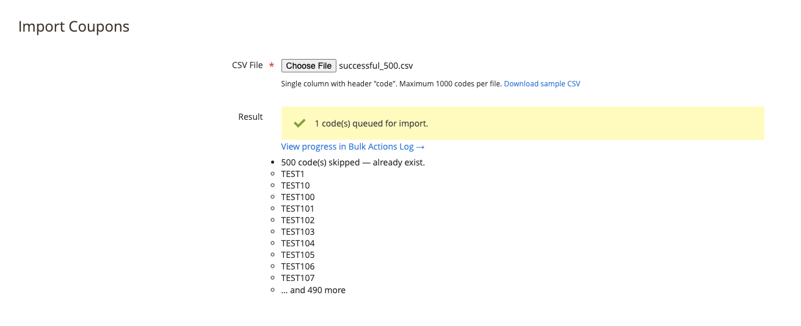

# Códigos de cupón

Los códigos de cupones se utilizan con [reglas de precio de carro de compras](price-rules-cart.md) para aplicar un descuento cuando se cumple un conjunto de condiciones. Por ejemplo, se puede crear un código de cupón para un grupo de clientes específico o para cualquier persona que realice una compra de más de una cantidad determinada. Para aplicar el cupón a una compra, el cliente puede ingresar el código del cupón en el carro de compras o posiblemente en la caja registradora de su tienda _brick and mortar_. A continuación se indican algunas formas de utilizar cupones en una tienda:

- Envíos de cupones por correo electrónico a clientes
- Producir cupones impresos
- Creación de cupones en tienda para usuarios móviles

Los códigos de cupones se pueden enviar por correo electrónico o incluir en boletines informativos, catálogos y anuncios. La lista de códigos de cupones se puede exportar y enviar a una imprenta comercial. También puede crear cupones en la tienda con un código de respuesta rápida que los compradores pueden escanear con sus teléfonos inteligentes. El código QR puede vincular a una página del sitio con más información sobre la promoción.

A partir de Commerce 2.4.7, los compradores pueden aplicar varios cupones a un carro de compras. Los comerciantes también pueden aplicar varios cupones utilizando la asistencia de compras.

>[!NOTE]
>
>Las reglas de precios del carro de compras que tienen la misma prioridad no resultan en un descuento combinado. Cada regla (cupón) se aplica a los productos coincidentes por separado, uno a uno, según el ID de regla de precios del carro de compras de la base de datos. Para controlar el orden en que se aplican los descuentos, Adobe recomienda establecer una prioridad diferente para cada regla de precio del carro de compras agregada.

## Configuración de códigos de cupones

>[!BEGINSHADEBOX]

De forma predeterminada, Commerce admite dos métodos para crear códigos de cupones:

1. Creación de un único código de cupón específico
1. Generando varios códigos de cupón _random_

Si ya tiene una lista de códigos de cupones que desea importar y asociar con una regla de precio de carro de compras, debería considerar la posibilidad de usar una extensión de [Commerce Marketplace](https://marketplace.magento.com/).

>[!ENDSHADEBOX]

La configuración controla la longitud y el formato de los códigos de cupón generados automáticamente. Los caracteres se pueden definir en todos los números, en todas las letras o en una combinación. Puede insertar un guión a intervalos establecidos para facilitar la lectura y agregar un prefijo y un sufijo para asociar el código a una campaña o iniciativa específica.

1. En la barra lateral _Admin_, vaya a **[!UICONTROL Stores]** > _[!UICONTROL Settings]_>**[!UICONTROL Configuration]**.

1. En el panel izquierdo, expanda **[!UICONTROL Customers]** y elija **[!UICONTROL Promotions]**.

   {width="600" zoomable="yes"}

1. Expanda la sección **[!UICONTROL Auto Generated Specific Coupon Codes]**.

   {width="600" zoomable="yes"}

1. Escriba **[!UICONTROL Code Length]**, incluidos prefijo, sufijo y separadores.

1. Establezca **[!UICONTROL Code Format]** en una de las siguientes opciones:

   - `Alphanumeric`
   - `Alphabetical`
   - `Numeric`

1. Para **[!UICONTROL Code Prefix]**, escriba el valor que desea que aparezca al principio de todos los códigos de cupones.

1. Para **[!UICONTROL Code Suffix]**, escriba el valor que desea que aparezca al final de todos los códigos de cupones.

1. Para **[!UICONTROL Dash Every X Characters]**, escriba el número de caracteres entre cada guión.

   Los códigos de cupones con diferentes patrones de guión se consideran códigos diferentes, incluso si los números son los mismos.

1. Una vez finalizado, haga clic en **[!UICONTROL Save Config]**.

## Creación de cupones

>[!NOTE]
>
>[!BADGE Solo PaaS]{type=Informative url="https://experienceleague.adobe.com/en/docs/commerce/user-guides/product-solutions" tooltip="Se aplica solo a proyectos de Adobe Commerce en la nube (infraestructura PaaS administrada por Adobe) y a proyectos locales."} Antes de crear cupones, use el comando `bin/magento cron:run` para comprobar que cron se está ejecutando. Consulte [Ejecutar cron desde la línea de comandos](https://experienceleague.adobe.com/docs/commerce-operations/configuration-guide/cli/configure-cron-jobs.html#run-cron-from-the-command-line) en la _Guía de configuración_ para obtener más información.

### Método 1: Creación de un cupón específico

1. Siga las instrucciones para crear una [regla de precio del carro de compras](price-rules-cart.md).

1. En la sección **[!UICONTROL Rule Information]**, establezca **[!UICONTROL Coupon]** en `Specific Coupon`.

1. Escriba un(a) **[!UICONTROL Coupon Code]** para usar con la promoción.

   El formato del código (numérico, alfanumérico o alfabético) está determinado por la [configuración](#configure-coupon-codes).

1. Para limitar el número de veces que se puede utilizar el cupón, haga lo siguiente:

   - Escriba el número de **[!UICONTROL Uses per Coupon]**.
   - Escriba el número de **[!UICONTROL Uses per Customer]**.

   Para un uso ilimitado, deje estos campos en blanco.

   {width="600" zoomable="yes"}

   >[!NOTE]
   >
   >Si varios clientes utilizan simultáneamente el mismo cupón al mismo tiempo, es posible que se supere el límite de uso establecido debido al retraso en el procesamiento de los cupones.

1. Para que el cupón sea válido durante un período de tiempo, haga lo siguiente:

   -  (solo Magento Open Source) Complete las fechas **Desde** y **Hasta**. Para seleccionar la fecha, haga clic en el icono **Calendario** () que hay junto a cada campo. Si deja vacío el intervalo de fechas, la regla no caduca.

   -  (solo Adobe Commerce) Realice una de las siguientes acciones:

     **Opción 1:** Programar una nueva actualización

      - Haga clic en **[!UICONTROL Schedule New Update]** en la esquina superior derecha de la página.

        {width="600" zoomable="yes"}

      - Escriba **[!UICONTROL Update Name]** y **[!UICONTROL Description]**.

      - Elija **Fecha de inicio** y **[!UICONTROL End Date]** del calendario (  ). Si deja vacío el intervalo de fechas, la regla no caduca.

      - Una vez finalizado, haga clic en **[!UICONTROL Save]**.

        {width="600" zoomable="yes"}

     **Opción 2:** Asignar a una actualización existente:

      - Seleccione **[!UICONTROL Assign to Another Update]**.

      - Busque la actualización en la lista y haga clic en **[!UICONTROL Select]**.

1. Complete la [regla de precio del carro de compras](price-rules-cart.md) según sea necesario.

### Método 2: Generación de un lote de cupones

La generación de cupones de descuento es una operación asincrónica, que se ejecuta en segundo plano para que pueda seguir trabajando en el administrador sin esperar a que finalice la operación. El sistema muestra un mensaje cuando se completa la tarea.

1. Siga las instrucciones para crear una [regla de precio del carro de compras](price-rules-cart.md).

1. En **[!UICONTROL Coupon Code]**, seleccione la casilla de verificación **[!UICONTROL Use Auto Generation]**.

1. Para limitar el número de veces que cada cliente puede utilizar el cupón, escriba el número de **[!UICONTROL Uses per Customer]**.

   {width="600" zoomable="yes"}

   >[!NOTE]
   >
   >Si varios clientes utilizan simultáneamente el mismo cupón al mismo tiempo, es posible que se supere el límite de uso establecido debido al retraso en el procesamiento de los cupones.

1. Desplácese hacia abajo y expanda  en la sección **[!UICONTROL Manage Coupon Codes]** y haga lo siguiente:

   {width="600" zoomable="yes"}

   - Para **[!UICONTROL Coupons Qty]**, introduzca el número de cupones que desea generar.

   - Escriba **[!UICONTROL Code Length]**, sin incluir el prefijo, el sufijo ni los separadores.

   - Establezca **[!UICONTROL Code Format]** en una de las siguientes opciones:

      - `Alphanumeric`
      - `Alphabetical`
      - `Numeric`

   - (Opcional) Escriba un **[!UICONTROL Code Prefix]** para agregarlo al principio del código.

   - (Opcional) Escriba un **[!UICONTROL Code Suffix]** para agregarlo al final del código.

   - (Opcional) Para **[!UICONTROL Dash Every X Characters]**, escriba el número de caracteres entre cada guión. Por ejemplo, si el código tiene 12 caracteres de longitud y hay un guión cada cuatro caracteres, el aspecto es `xxxx-xxxx-xxxx`. Los guiones facilitan la lectura y la introducción de códigos.

1. Una vez finalizado, haga clic en **[!UICONTROL Generate]**.

   El sistema muestra `Message is added to queue, wait to get your coupons soon`.

   Una vez finalizado el trabajo de cron, se muestra la lista de códigos generados.

   | Campo | Descripción |
   |-------------|-------------|
   | [!UICONTROL Coupon Code] | Un código de cupón único que se creó y que puede utilizarse para recibir condiciones especiales. |
   | [!UICONTROL Created] | La fecha en la que se creó el código de cupón. |
   | [!UICONTROL Used] | Indica si se ha utilizado el cupón. |
   | [!UICONTROL Times Used] | Indica cuántas veces se ha utilizado el código de cupón. |

   {style="table-layout:auto"}

Puede exportar códigos de cupones a un archivo CSV o XML de Excel seleccionando el formato de archivo y haciendo clic en **[!UICONTROL Export]**.

Para eliminar códigos de cupones, seleccione uno o varios códigos de la lista. Seleccione `Delete` del selector **[!UICONTROL Actions]** y haga clic en **[!UICONTROL Submit]**.

### Método 3: Códigos de cupón personalizados

[!BADGE Solo SaaS]{type=Positive url="https://experienceleague.adobe.com/en/docs/commerce/user-guides/product-solutions" tooltip="Solo se aplica a los proyectos de Adobe Commerce as a Cloud Service y Adobe Commerce Optimizer (infraestructura de SaaS administrada por Adobe)."}

Después de crear una [regla de precio de carro de compras](price-rules-cart.md), puede agregar manualmente códigos de cupones personalizados a la regla.

1. En la barra lateral _Admin_, vaya a **[!UICONTROL Marketing]** > _[!UICONTROL Promotions]_>**[!UICONTROL Cart Price Rules]**&#x200B;y seleccione la regla a la que desee agregar códigos de cupones personalizados.

1. Expanda la sección **[!UICONTROL Manage Coupon Codes]** y haga clic en **[!UICONTROL Add Coupon Code]**.

   {width="600" zoomable="yes"}

1. En el cuadro de diálogo **[!UICONTROL Add Custom Coupon]**, escriba el código de cupón que desee utilizar para la regla de precio del carro de compras y haga clic en **[!UICONTROL Save]**.

   {width="600" zoomable="yes"}

1. Haga clic en **[!UICONTROL Save]** para actualizar la regla de precios del carro de compras.

Para eliminar códigos de cupones personalizados, seleccione los códigos que desea eliminar en la cuadrícula y, a continuación, seleccione **[!UICONTROL Delete]** del selector **[!UICONTROL Actions]**.

Para editar códigos de cupones personalizados o ver detalles de uso, haga clic en **[!UICONTROL Edit]** en la columna **[!UICONTROL Actions]**.

&lt;InlineAlert variant="info" slots="text"/>

El código de cupón principal que pertenece a la regla de precio del carro de compras no se puede editar ni eliminar.

{width="600" zoomable="yes"}

#### Importación masiva de códigos de cupones personalizados

Si tiene una lista de códigos de cupones predefinidos, puede adjuntarlos a la regla de precio del carro de compras desde un archivo CSV en lugar de agregar cada código individualmente. El archivo CSV debe constar de una sola columna con los códigos de cupones.

1. En la barra lateral _Admin_, vaya a **[!UICONTROL Marketing]** > _[!UICONTROL Promotions]_>**[!UICONTROL Cart Price Rules]**&#x200B;y seleccione la regla en la que desea importar los códigos de cupones personalizados.

1. Expanda la sección **[!UICONTROL Manage Coupon Codes]** y haga clic en **[!UICONTROL Import]**.

   >[!NOTE]
   >
   >El botón **[!UICONTROL Import]** está disponible en las reglas de precios del carro de compras guardadas con **[!UICONTROL Coupon]** establecido en `Specific Coupon` y **[!UICONTROL Use Auto Generation]** desactivado.

1. En el cuadro de diálogo **[!UICONTROL Import Coupons]**, haga clic en **[!UICONTROL Choose File]** y seleccione el archivo CSV que contiene los códigos de cupones que desea importar.

   El archivo CSV debe cumplir los siguientes requisitos:

   | Requisito | Valor |
   |-------------|-------|
   | Número máximo de códigos por archivo | 1,000 |
   | Tamaño máximo de archivo | 512 KB |
   | Longitud máxima del código | 255 caracteres por código |
   | Códigos duplicados | No permitido dentro del mismo archivo |

   {style="table-layout:auto"}

   Una vez seleccionado el archivo, el cuadro de diálogo muestra un **[!UICONTROL Preview]** con el número de códigos listos para importar y un ejemplo de los primeros códigos del archivo.

   {width="600" zoomable="yes"}

1. Haga clic en **[!UICONTROL Import]**. El cuadro de diálogo muestra un resumen con el número de códigos en cola para la importación y una lista de los códigos existentes que se omitieron.

   {width="600" zoomable="yes"}

Para supervisar el progreso y los resultados detallados de la importación, haga clic en **[!UICONTROL View progress in Bulk Actions Log]** o vaya a **[!UICONTROL System]** > _[!UICONTROL Action Log]_>**[!UICONTROL Bulk Actions]**. Cada importación aparece como una sola entrada en **[!UICONTROL Bulk Actions]**&#x200B;y seleccione una entrada.

## Informe de cupones

El informe _Cupones_ agrega datos de cada cupón que se usa durante un intervalo de fechas específico. Como los cupones se aplican desde el carro de compras, el informe incluye datos de todos los cupones canjeados, independientemente de [estado del pedido](../stores-purchase/order-status.md). En consecuencia, el informe podría incluir tanto los totales previstos como los reales. El informe se puede filtrar para una vista de tienda, un período de tiempo, un estado de pedido y una regla de precio de carro de compras específicos.

En el ejemplo siguiente, dos clientes utilizaron el código de cupón &quot;H20&quot;. Uno de los pedidos se factura, pero el otro sigue _pendiente_. Las columnas Subtotal de Ventas proyectadas, Descuento de Ventas y Total de Ventas muestran los importes agregados de ambos pedidos, pero sólo aparece el pedido facturado real en las columnas Subtotal, Descuento y Total. Cada fila del informe representa una sola promoción de cupones.

{width="600" zoomable="yes"}

### Ejecutar el informe

1. En la barra lateral _Admin_, vaya a **[!UICONTROL Reports]** > _[!UICONTROL Sales]_>**[!UICONTROL Coupons]**.

1. Si tiene varias vistas de tienda, configure **[!DNL Store View]** en la esquina superior izquierda para establecer el ámbito del informe.

1. Para actualizar las [estadísticas](../getting-started/sales-reports.md#refresh-statistics) de ventas del día, haga clic en el mensaje _Última actualización_ en la parte superior del área de trabajo.

   A continuación, haga clic para seleccionar la casilla **[!UICONTROL Coupons]** y haga clic en **[!UICONTROL Refresh]**.

   {width="600" zoomable="yes"}

1. Para filtrar los datos, haga lo siguiente:

   {width="600" zoomable="yes"}

   - Establezca **[!UICONTROL Date Used]** en una de las siguientes opciones:

      - `Order Created`
      - `Order Updated`

     El informe _Pedido actualizado_ se crea en tiempo real y no requiere una actualización.

   - Para definir el período de tiempo que abarca el informe, establezca **[!UICONTROL Period]** en uno de los siguientes:

      - `Day`
      - `Month`
      - `Year`

   - Para definir el intervalo de fechas del informe, escriba las fechas **Desde** y **Hasta** en formato M/D/AA.

   - Para imprimir un informe para un [estado de pedido](../stores-purchase/order-status.md) específico, establezca **[!UICONTROL Order Status]** en `Specified` y elija el estado del pedido en la lista.

   - Para omitir filas sin datos del informe, establezca **[!UICONTROL Empty Rows]** en `No`.

   - Para definir la actividad de cupones incluida en el informe, realice una de las siguientes acciones:

      - Para incluir toda la actividad de cupones de todas las reglas de precios, establezca **[!UICONTROL Cart Price Rule]** en `Any`.
      - Para incluir solamente la actividad relacionada con una regla de precios específica, establezca **[!UICONTROL Cart Price Rule]** en `Specified` y seleccione la regla de precios del carro de compras en la lista.

1. Cuando esté listo para ejecutar el informe, haga clic en **[!UICONTROL Show Report]**.

   El informe aparece en la parte inferior de la página.

### Opciones de filtro

| Campo | Descripción |
|--- |--- |
| [!UICONTROL Date Used] | Identifica el campo de fecha que se utiliza como base del informe. Opciones: **[!UICONTROL Order Created]**: genera el informe en función de la fecha en la que el cliente realizó el pedido. Para asegurarse de que se incluyen los datos más actuales, haga clic en el vínculo del mensaje para actualizar las estadísticas. **[!UICONTROL Order Updated]**: genera el informe basándose en la fecha en la que se actualizaron los pedidos por última vez. Este informe utiliza datos en tiempo real y no requiere que se actualicen las estadísticas. |
| [!UICONTROL Period] | Determina el tipo de intervalo de fecha que se utiliza para el informe. Opciones: `Day` / `Month` / `Year` |
| [!UICONTROL From] | Indica la primera fecha del rango de datos de pedido que se incluye en el informe. |
| [!UICONTROL To] | Indica la última fecha del rango de datos de pedido que se incluye en el informe. |
| [!UICONTROL Order Status] | Filtra el informe por estado de pedido. El informe se puede generar para todos los pedidos o se puede limitar a un estado de pedido específico. Opciones:  **[!UICONTROL Any]**: incluye todos los pedidos independientemente del estado. **[!UICONTROL Specified]**: incluye solo pedidos con el estado especificado. Los pedidos cancelados no se incluyen en el informe. |
| [!UICONTROL Empty Rows] | Determina si el informe incluye filas de datos vacíos que podrían recuperarse. Opciones: `Yes` / `No` |
| [!UICONTROL Cart Price Rules] | Determina qué promociones de cupones se incluyen en el informe. Opciones: **[!UICONTROL Any]**: incluye información de pedido para cualquier promoción de cupones que se haya utilizado durante el intervalo de fechas especificado. **[!UICONTROL Specified]**: incluye sólo información de pedido para la promoción de cupones seleccionada durante el intervalo de fechas especificado. |

{style="table-layout:auto"}

### Columnas del informe

| Columna | Descripción |
|--- |--- |
| [!UICONTROL Interval] | Indica el intervalo de fechas de uso de cupones que se va a incluir en el informe. El intervalo puede ser un día, mes o año específico o un intervalo de fechas. La fecha del intervalo tiene el formato que se muestra en los ejemplos siguientes, según el valor establecido en la configuración **[!UICONTROL Period]**: `Day`: 6/21/19 `Month`: 6/2019 `Year`: 2019 |
| [!UICONTROL Coupon Code] | El código de descuento que introducen los clientes en el carro de compras para recibir el descuento. |
| [!UICONTROL Price Rule] | El nombre de la regla de precio asociada al cupón. |
| [!UICONTROL Uses] | El número de veces que se ha utilizado el cupón durante el intervalo de fechas especificado para el informe. |
| [!UICONTROL Sales Subtotal] | El subtotal proyectado de todos los pedidos realizados con el cupón.  El subtotal de ventas representa el subtotal agregado de todos los pedidos calificados e incluye `Pending` pedidos de ventas que aún no se han facturado. |
| [!UICONTROL Sales Discount] | El importe de descuento proyectado de todos los pedidos realizados con el cupón.  El descuento representa el importe de descuento agregado de todos los pedidos calificados e incluye `Pending` pedidos de venta que aún no se han facturado. |
| [!UICONTROL Sales Total] | El total general proyectado de todos los pedidos realizados con el cupón. El total de ventas incluye cualquier tarifa de envío y manipulación, menos el importe del descuento.  El total de ventas representa el total general agregado de todos los pedidos calificados e incluye `Pending` pedidos de ventas que aún no se han facturado. El valor incluye el subtotal más gastos de envío y manipulación, menos el descuento, más impuestos.   Calculado por: `((Subtotal + Shipping & Handling) - Discount) + Tax` |
| [!UICONTROL Subtotal] | El subtotal agregado de todos los pedidos facturados que utilizaron el cupón. |
| [!UICONTROL Discount] | El descuento agregado de todos los pedidos facturados que utilizaron el cupón. |
| [!UICONTROL Total] | El total del pedido agregado de todos los pedidos facturados que utilizaron el cupón. |

{style="table-layout:auto"}
