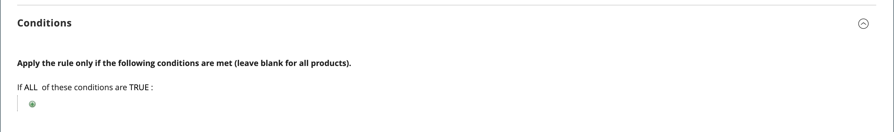
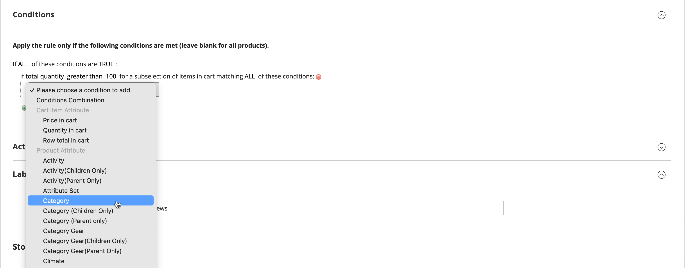

# Crear una regla de precios de carro

Complete los siguientes pasos para agregar una regla, describir las condiciones y definir las acciones. Complete también las etiquetas y pruebe la regla. Las condiciones de las reglas de precios pueden basarse en el carro de compras o en [atributos de productos](../catalog/product-attributes.md) o en [Audiencias de Real-Time CDP](#use-real-time-cdp-audiences-to-set-a-condition), pero no en [opciones personalizables](../catalog/settings-advanced-custom-options.md).

## Paso 1: Añadir una regla

1. En la barra lateral _Admin_, vaya a **[!UICONTROL Marketing]** > _[!UICONTROL Promotions]_>**[!UICONTROL Cart Price Rules]**.

1. Haga clic en **[!UICONTROL Add New Rule]** y haga lo siguiente:

   - En _[!UICONTROL Rule Information]_, complete **[!UICONTROL Rule Name]**y **[!UICONTROL Description]**.

   - Si no desea que la regla entre en vigor inmediatamente, establezca **[!UICONTROL Active]** en `No`.

   {width="600" zoomable="yes"}

1. Para establecer el [ámbito](../getting-started/websites-stores-views.md#scope-settings) de la regla, haga lo siguiente:

   - Seleccione el **[!UICONTROL Websites]** en el que la promoción estará disponible.

   - Seleccione el **[!UICONTROL Customer Groups]** al que se aplica la promoción.

     Si desea que la promoción esté disponible solamente para clientes registrados, **_no_** elija la opción `NOT LOGGED IN`.

1. Establezca la regla para aplicar con o sin un [cupón](price-rules-cart-coupon.md) de la siguiente manera:

   - Para aplicar la regla de carro de compras sin usar un código de cupón, establezca **[!UICONTROL Coupon]** en `No Coupon` y vaya al paso 5.

   - Para asociar un cupón con una regla de precio, establezca **[!UICONTROL Coupon]** en `Specific Coupon` y haga lo siguiente:

      - Escriba un mensaje de texto gratuito **[!UICONTROL Coupon Code]** que el cliente debe especificar para recibir el descuento.

      - Para establecer un límite en el número de veces que se puede utilizar el cupón, complete las siguientes opciones:

     | Opción | Descripción |
     |------|-----------|
     | `Uses per Coupon` | Determina cuántas veces se puede utilizar el código de cupón. Si no hay límite, deje el campo en blanco. |
     | `Uses per Customer` | Determina cuántas veces el mismo cliente registrado que pertenece a cualquiera de los grupos de clientes seleccionados puede usar la regla de precio del carro de compras. La configuración no se aplica a compradores invitados que sean miembros del grupo de clientes NOT LOGGED IN, ni a clientes que compren sin iniciar sesión en sus cuentas. Si no hay límite, deje el campo en blanco. |

     {style="table-layout:auto"}

     Para obtener más información, consulte [Códigos de cupón](price-rules-cart-coupon.md).

     {width="600" zoomable="yes"}

   -  (solo Magento Open Source) Usa _Calendario_ () para elegir el intervalo de fechas de **[!UICONTROL From]** y **[!UICONTROL To]** para la promoción.

1. Introduzca un número para definir el **[!UICONTROL Priority]** de esta regla de precio en relación con la configuración de acción de otras reglas de precio que estén activas al mismo tiempo.

   >[!NOTE]
   >
   >La configuración Prioridad es importante cuando dos reglas de carro de compras/códigos de cupones son válidos para el mismo producto al mismo tiempo. La regla con la configuración de prioridad más alta (`1` es la más alta) controla la acción del carro de compras. Consulte _Descartar reglas de precios subsiguientes_ en el paso _Definir las acciones_.

   >[!NOTE]
   >
   >Las reglas de precios del carro de compras que tienen la misma prioridad no resultan en un descuento combinado. Cada regla (cupón) se aplica a los productos coincidentes por separado, uno a uno, según el ID de regla de precios del carro de compras de la base de datos. Para controlar el orden en que se aplican los descuentos, Adobe recomienda establecer una prioridad diferente para cada regla de precio del carro de compras agregada.

1. Para aplicar la regla a las [fuentes RSS](social-rss.md#rss-feeds) publicadas, establezca **Público en la fuente RSS** en `Yes`.

1. Haga clic en **[!UICONTROL Save and Continue Edit]**.

   -  (solo Magento Open Source): una vez guardada la regla, el nombre de la regla de precios del carro de compras aparecerá en la parte superior de la página.

   -  (solo Adobe Commerce) Una vez guardada la regla, el nombre de la regla de precios del carro de compras y el cuadro [Cambios programados](price-rule-cart-scheduled-changes.md) aparecerán en la parte superior de la página.

     {width="600" zoomable="yes"}

## Paso 2: Describir las condiciones

En este paso se describen las condiciones que deben cumplirse para que una solicitud cumpla los requisitos para la promoción. La regla entra en acción cada vez que se cumple el conjunto de condiciones.

Si está usando audiencias de Real-Time CDP, vaya a [esta sección](#use-real-time-cdp-audiences-to-set-a-condition).

>[!NOTE]
>
>La regla de precio del carro de compras se aplica a **_cada_** producto del carro de compras siempre que se cumpla el conjunto de condiciones de la ficha _[!UICONTROL Conditions]_. Agregue condiciones en la pestaña_[!UICONTROL Actions]_ para limitar el número de productos afectados por la regla de precios del carro de compras.

>[!NOTE]
>
>Si al menos un atributo de producto condicional tiene un valor vacío, la regla de precio del carro de compras no se aplica al producto.

1. En el panel izquierdo, seleccione **[!UICONTROL Conditions]**.

   {width="600" zoomable="yes"}

   La primera condición aparece de forma predeterminada y establece lo siguiente:

   `If **ALL** of these conditions are **TRUE**:`

   La instrucción tiene dos vínculos en negrita en los que puede hacer clic para mostrar la selección de opciones de esa parte de la instrucción. Puede crear diferentes condiciones cambiando la combinación de estos valores. Realice una de las siguientes acciones:

   - Haga clic en **[!UICONTROL ALL]** y seleccione `ALL` o `ANY`.
   - Haga clic en **[!UICONTROL TRUE]** y seleccione `TRUE` o `FALSE`.
   - Deje la condición sin cambios para aplicar la regla a todos los productos.

1. Haga clic en _Agregar_ () al principio de la línea siguiente y seleccione una opción para la condición, como atributo de carro de compras, subselección de productos o combinación.

   Para este ejemplo, complete la siguiente parte de la condición de la siguiente manera:

   - Cuando se le pida **[!UICONTROL Choose the condition to add]**, elija `Products Subselection`.

     {width="600" zoomable="yes"}

   - En la condición, haga clic en **[!UICONTROL total quantity]** y seleccione `total quantity` o `total amount`.

   >[!IMPORTANT]
   >
   >[!UICONTROL Total amount] es un total de fila, por lo que los impuestos no se incluyen en `total amount` para la condición de regla de precio del carro de compras [!UICONTROL Products Subselection]. Use la condición [!UICONTROL Subtotal (Incl. Tax)] para incluir impuestos.

   - En la condición, haga clic en **[!UICONTROL is]** y seleccione `greater than`.

1. Cuando aparezca la siguiente parte de la condición, haga clic en los elementos de la instrucción para que pueda ver dónde se encuentra cada vínculo con valores de variables.

1. Haga clic en el vínculo &quot;más&quot; (...) y escriba `100`.

   Esta condición requiere que la cantidad total del carro de compras sea de `101` o más.

   {width="600" zoomable="yes"}

1. Haga clic en **Agregar** () al principio de la línea siguiente y, a continuación, agregue una condición basada en **Categoría**.

   {width="600" zoomable="yes"}

1. En la siguiente parte de la condición, haga clic en el vínculo _más_ (**...**) para mostrar el campo de entrada y, a continuación, abra el _Selector_ () para mostrar el árbol de categorías.

1. Seleccione la casilla de verificación de la categoría que desee usar como condición para la regla de precio y haga clic en el icono  para aceptar las selecciones de categoría.

   La condición se puede basar en cualquier categoría que sea secundaria de la [categoría raíz](../catalog/category-root.md) del almacén.

   {width="600" zoomable="yes"}

1. Para agregar más condiciones, haga clic en _Agregar_ () y defina otra condición.

   Puede repetir el proceso tantas veces como sea necesario para describir las condiciones que deben cumplirse para la regla de precio. Estos son algunos ejemplos:

   **Ejemplo 1:** Regla de precio regional

   Para crear una regla de precios regional, utilice uno de los siguientes atributos de carro de compras:

   - `Shipping Postcode`
   - `Shipping Region`
   - `Shipping State/Province`
   - `Shipping Country`

   **Ejemplo 2:** Totales del carro de compras

   Para basar la condición en los totales del carro de compras, utilice uno de los siguientes atributos:

   - `Subtotal`
   - `Total Items Quantity`
   - `Total Weight`

>[!NOTE]
>
>En el caso de varias promociones paralelas, la condición _Subtotal_ se aplica al subtotal del carro de compras _base_ **_antes_** de cualquier descuento.

>[!IMPORTANT]
>
>**Solo para pedidos de compra**: Cuando se establece una regla de precio de carro de compras basada en uno o más métodos de pago específicos, el descuento se aplica al total cuando se crea un pedido de compra. Una vez creado el pedido de compra, el descuento permanece aplicado al total si el método de pago se cambia por uno que no esté cubierto por la regla de precio del carro de compras.

### Añadir un atributo de producto a las reglas de precios del carro de compras

1. Vaya a **[!UICONTROL Stores]** > _[!UICONTROL Attributes]_>**[!UICONTROL Product]**y abra el atributo del producto.

1. En el panel izquierdo, seleccione **[!UICONTROL Storefront Properties]**.

1. Establezca **[!UICONTROL Use for Promo Rule Conditions]** en `Yes`.

1. Haga clic en **[!UICONTROL Save Attribute]**.

1. Vaya a **[!UICONTROL Marketing]** > **[!UICONTROL Cart Price Rules]** y abra la regla de precios del carro de compras requerida.

1. Expanda  en la sección **[!UICONTROL Condition]** y seleccione **[!UICONTROL Product attribute combination]**.

1. Establezca esta condición en uno de los siguientes valores:

   - Haga clic en **[!UICONTROL FOUND]** y seleccione `FOUND` o `NOT FOUND`.

   - Haga clic en **[!UICONTROL ALL]** y seleccione `ALL` o `ANY`.

1. Haga clic en el icono _Agregar_ () y seleccione el **[!UICONTROL Product Attribute]** que configuró para las condiciones de regla promocional.

1. Haga clic en **[!UICONTROL Save]**.

>[!NOTE]
>
>Cuando se usa la condición `is not one of` con un atributo de producto _SKU_ y un producto configurable, se deben seleccionar tanto los SKU del producto principal como los secundarios. Para evitar enumerar todos los SKU secundarios en la regla, puede utilizar la condición `does not contain` con partes de SKU comunes de un producto configurable y sus productos secundarios.

### Usar audiencias de Real-Time CDP para establecer una condición

Puede establecer una condición para una regla de precio del carro de compras basada en una [audiencia](../customers/audience-activation.md) de Real-Time CDP.

1. Expanda **[!UICONTROL Conditions]**, haga clic en el icono &quot;+&quot; y seleccione **[!UICONTROL Real-Time CDP Audience]** de la lista.

   {width="300"}

1. Seleccione el icono _Más_ (**...**), haga clic en **[!UICONTROL Open Chooser]** y vea todas las audiencias de Real-Time CDP disponibles.

   {width="600" zoomable="yes"}

1. Seleccione la audiencia de Real-Time CDP que desee utilizar para la regla de precio del carro de compras.

   | Opción | Descripción |
   |------|-----------|
   | `ID` | Un identificador interno de la audiencia que se usa en el administrador |
   | `Real-Time CDP Audience ID` | Identificador único de la audiencia cuando se creó en Experience Platform |
   | `Name` | Nombre de la audiencia, como `Orders over $50` |
   | `Description` | Descripción de la audiencia, como `People who placed an order over $50 in the last month.`. |
   | `Source` | Indica la procedencia de la audiencia, como `Experience Platform`. |
   | `Website` | Indica qué sitio web ha vinculado al conjunto de datos que contiene las audiencias. Este vínculo se crea al conectar la instancia de Commerce al Experience Platform mediante la extensión [[!DNL Data Connection]](https://experienceleague.adobe.com/docs/commerce-merchant-services/data-connection/fundamentals/connect-data.html). |

   {style="table-layout:auto"}

En el siguiente paso, defina la acción que se producirá cuando se cumpla la condición.

## Paso 3: Definir las acciones

Las acciones de regla de precios del carro de compras describen cómo se actualizan los precios cuando se cumplen las condiciones.

1. Desplácese hacia abajo hasta **[!UICONTROL Actions]** y expanda  la sección.

   {width="600" zoomable="yes"}

1. Establezca **[!UICONTROL Apply]** en una de las siguientes opciones de descuento:

   | Opción | Descripción |
   |------|-----------|
   | `Percent of product price discount` | Artículo de descuentos al restar un porcentaje del precio original. El descuento se aplica a cada artículo que cumpla los requisitos del carro de compras. Por ejemplo: escriba `10` en [!UICONTROL Discount Amount] para obtener un precio actualizado que sea un 10% inferior al precio original. |
   | `Fixed amount discount` | Descuenta un artículo restando una cantidad fija del precio original de cada artículo que cumple los requisitos del carro de compras. Por ejemplo: escriba `10` en [!UICONTROL Discount Amount] para obtener un precio actualizado que sea 10 $ menor que el precio original. |
   | Descuento de cantidad fija para todo el carro | Descuenta todo el carro de compras restando una cantidad fija del total del carro de compras. Por ejemplo: escriba 10 en [!UICONTROL Discount Amount] para restar 10 $ del total del carro de compras. De forma predeterminada, el descuento se aplica solo al subtotal del carro de compras. Para aplicar el descuento al subtotal y al envío por separado, use la opción _[!UICONTROL Apply to Shipping Amount]_. |
   | `Buy X get Y free` | Define una cantidad X que el cliente debe comprar para recibir una cantidad Y **del mismo producto/variación** de forma gratuita. (El [!UICONTROL Discount Amount] es Y.) Para que se aplique el descuento, debe haber una cantidad total de X+Y de ese mismo artículo en el carro de compras o agregado al mismo. |

   {style="table-layout:auto"}

   - Escriba **[!UICONTROL Discount Amount]** como número, sin símbolos. Por ejemplo, dependiendo de la opción de descuento seleccionada, el número 10 puede indicar un porcentaje, una cantidad fija o una cantidad de artículos.

   - Para obtener un descuento de _Comprar X y obtener Y gratis_, escribe la cantidad en el campo **[!UICONTROL Discount Qty Step (Buy X)]** de un único artículo de producto/SKU/línea que el cliente debe comprar para recibir el descuento en la cantidad Y. Tanto X como Y hacen referencia a cantidades del mismo SKU y esa cantidad específica (las variaciones de un producto configurable se cuentan por separado) del artículo debe añadirse al carro de compras manualmente.

   - En el campo **[!UICONTROL Maximum Qty Discount is Applied To]**, introduzca la cantidad máxima del mismo producto que puede optar al descuento en la misma compra.

   - Establezca **[!UICONTROL Apply to Shipping Amount]** () de la siguiente manera:

     | Opción | Descripción |
     |------|-----------|
     | `Yes` | Aplica el importe de descuento por separado al subtotal y a los importes de envío. |
     | `No` | Aplica el importe del descuento sólo al subtotal. |

     {style="table-layout:auto"}

   - Para detener el procesamiento de otras reglas después de aplicar esta regla, establezca **[!UICONTROL Discard Subsequent Rules]** () en `Yes`. Esta configuración evita que se apliquen varios descuentos al mismo producto.

     | Opción | Descripción |
     |------|-----------|
     | `Yes` | Evita que se apliquen otras reglas de precios que puedan aplicarse a un producto. Cuando se aplican varias reglas de precios al mismo producto, solo se aplica la regla de precios con la prioridad definida más alta (en un campo de regla [!UICONTROL Priority]) al producto correspondiente. Esto evita que se apilen varias reglas de precios y proporciona descuentos adicionales no deseados. |
     | `No` | Permite que se apliquen varias reglas de precios al mismo producto. Esto podría provocar el apilamiento y el suministro de múltiples descuentos aplicados al precio del anuncio. |

     {style="table-layout:auto"}

     >[!IMPORTANT]
     >
     >Para descartar reglas subsiguientes, una regla de asignación de precios debe utilizar las prioridades definidas que se establecen en el campo Prioridad de cada regla y varias reglas no deben tener la misma prioridad definida Ver **[!UICONTROL Priority]** en el paso _Agregar nueva regla_.

1. Para definir los productos **_exacta_** del carro de compras que se ven afectados por la regla de precio del carro de compras, agregue las condiciones **_adicionales_** que se necesitan para la acción.

   Para determinar si el envío gratuito se aplica a los pedidos que cumplen las condiciones, establezca **[!UICONTROL Free Shipping]** en una de las siguientes opciones:

   | Opción | Descripción |
   |------|-----------|
   | `No` | El envío gratuito no está disponible. |
   | `For matching items only` | El envío gratuito solo está disponible para artículos que cumplan las condiciones de la regla. |
   | `For shipment with matching items` | El envío gratuito está disponible para cualquier envío que incluya artículos coincidentes. El método de entrega [Envío gratuito](../stores-purchase/shipping-free.md) debe estar habilitado para usar esta opción. |

   {style="table-layout:auto"}

1.  (solo Adobe Commerce) Para **[!UICONTROL Add Rewards Points]**, ingrese el número fijo de puntos que el cliente gana **_una vez_** por pedido cada vez que se aplique la regla de precios del carro de compras.

   Si los puntos de recompensa no están activados, deje este campo en blanco.

1. Una vez finalizado, haga clic en **[!UICONTROL Save and Continue Edit]**.

## Paso 4: Completar las etiquetas

La etiqueta aparece en la sección de totales del pedido para identificar el descuento. El texto de la etiqueta va entre paréntesis, después de la palabra `Discount`. Puede escribir una etiqueta predeterminada para todas las vistas de tiendas o escribir una etiqueta diferente para cada vista.

{width="600"}

1. Desplácese hasta **[!UICONTROL Labels]** y expanda la sección.

1. Escriba el texto que desea usar como **[!UICONTROL Default Rule Label for All Store Views]**.

   {width="600" zoomable="yes"}

1. Si la tienda tiene varias vistas o varios sitios web con varias vistas, escriba el texto de etiqueta adecuado para cada uno.

   Por ejemplo, si cada vista de tienda está en un idioma diferente, introduzca la traducción de la etiqueta para cada vista.

   {width="600" zoomable="yes"}

## Paso 5: Agregar bloques dinámicos relacionados (opcional)

{{ee-feature}}

[Los bloques dinámicos](../content-design/dynamic-blocks.md) asociados con la regla aparecen en la tienda siempre que se cumplan las condiciones.

1. Expanda  en la sección **[!UICONTROL Related Dynamic Blocks]**.

1. Use los [filtros de búsqueda](../getting-started/admin-workspace.md) para localizar los bloques que desea asociar con la regla.

1. Seleccione la casilla de verificación de la primera columna para asociar el bloque con la regla.

   Para obtener más información, consulte [Bloques dinámicos en reglas de precios](../content-design/dynamic-blocks-price-rules.md).

## Paso 6: Guardar y probar la regla

1. Una vez finalizado, haga clic en **[!UICONTROL Save Rule]**.

1. Pruebe la regla para asegurarse de que funciona correctamente.

   Las reglas de precios se procesan automáticamente con otras reglas del sistema cada noche. Cuando cree una regla de precios, deje tiempo suficiente para que entre en el sistema. Pruebe también la regla para asegurarse de que funciona correctamente. A medida que se añaden nuevas reglas, Commerce vuelve a calcular los precios y las prioridades en consecuencia.

## Demostración de regla de precio del carro

Vea este vídeo para obtener más información sobre la creación de reglas de precios de carro de compras:

>[!VIDEO](https://video.tv.adobe.com/v/343835?quality=12)

## Descripciones de campos

### [!UICONTROL Rule Information]

| Campo | Descripción |
|--- |--- |
| [!UICONTROL Rule Name] | (Obligatorio) El nombre de la regla es para referencia interna. |
| [!UICONTROL Description] | Una descripción de la regla debe incluir su propósito y explicar cómo se utiliza. |
| [!UICONTROL Active] | (Obligatorio) Determina si la regla está activa en el almacén. Opciones: `Yes` / `No` |
| [!UICONTROL Websites] | (Obligatorio) Identifica los sitios web en los que se puede utilizar la regla. |
| [!UICONTROL Customer Groups] | (Obligatorio) Identifica los grupos de clientes a los que se aplica la regla. |
| [!UICONTROL Coupon] | (Obligatorio) Indica si hay un cupón asociado a la regla. Opciones:  **[!UICONTROL No Coupon]**- No hay ningún cupón asociado con la regla. **[!UICONTROL Specific Coupon]** - Hay un cupón específico asociado con la regla.  **[!UICONTROL Coupon Code]**: cuando se le solicite, introduzca el código de cupón que debe introducir el cliente para aprovechar la promoción. **[!UICONTROL Use Auto Generation]**: seleccione la casilla de verificación para generar automáticamente varios códigos de cupones que se puedan utilizar con la promoción.  **[!UICONTROL Auto]**- Muestra la sección _[!UICONTROL Manage Coupon Codes]_para definir el formato de los códigos de cupón que se van a generar. |
| [!UICONTROL Uses per Coupon] | Determina cuántas veces se puede utilizar el código de cupón. Si no hay límite, deje el campo en blanco. |
| [!UICONTROL Uses per Customer] | Determina cuántas veces el mismo cliente registrado que pertenece a un grupo de clientes seleccionado puede utilizar la regla de precio del carro de compras. No se aplica a los compradores invitados que sean miembros del grupo de clientes NOT LOGGED IN, ni a los clientes que compren sin iniciar sesión en sus cuentas. Si no hay límite, déjelo en blanco. |
| [!UICONTROL Priority] | Un número que indica la prioridad de esta regla en relación con otras. La prioridad más alta es el número `1`. |
| [!UICONTROL Public in RSS Feed] | Determina si la promoción está incluida en la fuente RSS pública de la tienda. Opciones:  `Yes` / `No` |
| [!UICONTROL From] |  (solo Magento Open Source) La primera fecha en que se puede usar el cupón. |
| [!UICONTROL To] |  (solo Magento Open Source) La última fecha en que se puede usar el cupón. |

{style="table-layout:auto"}

### [!UICONTROL Conditions]

Especifica las condiciones que deben cumplirse antes de que la regla de precios del carro de compras entre en acción. Si se deja en blanco, la regla se aplica a todos los productos del carro de compras. Las condiciones se pueden basar en cualquier combinación de atributos del carro de compras y del producto. Sin embargo, no se puede hacer referencia a [opciones personalizables](../catalog/settings-advanced-custom-options.md) en las condiciones de regla de precios del carro de compras.

| Campo | Descripción |
|--- |--- |
| [!UICONTROL **Atributo de elemento de carro**] |  |
| [!UICONTROL Price in cart] | Precio del producto. La regla se aplica si se cumple el precio del producto en la condición del carro de compras. |
| [!UICONTROL Quantity in cart] | Cantidad de productos. La regla se aplica si se cumple la cantidad de producto en la condición del carro de compras. |
| [!UICONTROL Row total in cart] | Total de fila del producto. La regla se aplica si se cumple el total de filas de productos en la condición de carro de compras. |
| [!UICONTROL **Atributo de producto**] |  |
| [!UICONTROL Attribute Set] | Conjunto de atributos del producto. La regla se aplica si el producto cumple la condición de atributo del producto. |
| [!UICONTROL Category/Other attribute] | Categoría de producto/otro atributo. La regla se aplica si el producto en sí o los elementos secundarios cumplen la condición de categoría/otro atributo. El atributo debe tener [!UICONTROL Use for Promo Rule Conditions] establecido en `Yes`. |
| [!UICONTROL Category/Other attribute (Children Only)] | Categoría de producto secundaria/otro atributo. La regla se aplica si solo los productos secundarios cumplen la condición de categoría/otro atributo (el producto en sí no está marcado aquí). El atributo debe tener [!UICONTROL Use for Promo Rule Conditions] para `Yes`. |
| [!UICONTROL Category/Other attribute (Parent Only)] | Categoría de producto principal/otro atributo. La regla se aplica si solo el producto en sí cumple la condición de categoría/otro atributo (los productos secundarios no están marcados aquí). El atributo debe tener [!UICONTROL Use for Promo Rule Conditions] establecido en `Yes`. |
| [!UICONTROL **Atributo de carro**] |  |
| [!UICONTROL Subtotal (Excl. Tax)] | Subtotal del carro de compras (impuestos no incluidos). La regla se aplica si el carro de compras cumple la condición de subtotal (impuestos excluidos). |
| [!UICONTROL Subtotal (Incl. Tax)] | Subtotal del carro de compras (impuestos incluidos). La regla se aplica si el carro de compras cumple la condición de subtotal (impuestos incluidos). |
| [!UICONTROL Subtotal] | Subtotal de carrito. La regla se aplica si el carro de compras cumple una condición de subtotal. El cheque incluye o excluye impuestos según la configuración de impuestos actual. |
| [!UICONTROL Total Items Quantity] | Cantidad total de todos los productos del carro de compras. La regla se aplica si el carro de compras cumple una condición de cantidad de artículos totales. |
| [!UICONTROL Total Weight] | Peso total de todos los productos en el carro de compras. La regla se aplica si el carro de compras cumple la condición de peso total. |
| [!UICONTROL Payment Method] | Método de pago seleccionado al pagar. La regla se aplica si se cumple la condición de método de pago. |
| [!UICONTROL Shipping Method] | Método de envío seleccionado al cerrar la compra. La regla se aplica si se cumple la condición del método de envío. |
| [!UICONTROL Shipping Postcode] | Código postal de la dirección de envío. La regla se aplica si la dirección de envío cumple la condición de código postal. |
| [!UICONTROL Shipping Region] | Región de dirección de envío. La regla se aplica si la dirección de envío cumple la condición de región. |
| [!UICONTROL Shipping State/Province] | Estado o provincia de la dirección de envío. La regla se aplica si la dirección de envío cumple la condición de estado/provincia. |
| [!UICONTROL Shipping Country] | País de la dirección de envío. La regla se aplica si la dirección de envío cumple la condición de país. |
| [!UICONTROL Customer Segment] | La regla se aplica si un cliente registrado o invitado cumple la condición del segmento de cliente. |

### [!UICONTROL Actions]

| Campo | Descripción |
|--- |--- |
| [!UICONTROL Apply] | Determina el tipo de cálculo que se aplica a la compra. Opciones:  **[!UICONTROL Percent of product price discount]**- artículo de descuentos al restar un porcentaje del precio original. Por ejemplo: escriba `10` en _[!UICONTROL Discount Amount]_para obtener un precio actualizado que sea un 10% inferior al precio original. **[!UICONTROL Fixed amount discount]**: artículo de descuentos al restar una cantidad fija del precio original de cada artículo que cumple los requisitos en el carro de compras. Por ejemplo: escriba `10` en_[!UICONTROL Discount Amount]_ para obtener un precio actualizado que sea 10 $ menor que el precio original.  **[!UICONTROL Fixed amount discount for whole cart]**- Descuenta todo el carro de compras restando una cantidad fija del subtotal del carro de compras. Por ejemplo: escriba `10` en _[!UICONTROL Discount Amount]_para restar $10 del subtotal del carro de compras. De forma predeterminada, el descuento se aplica solo al subtotal del carro de compras. Para aplicar el descuento al subtotal y al envío por separado, consulte_Aplicar al importe de envío _. **[!UICONTROL Buy X Get Y Free (discount amount is Y)]**- Define una cantidad que el cliente debe comprar para recibir una cantidad de forma gratuita. (El_[!UICONTROL Discount Amount]_ es Y.) |
| [!UICONTROL Discount Amount] | (Obligatorio) El importe del descuento ofrecido. |
| [!UICONTROL Maximum Qty Discount is Applied To] | Establece el número máximo de productos a los que se puede aplicar el descuento en la misma compra. |
| [!UICONTROL Discount Qty Step (Buy X)] | Establece el número de productos representados por `X` en una promoción `Buy X Get Y Free`. Además, define cuántos productos deben agregarse al carro de compras juntos en lotes para aplicar las promociones `Fixed amount discount` y `Percent of product price discount`. |
| [!UICONTROL Apply to Shipping Amount] | Determina si el descuento se aplica por separado a los importes de subtotal y envío. De lo contrario, sólo se aplica al subtotal. Opciones: `Yes` / `No` |
| [!UICONTROL Discard Subsequent Rules] | Determina si se pueden aplicar reglas de prioridad inferior (1 es la prioridad más alta) al producto cuando esta regla de precios del carro de compras coincide. Active esta opción para evitar que se apliquen varios descuentos al mismo producto. Opciones: `Yes` / `No` |
| [!UICONTROL Free Shipping] | Determina si se incluye el envío gratuito en la promoción y, si es así, para qué artículos. Opciones:  **[!UICONTROL No]**- El envío gratuito no está disponible para la regla actual. **[!UICONTROL For matching items only]** - El envío gratuito solo está disponible para artículos específicos del carro de compras que coincidan con la regla.  **[!UICONTROL For shipment with matching items]**: el envío gratuito está disponible para todos los artículos del carro de compras. El método de entrega [Envío gratuito](../stores-purchase/shipping-free.md) debe estar habilitado para usar esta opción. |
| [!UICONTROL Add Reward Points] |  (solo Adobe Commerce) Especifica el número de [puntos de recompensa](rewards-loyalty.md) que el cliente obtiene cada vez que se aplica la regla de precio. |

{style="table-layout:auto"}

### [!UICONTROL Labels]

| Campo | Descripción |
|--- |--- |
| [!UICONTROL Default Rule Label for All Store Views] | Una etiqueta predeterminada que identifica el descuento y se puede utilizar para todas las vistas de la tienda. |
| [!UICONTROL Store View Specific Labels] | Si procede, especifica una etiqueta diferente para identificar el descuento en cada vista de tienda. |

{style="table-layout:auto"}

### [!UICONTROL Related Dynamic Blocks]

{{ee-feature}}

Identifica cualquier [bloque dinámico](../content-design/dynamic-blocks.md) que esté asociado con la regla.
