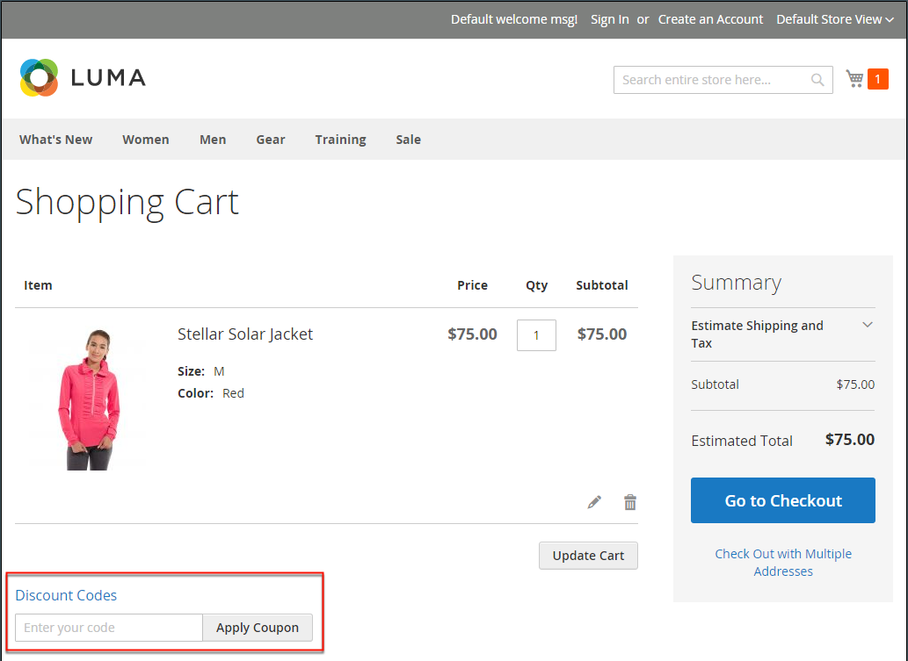

# Reglas de precios del carrito

Las reglas de precios del carro de compras aplican descuentos a los artículos del carro de compras, según un conjunto de condiciones. El descuento se puede aplicar automáticamente cuando se cumplen las condiciones o cuando el cliente introduce un código de cupón válido. Cuando se aplica, el descuento aparece en el carro de compras bajo el subtotal. Se puede utilizar una regla de precio del carro de compras según sea necesario para una temporada o promoción cambiando su estado y el intervalo de fechas.

>[!NOTE]
>
>Si la regla del carro de cupones tiene condiciones que especifican las opciones de pago, como determinados métodos de envío o de pago, las condiciones solo se cumplen en el pago después de seleccionar los métodos de envío o de pago específicos. En este caso, el cupón se puede aplicar al finalizar la compra en el último paso.

{width="600" zoomable="yes"}

## Acceder a reglas de precios de carrito

1. En la barra lateral _Admin_, vaya a **[!UICONTROL Marketing]** > _[!UICONTROL Promotions]_>**[!UICONTROL Cart Price Rules]**.

   {width="700" zoomable="yes"}

1. Si tiene muchas reglas, use las opciones de filtro en la parte superior de cada columna para optimizar la lista y haga clic en **[!UICONTROL Search]** para aplicar los filtros.

1. Para borrar todas las opciones de filtro y mostrar la lista completa, haga clic en **[!UICONTROL Reset Filter]**.

1. Actualizar las propiedades de una regla:

   -  (solo Adobe Commerce) Haga clic en **[!UICONTROL Edit]** para mostrar la página Información de la regla.

   -  (solo Magento Open Source) Haga clic en la regla de la lista para mostrar la página Información de la regla.

   Aquí puede cambiar la configuración de la regla (similar a la creación de una regla).

## Filtrar opciones por columna

| Columna | Descripción |
|--- |--- |
| [!UICONTROL ID] | Introduzca texto para filtrar la lista por un número de ID de regla específico. |
| [!UICONTROL Rule] | Introduzca texto para filtrar la lista en función del nombre de regla definido cuando se creó la regla. |
| [!UICONTROL Coupon Code] | Introduzca texto para filtrar la lista en función del nombre de código definido cuando se creó la regla. |
| [!UICONTROL Priority] | Campo de texto libre que filtra la lista en función de la prioridad definida para una regla. |
| [!UICONTROL Status] | Utilice esta opción para filtrar la lista en función del estado de la regla (`Active` o `Inactive`). |
| [!UICONTROL Web Site] | Utilice esta opción para filtrar la lista en función de los sitios web definidos para una regla. |
| [!UICONTROL Action] |  (solo Adobe Commerce) Haga clic en **[!UICONTROL Edit]** para mostrar la página _[!UICONTROL Rule Information]_y actualizar la configuración de la regla (similar a crear una regla). |
| [!UICONTROL Start] |  (solo Magento Open Source) Utilice los campos de calendario dinámico (_[!UICONTROL To:]_y_[!UICONTROL From:]_) para filtrar la lista en función de la fecha de inicio de la regla definida cuando se creó la regla. |
| [!UICONTROL End] |  (solo Magento Open Source) Utilice los campos de calendario dinámico (_[!UICONTROL To:]_y_[!UICONTROL From:]_) para filtrar la lista en función de la fecha de finalización de la regla definida cuando se creó la regla. |

{style="table-layout:auto"}

## Usar audiencias de Real-Time CDP para informar las reglas de precios del carro de compras

Aprenda a [activar](../customers/audience-activation.md) audiencias de Real-Time CDP en su instancia de Adobe Commerce para informar las reglas de precios del carro de compras.
