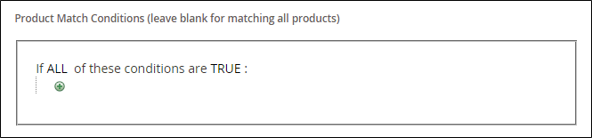

# Crear una regla de producto relacionada

{{ee-feature}}

El proceso de creación de una regla de producto relacionada es similar a la configuración de una regla de precio. En primer lugar, defina las condiciones que desea que coincidan y, a continuación, elija los productos que desea mostrar. En cualquier momento dado, puede haber varias reglas activas que se pueden activar para mostrar productos relacionados, mejorar ventas y realizar ventas cruzadas. La prioridad de cada regla determina el orden en que aparece el bloque de productos en la página.

>[!NOTE]
>
>Para utilizar un atributo en una regla de destino, la propiedad [_[!UICONTROL Use for Promo Rule Conditions]_](../catalog/product-attributes.md) debe establecerse en `Yes`.

>[!NOTE]
>
>El valor de ámbito `All Store Views` siempre se usa para las condiciones [!UICONTROL Products to Match] y [!UICONTROL Products to Display] de todos los atributos de producto. Esto también se aplica cuando los atributos del producto tienen valores diferentes para vistas de tiendas y sitios web diferentes.

## Crear una regla de producto relacionada

1. En la barra lateral _Admin_, vaya a **[!UICONTROL Marketing]** > _[!UICONTROL Promotions]_>**[!UICONTROL Related Product Rules]**.

1. En la esquina superior derecha, haga clic en **[!UICONTROL Add Rule]**.

   {width="600" zoomable="yes"}

1. Complete **[!UICONTROL Rule Information]** de la siguiente manera:

   - Escriba un **[!UICONTROL Rule Name]** para identificar la regla cuando trabaje en el administrador.

   - Para **[!UICONTROL Priority]**, escriba un número que determine el orden en que aparecen los resultados en la página cuando los resultados de otras reglas se dirijan a la misma ubicación. El número `1` es la prioridad principal.

   - Para habilitar la regla, establezca **[!UICONTROL Status]** en `Active`.

   - Establezca **[!UICONTROL Apply To]** en una de las siguientes opciones:

      - `Related Products`
      - `Up-sells`
      - `Cross-sells`

   - Si la regla va a estar activa durante un intervalo de tiempo específico, escriba las fechas **[!UICONTROL From]** y **[!UICONTROL To]**.

   - Para **[!UICONTROL Result Limit]**, introduzca el número de registros que aparecerán en la lista de resultados. El número máximo es 20.

   - Si la regla se aplica a un [segmento de cliente](../customers/customer-segments.md) específico, establezca **[!UICONTROL Customer Segments]** en `Specified` y elija el segmento de cliente de la lista.

   - Si la regla se aplica a una [audiencia de Real-Time CDP](../customers/audience-activation.md) específica, establezca **[!UICONTROL Real-Time CDP Audience]** en `Specified` y elija la audiencia de Real-Time CDP en la lista. Esta función está en versión beta. Si desea unirse al programa beta, envíe una solicitud a [dataconnection@adobe.com](mailto:dataconnection@adobe.com).

     {width="500"}

1. En el panel izquierdo, elija **[!UICONTROL Products to Match]** y genere las condiciones como lo haría para una [regla de precio de catálogo](price-rules-catalog.md).

   {width="500"}

1. En el panel izquierdo, elija **[!UICONTROL Products to Display]** y genere las condiciones de los resultados como lo haría para una [regla de precio de catálogo](price-rules-catalog.md).

   {width="500"}

   Complete la condición para describir los productos que desea incluir en los resultados mostrados.

1. Una vez finalizado, haga clic en **[!UICONTROL Save]**.

## Eliminar una regla de producto relacionada

1. En la barra lateral _Admin_, vaya a **[!UICONTROL Marketing]** > _[!UICONTROL Promotions]_>**[!UICONTROL Related Product Rules]**.

1. Busque la regla de producto relacionada que desee eliminar.

1. Haga clic en la regla para abrir la página de detalles.

1. En la esquina superior derecha, haga clic en **[!UICONTROL Delete]**.

1. Para confirmar la acción, haga clic en **[!UICONTROL OK]**.

## Demostración de regla de producto relacionada

Vea este vídeo para obtener más información sobre la creación de reglas de producto relacionadas:

>[!VIDEO](https://video.tv.adobe.com/v/3411061?quality=12&learn=on&captions=spa)

## Descripciones de campos

| Campo | Descripción |
|--- |--- |
| [!UICONTROL Rule Name] | Un nombre que identifica la regla para uso interno. |
| [!UICONTROL Priority] | Determina la secuencia en la que aparecen los resultados de la regla cuando se muestran con otros conjuntos de resultados cuyo destino es el mismo lugar de la página. El valor puede establecerse en cualquier número entero, con la prioridad más alta de 1. Por ejemplo, si se aplican varias reglas de mejora de ventas, la que tenga la prioridad más alta aparece antes que las demás. El orden de los productos dentro de cada conjunto de resultados es aleatorio. Cualquier mejora de venta, venta cruzada y productos relacionados configurados manualmente siempre aparecen en la página antes de cualquier promoción de producto basada en reglas. |
| [!UICONTROL Status] | Controla el estado activo de la regla. Opciones: `Active` / `Inactive` |
| [!UICONTROL Apply To] | Identifica el tipo de relación de producto asociado a la regla. Opciones: `Related Products` / `Up-sells` / `Cross-sells` |
| [!UICONTROL From Date] | Si la regla está activa durante un intervalo de tiempo, esta configuración determina la primera fecha en que la regla está activa. |
| [!UICONTROL To Date] | Si la regla está activa durante un intervalo de tiempo, esta configuración determina la última fecha en que la regla está activa. |
| [!UICONTROL Result Limit] | Determina el número de productos que aparecen en los resultados al mismo tiempo. El número máximo es 20. Si se encuentran más resultados coincidentes, los productos giran a través del bloque cada vez que se actualiza la página. |
| [!UICONTROL Customer Segments] | Identifica los segmentos de clientes a los que se aplica la regla. Opciones: `All` / `Specified` |

{style="table-layout:auto"}
