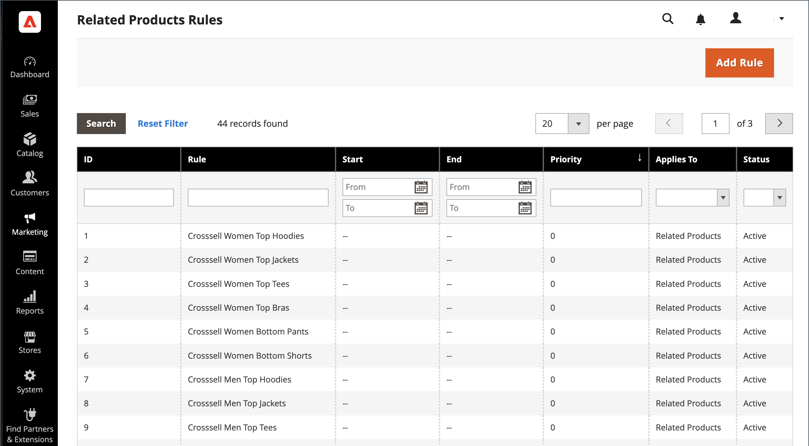

# Reglas de producto relacionadas (reglas de destino)

{{ee-feature}}

Las reglas de productos relacionados permiten seleccionar la selección de productos que se presentan a los clientes como productos relacionados, mejoras en las ventas y ventas cruzadas. Cada regla de producto se puede asociar con un [segmento de cliente](../customers/customer-segments.md) para producir una visualización dinámica de la comercialización segmentada.

Dado que se pueden activar varias reglas activas al mismo tiempo, puede establecer una prioridad para cada regla. Define el orden en el que se aplican las reglas y se muestran los productos en la página.

Para acceder a las reglas de producto relacionadas, vaya a **[!UICONTROL Marketing]** > _[!UICONTROL Promotions]_>**[!UICONTROL Related Product Rules]**.

{width="700" zoomable="yes"}

## Descripciones de columna

| Columna | Descripción |
|--- |--- |
| [!UICONTROL ID] | Identificador numérico único asignado a cada regla de producto relacionada |
| [!UICONTROL Rule] | Nombre de la regla de producto relacionada |
| [!UICONTROL Start] | Utilice los campos de calendario dinámico (_[!UICONTROL To:]_y_[!UICONTROL From:]_) para filtrar la lista en función de la fecha de inicio de la regla definida cuando se creó la regla. |
| [!UICONTROL End] | Utilice los campos de calendario dinámico (_[!UICONTROL To:]_y_[!UICONTROL From:]_) para filtrar la lista en función de la fecha de finalización de la regla definida cuando se creó la regla. |
| [!UICONTROL Priority] | Introduzca texto en este campo para filtrar la lista en función de la prioridad definida para una regla. |
| [!UICONTROL Applies To] | Esta opción filtra la lista de reglas aplicables a `Related Products`, `Up-sells` y `Cross-sells`. |
| [!UICONTROL Status] | Utilice esta opción para filtrar la lista en función del estado de la regla (`Active` o `Inactive`). |

{style="table-layout:auto"}

## Prioridad de reglas

En cualquier momento dado, puede haber varias reglas activas que se pueden activar para mostrar productos relacionados, mejorar ventas y realizar ventas cruzadas. La prioridad de cada regla determina el orden en que aparecen los productos en la página. El valor puede establecerse en cualquier número entero, y `1` tiene la prioridad más alta.

El número de identificadores de producto que se pueden incluir en una regla de relaciones de producto está determinado por el valor `Result Limit`, que tiene un máximo de 20. El valor `Result Limit`, combinado con `Configurable Maximum` para la promoción específica de productos basada en reglas, se convierte en `Real Limit` y determina el número real de productos coincidentes que pueden aparecer en la lista.

[Límite de resultados] + [Máximo configurable] = [Límite real]

Por ejemplo, suponga que tiene tres reglas con una prioridad de `1`, `2` y `3`.

- Se han devuelto dos productos coincidentes para _Regla 1_, seis productos coincidentes para _Regla 2_ y 20 productos coincidentes para _Regla 3_.
- En la configuración, _[!UICONTROL Maximum Number of Products for Related Products List]_está establecido en `6`.

  | Reglas | Prioridad | Productos coincidentes |
  |---|---|-----|
  | Regla 1 | `1` | `2` |
  | Regla 2 | `2` | `6` |
  | Regla 3 | `3` | `20` |

Si la primera regla devuelve más productos coincidentes que los permitidos por el _límite máximo configurable_, pero menos que el _límite real_, se usarán los productos coincidentes de las demás reglas (en orden de prioridad) hasta que se alcance el _límite real_.

Por prioridad, los productos coincidentes devueltos por la _regla 1_ pueden usarse primero para llenar las 26 ranuras disponibles. Debido a que la Regla 1 devolvió solo dos productos coincidentes, todavía hay espacio para 24 más. _La regla 2_ tiene la siguiente prioridad más alta y devuelve seis productos más que coinciden. Ahora hay 18 espacios disponibles para rellenar. La _regla 3_ tiene el siguiente nivel de prioridad, con suficientes productos coincidentes para llenar las 18 ranuras restantes. Cuando se rellenan todas las ranuras disponibles, y según el modo de rotación configurado, los productos pueden redistribuirse u ordenarse por ID dentro de cada prioridad y luego reducirse al límite máximo configurable. En este caso, los seis productos restantes aparecen en la tienda.

>[!NOTE]
>
>Los productos seleccionados siempre se muestran antes de los productos basados en reglas, independientemente del modo de rotación.

## Configurar relaciones de producto basadas en reglas

El comportamiento de las reglas de relación de productos y la visualización de los productos coincidentes están determinados por los ajustes de configuración. Esta configuración determina cuántos productos que coinciden con la regla se pueden mostrar y el orden en que aparecen.

1. En la barra lateral _Admin_, vaya a **[!UICONTROL Stores]** > _[!UICONTROL Settings]_>**[!UICONTROL Configuration]**.

1. En el panel de la izquierda, expanda **[!UICONTROL Catalog]** y elija **[!UICONTROL Catalog]** debajo.

1. Expandir  de la sección **[!UICONTROL Rules-Based Product Relations]**.

   {width="600" zoomable="yes"}

1. Escriba **[!UICONTROL Maximum Number of Products in the Related Products List]**.

1. Establezca **[!UICONTROL Show Related Products]** en una de las siguientes opciones:

   - `Both Selected and Rule Based`
   - `Selected Only`
   - `Rule-Based Only`

1. Establezca **[!UICONTROL Rotation Mode for Products in Related Product List]** en una de las siguientes opciones:

   - `By Priority, Then by ID`
   - `By Priority, Then Random`
   - `Weighted Random`

1. Para completar la configuración de la venta cruzada de productos, haz lo siguiente:

   - Escriba **[!UICONTROL Maximum Number of Products in the Cross-Sell Product List]**.

   - Establezca **[!UICONTROL Show Cross-Sell Products]** en una de las siguientes opciones:

      - `Both Selected and Rule Based`
      - `Selected Only`
      - `Rule-Based Only`

   - Establezca **[!UICONTROL Rotation Mode for Products in Cross-Sell Product List]** en una de las siguientes opciones:

      - `By Priority, Then by ID`
      - `By Priority, Then Random`
      - `Weighted Random`

1. Para completar la configuración de la mejora de ventas del producto, haga lo siguiente:

   - Escriba **[!UICONTROL Maximum Number of Products in the Upsell Product List]**.

   - Establezca **[!UICONTROL Show Upsell Products]** en una de las siguientes opciones:

      - `Both Selected and Rule Based`
      - `Selected Only`
      - `Rule-Based Only`

   - Establezca **[!UICONTROL Rotation Mode for Products in Upsell Product List]** en una de las siguientes opciones:

      - `By Priority, Then by ID`
      - `By Priority, Then Random`
      - `Weighted Random`

1. Una vez finalizado, haga clic en **[!UICONTROL Save Config]**.

### Modos de rotación

| Modo | Descripción |
|---|---|
| [!UICONTROL By Priority, Then by ID] | Los productos se ordenan por prioridad y, a continuación, se reordenan por ID dentro de cada prioridad. Los productos de la regla de prioridad inferior solo aparecen cuando ya no quedan productos de la regla de prioridad superior para rellenar los espacios disponibles. |
| [!UICONTROL By Priority, Then Random] | Los productos se ordenan por prioridad y luego se aleatorizan dentro de cada prioridad. Los productos de la regla de prioridad inferior solo aparecen cuando ya no quedan productos de la regla de prioridad superior para rellenar los espacios disponibles. |
| [!UICONTROL Weighted Random] | Los productos se aleatorizan de modo que los productos que pertenecen a una regla con prioridad mayor tienen una mayor probabilidad de aparecer que los que pertenecen a una regla con prioridad menor. A continuación, los productos se reducen al límite máximo configurable y se reagrupan por prioridad. Este modo da la oportunidad a los productos de menor prioridad de aparecer a veces, incluso si las ranuras restantes podrían rellenarse con productos de la regla con mayor prioridad |

{style="table-layout:auto"}

## Usar audiencias de Real-Time CDP para informar sobre reglas de productos relacionadas

>[!NOTE]
>
>Esta función está en versión beta. Si desea unirse al programa beta, envíe una solicitud a [dataconnection@adobe.com](mailto:dataconnection@adobe.com).

Aprenda a [activar](../customers/audience-activation.md) audiencias de Real-Time CDP en su instancia de Adobe Commerce para informar sobre reglas de producto relacionadas.
