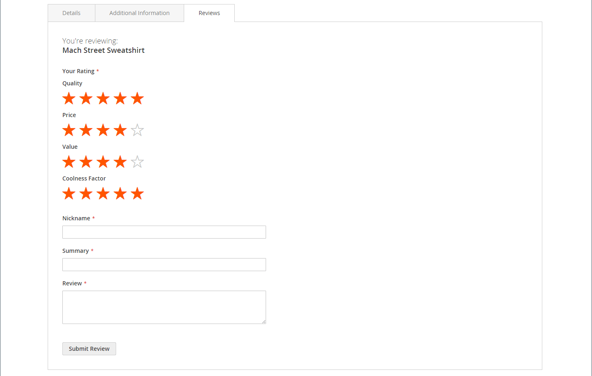

# Revisiones de productos

Las revisiones de productos ayudan a crear un sentido de comunidad y se consideran más creíbles de lo que cualquier dinero publicitario puede comprar. De hecho, algunos motores de búsqueda dan a los sitios con reseñas de productos una clasificación más alta que los que no lo tienen. Para aquellos que encuentran su sitio buscando un producto específico, una revisión de producto es esencialmente la página de aterrizaje de su tienda. Las revisiones de productos ayudan a las personas a encontrar su tienda, mantenerlas comprometidas y, a menudo, generar ventas.

Commerce incluye una función nativa de revisiones de productos que puede administrar desde el administrador. También puede usar una extensión de [Commerce Marketplace](../getting-started/commerce-marketplace.md) para usar un sistema de administración de revisiones alojado.

>[!NOTE]
>
>Las versiones 2.4.0 a 2.4.3 de Adobe Commerce y Magento Open Source incluían la extensión desarrollada por el proveedor de Yotpo. A partir de la versión 2.4.4, esta extensión ya no se integra con la versión principal y debe instalarse y actualizarse desde Commerce Marketplace. Marketplace también proporciona acceso a la documentación actual proporcionada por el desarrollador de extensiones.
>&#x200B;>  
>&#x200B;>Si tiene la extensión agrupada habilitada y configurada, debe actualizar el archivo composer.json como parte del proceso de actualización de la versión 2.4.4 y administrar las actualizaciones de extensión que se realicen. Consulte [Módulos de actualización](https://experienceleague.adobe.com/docs/commerce-operations/upgrade-guide/modules/upgrade.html) en la _Guía de actualización_ para obtener más información.

## Reseñas de productos en la tienda

Cuando la función nativa Revisiones de productos está activada, los clientes pueden escribir revisiones para cualquier producto del catálogo. Las críticas se pueden escribir desde la página de producto haciendo clic en:

- **Agrega tu reseña** para productos con reseñas existentes.

- **Sea el primero en opinar sobre este producto** en busca de productos sin opiniones.

La pestaña [!UICONTROL Reviews] enumera todas las revisiones actuales y el formulario que se utilizó para enviar una revisión.

La configuración determina si los clientes deben abrir una cuenta en la tienda antes de escribir críticas de productos o si pueden enviar críticas como invitados. Exigir a los revisores que abran una cuenta evita los envíos anónimos y mejora la calidad de las revisiones.

{width="700" zoomable="yes"}

El número de estrellas indica el grado de satisfacción del producto. Los visitantes pueden hacer clic en el vínculo para leer las críticas y escribir sus propios comentarios. Como incentivo, los clientes pueden recibir puntos de recompensa por enviar una revisión. Cuando se envía una revisión, se envía al administrador para que la modere. Cuando se aprueba, la revisión se publica en el almacén.

{width="700" zoomable="yes"}

### [!UICONTROL My Product Reviews]

La sección _[!UICONTROL My Product Reviews]_&#x200B;del panel de cuenta del cliente enumera todas las revisiones enviadas por el cliente y aprobadas para su publicación. Cada resumen de revisión incluye la fecha en la que se envió la revisión, los vínculos a la página del producto y los detalles de la revisión.

{width="700" zoomable="yes"}

1. En la barra lateral de su cuenta, el cliente elige **[!UICONTROL My Product Reviews]**.

1. Para ver la revisión completa, haga clic en **[!UICONTROL See Details]**.

   {width="700" zoomable="yes"}

## Habilitar funciones de revisión del producto

La función Revisiones de productos de Commerce está activada de forma predeterminada.

>[!NOTE]
>
>Para establecer estos campos en `No` y deshabilitar las revisiones de productos de Commerce, debe desactivar las casillas de verificación **Usar valor del sistema**.

1. En la barra lateral _Admin_, vaya a **[!UICONTROL Stores]** > _[!UICONTROL Settings]_>**[!UICONTROL Configuration]**.

1. En el panel izquierdo, expanda **[!UICONTROL Catalog]** y seleccione **[!UICONTROL Catalog]** debajo.

1. Expanda  en la sección **[!UICONTROL Product Reviews]**.

   {width="600" zoomable="yes"}

1. Establezca **[!UICONTROL Enabled]** en `Yes`.

   Esta es la configuración predeterminada que habilita las críticas de producto.

1. Establezca **[!UICONTROL Allow Guests to Write Reviews]** en `Yes`.

   Esta es la configuración predeterminada que determina si los clientes deben abrir una cuenta en su tienda para poder escribir críticas de productos.

1. Una vez finalizado, haga clic en **[!UICONTROL Save Config]**.

## Crear clasificaciones personalizadas

Con las revisiones de producto de Commerce, los clientes pueden asignar clasificaciones cuando envían una revisión de producto. Las clasificaciones predeterminadas son calidad, precio y valor. Además de esto, puede agregar sus propias clasificaciones personalizadas. Las clasificaciones de cinco estrellas que aparecen en las páginas del catálogo se calculan según la media de cada producto.

{width="700" zoomable="yes"}

1. En la barra lateral _Admin_, vaya a **[!UICONTROL Stores]** > _[!UICONTROL Attributes]_>**[!UICONTROL Rating]**.

1. En la esquina superior derecha, haga clic en **[!UICONTROL Add New Rating]**.

   {width="700" zoomable="yes"}

1. En la sección _[!UICONTROL Rating Title]_, escriba **[!UICONTROL Default Value]**&#x200B;para la nueva clasificación.

   Si procede, introduzca también la traducción para cada vista de tienda.

   {width="600" zoomable="yes"}

1. En la sección _Visibilidad de clasificación_, establezca **[!UICONTROL Visibility In]** en la vista de tienda donde se usará la clasificación.

   Para seleccionar varias vistas de tienda, mantenga pulsada la tecla Ctrl (PC) o la tecla Comando (Mac) y haga clic en cada elemento.

   >[!NOTE]
   >
   >Las clasificaciones no son visibles a menos que se asignen a una vista de tienda.

1. En el caso de **[!UICONTROL Sort Order]**, escriba un número para determinar el orden de esta clasificación cuando aparezca con otros usuarios.

1. Si desea mostrar su clasificación en la tienda, marque la casilla de verificación **[!UICONTROL Is Active]**.

   {width="600" zoomable="yes"}

1. Una vez finalizado, haga clic en **[!UICONTROL Save Rating]**.

   La clasificación promedio de todas las revisiones se muestra para cada producto en la página de cuadrícula de productos del catálogo.

   {width="700" zoomable="yes"}
