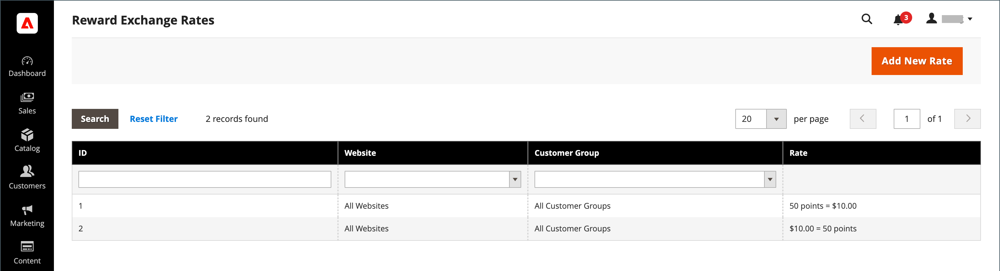

# Tasas de cambio de recompensa

{{ee-feature}}

Las tasas de cambio de recompensa determinan el número de puntos que se ganan en función del importe del pedido y el valor de los puntos obtenidos. Se pueden aplicar diferentes tasas de cambio a diferentes sitios web y grupos de clientes. Si se aplican varios tipos de cambio de diferentes sitios web y grupos de clientes al mismo cliente, se aplican las siguientes reglas de prioridad:

## Prioridad de tasa de cambio

**1**: se aplica a un sitio web y a un grupo de clientes específicos.

**2**: se aplica a todos los sitios web y a un grupo de clientes específico.

**3**: se aplica a un sitio web específico y a todos los grupos de clientes.

**4**: se aplica a todos los sitios web y grupos de clientes.

Al convertir una moneda en puntos, el número de puntos no se puede dividir. Cualquier resto de moneda se redondea a la baja. Por ejemplo, si 2,00 $ se convierte en diez puntos, los puntos se ganan en grupos de 2,00 $. Por lo tanto, un pedido de 7 dólares ganaría 30 puntos y los 1 dólares restantes se redondearían hacia abajo. El importe monetario del pedido se define como el importe que recibe el comerciante o el total general menos el envío, los impuestos, los descuentos, el crédito de la tienda y las tarjetas regalo. Los puntos se obtienen en el momento en que no hay artículos sin factura en el pedido (todos los artículos se pagan o cancelan). Si un usuario administrador no desea permitir que los clientes obtengan puntos de recompensa por pedidos cancelados, esos puntos se pueden deducir manualmente de la página Administrar clientes.

## Configurar tasas de cambio

{width="700" zoomable="yes"}

1. En la barra lateral _Admin_, vaya a **[!UICONTROL Stores]** > _[!UICONTROL Other Settings]_>**[!UICONTROL Reward Exchange Rates]**.

1. En la esquina superior derecha, haga clic en **[!UICONTROL Add New Rate]**.

1. En la sección **[!UICONTROL Reward Exchange Rate Information]**, haga lo siguiente:

   {width="600" zoomable="yes"}

   - Establezca **[!UICONTROL Website]** en los sitios donde se aplica la tasa de cambio de recompensa.

   - Establezca **[!UICONTROL Customer Group]** en los grupos a los que se aplica la tasa de cambio de recompensa.

   - Establezca **[!UICONTROL Direction]** en una de las siguientes opciones:

      - `Points to Currency`
      - `Currency to Points`

   Para cualquier configuración de Dirección, la cantidad se representa en la moneda base del sitio web.

1. Escriba los valores de **[!UICONTROL Rate]** según la configuración de _[!UICONTROL Direction]_.

   | Dirección | Configuración de velocidad |
   |---------|-------------|
   | [!UICONTROL Points to Currency] | En el primer campo _[!UICONTROL Rate]_, escriba el número de puntos. En el segundo campo_[!UICONTROL Rate]_, introduzca el valor monetario de los puntos. |
   | [!UICONTROL Currency to Points] | En el primer campo _[!UICONTROL Rate]_, introduzca el valor monetario. En el segundo campo_[!UICONTROL Rate]_, escriba el número de puntos que representa el valor monetario. |

   Al convertir puntos en moneda, el número de puntos no se puede dividir. Por ejemplo, si diez puntos se convierten en 2,00 $, los puntos deben canjearse en grupos de diez. Por lo tanto, 25 puntos se canjearían por $4.00, con 5 puntos restantes en el saldo del cliente.

   Se recomienda configurar una conversión para `Points to Currency` y `Currency to Points`.

1. Una vez finalizado, haga clic en **[!UICONTROL Save]**.

## Eliminar un tipo de cambio de recompensa

1. En la barra lateral _Admin_, vaya a **[!UICONTROL Stores]** > _[!UICONTROL Other Settings]_>**[!UICONTROL Reward Exchange Rates]**.

1. Busque el tipo de cambio de recompensa que desea eliminar y ábralo en modo de edición.

1. En la barra de menús, haga clic en **[!UICONTROL Delete]**.

1. Para confirmar la acción, haga clic en **[!UICONTROL OK]**.

## Descripciones de campos

| Campo | Descripción |
|--- |--- |
| [!UICONTROL Website] | Los sitios web donde se aplican las tasas de recompensa. |
| [!UICONTROL Customer Group] | Los grupos de clientes a los que se aplican las tarifas de recompensa. |
| [!UICONTROL Direction] | Determina qué tipo de transacción define el tipo de cambio. Opciones:  **[!UICONTROL Points to Currency]**: define el número de puntos que se pueden aplicar como crédito al importe de un pedido. En el primer campo _[!UICONTROL Rate]_, escriba el número de puntos. En el segundo campo_[!UICONTROL Rate]_, introduzca el valor monetario de los puntos. **[!UICONTROL Currency to Points]**: define la cantidad de un pedido que puede obtener puntos del cliente. En el primer campo _[!UICONTROL Rate]_, introduzca el valor monetario. En el segundo campo_[!UICONTROL Rate]_, escriba el número de puntos que representa el valor monetario. |
