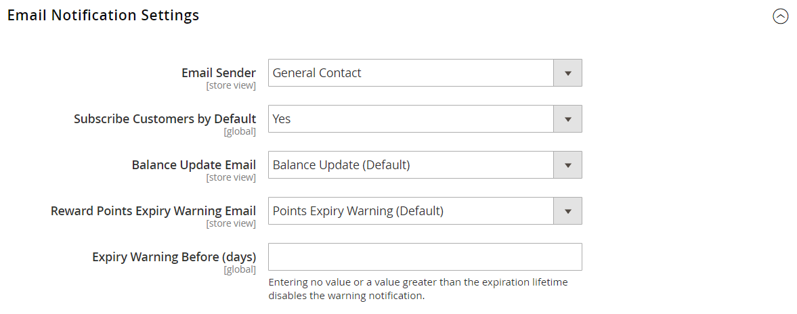

# Programas de recompensa y fidelización

{{ee-feature}}

El sistema de _puntos de recompensa_ de Adobe Commerce le ofrece la capacidad de implementar programas únicos que promuevan la participación del cliente y la lealtad con él. Se pueden otorgar puntos por una amplia gama de transacciones y actividades de clientes, y la configuración se puede establecer para controlar la asignación de puntos, el saldo y la caducidad. Los clientes pueden canjear puntos por compras, según la tasa de conversión que establezca entre los puntos de recompensa y la moneda.

## Reglas de precio del carro de compras

Los puntos se pueden recompensar a los clientes según la [regla del carro de compras](price-rules-cart.md). Pueden ser recompensados como la única acción de la regla de precio, o junto con un descuento.

## Saldo del cliente

Los usuarios administradores por cliente pueden gestionar los saldos de puntos de recompensa. Si se habilita en la tienda, los clientes también pueden ver los detalles del saldo de puntos.

## Puntos de canje

>[!NOTE]
>
>Se requiere la configuración de [Tasas de cambio de recompensa](reward-exchange-rates.md) para que los clientes y los usuarios administradores puedan canjear los puntos de recompensa durante el cierre de compra.

Los usuarios administradores y los clientes pueden canjear los puntos (si está activado) durante el cierre de compra. En la sección Método de pago, aparece la casilla de verificación Usar mis puntos de recompensa encima de los métodos de pago activados. Se incluyen los puntos disponibles y el tipo de cambio monetario. Si el saldo disponible es mayor que el total general del pedido, no se requiere ningún método de pago adicional. El número de puntos de recompensa que se aplican al pedido aparece con los totales del pedido, restados del total general, de forma similar a las tarjetas de crédito o regalo de una tienda. Si se utilizan puntos de recompensa junto con el crédito de la tienda o una tarjeta regalo, los puntos de recompensa se deducen primero. El crédito de la tienda o tarjeta regalo se deduce si el total del pedido es mayor que el número canjeable de puntos de recompensa.

>[!NOTE]
>
>No se recomiendan puntos de recompensa para su uso con compras de COD, porque la recepción del pago no se puede confirmar hasta después de que se factura el pedido.

## Reembolso para recompensar puntos

Los pedidos realizados con puntos de recompensa se pueden reembolsar al saldo de puntos de recompensa hasta la cantidad canjeada en el pedido. En la [_página Nuevo abono_](../stores-purchase/credit-memo-create.md), se puede especificar el número de puntos que se aplicarán al saldo del cliente. De forma predeterminada, el campo contiene el número completo de puntos que se utilizaron en el pedido.

## Habilitar operaciones de puntos de recompensa para su tienda

La configuración de puntos de recompensa determina cómo se presentan los puntos de recompensa en la tienda y define los parámetros básicos de funcionamiento.

{width="600" zoomable="yes"}

### Paso 1. Configuración de los puntos de recompensa

1. En la barra lateral _Admin_, vaya a **[!UICONTROL Stores]** > _[!UICONTROL Settings]_>**[!UICONTROL Configuration]**.

1. En el panel izquierdo, expanda **[!UICONTROL Customers]** y elija **[!UICONTROL Reward Points]**.

1. Expanda  en la sección **[!UICONTROL Reward Points]** y haga lo siguiente:

   - Para activar los puntos de recompensa, establezca **[!UICONTROL Enable Reward Points Functionality]** en `Yes`.

   - Para permitir que los clientes obtengan sus propios puntos de recompensa, establezca **[!UICONTROL Enable Reward Points Functionality on Storefront]** en `Yes`.

   - Para permitir que los clientes vean un historial detallado de sus recompensas, establezca **[!UICONTROL Customers May See Reward Point History]** en `Yes`.

1. Para **[!UICONTROL Reward Points Balance Redemption Threshold]**, ingrese el número de puntos que deben acumularse antes de que se puedan canjear (en blanco si no hay un mínimo).

1. Para **[!UICONTROL Cap Reward Points Balance At]**, escriba el número máximo de puntos que puede acumular un cliente (en blanco si no hay límite).

1. Para **[!UICONTROL Reward Points Expire in (days)]**, ingrese el número de días antes de que expiren los puntos de recompensa (en blanco si no caducan).

1. Establezca **[!UICONTROL Reward Points Expiry Calculation]** en una de las siguientes opciones:

   - `Static`: determina la duración restante de los puntos de recompensa en función del número de días establecido en la configuración. Si el límite de caducidad de la configuración cambia, la fecha de caducidad de los puntos existentes no cambia.

   - `Dynamic` - Calcula el número restante de días cada vez que aumenta el saldo de puntos de recompensa. Si el límite de caducidad de la configuración cambia, la caducidad de todos los puntos existentes se actualiza en consecuencia.

1. Si desea reembolsar automáticamente los puntos de recompensa disponibles, establezca **[!UICONTROL Refund Reward Points Automatically]** en `Yes`.

1. Para anular los puntos de recompensa obtenidos mediante compras cuando se reembolse total o parcialmente el pedido que obtuvo los puntos, establezca **[!UICONTROL Deduct Reward Points from Refund Amount Automatically]** en `Yes`.

   >[!NOTE]
   >
   >Solo se ven afectados los puntos obtenidos con el pedido que se está reembolsando.

1. Establece **[!UICONTROL Landing Page]** en la página de contenido que explica tu programa de puntos de recompensa.

   Asegúrese de actualizar la página predeterminada Puntos de recompensa con su propia información.

1. Una vez finalizado, haga clic en **[!UICONTROL Save Config]**.

### Paso 2. Configure los puntos obtenidos por las actividades de los clientes

En este paso, se especifica el número de puntos de recompensa que se pueden obtener por diversas actividades del cliente. Cuando los clientes completan una acción que tiene puntos asignados, aparece un mensaje para el cliente que indica cuántos puntos han obtenido.

1. Expanda  en la sección **[!UICONTROL Actions for Acquiring Reward Points by Customer]**.

   {width="600" zoomable="yes"}

1. Para permitir que se obtengan puntos de recompensa por las compras en función de las [tasas de cambio de recompensa](reward-exchange-rates.md) configuradas, establezca **[!UICONTROL Purchase]** en `Yes`.

   >[!NOTE]
   >
   >Para obtener puntos de recompensa por su _primer_ pedido, el cliente debe estar registrado _antes_ de que el método de pago capture la transacción. La mayoría de los métodos de pago se pudieron configurar para capturar las transacciones _automáticamente_ cuando se haga el pedido, pero _antes_ de que finalice el registro de la cuenta del cliente.

1. Para **[!UICONTROL Registration]**, ingrese el número de puntos obtenidos por abrir una cuenta de cliente.

1. Para **[!UICONTROL Newsletter Signup]**, escriba el número de puntos obtenidos por los clientes registrados que se suscriben a un boletín informativo.

1. Para **[!UICONTROL Converting Invitation to Customer]**, introduzca el número de puntos obtenidos por un cliente que envía una invitación y el destinatario abre una cuenta de cliente.

   Puede limitar el número de conversiones de invitación que se pueden utilizar para obtener puntos para el cliente que envía la invitación (en blanco si no hay límite). Para ello, escriba un número en el campo **[!UICONTROL Invitation to Customer Conversions Quantity Limit]**.

1. Para **[!UICONTROL Converting Invitation to Order]**, introduzca el número de puntos obtenidos por un cliente que envía una invitación al destinatario que luego realiza un pedido y haga lo siguiente:

   - Para **Límite de cantidad de conversiones de invitaciones a pedidos**, introduzca el número de puntos obtenidos por el cliente que envía la invitación cuando el destinatario realiza un pedido inicial (en blanco si no hay límite).

   - Para **[!UICONTROL Invitation Conversion to Order Reward]**, seleccione la opción `Each` para obtener puntos por cada pedido realizado por el destinatario o seleccione la opción `First` para obtener puntos solo por el primer pedido realizado por el destinatario.

1. Para **[!UICONTROL Review Submission]**, escriba el número de puntos obtenidos por un cliente que envíe una revisión que se haya aprobado para su publicación.

1. A continuación, para limitar el número de revisiones que se pueden utilizar para obtener puntos por cliente, introduzca el número en el campo **[!UICONTROL Rewarded Reviews Submission Quantity Limit]** (en blanco para no establecer límite).

1. Una vez finalizado, haga clic en **[!UICONTROL Save Config]**.

### Paso 3. Completar la configuración de notificaciones por correo electrónico

1. Expanda  en la sección **[!UICONTROL Email Notification Settings]**.

   {width="600" zoomable="yes"}

1. Establece **[!UICONTROL Email Sender]** en el contacto de tienda que aparece como remitente de las actualizaciones de saldo y las notificaciones de caducidad.

1. Si desea suscribirse a los clientes de forma predeterminada para que se les notifiquen las actualizaciones de saldo y las próximas fechas de caducidad, establezca **[!UICONTROL Subscribe Customers by Default]** en `Yes`.

1. Establezca **[!UICONTROL Balance Update Email]** en la plantilla utilizada para la notificación que se envía a los clientes cada vez que se actualiza su saldo de puntos.

1. Establezca **[!UICONTROL Reward Points Expiry Warning Email]** en la plantilla utilizada para la notificación que se envía a los clientes cuando se alcanza el límite de caducidad de un lote de puntos.

1. Para **[!UICONTROL Expiry Warning Before (days)]**, ingrese el número de días antes de que caduquen los puntos a los que se envía la notificación.

1. Una vez finalizado, haga clic en **[!UICONTROL Save Config]**.

## Actualizar el saldo de puntos de recompensa

El saldo de puntos de recompensa se puede actualizar desde el Administrador.

1. En la barra lateral _Admin_, vaya a **[!UICONTROL Customers]** > **[!UICONTROL All Customers]**.

1. Busque al cliente en la cuadrícula y haga clic en **[!UICONTROL Edit]** en la columna _[!UICONTROL Action]_.

1. En _Información del cliente_, elija la sección **[!UICONTROL Reward Points]**.

1. Escriba el número de **[!UICONTROL Update Points]**:

   - Para actualizar la cantidad de puntos de recompensa, introduzca el número para aumentar el saldo total de puntos.
   - Para restar el importe de puntos de recompensa, introduzca el número negativo que desea reducir el saldo total de puntos.

1. Especifique **[!UICONTROL Comments]** en relación con el ajuste de puntos de recompensa, si es necesario.

   {width="700" zoomable="yes"}

1. De manera opcional, suscriba al cliente a _Notificaciones de puntos de recompensa_:

   - **[!UICONTROL Subscribe for Balance Updates]**
   - **[!UICONTROL Subscribe for Points Expiration Notifications]**

1. Haga clic en **[!UICONTROL Save Customer]**.

Todas las acciones relacionadas con los puntos de recompensa se muestran en el bloque _[!UICONTROL Reward Points History]_del cliente en su cuenta en la tienda.

## Descripciones de campos

| Campo | Descripción |
|--- |--- |
| [!UICONTROL Balance] | Saldo actual de puntos de recompensa para el cliente |
| [!UICONTROL Amount Balance] | El importe del saldo de efectivo actual |
| [!UICONTROL Points] | El número de puntos añadidos o restados |
| [!UICONTROL Amount] | Importe de dinero añadido o restado |
| [!UICONTROL Rate] | La [tasa de cambio de recompensa](reward-exchange-rates.md) |
| [!UICONTROL Website] | Sitio web al que se asigna el historial de puntos de recompensa |
| [!UICONTROL Reason] | Motivos para la concesión de puntos: **[!UICONTROL Making purchases]**— Cada vez que el cliente realiza una compra, puede obtener puntos. **[!UICONTROL Registering on the site]** - Acumulado tras el registro (una vez). **[!UICONTROL Subscribing to a newsletter]**- Acumulado por primera vez en la suscripción (una vez). **[!UICONTROL Sending Invitations]**: obtenga puntos invitando a sus amigos a unirse al sitio. **[!UICONTROL Converting Invitations to Customer]**: obtenga puntos por cada invitación que envíen, lo que lleva a los amigos a registrarse en el sitio. **[!UICONTROL Converting Invitations to Order]**: obtenga puntos por cada venta resultante de una invitación enviada. **[!UICONTROL Review Submission]**: obtenga puntos por enviar críticas de productos. |
| [!UICONTROL Created] | Fecha y hora de actualización de los puntos de recompensa |
| [!UICONTROL Expired] | Número de puntos de recompensa vencidos |
| [!UICONTROL Comment] | Comentarios al añadir o restar puntos |

{style="table-layout:auto"}

## Solución de problemas de recursos

Para obtener ayuda sobre la resolución de problemas con los puntos de recompensa, consulte los siguientes artículos de la Base de conocimiento de asistencia de Commerce:

- [Puntos de fidelización en pedidos parciales](https://experienceleague.adobe.com/docs/commerce-knowledge-base/kb/support-tools/patches/v1-0-8/mdva-31295-magento-patch-loyalty-points-on-partial-orders.html)
- [Error 404: eliminando puntos de recompensa en el pago con envío múltiple](https://experienceleague.adobe.com/docs/commerce-knowledge-base/kb/troubleshooting/storefront/magento-2.4.0-404-error-removing-rewards-points-on-multi-shipping-checkout.html)
