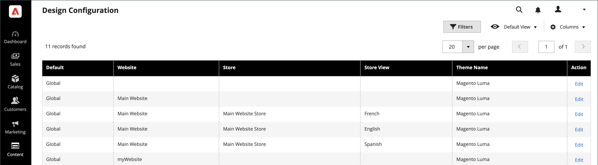

# Información general de SEO

_Optimización de motores de búsqueda_ (SEO) es la práctica de ajustar el contenido y la presentación de un sitio para mejorar la forma en que los motores de búsqueda indexan las páginas. Commerce incluye varias funciones para apoyar su esfuerzo continuo de SEO.

>[!TIP]
>
>Para Adobe Commerce as a Cloud Service, consulte las [directrices SEO](https://experienceleague.adobe.com/developer/commerce/storefront/setup/seo/indexing/) en la documentación de Commerce Storefront

## Metadatos

[!BADGE Solo PaaS]{type=Informative url="https://experienceleague.adobe.com/en/docs/commerce/user-guides/product-solutions" tooltip="Se aplica solo a proyectos de Adobe Commerce en la nube (infraestructura PaaS administrada por Adobe) y a proyectos locales."}

Obtenga más información sobre cómo agregar y mejorar [metadatos](meta-data.md) con abundancia de palabras clave para su sitio y tienda.

## Uso de un mapa del sitio

[!BADGE Solo PaaS]{type=Informative url="https://experienceleague.adobe.com/en/docs/commerce/user-guides/product-solutions" tooltip="Se aplica solo a proyectos de Adobe Commerce en la nube (infraestructura PaaS administrada por Adobe) y a proyectos locales."}

Un [mapa del sitio](sitemap-xml.md) mejora la forma en que los motores de búsqueda indizan su tienda y está diseñado para encontrar páginas que los rastreadores web podrían pasar por alto. Se puede configurar un mapa del sitio para indexar todas las páginas e imágenes.

## Reescrituras de URL

[!BADGE Solo PaaS]{type=Informative url="https://experienceleague.adobe.com/en/docs/commerce/user-guides/product-solutions" tooltip="Se aplica solo a proyectos de Adobe Commerce en la nube (infraestructura PaaS administrada por Adobe) y a proyectos locales."}

La herramienta [Reescritura de URL](url-rewrite.md) le permite cambiar cualquier URL asociada a un producto, categoría o página de CMS.

## Robots de motor de búsqueda

La configuración de Commerce incluye opciones para generar y administrar instrucciones para los rastreadores web y bots que indexan el sitio. Si la solicitud de `robots.txt` llega a Commerce (en lugar de a un archivo físico), se enrutará dinámicamente al controlador de robots. Las instrucciones son directivas que la mayoría de los motores de búsqueda reconoce y sigue.

De forma predeterminada, el archivo robots.txt generado por Commerce contiene instrucciones para el rastreador web a fin de evitar la indexación de determinadas partes del sitio que contienen archivos que el sistema utiliza internamente. Puede utilizar la configuración predeterminada o definir sus propias instrucciones personalizadas para todos o para motores de búsqueda específicos. Hay muchos artículos en línea que exploran el tema en detalle.

### Ejemplo de instrucciones personalizadas

**Permite Acceso Completo**

    Usuario-agente:*
    No permitir:

**No permite el acceso a todas las carpetas**

    Usuario-agente:*
    No permitir: /

**Instrucciones predeterminadas**

    Usuario-agente: *
    No permitir: /index.php/
    No permitir: /*?
    No permitir: /checkout/
    No permitir: /app/
    No permitir: /lib/
    No permitir: /*.php$
    No permitir: /pkginfo/
    No permitir: /report/
    No permitir: /var/
    No permitir: /catalog/
    No permitir: /customer/
    No permitir: /sendfriend/
    No permitir: /review/
    No permitir: /*SID=

### Configurar `robots.txt`

1. En la barra lateral _Admin_, vaya a **[!UICONTROL Content]** > _[!UICONTROL Design]_>**[!UICONTROL Configuration]**.

1. Busque la configuración **[!UICONTROL Global]** en la primera fila de la cuadrícula y haga clic en **[!UICONTROL Edit]**.

   {width="700" zoomable="yes"}

1. Desplácese hacia abajo y expanda  en la sección **[!UICONTROL Search Engine Robots]** y haga lo siguiente:

   {width="600" zoomable="yes"}

   - Establezca **[!UICONTROL Default Robots]** en una de las siguientes opciones:

     | Opción | Descripción |
     |------|------------|
     | `INDEX, FOLLOW` | Indica a los rastreadores web que indexen el sitio y que vuelvan más tarde para ver si hay cambios. |
     | `NOINDEX, FOLLOW` | Indica a los rastreadores web que eviten indexar el sitio, pero que vuelvan más tarde para ver si hay cambios. |
     | `INDEX, NOFOLLOW` | Indica a los rastreadores web que indexen el sitio una vez, pero no sigan ningún vínculo de la página. |
     | `NOINDEX, NOFOLLOW` | Indica a los rastreadores web que eviten indexar el sitio y que no sigan ningún vínculo de la página. |

     {style="table-layout:auto"}

   - Si es necesario, escriba instrucciones personalizadas en el cuadro **[!UICONTROL Edit Custom instruction of robots.txt file]**. Por ejemplo, mientras un sitio está en desarrollo, es posible que desee impedir el acceso a todas las carpetas.

   - Para restaurar las instrucciones predeterminadas, haga clic en **[!UICONTROL Reset to Default]**.

1. Una vez finalizado, haga clic en **[!UICONTROL Save Configuration]**.
