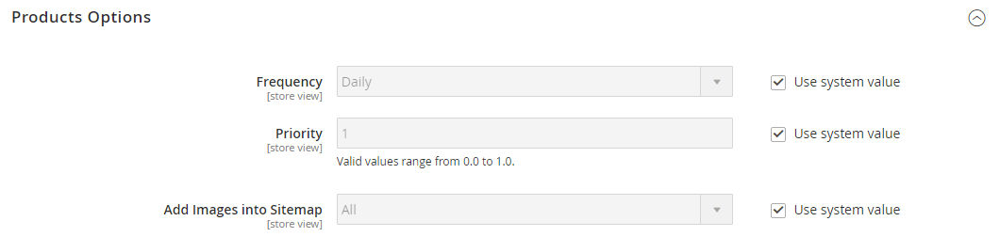

# Mapas del sitio

>[!TIP]
>
>Para Adobe Commerce as a Cloud Service, consulte las [directrices SEO](https://experienceleague.adobe.com/developer/commerce/storefront/setup/seo/indexing/) en la documentación de Commerce Storefront

Un mapa del sitio mejora la forma en que los motores de búsqueda indizan el almacén y está diseñado para buscar páginas que los rastreadores web podrían pasar por alto. Se puede configurar un mapa del sitio para indexar todas las páginas e imágenes.

Cuando se habilita, Commerce crea un archivo denominado `sitemap.xml` que se guarda en la instalación en la ubicación especificada. La configuración le permite establecer la frecuencia de las actualizaciones y la prioridad para cada tipo de contenido. El mapa del sitio debe actualizarse con la frecuencia con la que cambia el contenido del sitio, que puede ser diaria, semanal o mensual.

Mientras el sitio está en desarrollo, puede incluir instrucciones en el archivo `robots.txt` para rastreadores web a fin de evitar la indexación del sitio. A continuación, antes del lanzamiento, puede cambiar las instrucciones para permitir que el sitio se indexe.

Para obtener información técnica, consulte [Agregar mapa del sitio y robots.txt](https://experienceleague.adobe.com/docs/commerce-cloud-service/user-guide/configure-store/robots-sitemap.html) en la _Guía de infraestructura en la nube de Commerce_.

{width="700" zoomable="yes"}

## Paso 1. Configuración del mapa del sitio

Complete la [configuración del mapa del sitio XML](#site-map-configuration) para determinar qué se incluye y con qué frecuencia se actualiza el mapa del sitio.

## Paso 2. Generación del mapa del sitio

1. En el menú _Administrador_, vaya a **[!UICONTROL Marketing]** > _[!UICONTROL SEO & Search]_>**[!UICONTROL Site Map]**.

1. Haga clic en **[!UICONTROL Add Site Map]**.

   {width="700" zoomable="yes"}

1. Escriba el mapa del sitio **[!UICONTROL Filename]**. Por ejemplo: `sitemap.xml`

1. Escriba **[!UICONTROL Path]** para determinar dónde residirá el archivo del mapa del sitio en el servidor. Asegúrese de que la ruta de acceso sea de escritura.

   - `/sitemap/` - Coloca el archivo del mapa del sitio en un directorio llamado _mapa del sitio_.

   - `/`: coloca el archivo del mapa del sitio en la ruta de acceso base o raíz de la instalación de Commerce.

   {width="600" zoomable="yes"}

1. Una vez finalizado, haga clic en **[!UICONTROL Save & Generate]**.

   El mapa del sitio puede tardar unos minutos en aparecer en la cuadrícula.

## Paso 3. Configure y habilite robots.txt (opcional)

Complete la configuración de [robots de motores de búsqueda](seo-overview.md#search-engine-robots) con instrucciones que dirijan a los motores de búsqueda a rastrear las partes del sitio que desee indexar.

## Paso 4. Envíe el mapa del sitio a los motores de búsqueda

Puede enviar el mapa del sitio a distintos motores de búsqueda proporcionándoles el vínculo al archivo `sitemap.xml` en la instalación de Commerce. Para copiar el vínculo, haga lo siguiente:

1. En la lista _Mapa del sitio_, haga clic con el botón secundario en la dirección URL de la columna **[!UICONTROL Link for Google]**.

1. En el menú, elija **[!UICONTROL Copy Link Address]**.

Para obtener más información, consulte las instrucciones del motor de búsqueda específico. Aquí tiene vínculos a instrucciones para dos motores de búsqueda principales:

- [Google](https://support.google.com/webmasters/answer/183669?hl=en)
- [Microsoft® Bing](https://www.bing.com/webmasters/help/Sitemaps-3b5cf6ed)

## Paso 5: Restauración de las instrucciones anteriores del robot (opcional)

Ahora puede restaurar las restricciones originales (predeterminadas).

## Administración de mapas del sitio y robots.txt para varios sitios web

Si tiene varios sitios web, puede simplificar el proceso de creación y envío de mapas del sitio. Simplemente [crea](#site-map-configuration) uno o más mapas del sitio que incluyan direcciones URL para todas tus tiendas verificadas y guarda los mapas del sitio en una sola ubicación. Todos los sitios deben verificarse en [Google Search Console](https://support.google.com/webmasters/answer/7451001).

Para crear mapas del sitio para una instancia de varias tiendas, haga lo siguiente:

1. Cree una carpeta llamada `sitemaps` en la raíz del sitio web y luego cree subcarpetas para cada dominio:

       /sitemaps/domain_1/
       /sitemaps/domain_2/
   
1. En la barra lateral _Admin_, vaya a **[!UICONTROL Marketing]** > _[!UICONTROL SEO & Search]_>**[!UICONTROL Site Map]**.

1. Cree o edite los listados de mapa del sitio para cada tienda y establezca **[!UICONTROL Path]** en el que creó para la tienda:

   `/sitemaps/domain_1/`
   `/sitemaps/domain_2/`

1. Si es necesario, actualice el archivo robots.txt.

   Para asegurarse de que las arañas del motor de búsqueda se dirigen correctamente a los nuevos mapas del sitio, puede actualizar o crear el archivo robots.txt. Añada las siguientes líneas en la parte superior.

       Mapa del sitio web
       Mapa del sitio: https://www.domain_1.com/sitemaps/domain_1/sitemap.xml
       Mapa del sitio: https://www.domain_2.com/sitemaps/domain_2/sitemap.xml
   
>[!NOTE]
>
>Si su sitio usa el motor de servidor web [Apache](https://experienceleague.adobe.com/docs/commerce-operations/installation-guide/prerequisites/web-server/apache.html), debe actualizar el archivo [`.htaccess`](https://httpd.apache.org/docs/current/howto/htaccess.html) en la raíz del sitio web para dirigir cualquier otra solicitud de mapa del sitio al lugar apropiado.

## Descripciones de columna

| Columna | Descripción |
|------|-----------|
| [!UICONTROL ID] | Número de registro secuencial del mapa del sitio actual. |
| [!UICONTROL Filename] | Nombre de archivo del mapa del sitio. |
| [!UICONTROL Path] | Ubicación en la que reside el mapa del sitio en el servidor. Por ejemplo:  `/sitemap/` - Coloca el archivo del mapa del sitio en un directorio llamado _mapa del sitio_, un nivel por debajo de la raíz de la instalación de Commerce.  `/`: coloca el archivo del mapa del sitio en la ruta de acceso base o raíz de la instalación de Commerce. |
| [!UICONTROL Link for Google] | Dirección URL del mapa del sitio que se va a enviar a Google y otros motores de búsqueda. |
| [!UICONTROL Last Generated] | Indica la fecha y la hora de la última generación del mapa del sitio. |
| [!UICONTROL Store View] | La vista de tienda donde se aplica el mapa del sitio. |
| [!UICONTROL Generate] | Vuelve a generar el mapa del sitio. |

{style="table-layout:auto"}

## Configuración del mapa del sitio

El mapa del sitio debe actualizarse con la frecuencia con la que cambia el contenido del sitio, que puede ser diaria, semanal o mensual. La configuración permite establecer la frecuencia y la prioridad para cada tipo de contenido.

### Paso 1. Establecer la frecuencia y la prioridad de las actualizaciones de contenido

1. En la barra lateral _Admin_, vaya a **[!UICONTROL Stores]** > _[!UICONTROL Settings]_>**[!UICONTROL Configuration]**.

1. En el panel izquierdo, expanda **[!UICONTROL Catalog]** y elija **[!UICONTROL XML Sitemap]**.

1. Expanda  en la sección **[!UICONTROL Categories Options]** y haga lo siguiente:

   >[!NOTE]
   >
   >Si es necesario, desactive la casilla de verificación **[!UICONTROL Use system value]** para cambiar esta configuración.

   - Establezca **[!UICONTROL Frequency]** en una de las siguientes opciones:

      - `Always`
      - `Hourly`
      - `Daily`
      - `Weekly`
      - `Monthly`
      - `Yearly`
      - `Never`

   - Para **[!UICONTROL Priority]**, escriba un valor entre `0.0` y `1.0`. Cero tiene la prioridad más baja.

   {width="600" zoomable="yes"}

   Para obtener una lista detallada de estas opciones, consulte [Opciones de categorías](../configuration-reference/catalog/xml-sitemap.md#categories-options) en la _Referencia de configuración_.

1. Expanda  en la sección **[!UICONTROL Products Options]** y complete la configuración de **[!UICONTROL Frequency]** y **[!UICONTROL Priority]** según sea necesario.

   Para obtener una lista detallada de estas opciones, consulte [Opciones de productos](../configuration-reference/catalog/xml-sitemap.md#products-options) en la _Referencia de configuración_.

1. Para determinar la extensión de las imágenes incluidas en el mapa del sitio, establezca **[!UICONTROL Add Images into Sitemap]** en una de las siguientes opciones:

   - `None`
   - `Base Only`
   - `All`

   {width="600" zoomable="yes"}

1. Expanda  en la sección **[!UICONTROL CMS Pages Options]** y complete la configuración de **[!UICONTROL Frequency]** y **[!UICONTROL Priority]** según sea necesario.

   {width="600" zoomable="yes"}

   Para obtener una lista detallada de estas opciones, consulte [Opciones de páginas de CMS](../configuration-reference/catalog/xml-sitemap.md#cms-pages-options) en la _Referencia de configuración_.

1. Expanda  en la sección **[!UICONTROL Store Url Options]** y complete la configuración de **[!UICONTROL Frequency]** y **[!UICONTROL Priority]** según sea necesario.

   {width="600" zoomable="yes"}

   Para obtener una lista detallada de estas opciones, consulte [Opciones de URL de almacenamiento](../configuration-reference/catalog/xml-sitemap.md#store-url-options) en la _Referencia de configuración_.

1. Una vez finalizado, haga clic en **[!UICONTROL Save Config]**.

### Paso 2. Completar la configuración de generación

1. Expanda  en la sección **[!UICONTROL Generation Settings]**.

   Si es necesario, borre la casilla de verificación **Usar valor del sistema** para cambiar esta configuración.

   {width="600" zoomable="yes"}

   Para obtener una lista detallada de estas opciones, consulte [Configuración de generación](../configuration-reference/catalog/xml-sitemap.md#generation-settings) en la _Referencia de configuración_.

1. Para generar un mapa del sitio, establezca **[!UICONTROL Enabled]** en `Yes` y haga lo siguiente:

   - Establezca **[!UICONTROL Start Time]** a la hora, el minuto y el segundo en que desea que se actualice el mapa del sitio.

   - Establezca **[!UICONTROL Frequency]** en una de las siguientes opciones:

      - `Daily`
      - `Weekly`
      - `Monthly`

   - Para **[!UICONTROL Error Email Recipient]**, escriba la dirección de correo electrónico de la persona que va a recibir la notificación si se produce un error durante una actualización del mapa del sitio.

   - Establezca **[!UICONTROL Error Email Sender]** en el contacto de tienda que aparece como remitente de la notificación de error.

   - Establezca **[!UICONTROL Error Email Template]** en la plantilla utilizada para la notificación de error.

### Paso 3. Establecer los límites de archivos del mapa del sitio

1. Expanda  en la sección **[!UICONTROL Sitemap File Limits]**.

   {width="600" zoomable="yes"}

   Para obtener una lista detallada de estas opciones, consulte [Límites de archivos de mapa del sitio](../configuration-reference/catalog/xml-sitemap.md#sitemap-file-limits) en la _Referencia de configuración_.

1. Para **[!UICONTROL Maximum No of URLs per File]**, escriba el número máximo de direcciones URL que se pueden incluir en el mapa del sitio.

   De forma predeterminada, el límite es 50 000.

1. Para **[!UICONTROL Maximum File Size]**, escriba el tamaño máximo en bytes asignado para el mapa del sitio.

   El tamaño predeterminado es 10.485.760 bytes.

### Paso 4. Establecer la configuración de envío del motor de búsqueda

1. Expanda  en la sección **[!UICONTROL Search Engine Submission Settings]**.

   {width="600" zoomable="yes"}

1. Si usa un archivo de `robots.txt` para proporcionar instrucciones a los motores de búsqueda que rastrean el sitio, establezca **[!UICONTROL Enable Submission to Robots.txt]** en `Yes`.

1. Una vez finalizado, haga clic en **[!UICONTROL Save Config]**.
