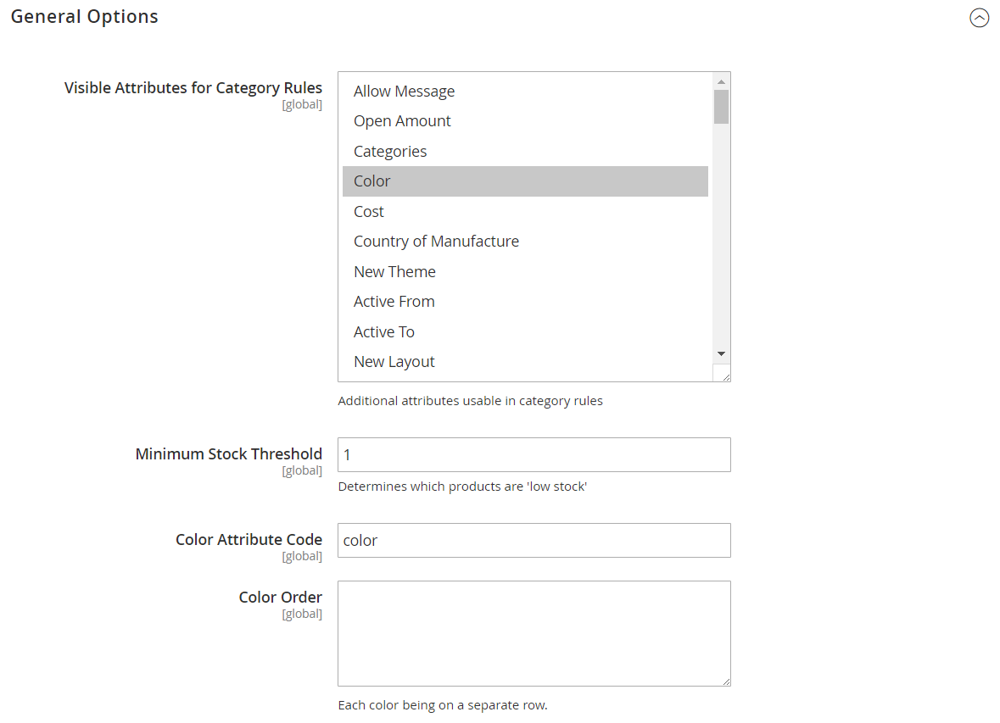

# Configurar atributos inteligentes para Visual Merchandiser

{{ee-feature}}

La configuración de Visual Merchandiser determina los atributos que se pueden utilizar en la ventana de comercialización y el umbral de existencias mínimo. La configuración también identifica el atributo utilizado para el color y el orden de los valores de color.

1. En la barra lateral _Admin_, vaya a **[!UICONTROL Stores]** > _[!UICONTROL Settings]_>**[!UICONTROL Configuration]**.

1. En el panel izquierdo, expanda **[!UICONTROL Catalog]** y elija **[!UICONTROL Visual Merchandiser]** debajo.

1. Expanda  en la sección **[!UICONTROL General Options]**.

   {width="600" zoomable="yes"}

1. En la lista **[!UICONTROL Attributes for Category Rules]**, seleccione cada atributo que desee que esté disponible para la comercialización visual.

   Para seleccionar varios atributos, mantenga presionada la tecla Ctrl (PC) o la tecla Comando (Mac) y haga clic en cada elemento.

1. Escriba **[!UICONTROL Minimum Stock Threshold]** para que un producto aparezca en la ventana de Visual Merchandiser.

1. Escriba **[!UICONTROL Color Attribute Code]**.

   El valor predeterminado es `color`. Si el catálogo utiliza un atributo diferente, introduzca el nombre del atributo en minúsculas.

1. Para **[!UICONTROL Color Order]**, introduzca cada valor de color en una línea independiente y en secuencia para determinar la prioridad de cada color.

1. Una vez finalizado, haga clic en **[!UICONTROL Save Config]**.
