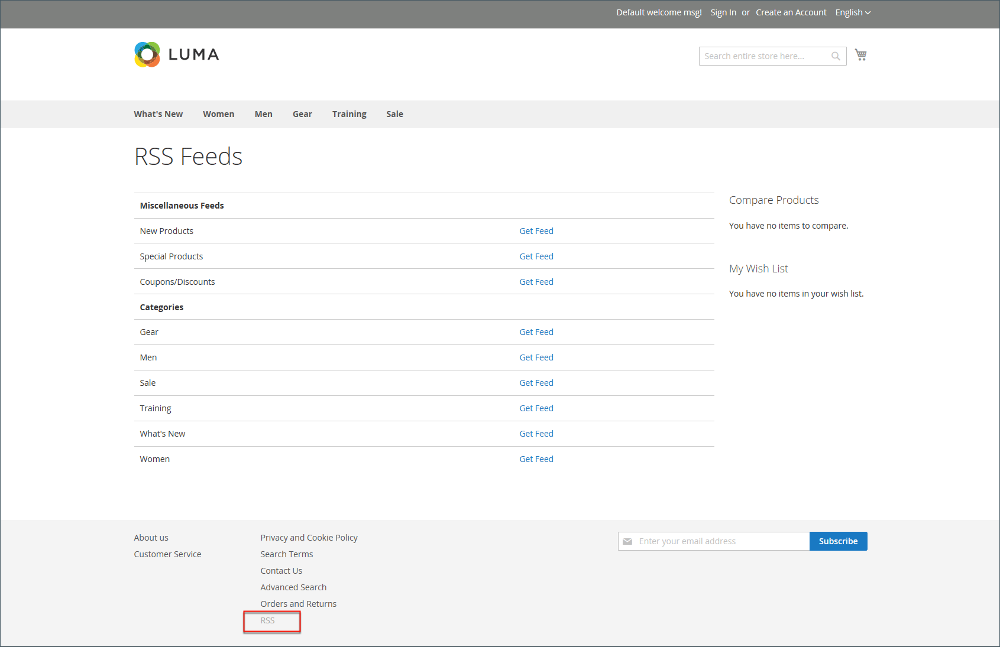

# Medios sociales y fuentes RSS

Muchos comerciantes utilizan las redes sociales y otras herramientas digitales para crear conciencia de marca y producto. Puede integrar su tienda con sus redes sociales instalando una extensión de Marketplace o añadiendo un complemento a sus páginas de contenido. Utilice fuentes RSS para publicar la información de sus productos en sitios de agregación de compras e incluso incluirlos en sus boletines. Los clientes pueden suscribirse a sus fuentes RSS para conocer nuevos productos y promociones.

## Redes sociales

Tu tienda se puede conectar a las redes sociales instalando una [extensión de Marketplace](../getting-started/commerce-marketplace.md). Además, puedes agregar fácilmente complementos sociales como el botón _Me gusta_ a bloques de CMS que se pueden incorporar a páginas de tu tienda.

Los sitios de redes sociales tienen numerosos complementos que se pueden agregar fácilmente a su tienda. Además, hay muchas extensiones en el Commerce Marketplace que se pueden utilizar para integrar su tienda con los medios sociales. El siguiente ejemplo muestra cómo agregar un botón _Like_ de Facebook a la tienda.

>[!NOTE]
>
>Adobe Commerce ha eliminado la integración nativa de Facebook _Magento Social_ y ya no admite la extensión. Vaya al [Commerce Marketplace](https://marketplace.magento.com/catalogsearch/result/?q=Facebook){:target=&quot;_blank&quot;} para buscar extensiones alternativas para la integración con Facebook.

### Paso 1. Obtener el código del botón

1. En el sitio web de desarrolladores de Meta, vaya a la página [button setup](https://developers.facebook.com/docs/plugins/like-button).

1. Para **[!UICONTROL URL to Like]**, escribe la dirección URL de la página de tu tienda que quieres que _te guste_.

   Por ejemplo, puede introducir la dirección URL de la página principal de la tienda.

1. Elija **[!UICONTROL Layout]** para el botón.

1. Escriba **[!UICONTROL Width]** en píxeles disponible en el sitio para el botón y cualquier mensaje de texto asociado.

1. Establezca **[!UICONTROL Action Type]** en una de las siguientes opciones:

   - `Like`
   - `Recommend`

1. Haga clic en **[!UICONTROL Get Code]** para copiar el código generado en el portapapeles.

### Paso 2. Creación de un bloque de contenido

1. Vuelva al administrador de la tienda.

1. En la barra lateral _Admin_, vaya a **[!UICONTROL Content]** > _[!UICONTROL Elements]_>**[!UICONTROL Blocks]**.

1. En la esquina superior derecha, haga clic en **[!UICONTROL Add New Block]**.

1. Escriba un(a) **[!UICONTROL Block Title]** descriptivo(a) para referencia interna.

   Por ejemplo: `Facebook Like Button`.

1. Asigne un único **[!UICONTROL Identifier]** al bloque, usando todos los caracteres en minúsculas y guiones bajos en lugar de espacios.

   Por ejemplo: `facebook_like_button`.

1. Si la instancia de Commerce tiene varias vistas de tienda, elija cada **[!UICONTROL Store View]** en que el bloque va a estar disponible.

1. Agregue el fragmento de código al contenido del bloque, según la herramienta de contenido:

   - Cuando use [!DNL Page Builder], agregue un bloque de [código de HTML](../page-builder/html-code.md) al escenario y pegue el fragmento de código que copió del sitio de Facebook. De lo contrario, pegue el fragmento de código en el cuadro **[!UICONTROL Content]**.

   - Con el editor, pegue el fragmento de código que copió del sitio de Facebook en el cuadro **[!UICONTROL Content]**.

1. Si el bloque no está listo para ejecutarse, establezca **[!UICONTROL Enable Block]** en `No`.

1. Una vez finalizado, haga clic en **[!UICONTROL Save Block]**.

### Paso 3. Colocar el bloque

1. Añada el bloque en función de la herramienta de contenido:

   - Cuando use [!UICONTROL Page Builder], siga las instrucciones para [agregar el bloque](../page-builder/block.md) al escenario.

   - En la barra lateral _Admin_, vaya a **[!UICONTROL Content]** > _[!UICONTROL Elements]_>**[!UICONTROL Widgets]**.

1. En la esquina superior derecha, haga clic en **[!UICONTROL Add Widget]** y haga lo siguiente:

   -  (disponible solo con Adobe Commerce B2B) En la sección _Configuración_, establezca **[!UICONTROL Type]** en `CMS Static Block` y haga clic en **[!UICONTROL Continue]**.

   - Compruebe que **[!UICONTROL Design Theme]** está establecido en el tema actual.

   - Haga clic en **[!UICONTROL Continue]**.

1. En la sección **[!UICONTROL Storefront Properties]**, haga lo siguiente:

   - Para **[!UICONTROL Widget Title]**, escriba un título para referencia interna.

   - Establezca **[!UICONTROL Assign to Store Views]** en `All Store Views` o en la vista donde desea que la aplicación esté disponible. Para seleccionar varias vistas, mantenga pulsada la tecla Ctrl (PC) o la tecla Comando (Mac) y haga clic en cada opción.

   - Escriba un número en el campo **[!UICONTROL Sort Order]** para determinar el orden del bloque si está asignado para que aparezca en la misma ubicación de la página como otros elementos de contenido. La posición superior es cero.

1. En la sección _[!UICONTROL Layout Updates]_, haga clic en **[!UICONTROL Add Layout Update]**&#x200B;y establezca **[!UICONTROL Display On]**&#x200B;en la categoría, el producto o la página donde desea que aparezca el bloque.

   Por ejemplo, si elige `All Pages` y coloca el bloque en el encabezado o en el pie de página, el bloque aparecerá en el mismo lugar en todas las páginas del almacén.

   Para colocar el bloque en una página específica, haga lo siguiente:

   - Establezca **[!UICONTROL Display On]** en `Specified Page` y seleccione **[!UICONTROL Page]** donde desea que aparezca el bloque.

   - Elija **[!UICONTROL Block Reference]** para identificar el lugar de la página donde se colocará el bloque.

   - Acepte la configuración predeterminada de **[!UICONTROL Template]**, que está establecida en `CMS Static Block Default Template`.

   - Haga clic en **[!UICONTROL Save and Continue Edit]**.

1. En el panel de la izquierda, elija **[!UICONTROL Widget Options]**.

1. Haga clic en **[!UICONTROL Select Block…]** y elija el bloque que desea colocar.

1. Una vez finalizado, haga clic en **[!UICONTROL Save]**.

1. Cuando se le solicite, siga las instrucciones de la parte superior del espacio de trabajo para actualizar el índice y la caché de la página.

   El widget ahora aparece en la lista _[!UICONTROL Widgets]_.

### Paso 4. Comprobar la ubicación en la tienda

Regresa a tu tienda para verificar que el bloque esté en la ubicación correcta. Para mover el bloque, puede volver a abrir el widget y probar con una página o referencia de bloque diferente.

## Fuentes RSS

RSS (Really Simple Syndication) es un formato de datos basado en XML que se utiliza para distribuir información en línea. Sus clientes pueden suscribirse a sus fuentes RSS para conocer nuevos productos y promociones. Las fuentes RSS también se pueden utilizar para publicar la información del producto en sitios de agregación de compras y se pueden incluir en boletines informativos.

Cuando las fuentes RSS están habilitadas, cualquier adición a productos, ofertas especiales, categorías y cupones se envía automáticamente a los suscriptores de cada fuente. Un vínculo a todas las fuentes RSS que publique se encuentra al pie de página de la tienda.

{width="100"} 

El software necesario para leer una fuente RSS se denomina lector de fuentes y permite a las personas suscribirse a titulares, blogs, podcasts y mucho más. Google Reader es uno de los muchos lectores de fuentes que están disponibles en línea de forma gratuita.

{width="700" zoomable="yes"}

### Ventajas de configurar una fuente RSS

- Descargue la última actualización de su tienda o blog
- Anuncios ligeros
- Acciones ordinarias
- Impulso de SEO
- Aumentar las ventas

### Tipos de fuentes RSS

| Fuente RSS | Descripción |
|--- |--- |
| [!UICONTROL Wish List] | Cuando se habilita, aparece un vínculo de fuente RSS en la parte superior de las páginas de la lista de deseos del cliente. Además, la página para compartir listas de deseos incluye una casilla de verificación que permite incluir un vínculo a la fuente desde listas de deseos compartidas. |
| [!UICONTROL New Products] | Publica la notificación de los nuevos productos añadidos al catálogo. |
| [!UICONTROL Special Products] | Publica una notificación de cualquier producto con precios especiales. |
| [!UICONTROL Coupons / Discounts] | Publica una notificación de los cupones o descuentos especiales disponibles en la tienda. |
| [!UICONTROL Top Level Category] | Publica una notificación de cualquier cambio realizado en la estructura de categorías de nivel superior del catálogo, que se refleja en el menú principal. |
| [!UICONTROL Customer Order Status] | Permite a los clientes realizar un seguimiento del estado de sus pedidos por fuente RSS. Cuando se habilita, aparece un vínculo de fuente RSS en el pedido. |

{style="table-layout:auto"}

### Configurar fuentes RSS para su tienda

1. En la barra lateral _Admin_, vaya a **[!UICONTROL Stores]** > _[!UICONTROL Settings]_>**[!UICONTROL Configuration]**.

1. En la esquina superior derecha, establezca **[!UICONTROL Store View]** en las vistas en las que las fuentes deben estar disponibles.

   Si se le solicita que confirme, haga clic en **[!UICONTROL OK]**.

1. En el panel izquierdo, expanda **[!UICONTROL Catalog]** y elija **[!UICONTROL RSS Feeds]**.

1. Expanda  en la sección **[!UICONTROL Rss Config]** y establezca **[!UICONTROL Enable RSS]** en `Enable`.

   {width="600" zoomable="yes"}

   Si es necesario, desactive la casilla de verificación **[!UICONTROL Use Default]** para cambiar el valor predeterminado.

1. Expanda  en la sección **[!UICONTROL Wish List]** y establezca **[!UICONTROL Enable RSS]** en `Enable`.

1. Expanda  en la sección **[!UICONTROL Catalog]** y establezca otras fuentes en `Enable` según sea necesario.

   - **[!UICONTROL New Products]**
   - **[!UICONTROL Special Products]**
   - **[!UICONTROL Coupons/Discounts]**
   - **[!UICONTROL Top Level Category]**

   {width="600" zoomable="yes"}

1. Expanda  en la sección **[!UICONTROL Order]** y establezca **[!UICONTROL Customer Order Status Notification]** en `Enable`.

1. Una vez finalizado, haga clic en **[!UICONTROL Save Config]**.

1. Ver el resultado en la tienda con `/rss` al final de la dirección URL de la página.

