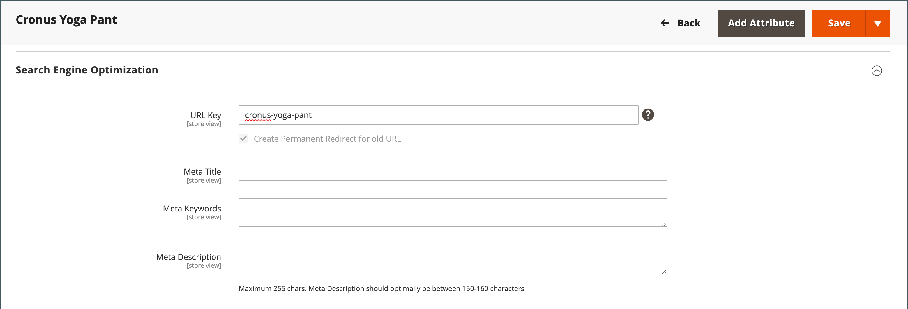

# Redirecciones automáticas

Su tienda se puede configurar para que genere automáticamente una redirección permanente cada vez que cambie la clave URL de un producto o categoría. En la sección Optimización del motor de búsqueda, la casilla de verificación debajo de la clave URL indica si las redirecciones permanentes están habilitadas. Si la tienda ya está configurada para redirigir automáticamente las direcciones URL del catálogo, una redirección es una actualización sencilla de la clave URL. El proceso para crear una redirección automática es el mismo para los productos y las categorías.

>[!NOTE]
>
>Cuando se habilitan las redirecciones automáticas y se guarda una categoría, todas las reescrituras de productos y categorías se generan en tiempo real y se almacenan en tablas de bases de datos de forma predeterminada. Esto podría provocar problemas de rendimiento significativos para las categorías con muchos productos asignados. La solución consiste en cambiar este valor predeterminado y omitir la generación de reescrituras de URL de categoría/productos para los productos al guardar la categoría. En este caso, las reescrituras de productos se generan solo para la URL del producto canónico.

## Configurar redirecciones automáticas

1. En la barra lateral _Admin_, vaya a **[!UICONTROL Stores]** > _[!UICONTROL Settings]_>**[!UICONTROL Configuration]**.

1. En el panel izquierdo, expanda **[!UICONTROL Catalog]** y elija **[!UICONTROL Catalog]** debajo.

1. Expanda  en la sección **[!UICONTROL Search Engine Optimization]**.

   {width="600" zoomable="yes"}

1. Establezca **[!UICONTROL Create Permanent Redirect for URLs if URL Key Changed]** en `Yes`.

1. Una vez finalizado, haga clic en **[!UICONTROL Save Config]**.

>[!NOTE]
>
> Las reescrituras de URL se pueden generar para la vista de tienda o el ámbito del sitio web. Establezca el ámbito de reescritura de URL desde el administrador en **[!UICONTROL Stores]** > _[!UICONTROL Settings]_>**[!UICONTROL Configuration]**&#x200B;**[!UICONTROL Catalog]**>**[!UICONTROL Catalog]**>**[!UICONTROL Search Engine Optimization]**. Seleccione el ámbito en el campo&#x200B;_[!UICONTROL Product URL Rewrite Scope]_.

## Redirigir automáticamente las direcciones URL del producto

1. En la barra lateral _Admin_, vaya a **[!UICONTROL Catalog]** > **[!UICONTROL Products]**.

1. Busque el producto en la lista y haga clic en para abrir el registro.

1. Expanda  en la sección **[!UICONTROL Search Engine Optimization]**.

   {width="600" zoomable="yes"}

1. Para **[!UICONTROL URL Key]**, haga lo siguiente:

   - Asegúrese de que la casilla de verificación **[!UICONTROL Create Permanent Redirect for old URL]** esté seleccionada. Si no, siga las instrucciones para [habilitar las redirecciones automáticas](url-rewrite.md#configure-url-rewrites).

   - Actualice **[!UICONTROL URL Key]** según sea necesario, usando todos los caracteres en minúsculas y guiones no finales entre estos caracteres en lugar de espacios.

1. Una vez finalizado, haga clic en **[!UICONTROL Save]**.

1. Cuando se le pida que actualice la caché, siga los vínculos del mensaje situado en la parte superior del espacio de trabajo.

   La redirección permanente ya está en vigor para el producto y cualquier dirección URL de categoría asociada.

## Redirigir automáticamente las direcciones URL de categoría

1. En la barra lateral _Admin_, vaya a **[!UICONTROL Catalog]** > **[!UICONTROL Categories]**.

1. Busque la categoría en el árbol y haga clic en para abrir el registro.

1. Expanda  en la sección **[!UICONTROL Search Engine Optimization]**.

1. Para **[!UICONTROL URL Key]**, haga lo siguiente:

   - Asegúrese de que la casilla de verificación **[!UICONTROL Create Permanent Redirect for old URL]** esté seleccionada. Si no, siga las instrucciones para [habilitar las redirecciones automáticas](url-rewrite.md#configure-url-rewrites).

   - Actualice **[!UICONTROL URL Key]** según sea necesario, usando todos los caracteres en minúsculas y guiones no finales entre estos caracteres en lugar de espacios.

1. Una vez finalizado, haga clic en **[!UICONTROL Save]**.

1. Cuando se le pida que actualice la caché, siga los vínculos del mensaje situado en la parte superior del espacio de trabajo.

   La redirección permanente ya está en vigor para la categoría y cualquier dirección URL de producto asociada.

## Omitir generación de reescrituras de URL de productos para guardar categorías {#skip-rewrite}

>[!WARNING]
>
>Si se desactiva la generación automática de reescrituras de URL de categorías/productos, se eliminan de forma permanente todas las reescrituras de URL de categorías/tipos de productos existentes, las cuales no se pueden restaurar. Esto podría causar conflictos de URL de categoría/tipo de producto sin resolver que requieren una actualización manual de la clave URL para resolverlos.

1. En la barra lateral _Admin_, vaya a **[!UICONTROL Stores]** > _[!UICONTROL Settings]_>**[!UICONTROL Configuration]**.

1. En el panel izquierdo, expanda **[!UICONTROL Catalog]** y elija **[!UICONTROL Catalog]** debajo.

1. Expanda  en la sección **[!UICONTROL Search Engine Optimization]**.

1. Establezca **[!UICONTROL Generate "category/product" URL Rewrites]** en `No`.

1. En el cuadro de diálogo de confirmación, haga clic en **[!UICONTROL OK]** para confirmar el cambio y la eliminación de las reescrituras de URL existentes.

   {width="350"}

1. Una vez finalizado, haga clic en **[!UICONTROL Save Config]**.
