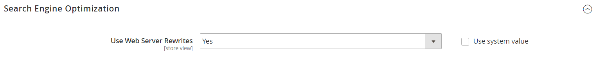

# Reescrituras de URL

La herramienta de reescritura de URL permite cambiar cualquier URL asociada a un producto, categoría o página de CMS. Cuando la reescritura entra en vigor, los vínculos que apunten a la dirección URL anterior se redirigirán a la nueva dirección.

>[!NOTE]
>
>Para actualizar las reescrituras de URL de varios o todos los productos simultáneamente, consulte [Reescrituras de URL múltiples](url-rewrite-product.md#multiple-url-rewrites).

Los términos _rewrite_ y _redirect_ se utilizan a menudo de forma intercambiable, pero hacen referencia a procesos ligeramente diferentes. Una reescritura de URL cambia la forma en que aparece la dirección URL en el explorador. Un redireccionamiento de URL actualiza la dirección URL almacenada en el servidor. Una redirección de URL puede ser temporal o permanente. Tu tienda usa reescrituras y redirecciones de URL para facilitar el cambio de la clave URL de un producto, categoría o página y la conservación de los vínculos existentes.

De manera predeterminada, las [redirecciones automáticas de URL](url-redirect-product-automatic.md) están habilitadas para su tienda y la casilla de verificación **Crear redireccionamiento permanente para la URL antigua** está seleccionada en el campo Clave de URL de cada producto.

{{url-rewrite-skip}}

{{url-rewrite-params}}

{width="600" zoomable="yes"}

## URL canónicas

A efectos de la SEO, es aconsejable que cada una de las páginas web tenga una sola URL distinta.

Si tiene una sola página accesible mediante varias direcciones URL o páginas diferentes con contenido similar, Google las verá como versiones duplicadas de la misma página. Google elige una dirección URL como versión canónica y rastrea esa y todas las demás direcciones URL se consideran direcciones URL duplicadas y se rastrean con menos frecuencia.

Si no le indica explícitamente a Google qué dirección URL es canónica, hace la elección por usted o puede considerarlas de igual peso. Esto podría provocar un comportamiento no deseado y corre el riesgo de un presupuesto de rastreo ineficaz y de vínculos de retorno distribuidos bajos.

Según la configuración del sitio web, puede haber varias versiones del sitio en el índice, incluidas las siguientes:

    https://www.example.com
    https://www.example.com/
    http://www.example.com
    https://example.com
    https://www.example.com/index.html

Para especificar una página canónica, consulte [Documentación de Google Search Central](https://developers.google.com/search/docs/crawling-indexing/consolidate-duplicate-urls).

## Configuración de reescrituras de URL

La activación de las reescrituras de Apache del servidor web forma parte de la configuración inicial de Commerce. Commerce usa de forma rutinaria las reescrituras de direcciones URL para quitar el nombre de archivo `index.php` que normalmente aparece en la dirección URL justo después de la carpeta raíz. Cuando las reescrituras del servidor web están habilitadas, el sistema reescribe cada URL para omitir `index.php`. La reescritura elimina las palabras que no transmiten nada de valor a los motores de búsqueda o a los clientes, y no afecta al rendimiento ni a la clasificación del sitio.

URL sin reescritura de servidor web

    http://www.yourdomain.com/magento/index.php/storeview/url-identifier

URL con reescritura de servidor web

    http://www.yourdomain.com/magento/storeview/url-identifier

1. En la barra lateral _Admin_, vaya a **[!UICONTROL Stores]** > _[!UICONTROL Settings]_>**[!UICONTROL Configuration]**.

1. En el panel izquierdo donde **[!UICONTROL General]** está expandido, elija **[!UICONTROL Web]**.

1. Expanda  en la sección **[!UICONTROL Search Engine Optimization]**.

   {width="600" zoomable="yes"}

1. Establezca **[!UICONTROL Use Web Server Rewrites]** según sus preferencias.

1. Una vez finalizado, haga clic en **[!UICONTROL Save Config]**.

## Crear reescrituras de URL

Puede utilizar la herramienta de reescritura de URL para crear reescrituras de productos y categorías, y reescrituras personalizadas para cualquier página de la tienda. Cuando la reescritura entra en vigor, los vínculos existentes que apunten a la dirección URL anterior se redirigirán sin problemas a la nueva dirección.

Las reescrituras de URL se pueden utilizar para añadir palabras clave de alto valor para mejorar la forma en que los motores de búsqueda indexan el producto. También puede utilizar las reescrituras para crear direcciones URL adicionales para un cambio temporal estacional o permanente. Las reescrituras se pueden crear para cualquier ruta válida, incluidas las páginas de contenido de CMS. Internamente, el sistema siempre hace referencia a productos y categorías por su ID. Independientemente de la frecuencia con la que cambie la dirección URL, el ID sigue siendo el mismo. A continuación se indican algunas formas de utilizar una reescritura de URL:

URL del sistema

    http://www.example.com/catalog/category/id/6

URL original

    http://www.example.com/peripherals/keyboard.html

URL del producto redirigido

    http://www.example.com/ergonomic-keyboard.html

Direcciones URL de categoría adicionales

    http://www.example.com/all-on-sale.html
    http://www.example.com/save-now/spring-sale

{width="700" zoomable="yes"}

Commerce ofrece estos tipos de reescritura de URL:

* [Reescrituras de productos](url-rewrite-product.md)
* [Reescrituras de categoría](url-rewrite-category.md)
* [Reescrituras de páginas de CMS](url-rewrite-cms-page.md)
* [Reescrituras personalizadas](url-rewrite-custom.md)

## La URL reescribe la demostración

Vea este vídeo para obtener más información sobre la administración de reescrituras de URL:

>[!VIDEO](https://video.tv.adobe.com/v/343751?quality=12&learn=on)
