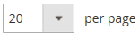
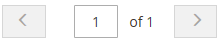

# Visual Merchandiser

{{ee-feature}}

_Visual Merchandiser_ es un conjunto de herramientas avanzadas que le permite colocar productos y aplicar condiciones que determinan qué productos aparecen en la lista de categorías. El resultado puede ser una selección dinámica de productos que se ajusta a los cambios en el catálogo. Puede trabajar en _modo visual_, que muestra cada producto como un mosaico en una cuadrícula, o para trabajar desde una lista de productos de la categoría. Las mismas herramientas están disponibles en cada modo y puede utilizar los botones de la esquina superior derecha para alternar entre cada tipo de visualización.

{width="600" zoomable="yes"}

## Obtener acceso a Visual Merchandiser

1. En la barra lateral _Admin_, vaya a **[!UICONTROL Catalog]** > **[!UICONTROL Categories]**.

1. Desplácese por el árbol de categorías y haga clic en la categoría que desee editar.

1. Desplácese hacia abajo y expanda  en la sección **[!UICONTROL Products in Category]**.

1. Haga clic en el botón _Ver como mosaicos_ (  ) para mostrar los productos como una cuadrícula.

1. Una vez finalizado, haga clic en **[!UICONTROL Save Category]**.

## Cambiar la posición de un producto

1. Use el [criterio de ordenación](../catalog/navigation-product-listings.md) para ver el producto que desea mover.

   - **Método 1: Arrastrar y soltar**

     Coge el control _Arrastrar_ () en la esquina superior derecha del mosaico del producto y suelta el producto en su posición. El número de cada producto se ajusta para reflejar la nueva posición.

   - **Método 2: establecer valor de posición**

     En el controlador _Position_ () del mosaico del producto, escriba el número en el que desea que aparezca el producto. Escriba `0` para colocar el producto al principio de la lista.

1. Una vez finalizado, haga clic en **[!UICONTROL Save Category]**.

>[!NOTE]
>
>En una instalación limpia, Adobe Commerce reserva el id. de categoría `2` para el catálogo raíz del almacén predeterminado. Visual Merchandiser sólo puede utilizar categorías con un número de identificador de `3` o superior.

## Controles de Workspace

| Control | Descripción |
|--- |--- |
|  | Ver como lista |
|  | Ver como mosaicos |
|  | Coincidencia por regla: no |
|  | Coincidencia por regla: sí |
|  | Arrastrar |
|  | Posición |
|  | Eliminar de la categoría |
|  | Vista por página |
|  | Ir al siguiente/anterior |

{style="table-layout:auto"}
