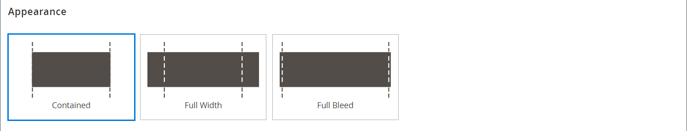
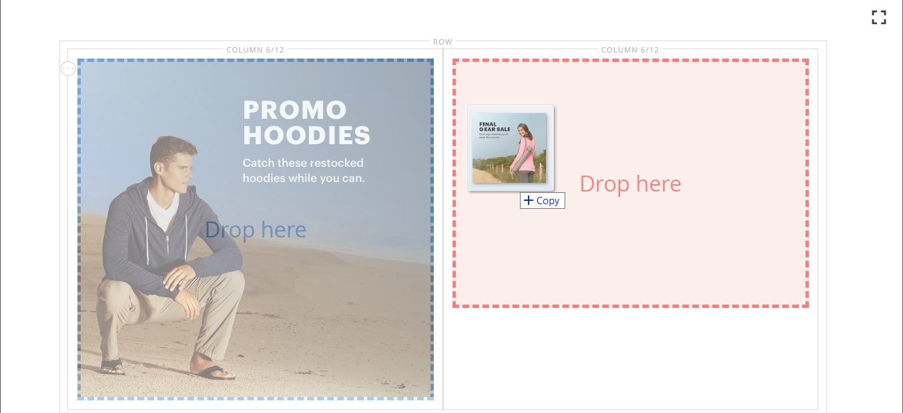

# [!DNL Page Builder], parte 1: página simple

Siga este ejercicio de tres partes para familiarizarse con el área de trabajo de [!DNL Page Builder] creando una página sencilla que ilustre lo fácil que es crear páginas con contenido enriquecido de su propio diseño.

{width="700" zoomable="yes"}

>[!NOTE]
>
>Estos ejercicios de introducción se actualizan para reflejar los cambios recientes realizados en el espacio de trabajo [!DNL Page Builder] en la versión 2.4.1.

## Antes de empezar

Antes de comenzar este ejercicio, se recomienda aumentar la [Duración de la sesión de administrador](../systems/security-admin.md) para evitar que se agote el tiempo de espera de la sesión mientras trabaja.

Compruebe las opciones de configuración de Content Management necesarias:

- El Editor de WYSIWYG está habilitado en la configuración de [Opciones de WYSIWYG](../content-design/editor.md#configure-the-editor).

- [!DNL Page Builder] está habilitado en la configuración de [Herramientas de contenido avanzadas](setup.md).

### Descargar los recursos de imagen del tutorial

1. Descargue el archivo de [`simple-page-assets`](./assets/simple-page-assets.zip) y guárdelo en el sistema local.

1. Vaya al archivo descargado y extraiga los archivos comprimidos.

   En un sistema Windows, haga clic con el botón secundario y elija **[!UICONTROL Extract All]** archivos. A continuación, elija la carpeta de destino y haga clic en **[!UICONTROL Extract]**.

   En un sistema Mac, simplemente puede hacer doble clic en el archivo zip y luego mover los archivos extraídos a la carpeta de destino.

   La carpeta contiene los siguientes archivos de imagen:

   ![[!DNL Page Builder] archivos de tutorial - recursos de página simples](./assets/pb-tutorial-simple-page-assets.png){width="500"}

Siga las tres partes de este tutorial en orden.

## Parte 1: Fila de sangrado completo con titular

En esta parte del ejercicio Página simple, se crea una página que tiene una fila y un banner a sangre completa. La fila tiene diferentes imágenes de fondo para escritorio y dispositivos móviles.

![[!DNL Page Builder] fila a sangre completa con banner](./assets/pb-tutorial1-full-bleed-with-banner.png){width="700" zoomable="yes"}

### Paso 1: Crear una página

1. En la barra lateral _Admin_, vaya a **[!UICONTROL Content]** > _[!UICONTROL Elements]_>**[!UICONTROL Pages]**.

1. En la esquina superior derecha, haga clic en **[!UICONTROL Add New Page]** y haga lo siguiente:

   - Para evitar que esta página se publique en su tienda, establezca **[!UICONTROL Enable Page]** en `No`.

   - Para **[!UICONTROL Page Title]**, escriba `Simple Page`.

   {width="600" zoomable="yes"}

1. Expanda  en la sección **[!UICONTROL Design]**.

   Observe que **[!UICONTROL Layout]** está establecido en `Page -- Full Width` de manera predeterminada. Además de las cinco opciones estándar de [layout](../content-design/page-layout.md), [!DNL Page Builder] agrega diseños de ancho completo para páginas, categorías y productos.

1. Si los datos de ejemplo están disponibles, establezca **[!UICONTROL New Theme]** en `Magento Luma`. De lo contrario, puede elegir otra temática disponible o dejarla en blanco para utilizar la predeterminada.

   La configuración _[!UICONTROL New Theme]_&#x200B;se puede usar para anular el tema predeterminado y aplicar un tema diferente a la página.

   >[!NOTE]
   >
   >El diseño Anchura completa solo se puede usar con un [tema](../content-design/themes.md) compatible.

   {width="600" zoomable="yes"}

1. En la esquina superior derecha, haga clic en **[!UICONTROL Save]**.

   Cuando se guarda la página, aparece el nombre _Página simple_ en la esquina superior izquierda de la página.

### Paso 2: Dar formato a la fila

1. Expanda  en la sección **[!UICONTROL Content]**.

   Esta acción muestra la vista previa de [!DNL Page Builder] con una fila vacía.

   >[!NOTE]
   >
   >El campo [Encabezado de contenido](workspace.md) es opcional. De forma predeterminada, se le aplica el formato de nivel de encabezado 1 (H1) según la temática. Para este ejercicio, _Encabezado de contenido_ se deja en blanco.

   {width="600" zoomable="yes"}

1. Haga clic en **[!UICONTROL Edit with Page Builder]** o dentro del área de vista previa de contenido.

   En el [espacio de trabajo](workspace.md) [!DNL Page Builder] expandido, el panel de la izquierda proporciona las herramientas de contenido que puede usar para generar contenido en el escenario.

1. Pase el ratón sobre la fila vacía para mostrar el cuadro de herramientas.

   Cada contenedor de contenido tiene una caja de herramientas con un conjunto similar de opciones.

   ![[!DNL Page Builder] cuadro de herramientas de fila](./assets/pb-layout-page-add-content-row-tools.png){width="600" zoomable="yes"}

1. En el cuadro de herramientas Fila, elija el icono _Configuración_ ({width="20"}.

1. En _[!UICONTROL Appearance]_, elija **Sangrado total**.

   La configuración de apariencia de sangrado completo extiende los bordes izquierdo y derecho del área de contenido de la fila y el fondo al ancho completo de la página.

   {width="600" zoomable="yes"}

1. Desplácese hacia abajo hasta la sección _[!UICONTROL Advanced]_&#x200B;y establezca todos los valores de **[!UICONTROL Margins and Padding]**&#x200B;en `0`.

   Esta configuración garantiza que el banner amplíe el ancho completo de la fila.

   {width="600" zoomable="yes"}

1. Para guardar la configuración y volver al área de trabajo [!DNL Page Builder], desplácese hasta la parte superior de la página y haga clic en **[!UICONTROL Save]** en la esquina superior derecha.

### Paso 3: Añadir un titular

>[!NOTE]
>
>[!DNL Page Builder] tiene un nuevo tipo de contenido denominado _Banner_, que se muestra en este paso. Lo que antes era la opción _Banner_ en el menú Contenido, ahora es un _Bloque dinámico_.

1. En el panel [!DNL Page Builder], expanda **[!UICONTROL Media]** y arrastre un marcador de posición **Banner** al escenario.

   {width="600" zoomable="yes"}
1. Pase el ratón sobre el contenedor del titular para mostrar el cuadro de herramientas.

   >[!NOTE]
   >
   >El escenario ahora tiene dos contenedores de contenido, cada uno con una caja de herramientas independiente. Como el banner está anidado dentro de la fila, asegúrese de que está trabajando en el cuadro de herramientas correcto.

   Además del cuadro de herramientas, se incluyen los botones _Cargar imagen_ y _Seleccionar de la galería_ para que pueda realizar cambios rápidos en el titular directamente desde el escenario.

   {width="600" zoomable="yes"}

1. En el cuadro de herramientas del titular, elija el icono _Configuración_ ( {width="20"} ).

1. En _[!UICONTROL Appearance]_, elija **[!UICONTROL Collage Right]**.

   La configuración Collage Right coloca el contenido en el lado derecho del banner.

   {width="600" zoomable="yes"}

1. Desplácese hacia abajo hasta la sección _[!UICONTROL Background]_&#x200B;y defina la imagen de fondo del titular:

   - Para **[!UICONTROL Background Image]**, haga clic en **Cargar**.

     {width="600" zoomable="yes"}

     Vaya al directorio en el que guardó los recursos de página simples extraídos y elija el archivo `wide-banner-background.jpg`.

     La imagen se cargará y aparecerá una miniatura de la imagen cargada. A continuación se indica el nombre del archivo, las dimensiones de la imagen y el tamaño del archivo.

     {width="600" zoomable="yes"}

   - Para **[!UICONTROL Background Mobile Image]**, haga clic en **Cargar**.

     En el mismo directorio de archivos, elija el archivo `wide-banner-background-mobile.jpg`.

     La imagen de fondo móvil se utiliza para dispositivos móviles y también siempre que se cambia el tamaño de una ventana del explorador de escritorio a la anchura de un dispositivo móvil.

     {width="600" zoomable="yes"}

   - Desplácese de nuevo a la parte superior de la página y haga clic en **[!UICONTROL Save]** para guardar la configuración y volver al área de trabajo [!DNL Page Builder].

     El fondo aparece en el escenario y extiende el ancho completo de la fila.

     {width="600" zoomable="yes"}

   Observe el texto de marcador de posición que aparece en el lado derecho de la fila. La posición de este texto refleja la configuración de apariencia _Collage Right_.

1. Haga clic en el texto del marcador de posición e introduzca el siguiente mensaje como dos líneas:

   `Get fit and look fab in new seasonal styles.`

   `New LUMA yoga collection`

   La barra de herramientas del editor aparece encima del cuadro de texto. Se puede introducir y dar formato al texto directamente desde el escenario o eligiendo _Configuración_ en la caja de herramientas del titular.

   {width="600" zoomable="yes"}

1. Aplicar formato al texto:

   - Seleccione la primera línea de texto. A continuación, en la barra de herramientas del editor en **Formatos**, elija `Heading 2`.

     {width="600" zoomable="yes"}

   - Seleccione la segunda línea de texto. A continuación, en la barra de herramientas del editor en **Formatos**, elija `Paragraph`.

   La configuración de formato aplica los estilos de la hoja de estilos asociada al tema actual.

   {width="600" zoomable="yes"}
__

1. Pase el ratón por encima para mostrar el cuadro de herramientas del titular, elija de nuevo el icono _Configuración_ ( {width="20"} ) y luego desplácese hasta la sección _[!UICONTROL Content]_.

   Observe que el texto se muestra en el cuadro _Texto del mensaje_. Se puede introducir y editar texto desde el escenario o desde la sección _[!UICONTROL Content]_&#x200B;de la configuración del banner.

   {width="600" zoomable="yes"}

1. Continuando en la sección _[!UICONTROL Content]_, establezca el vínculo y el botón del titular:

   - Establezca **Link** en `Category` y, a continuación, haga clic en **[!UICONTROL Select]** para mostrar el árbol de categorías.

   - Elija `What's New` como categoría vinculada.

     {width="600" zoomable="yes"}

   - Establezca **[!UICONTROL Show Button]** en `Always`.

   - Para **[!UICONTROL Button Text]**, escriba `Shop Now` como el texto que aparece en el botón.

   - Para **[!UICONTROL Button Type]**, acepte el valor predeterminado `Primary`.

     El estilo de botón del tema actual determina el formato del botón.

1. Establezca la superposición del banner:

   Puede utilizar una superposición para aplicar un color de fondo al área de contenido activo definida por la configuración Aspecto. La imagen de fondo del titular permanece visible durante todo el ancho del titular.

   - Establezca **[!UICONTROL Show Overlay]** en `Always`.

   - Para **[!UICONTROL Overlay Color]**, realice una de las siguientes acciones:

      - Haga clic en el cuadrado de color y seleccione la muestra blanca.
      - Haga clic en el cuadro de texto _Sin color_ y escriba `White` o el valor hexadecimal `#ffffff`.

     A continuación, haga clic en **[!UICONTROL Apply]**.

     {width="600" zoomable="yes"}

   - Desplácese de nuevo a la parte superior de la página y haga clic en **[!UICONTROL Save]** para guardar la configuración y volver al área de trabajo [!DNL Page Builder].

     El botón aparece debajo del mensaje del titular en el escenario.

     {width="600" zoomable="yes"}

1. En la esquina superior derecha del escenario, haga clic en el icono _Cerrar pantalla completa_ ().

   Al hacer clic en este icono, volverá a la sección _[!UICONTROL Content]_&#x200B;de la página con la vista previa mostrada.

   Puede alternar entre los dos modos de espacio de trabajo en cualquier momento que desee.

1. En la esquina superior derecha, haga clic en la flecha **[!UICONTROL Save]** y elija **[!UICONTROL Save & Close]**.

1. Si se le solicita, haga clic en el vínculo [Administración de caché](../systems/cache-management.md) en el mensaje en la parte superior de la página y actualice cualquier caché no válida.

## Parte 2: Fila contenida con dos columnas iguales

En esta parte del ejercicio, agregue una fila a la página y divida la fila en dos columnas iguales. A continuación, agregue una imagen vinculada a cada columna. En las instrucciones, cada nueva fila se agrega antes de la primera fila para hacer que el panel [!DNL Page Builder] se alinee con el escenario. Al final del ejercicio, reorganice las filas para que coincidan con el ejemplo Página simple.

{width="600" zoomable="yes"}

### Paso 1: Añadir una fila

1. En la cuadrícula Páginas, busque la _Página simple_ que creó en la primera parte de este ejercicio y seleccione **[!UICONTROL Edit]** en la columna _[!UICONTROL Action]_.

1. Expanda  en la sección **[!UICONTROL Content]**.

1. Haga clic en **[!UICONTROL Edit with Page Builder]** o dentro del área de vista previa de contenido.

1. En el panel [!DNL Page Builder] bajo _[!UICONTROL Layout]_, arrastre un marcador de posición **[!UICONTROL Row]**&#x200B;al escenario y colóquelo sobre el titular.

   La directriz roja marca el límite entre las dos filas.

   {width="600" zoomable="yes"}

1. Pase el ratón sobre la nueva fila para ver el cuadro de herramientas y elija el icono _Configuración_ ( {width="20"} ).

   {width="600" zoomable="yes"}

1. En _[!UICONTROL Appearance]_, acepte la configuración predeterminada **Contenido**.

   Esta configuración limita el área de contenido de la fila al ancho de la página según se define en la temática.

   {width="600" zoomable="yes"}

1. En la esquina superior derecha, haga clic en **[!UICONTROL Save]** para guardar la configuración y volver al área de trabajo [!DNL Page Builder].

### Paso 2: Añadir una columna

1. En el panel [!DNL Page Builder] bajo _[!UICONTROL Layout]_, arrastre un marcador de posición **[!UICONTROL Column]**&#x200B;a la nueva fila.

   {width="600" zoomable="yes"}

   La fila ahora se divide en dos columnas de igual ancho. Cada columna es un contenedor independiente para el contenido con su propia caja de herramientas de opciones dedicada.

   {width="600" zoomable="yes"}

1. En la esquina superior izquierda de la primera columna, haga clic en el control circular _Grid_ () para mostrar las directrices de la cuadrícula.

   La cuadrícula garantiza que el contenido se alinee de forma coherente y que se represente correctamente tanto en equipos de escritorio como en dispositivos móviles. Para obtener información acerca de cómo configurar el tamaño de la cuadrícula, vea la sección [Configurar [!DNL Page Builder]](setup.md#configure-page-builder) en el tema Configuración de [!DNL Page Builder].

   Los números entre paréntesis (6/12) en el borde superior de cada contenedor de columnas indican el número de divisiones de cuadrícula en cada columna y el número total de divisiones en la fila.

   {width="600" zoomable="yes"}

### Paso 3: Añadir imágenes con vínculos

En este paso, aprenderá a cargar una imagen en el titular.

1. En el panel [!DNL Page Builder], expanda la sección **[!UICONTROL Media]** y arrastre un marcador de posición **[!UICONTROL Image]** a la primera columna.

   {width="600" zoomable="yes"}

1. Inserte la imagen de muestra en el marcador de posición.

   {width="600" zoomable="yes"}

   Para una imagen ubicada en el sistema, puede elegir cualquiera de estos métodos:

   - **Cargar el archivo de imagen**: en la primera columna, haga clic en **[!UICONTROL Upload Image]**. A continuación, vaya al directorio en el que guardó los recursos de página simple extraídos y elija el archivo `small-banner-1.jpg`.

     {width="600" zoomable="yes"}

     Repita esta acción para agregar el archivo `small-banner-2.jpg` a la segunda columna.

   - **Arrastre el archivo de imagen**: en el escritorio, abra la carpeta de recursos de página simple y colóquela junto a la ventana del explorador de administración donde está trabajando con el escenario [!DNL Page Builder]. A continuación, arrastre el archivo `small-banner-1.jpg` desde la carpeta de recursos de la página simple y suéltelo en la primera columna.

     {width="600" zoomable="yes"}

     Repita esta acción para agregar el archivo `small-banner-2.jpg` a la segunda columna.

1. Determine qué página del catálogo desea vincular a cada imagen.

1. Pase el ratón sobre la imagen de la primera columna para ver la caja de herramientas y elija el icono _Configuración_ ( {width="20"} ).

   {width="600" zoomable="yes"}

1. Vincule la imagen a una categoría:

   - Desplácese hacia abajo y establezca **Link** en `Category`.

   - En el árbol de categorías, explore en profundidad y elija la categoría `Men's Hoodies & Sweatshirt`.

   - En la esquina superior derecha, **[!UICONTROL Save]** la configuración y vuelva al área de trabajo [!DNL Page Builder].

1. Repita el paso anterior para vincular la imagen de la segunda columna a la categoría _Engranaje_.

1. En la esquina superior derecha del escenario, haga clic en el icono _Cerrar pantalla completa_ ().

   Al hacer clic en este icono, volverá a la sección _[!UICONTROL Content]_&#x200B;de la página con la vista previa mostrada.

1. En la esquina superior derecha, haga clic en la flecha **[!UICONTROL Save]** y elija **[!UICONTROL Save & Close]**.

1. Cuando se le solicite, haga clic en el vínculo [Administración de caché](../systems/cache-management.md) en el mensaje en la parte superior de la página y actualice cualquier caché no válida.

## Parte 3: Fila de ancho completo con columnas desiguales

La última fila de esta página incluye contenido de una revisión de producto. Se agrega una fila de ancho completo y se divide en dos columnas de anchos diferentes. Se agrega una imagen de fondo a la primera columna, con un color de fondo coincidente que se aplica a la fila para obtener un efecto unificado.

{width="500"}

### Paso 1: Añadir una fila

1. En la cuadrícula Páginas, busque la _Página simple_ que creó en la primera parte de este ejercicio y seleccione **[!UICONTROL Edit]** en la columna _[!UICONTROL Action]_.

1. Expanda  en la sección **[!UICONTROL Content]**.

1. Haga clic en **[!UICONTROL Edit with Page Builder]** o dentro del área de vista previa de contenido.

1. En el panel [!DNL Page Builder] bajo _[!UICONTROL Layout]_, arrastre un marcador de posición **[!UICONTROL Row]**&#x200B;al escenario y colóquelo sobre la fila que se creó en la segunda parte de este ejercicio.

   Una directriz roja marca el límite entre las dos filas.

   {width="600" zoomable="yes"}

1. Pase el ratón sobre la nueva fila para ver el cuadro de herramientas y elija el icono _Configuración_ ({width="20"} ).

   {width="600" zoomable="yes"}

1. En la página Editar fila bajo _[!UICONTROL Appearance]_, elija **[!UICONTROL Full Width]**.

   Esta configuración limita el área de contenido al ancho de página máximo definido por la temática. El color de fondo o la imagen no están limitados y amplían el ancho completo de la fila.

   {width="600" zoomable="yes"}

1. En la sección _[!UICONTROL Background]_, escriba `#f1f1f1` como **[!UICONTROL Background Color]**.

   {width="600" zoomable="yes"}

1. Desplácese hacia abajo hasta la sección _[!UICONTROL Advanced]_&#x200B;y establezca todos los valores de **Márgenes y relleno**&#x200B;en `0`.

   {width="600" zoomable="yes"}

1. Desplácese de nuevo a la parte superior de la página y haga clic en **[!UICONTROL Save]** para guardar la configuración y volver al área de trabajo [!DNL Page Builder].

   El color de fondo de la fila ahora es beige pálido.

   {width="600" zoomable="yes"}

### Paso 2: Añadir columnas de diferentes anchos

1. En el panel [!DNL Page Builder] bajo _[!UICONTROL Layout]_, arrastre un marcador de posición **[!UICONTROL Column]**&#x200B;a la fila superior del escenario.

   {width="600" zoomable="yes"}

1. Arrastre el borde derecho de la primera columna a la posición cuatro de 12 (`4/12`) de la cuadrícula.

   El tamaño de la segunda columna se ajusta a ocho de 12 (`8/12`).

   {width="600" zoomable="yes"}

1. Pase el ratón sobre el primer contenedor de columnas para ver la caja de herramientas y elija el icono _Configuración_ ( {width="20"} ).

1. Desplácese hacia abajo hasta la sección _[!UICONTROL Advanced]_&#x200B;y establezca todos los valores de **Márgenes y relleno**&#x200B;en `0`.

   {width="600" zoomable="yes"}

1. Desplácese de nuevo a la parte superior de la página y haga clic en **[!UICONTROL Save]** para guardar la configuración y volver al área de trabajo [!DNL Page Builder].

### Paso 3: Agregar una imagen a la primera columna

1. En el panel [!DNL Page Builder], expanda **[!UICONTROL Media]** y arrastre un tipo de contenido de **[!UICONTROL Image]** a la primera columna.

   {width="600" zoomable="yes"}

1. En el marcador de posición de la imagen, haga clic en **[!UICONTROL Upload Image]**.

   {width="600" zoomable="yes"}

1. Vaya al directorio en el que guardó los recursos de página simples extraídos y elija el archivo `review-image.jpg`.

   La imagen cargada aparece en la primera columna y se funde perfectamente con el color de fondo de la fila.

   {width="600" zoomable="yes"}

### Paso 4: Añadir el contenido de revisión a la segunda columna

La segunda columna de la fila debe contener contenido de una revisión del cliente, incluida la imagen de clasificación de cinco estrellas y el mensaje de texto con formato.

1. En el panel [!DNL Page Builder], expanda la sección **[!UICONTROL Elements]** y arrastre el tipo de contenido **[!UICONTROL Text]** a la segunda columna.

   {width="600" zoomable="yes"}

1. Haga clic en el elemento de texto para mostrar la barra de herramientas del editor.

1. En la barra de herramientas, haga clic en el icono _Insertar imagen_ () y haga lo siguiente:

   {width="600" zoomable="yes"}

   - En el cuadro de diálogo _[!UICONTROL Insert/edit image]_, haga clic en el icono_ Buscar _(  ) que se encuentra junto al campo&#x200B;_[!UICONTROL Source]_.

     {width="600" zoomable="yes"}

   - En la página _[!UICONTROL Select Images]_, haga clic en **[!UICONTROL Choose Files]**.

   - En la carpeta donde guardó los recursos de la página simple, elija `rating.png`.

   - Cuando vuelva a la página, haga doble clic en el mosaico de la imagen para seleccionarlo e insertar su URL en el campo Source.

     {width="600" zoomable="yes"}

   - Para **[!UICONTROL Image Description]**, escriba `5-Star Rating` y haga clic en **[!UICONTROL OK]** para insertar la imagen en la columna.

   - En la barra de herramientas del editor, haga clic en **Alinear al centro** () para centrar la imagen en la columna.

     {width="600" zoomable="yes"}

1. Coloque el punto de inserción justo después de la imagen de cinco estrellas, presione la tecla Intro/Retorno para comenzar una nueva línea e introduzca el siguiente texto:

   `Awesome Tank!`

   `I'm a long distance runner and it keeps me pretty comfortable, although these companies always act like their shirts are magical and really it's just pretty basic stuff. Still it's a great shirt, and I would recommend it.`

   `Antonia Racer Tank – Reviewed by Allyson`

   El texto se centra a medida que escribe.

   {width="600" zoomable="yes"}

1. Dar formato al texto:

   - Haga clic en cualquier lugar de la primera línea de texto y, en la barra de herramientas del editor, en **Formatos**, elija `Heading 2`.

   - Seleccione el texto restante y, en la barra de herramientas del editor, en **Formatos**, elija `Paragraph`.

   El texto recibe el formato de acuerdo con la hoja de estilos asociada al tema.

1. Obtenga las dimensiones de la imagen para que pueda centrar el contenido verticalmente en la columna:

   - Pase el ratón sobre la imagen de la primera columna para ver la caja de herramientas y elija el icono _Configuración_ ({width="20"} ).

   - Debajo de la miniatura de la imagen, tome nota de las dimensiones de la imagen.

     {width="600" zoomable="yes"}

   - En la esquina superior derecha, haga clic en **Cerrar**.

1. Centre el contenido verticalmente en la segunda columna:

   - Pase el ratón sobre la segunda columna para ver el cuadro de herramientas y elija el icono _Configuración_ ({width="20"} ).

   >[!NOTE]
   >
   >Asegúrese de seleccionar el contenedor de columnas en lugar del contenedor de texto para mostrar el cuadro de herramientas correcto.

   - Para **[!UICONTROL Minimum Height]**, escriba `450` como el alto en píxeles de la imagen de la primera columna.

   - Establezca **[!UICONTROL Vertical Alignment]** en `Center`.

   {width="600" zoomable="yes"}

1. Desplácese hacia abajo hasta la sección _[!UICONTROL Advanced]_&#x200B;y establezca todos los valores de **[!UICONTROL Margins and Padding]**&#x200B;en cero ( `0` ).

   {width="600" zoomable="yes"}

1. Desplácese de nuevo a la parte superior de la página y, en la esquina superior derecha, haga clic en **[!UICONTROL Save]** para guardar la configuración y volver al área de trabajo [!DNL Page Builder].

   {width="600" zoomable="yes"}

### Paso 5: Insertar un vínculo de producto del catálogo

1. Seleccione el texto `Antonia Racer Tank` y haga clic en el icono _Insertar vínculo_ () de la barra de herramientas del editor.

1. En el cuadro de diálogo _Insertar vínculo_, especifique el vínculo al producto del catálogo:

   - Escriba el producto **[!UICONTROL URL]**.

     Puede introducir una dirección URL relativa o completa. Para este ejemplo, se introduce el siguiente vínculo relativo:

     `../antonia-racer-tank.html`

   - (Opcional) Para **Title**, escriba el nombre del producto.

     Algunos exploradores utilizan el atributo de vínculo Título como información sobre herramientas.

     {width="600" zoomable="yes"}

   - Una vez finalizado, haga clic en **[!UICONTROL OK]** para guardar el vínculo.

     El texto vinculado ahora se resalta en el titular.

     {width="600" zoomable="yes"}

1. En la esquina superior derecha del escenario, haga clic en el icono _Cerrar pantalla completa_ ().

   Al hacer clic en este icono, volverá a la sección _[!UICONTROL Content]_&#x200B;de la página con la vista previa mostrada.

1. En la esquina superior derecha, haga clic en **[!UICONTROL Save]**.

### Paso 6: Reorganizar las filas

Una vez completadas las tres filas, el paso final es reorganizar las filas para que coincidan con el ejemplo _Página simple_ original. Para que coincida con el ejemplo original, la primera fila debe moverse hacia abajo y la última fila debe moverse hacia arriba.

1. Si es necesario, expanda  en la sección **[!UICONTROL Content]**.

1. Haga clic en **[!UICONTROL Edit with Page Builder]** o dentro del área de vista previa de contenido.

1. Pase el ratón sobre la primera fila del escenario para ver el cuadro de herramientas y elija el icono _Mover_ ().

   {width="600" zoomable="yes"}

1. Mantenga pulsado el botón del ratón mientras verifica que todo el contenido de la fila está seleccionado y arrastre la fila a su posición debajo de la guía roja en la parte inferior de la página.

   >[!NOTE]
   >
   >Si accidentalmente mueve solo parte del contenido, como la imagen, simplemente mueva el contenido hacia atrás a donde pertenece e inténtelo de nuevo.

   {width="600" zoomable="yes"}

1. Repita este proceso para mover la primera fila a la segunda posición.

   El orden de las filas de la página ahora coincide con el ejemplo de página simple.

1. En la esquina superior derecha del escenario, haga clic en el icono _Cerrar pantalla completa_ ().

   Al hacer clic en este icono, volverá a la sección _[!UICONTROL Content]_&#x200B;de la página con la vista previa mostrada.

1. En la esquina superior derecha, haga clic en la flecha **[!UICONTROL Save]** y elija **[!UICONTROL Save & Close]**.

1. Si se le solicita, haga clic en el vínculo [Administración de caché](../systems/cache-management.md) en el mensaje en la parte superior de la página y actualice cualquier caché no válida.

Ha completado el ejercicio Página simple. Conserve el trabajo que ha creado para poder consultarlo más adelante.

Cuando esté listo, continúe con [Parte 2: Bloques](2-blocks.md).
