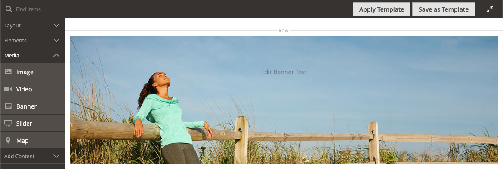
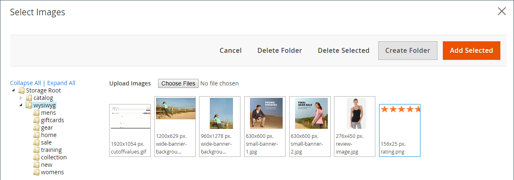

# [!DNL Page Builder] Tutorial, parte 1: página simple

Siga este ejercicio en tres partes para familiarizarse con la [!DNL Page Builder] espacio de trabajo mediante la creación de una página sencilla que ilustra lo fácil que es crear páginas con contenido enriquecido de su propio diseño.

{width="700" zoomable="yes"}

>[!NOTE]
>
>Estos ejercicios de introducción se actualizan para reflejar los cambios recientes en la [!DNL Page Builder] workspace en la versión 2.4.1. Si utiliza una versión anterior de Adobe Commerce, utilice el [!DNL Page Builder] ejercicios de introducción incluidos en la [[!DNL Commerce] Guía del usuario de 2.3](https://docs.magento.com/user-guide/v2.3/cms/page-builder-learn.html).

## Antes de empezar

Antes de comenzar este ejercicio, se recomienda aumentar el [Duración de sesión de administrador](../systems/security-admin.md) para evitar que se agote el tiempo de espera de la sesión mientras trabaja.

Compruebe las opciones de configuración de Content Management necesarias:

- El editor WYSIWYG está habilitado en [Opciones WYSIWYG](../content-design/editor.md#configure-the-editor) configuración.

- [!DNL Page Builder] está habilitado en la [Herramientas de contenido avanzadas](setup.md) configuración.

### Descargar los recursos de imagen del tutorial

1. Descargue la [`simple-page-assets`](./assets/simple-page-assets.zip) y guarde el archivo en el sistema local.

1. Vaya al archivo descargado y extraiga los archivos comprimidos.

   En un sistema Windows, haga clic con el botón derecho y seleccione **[!UICONTROL Extract All]** archivos. A continuación, elija la carpeta de destino y haga clic en **[!UICONTROL Extract]**.

   En un sistema Mac, simplemente puede hacer doble clic en el archivo zip y luego mover los archivos extraídos a la carpeta de destino.

   La carpeta contiene los siguientes archivos de imagen:

   ![[!DNL Page Builder] archivos de tutorial: recursos de página simples](./assets/pb-tutorial-simple-page-assets.png){width="500"}

Siga las tres partes de este tutorial en orden.

## Parte 1: Fila de sangrado completo con titular

En esta parte del ejercicio Página simple, se crea una página que tiene una fila y un banner a sangre completa. La fila tiene diferentes imágenes de fondo para escritorio y dispositivos móviles.

![[!DNL Page Builder] fila a sangre completa con banner](./assets/pb-tutorial1-full-bleed-with-banner.png){width="700" zoomable="yes"}

### Paso 1: Crear una página

1. En el _Administrador_ barra lateral, vaya a **[!UICONTROL Content]** > _[!UICONTROL Elements]_>**[!UICONTROL Pages]**.

1. En la esquina superior derecha, haga clic en **[!UICONTROL Add New Page]** y haga lo siguiente:

   - Para evitar que esta página se publique en su tienda, establezca **[!UICONTROL Enable Page]** hasta `No`.

   - Para **[!UICONTROL Page Title]**, introduzca `Simple Page`.

   {width="600" zoomable="yes"}

1. Expandir  el **[!UICONTROL Design]** sección.

   Observe que **[!UICONTROL Layout]** se establece en `Page -- Full Width` de forma predeterminada. Además de las cinco normas [layout](../content-design/page-layout.md) opciones, [!DNL Page Builder] agrega diseños de ancho completo para páginas, categorías y productos.

1. Si los datos de ejemplo están disponibles, establezca **[!UICONTROL New Theme]** hasta `Magento Luma`. De lo contrario, puede elegir otra temática disponible o dejarla en blanco para utilizar la predeterminada.

   El _[!UICONTROL New Theme]_Esta configuración se puede utilizar para anular la temática predeterminada y aplicar una temática diferente a la página.

   >[!NOTE]
   >
   >El diseño Anchura completa solo se puede utilizar con un [tema](../content-design/themes.md).

   {width="600" zoomable="yes"}

1. En la esquina superior derecha, haga clic en **[!UICONTROL Save]**.

   Cuando se guarde la página, el nombre _Página simple_ aparece en la esquina superior izquierda de la página.

### Paso 2: Dar formato a la fila

1. Expandir  el **[!UICONTROL Content]** sección.

   Esta acción muestra la variable [!DNL Page Builder] vista previa con una fila vacía.

   >[!NOTE]
   >
   >El [Encabezado de contenido](workspace.md) es opcional. De forma predeterminada, se le aplica el formato de nivel de encabezado 1 (H1) según la temática. Para este ejercicio, la variable _Encabezado de contenido_ se deja en blanco.

   {width="600" zoomable="yes"}

1. Clic **[!UICONTROL Edit with Page Builder]** o dentro del área de previsualización de contenido.

   En el ampliado [!DNL Page Builder] [workspace](workspace.md), el panel de la izquierda proporciona las herramientas de contenido que puede utilizar para crear su contenido en el escenario.

1. Pase el ratón sobre la fila vacía para mostrar el cuadro de herramientas.

   Cada contenedor de contenido tiene una caja de herramientas con un conjunto similar de opciones.

   ![[!DNL Page Builder] cuadro de herramientas fila](./assets/pb-layout-page-add-content-row-tools.png){width="600" zoomable="yes"}

1. En el cuadro de herramientas Fila, elija _Configuración_ ({width="20"} icono.

1. En _[!UICONTROL Appearance]_, elija **Sangrado completo**.

   La configuración de apariencia de sangrado completo extiende los bordes izquierdo y derecho del área de contenido de la fila y el fondo al ancho completo de la página.

   {width="600" zoomable="yes"}

1. Desplácese hacia abajo hasta el _[!UICONTROL Advanced]_y establecer todo **[!UICONTROL Margins and Padding]**configuración para `0`.

   Esta configuración garantiza que el banner amplíe el ancho completo de la fila.

   {width="600" zoomable="yes"}

1. Para guardar la configuración y volver a [!DNL Page Builder] Workspace, desplácese hasta la parte superior de la página y haga clic en **[!UICONTROL Save]** en la esquina superior derecha.

### Paso 3: Añadir un titular

>[!NOTE]
>
>[!DNL Page Builder] tiene un nuevo tipo de contenido llamado _Titular_, que se muestra en este paso. ¿Qué era antes el _Titular_ en el menú Contenido, ahora es una _Bloque dinámico_.

1. En el [!DNL Page Builder] panel, expandir **[!UICONTROL Media]** y arrastre un **Titular** marcador de posición al escenario.

   {width="600" zoomable="yes"}
1. Pase el ratón sobre el contenedor del titular para mostrar el cuadro de herramientas.

   >[!NOTE]
   >
   >El escenario ahora tiene dos contenedores de contenido, cada uno con una caja de herramientas independiente. Como el banner está anidado dentro de la fila, asegúrese de que está trabajando en el cuadro de herramientas correcto.

   Además de la caja de herramientas, la variable _Cargar imagen_ y _Seleccionar de la galería_ se incluyen botones para que pueda realizar cambios rápidos en el titular directamente desde el escenario.

   {width="600" zoomable="yes"}

1. En el cuadro Banner, seleccione la opción _Configuración_ ( {width="20"} ) icono.

1. En _[!UICONTROL Appearance]_, elija **[!UICONTROL Collage Right]**.

   La configuración Collage Right coloca el contenido en el lado derecho del banner.

   {width="600" zoomable="yes"}

1. Desplácese hacia abajo hasta el _[!UICONTROL Background]_y establezca la imagen de fondo del titular:

   - Para **[!UICONTROL Background Image]**, haga clic en **Cargar**.

     {width="600" zoomable="yes"}

     Vaya al directorio en el que guardó los recursos de página simples extraídos y elija el `wide-banner-background.jpg` archivo.

     La imagen se cargará y aparecerá una miniatura de la imagen cargada. A continuación se indica el nombre del archivo, las dimensiones de la imagen y el tamaño del archivo.

     {width="600" zoomable="yes"}

   - Para **[!UICONTROL Background Mobile Image]**, haga clic en **Cargar**.

     En el mismo directorio de archivos, seleccione `wide-banner-background-mobile.jpg` archivo.

     La imagen de fondo móvil se utiliza para dispositivos móviles y también siempre que se cambia el tamaño de una ventana del explorador de escritorio a la anchura de un dispositivo móvil.

     {width="600" zoomable="yes"}

   - Vuelva a la parte superior de la página y haga clic en **[!UICONTROL Save]** para guardar la configuración y volver a [!DNL Page Builder] workspace.

     El fondo aparece en el escenario y extiende el ancho completo de la fila.

     {width="600" zoomable="yes"}

   Observe el texto de marcador de posición que aparece en el lado derecho de la fila. La posición de este texto refleja el _Collage derecho_ configuración de apariencia.

1. Haga clic en el texto del marcador de posición e introduzca el siguiente mensaje como dos líneas:

   `Get fit and look fab in new seasonal styles.`

   `New LUMA yoga collection`

   La barra de herramientas del editor aparece encima del cuadro de texto. El texto se puede introducir y formatear directamente desde el escenario o eligiendo _Configuración_ en el cuadro de herramientas del titular.

   {width="600" zoomable="yes"}

1. Aplicar formato al texto:

   - Seleccione la primera línea de texto. A continuación, en la barra de herramientas del editor, en **Formatos**, elija `Heading 2`.

     {width="600" zoomable="yes"}

   - Seleccione la segunda línea de texto. A continuación, en la barra de herramientas del editor, en **Formatos**, elija `Paragraph`.

   La configuración de formato aplica los estilos de la hoja de estilos asociada al tema actual.

   {width="600" zoomable="yes"}
__

1. Pase el ratón por encima para mostrar el cuadro de herramientas Banner y seleccione _Configuración_ ( {width="20"} ) y, a continuación, desplácese hasta el _[!UICONTROL Content]_sección.

   Observe que el texto se muestra en la _Texto del mensaje_ cuadro. El texto se puede introducir y editar desde el escenario o desde el _[!UICONTROL Content]_de la configuración del banner.

   {width="600" zoomable="yes"}

1. Continuación en la _[!UICONTROL Content]_, establezca el vínculo del titular y el botón:

   - Establecer **Vínculo** hasta `Category`y haga clic en **[!UICONTROL Select]** para mostrar el árbol de categorías.

   - Elegir `What's New` como la categoría vinculada.

     {width="600" zoomable="yes"}

   - Establecer **[!UICONTROL Show Button]** hasta `Always`.

   - Para **[!UICONTROL Button Text]**, introduzca `Shop Now` como el texto que aparece en el botón.

   - Para **[!UICONTROL Button Type]**, acepte el `Primary` predeterminada.

     El estilo de botón del tema actual determina el formato del botón.

1. Establezca la superposición del banner:

   Puede utilizar una superposición para aplicar un color de fondo al área de contenido activo definida por la configuración Aspecto. La imagen de fondo del titular permanece visible durante todo el ancho del titular.

   - Establecer **[!UICONTROL Show Overlay]** hasta `Always`.

   - Para **[!UICONTROL Overlay Color]**, realice una de las siguientes acciones:

      - Haga clic en el cuadrado de color y seleccione la muestra blanca.
      - Haga clic en en _Sin color_ cuadro de texto y escriba `White` o el valor hexadecimal `#ffffff`.

     A continuación, haga clic en **[!UICONTROL Apply]**.

     {width="600" zoomable="yes"}

   - Vuelva a la parte superior de la página y haga clic en **[!UICONTROL Save]** para guardar la configuración y volver a [!DNL Page Builder] workspace.

     El botón aparece debajo del mensaje del titular en el escenario.

     {width="600" zoomable="yes"}

1. En la esquina superior derecha del escenario, haga clic en _Cerrar pantalla completa_ () icono.

   Al hacer clic en este icono, volverá a la _[!UICONTROL Content]_de la página con la vista previa.

   Puede alternar entre los dos modos de espacio de trabajo en cualquier momento que desee.

1. En la esquina superior derecha, haga clic **[!UICONTROL Save]** flecha y elija **[!UICONTROL Save & Close]**.

1. Si se le solicita, haga clic en [Administración de caché](../systems/cache-management.md) en el mensaje en la parte superior de la página y actualice cualquier caché no válida.

## Parte 2: Fila contenida con dos columnas iguales

En esta parte del ejercicio, agregue una fila a la página y divida la fila en dos columnas iguales. A continuación, agregue una imagen vinculada a cada columna. En las instrucciones, cada nueva fila se agrega antes de la primera fila para realizar el [!DNL Page Builder] panel alineado con el escenario. Al final del ejercicio, reorganice las filas para que coincidan con el ejemplo Página simple.

{width="600" zoomable="yes"}

### Paso 1: Añadir una fila

1. En la cuadrícula Páginas, busque _Página simple_ que creó en la primera parte de este ejercicio y seleccione **[!UICONTROL Edit]** en el _[!UICONTROL Action]_columna.

1. Expandir  el **[!UICONTROL Content]** sección.

1. Clic **[!UICONTROL Edit with Page Builder]** o dentro del área de previsualización de contenido.

1. En el [!DNL Page Builder] panel debajo de _[!UICONTROL Layout]_, arrastre un **[!UICONTROL Row]**coloque el marcador de posición en el escenario y colóquelo encima del titular.

   La directriz roja marca el límite entre las dos filas.

   {width="600" zoomable="yes"}

1. Pase el ratón sobre la nueva fila para mostrar el cuadro de herramientas y elija _Configuración_ ( {width="20"} ) icono.

   {width="600" zoomable="yes"}

1. En _[!UICONTROL Appearance]_, acepte el **Contenido**configuración predeterminada.

   Esta configuración limita el área de contenido de la fila al ancho de la página según se define en la temática.

   {width="600" zoomable="yes"}

1. En la esquina superior derecha, haga clic en **[!UICONTROL Save]** para guardar la configuración y volver a [!DNL Page Builder] workspace.

### Paso 2: Añadir una columna

1. En el [!DNL Page Builder] panel debajo de _[!UICONTROL Layout]_, arrastre un **[!UICONTROL Column]**marcador de posición a la nueva fila.

   {width="600" zoomable="yes"}

   La fila ahora se divide en dos columnas de igual ancho. Cada columna es un contenedor independiente para el contenido con su propia caja de herramientas de opciones dedicada.

   {width="600" zoomable="yes"}

1. En la esquina superior izquierda de la primera columna, haga clic en la circular _Cuadrícula_ control () para mostrar las directrices de cuadrícula.

   La cuadrícula garantiza que el contenido se alinee de forma coherente y que se represente correctamente tanto en equipos de escritorio como en dispositivos móviles. Para obtener información sobre cómo configurar el tamaño de la cuadrícula, consulte la [Configurar [!DNL Page Builder]](setup.md#configure-page-builder) de la sección [!DNL Page Builder] Tema de configuración.

   Los números entre paréntesis (6/12) en el borde superior de cada contenedor de columnas indican el número de divisiones de cuadrícula en cada columna y el número total de divisiones en la fila.

   {width="600" zoomable="yes"}

### Paso 3: Añadir imágenes con vínculos

En este paso, aprenderá a cargar una imagen en el titular.

1. En el [!DNL Page Builder] , expanda el **[!UICONTROL Media]** y arrastre una **[!UICONTROL Image]** a la primera columna.

   {width="600" zoomable="yes"}

1. Inserte la imagen de muestra en el marcador de posición.

   {width="600" zoomable="yes"}

   Para una imagen ubicada en el sistema, puede elegir cualquiera de estos métodos:

   - **Cargar el archivo de imagen**: en la primera columna, haga clic en **[!UICONTROL Upload Image]**. A continuación, vaya al directorio en el que guardó los recursos de página simples extraídos y elija la `small-banner-1.jpg` archivo.

     {width="600" zoomable="yes"}

     Repita esta acción para agregar el `small-banner-2.jpg` a la segunda columna.

   - **Arrastre el archivo de imagen**: En el escritorio, abra la carpeta de recursos de la página simple y colóquela junto a la ventana del explorador de administración donde está trabajando con la [!DNL Page Builder] escenario. A continuación, arrastre el archivo `small-banner-1.jpg` en la carpeta recursos de la página simple y suéltela en la primera columna.

     {width="600" zoomable="yes"}

     Repita esta acción para agregar el `small-banner-2.jpg` a la segunda columna.

1. Determine qué página del catálogo desea vincular a cada imagen.

1. Pase el ratón sobre la imagen de la primera columna para ver el cuadro de herramientas y seleccione _Configuración_ ( {width="20"} ) icono.

   {width="600" zoomable="yes"}

1. Vincule la imagen a una categoría:

   - Desplazarse hacia abajo y establecer **Vínculo** hasta `Category`.

   - En el árbol de categorías, aumente el detalle y elija `Men's Hoodies & Sweatshirt` categoría.

   - En la esquina superior derecha, **[!UICONTROL Save]** Seleccione la configuración y vuelva a la [!DNL Page Builder] workspace.

1. Repita el paso anterior para vincular la imagen de la segunda columna al _Engranaje_ categoría.

1. En la esquina superior derecha del escenario, haga clic en _Cerrar pantalla completa_ () icono.

   Al hacer clic en este icono, volverá a la _[!UICONTROL Content]_de la página con la vista previa.

1. En la esquina superior derecha, haga clic **[!UICONTROL Save]** flecha y elija **[!UICONTROL Save & Close]**.

1. Cuando se le solicite, haga clic en [Administración de caché](../systems/cache-management.md) en el mensaje en la parte superior de la página y actualice cualquier caché no válida.

## Parte 3: Fila de ancho completo con columnas desiguales

La última fila de esta página incluye contenido de una revisión de producto. Se agrega una fila de ancho completo y se divide en dos columnas de anchos diferentes. Se agrega una imagen de fondo a la primera columna, con un color de fondo coincidente que se aplica a la fila para obtener un efecto unificado.

{width="500"}

### Paso 1: Añadir una fila

1. En la cuadrícula Páginas, busque _Página simple_ que creó en la primera parte de este ejercicio y seleccione **[!UICONTROL Edit]** en el _[!UICONTROL Action]_columna.

1. Expandir  el **[!UICONTROL Content]** sección.

1. Clic **[!UICONTROL Edit with Page Builder]** o dentro del área de previsualización de contenido.

1. En el [!DNL Page Builder] panel debajo de _[!UICONTROL Layout]_, arrastre un **[!UICONTROL Row]**coloque el marcador de posición en el escenario y colóquelo sobre la fila que se creó en la segunda parte de este ejercicio.

   Una directriz roja marca el límite entre las dos filas.

   {width="600" zoomable="yes"}

1. Pase el ratón sobre la nueva fila para mostrar el cuadro de herramientas y elija _Configuración_ ({width="20"} ) icono.

   {width="600" zoomable="yes"}

1. En la página Editar fila, en _[!UICONTROL Appearance]_, elija **[!UICONTROL Full Width]**.

   Esta configuración limita el área de contenido al ancho de página máximo definido por la temática. El color de fondo o la imagen no están limitados y amplían el ancho completo de la fila.

   {width="600" zoomable="yes"}

1. En el _[!UICONTROL Background]_, introduzca `#f1f1f1` como el **[!UICONTROL Background Color]**.

   {width="600" zoomable="yes"}

1. Desplácese hacia abajo hasta el _[!UICONTROL Advanced]_y establecer todo **Márgenes y relleno**valores para `0`.

   {width="600" zoomable="yes"}

1. Vuelva a la parte superior de la página y haga clic en **[!UICONTROL Save]** para guardar la configuración y volver a [!DNL Page Builder] workspace.

   El color de fondo de la fila ahora es beige pálido.

   {width="600" zoomable="yes"}

### Paso 2: Añadir columnas de diferentes anchos

1. En el [!DNL Page Builder] panel debajo de _[!UICONTROL Layout]_, arrastre un **[!UICONTROL Column]**marcador de posición a la fila superior del escenario.

   {width="600" zoomable="yes"}

1. Arrastre el borde derecho de la primera columna a las cuatro de 12 (`4/12`) en la cuadrícula.

   El tamaño de la segunda columna se ajusta a ocho de doce (`8/12`).

   {width="600" zoomable="yes"}

1. Pase el ratón sobre el primer contenedor de columnas para mostrar el cuadro de herramientas y seleccione la opción _Configuración_ ( {width="20"} ) icono.

1. Desplácese hacia abajo hasta el _[!UICONTROL Advanced]_y establecer todo **Márgenes y relleno**valores para `0`.

   {width="600" zoomable="yes"}

1. Vuelva a la parte superior de la página y haga clic en **[!UICONTROL Save]** para guardar la configuración y volver a [!DNL Page Builder] workspace.

### Paso 3: Agregar una imagen a la primera columna

1. En el [!DNL Page Builder] panel, expandir **[!UICONTROL Media]** y arrastre un **[!UICONTROL Image]** Tipo de contenido en la primera columna.

   {width="600" zoomable="yes"}

1. En el marcador de posición de imagen, haga clic en **[!UICONTROL Upload Image]**.

   {width="600" zoomable="yes"}

1. Vaya al directorio en el que guardó los recursos de página simples extraídos y elija el `review-image.jpg` archivo.

   La imagen cargada aparece en la primera columna y se funde perfectamente con el color de fondo de la fila.

   {width="600" zoomable="yes"}

### Paso 4: Añadir el contenido de revisión a la segunda columna

La segunda columna de la fila debe contener contenido de una revisión del cliente, incluida la imagen de clasificación de cinco estrellas y el mensaje de texto con formato.

1. En el [!DNL Page Builder] , expanda el **[!UICONTROL Elements]** y arrastre la sección **[!UICONTROL Text]** Tipo de contenido de la segunda columna.

   {width="600" zoomable="yes"}

1. Haga clic en el elemento de texto para mostrar la barra de herramientas del editor.

1. En la barra de herramientas, haga clic en _Insertar imagen_ () y haga lo siguiente:

   {width="600" zoomable="yes"}

   - En el _[!UICONTROL Insert/edit image]_, haga clic en_ Buscar _(  ) junto al icono de_[!UICONTROL Source]_ field.

     {width="600" zoomable="yes"}

   - En el _[!UICONTROL Select Images]_página, haga clic en **[!UICONTROL Choose Files]**.

   - En la carpeta donde guardó los recursos de la página simple, elija `rating.png`.

   - Cuando vuelva a la página, haga doble clic en el mosaico de la imagen para seleccionarlo e insertar su URL en el campo Origen.

     {width="600" zoomable="yes"}

   - Para **[!UICONTROL Image Description]**, introduzca `5-Star Rating` y haga clic en **[!UICONTROL OK]** para insertar la imagen en la columna.

   - En la barra de herramientas del editor, haga clic en **Alinear al centro** () para centrar la imagen en la columna.

     {width="600" zoomable="yes"}

1. Coloque el punto de inserción justo después de la imagen de cinco estrellas, presione la tecla Intro/Retorno para comenzar una nueva línea e introduzca el siguiente texto:

   `Awesome Tank!`

   `I'm a long distance runner and it keeps me pretty comfortable, although these companies always act like their shirts are magical and really it's just pretty basic stuff. Still it's a great shirt, and I would recommend it.`

   `Antonia Racer Tank – Reviewed by Allyson`

   El texto se centra a medida que escribe.

   {width="600" zoomable="yes"}

1. Dar formato al texto:

   - Haga clic en cualquier lugar de la primera línea de texto y en la barra de herramientas del editor debajo de **Formatos**, elija `Heading 2`.

   - Seleccione el texto restante y, en la barra de herramientas del editor, en **Formatos**, elija `Paragraph`.

   El texto recibe el formato de acuerdo con la hoja de estilos asociada al tema.

1. Obtenga las dimensiones de la imagen para que pueda centrar el contenido verticalmente en la columna:

   - Pase el ratón sobre la imagen de la primera columna para ver el cuadro de herramientas y seleccione _Configuración_ ({width="20"} ) icono.

   - Debajo de la miniatura de la imagen, tome nota de las dimensiones de la imagen.

     {width="600" zoomable="yes"}

   - En la esquina superior derecha, haga clic en **Cerrar**.

1. Centre el contenido verticalmente en la segunda columna:

   - Pase el ratón sobre la segunda columna para mostrar el cuadro de herramientas y elegir la _Configuración_ ({width="20"} ) icono.

   >[!NOTE]
   >
   >Asegúrese de seleccionar el contenedor de columnas en lugar del contenedor de texto para mostrar el cuadro de herramientas correcto.

   - Para **[!UICONTROL Minimum Height]**, introduzca `450` como la altura en píxeles de la imagen de la primera columna.

   - Establecer **[!UICONTROL Vertical Alignment]** hasta `Center`.

   {width="600" zoomable="yes"}

1. Desplácese hacia abajo hasta el _[!UICONTROL Advanced]_y establecer todo **[!UICONTROL Margins and Padding]**valores a cero ( `0` ).

   {width="600" zoomable="yes"}

1. Vuelva a la parte superior de la página y, en la esquina superior derecha, haga clic en **[!UICONTROL Save]** para guardar la configuración y volver a [!DNL Page Builder] workspace.

   {width="600" zoomable="yes"}

### Paso 5: Insertar un vínculo de producto del catálogo

1. Seleccione el `Antonia Racer Tank` y haga clic en el botón _Insertar vínculo_ () en la barra de herramientas del editor.

1. En el _Insertar vínculo_ , especifique el vínculo al producto del catálogo:

   - Introduzca el producto **[!UICONTROL URL]**.

     Puede introducir una dirección URL relativa o completa. Para este ejemplo, se introduce el siguiente vínculo relativo:

     `../antonia-racer-tank.html`

   - (Opcional) Para **Título**, introduzca el nombre del producto.

     Algunos exploradores utilizan el atributo de vínculo Título como información sobre herramientas.

     {width="600" zoomable="yes"}

   - Cuando termine, haga clic en **[!UICONTROL OK]** para guardar el vínculo.

     El texto vinculado ahora se resalta en el titular.

     {width="600" zoomable="yes"}

1. En la esquina superior derecha del escenario, haga clic en _Cerrar pantalla completa_ () icono.

   Al hacer clic en este icono, volverá a la _[!UICONTROL Content]_de la página con la vista previa.

1. En la esquina superior derecha, haga clic en **[!UICONTROL Save]**.

### Paso 6: Reorganizar las filas

Una vez completadas las tres filas, el paso final es reorganizar las filas para que coincidan con el original _Página simple_ ejemplo. Para que coincida con el ejemplo original, la primera fila debe moverse hacia abajo y la última fila debe moverse hacia arriba.

1. Si es necesario, expanda  el **[!UICONTROL Content]** sección.

1. Clic **[!UICONTROL Edit with Page Builder]** o dentro del área de previsualización de contenido.

1. Pase el ratón sobre la primera fila del escenario para mostrar el cuadro de herramientas y elegir la _Mover_ ( ) icono.

   {width="600" zoomable="yes"}

1. Mantenga pulsado el botón del ratón mientras verifica que todo el contenido de la fila está seleccionado y arrastre la fila a su posición debajo de la guía roja en la parte inferior de la página.

   >[!NOTE]
   >
   >Si accidentalmente mueve solo parte del contenido, como la imagen, simplemente mueva el contenido hacia atrás a donde pertenece e inténtelo de nuevo.

   {width="600" zoomable="yes"}

1. Repita este proceso para mover la primera fila a la segunda posición.

   El orden de las filas de la página ahora coincide con el ejemplo de página simple.

1. En la esquina superior derecha del escenario, haga clic en _Cerrar pantalla completa_ () icono.

   Al hacer clic en este icono, volverá a la _[!UICONTROL Content]_de la página con la vista previa.

1. En la esquina superior derecha, haga clic **[!UICONTROL Save]** flecha y elija **[!UICONTROL Save & Close]**.

1. Si se le solicita, haga clic en [Administración de caché](../systems/cache-management.md) en el mensaje en la parte superior de la página y actualice cualquier caché no válida.

Ha completado el ejercicio Página simple. Conserve el trabajo que ha creado para poder consultarlo más adelante.

Cuando esté listo, proceda a [Parte 2: Bloques](2-blocks.md).
