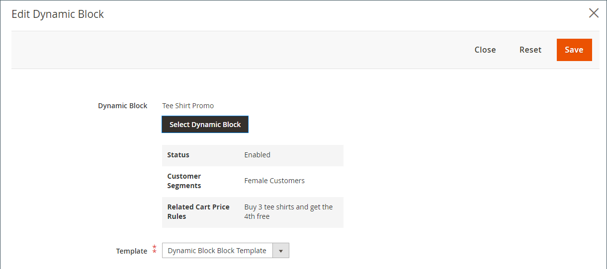
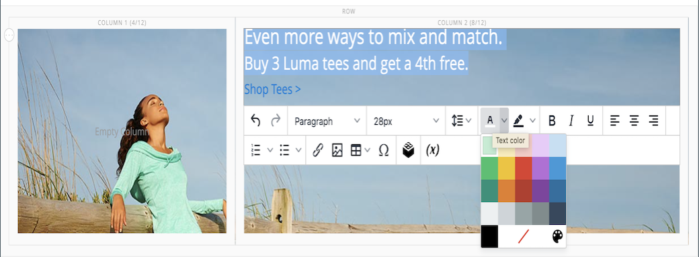

# [!DNL Page Builder] Tutorial, parte 2: bloques

El siguiente ejercicio ilustra la diferencia entre [bloques simples](../content-design/blocks.md) y [bloques dinámicos](dynamic-block.md), y cómo usar [!DNL Page Builder] para crear cada tipo de bloque.

>[!NOTE]
>
>[!DNL Page Builder] tiene un nuevo tipo de contenido llamado _Titular_, que aparece en el primer ejercicio de tutorial y no está relacionado con la funcionalidad de banner anterior. ¿Qué era anteriormente la opción Banner en? [Menú Contenido](../content-design/content-menu.md), es ahora _Bloque dinámico_.

{width="700" zoomable="yes"}

Este ejercicio supone que ha completado [Parte 1: Página simple](1-simple-page.md), incluidos los requisitos previos y [archivos de ejemplo descargados](./assets/simple-page-assets.zip). Siga las partes de este ejercicio de introducción en orden.

>[!NOTE]
>
>Estos ejercicios de introducción se actualizan para reflejar los cambios recientes en la [!DNL Page Builder] workspace en la versión 2.4.1. Si utiliza una versión anterior de Adobe Commerce, utilice el [!DNL Page Builder] ejercicios incluidos en la [[!DNL Commerce] Guía del usuario de 2.3](https://docs.magento.com/user-guide/v2.3/cms/page-builder-learn.html).

## Parte 1: Crear un bloque simple

En este ejercicio de tutorial, creará un bloque simple con contenido de [!DNL Google Maps]. A veces se llama a bloques simples _Bloques de CMS_ o _bloques estáticos_, porque el contenido no cambia. Un bloque simple es ideal para contenido que quizá desee reutilizar.

### Paso 1: Crear un bloque

1. En el _Administrador_ barra lateral, vaya a **[!UICONTROL Content]** > _[!UICONTROL Elements]_>**[!UICONTROL Blocks]**.

1. En la esquina superior derecha, haga clic en **[!UICONTROL Add New Block]**.

1. Para **[!UICONTROL Block Title]**, introduzca `Google Map`.

1. Para **[!UICONTROL Identifier]**, introduzca `google-map`.

1. Elija la **[!UICONTROL Store View]** donde el bloque va a estar disponible.

   {width="600" zoomable="yes"}

1. En la esquina superior derecha, haga clic en **[!UICONTROL Save]**.

### Paso 2: Añadir un [!DNL Google Map]

1. Desplácese hacia abajo hasta el [!DNL Page Builder] previsualización de contenido (actualmente vacío) y haga clic en **[!UICONTROL Edit with Page Builder]**.

1. En el [!DNL Page Builder] panel, expandir **[!UICONTROL Media]** y arrastre un **[!UICONTROL Map]** marcador de posición al escenario.

   {width="600" zoomable="yes"}

   Aparecerá un mapa con la ubicación de la tienda si [!DNL Google Maps] está configurado para su tienda.

   {width="600" zoomable="yes"}

   Aparecerá un mapa de marcador de posición si [!DNL Google Maps] aún no está configurado para su tienda.

   ![[!DNL Google Maps] placeholder](./assets/pb-tutorial2-media-map-not-configured.png){width="600" zoomable="yes"}

1. En la esquina superior derecha del escenario, haga clic en _Cerrar pantalla completa_ () icono.

   Al hacer clic en este icono, volverá a la _[!UICONTROL Content]_para el bloque con la vista previa mostrada.

1. En la esquina superior derecha, haga clic **[!UICONTROL Save]** flecha y elija **[!UICONTROL Save & Close]**.

### Paso 3: Configuración [!DNL Google Maps]

If [!DNL Google Maps] ya está configurado para su tienda, puede omitir este paso y continuar con el siguiente.

1. Vaya a la [Consola de Google Cloud Platform](https://console.cloud.google.com/google/maps-apis/overview).

1. Haga clic en el menú desplegable del proyecto y seleccione o cree el proyecto para el que desea agregar una clave de API.

1. Para configurar las credenciales de la API, siga los [instrucciones][1] en el [!DNL Google Maps] documentación.

1. Copie la clave API en el portapapeles.

1. Vuelva a la [!DNL Commerce] Administrador y vaya a **[!UICONTROL Stores]** > _[!UICONTROL Settings]_>**[!UICONTROL Configuration]**.

1. En el panel izquierdo, debajo de _[!UICONTROL General]_, elija **[!UICONTROL Content Management]**.

1. Expandir  **[!UICONTROL Advanced Content Tools]**.

   {width="600" zoomable="yes"}

   Para obtener más información sobre [!UICONTROL Content Management Advanced Tools] opciones de configuración, consulte las [_Guía de referencia de configuración_](../configuration-reference/general/content-management.md).

1. Para **[!UICONTROL Google Maps API Key]**, pegue la clave copiada.

1. Haga clic **[!UICONTROL Test Key]**.

   Si hay algún problema con la clave, vuelva al [!DNL Google Maps] Sitio de Platform para resolver el problema. A continuación, inténtelo de nuevo.

1. Tras comprobar la clave, haga clic en **[!UICONTROL Save Config]**.

### Paso 4: Añadir el bloque a una página

1. En el _Administrador_ barra lateral, vaya a **[!UICONTROL Content]** > _[!UICONTROL Elements]_>**[!UICONTROL Pages]**.

1. En la cuadrícula, busque _[!UICONTROL Simple Page]_que creó en el primer tutorial y seleccione **[!UICONTROL Edit]**en el_[!UICONTROL Action]_ columna.

1. Expandir  el **[!UICONTROL Content]** y haga clic en **[!UICONTROL Edit with Page Builder]** o dentro del área de previsualización de contenido.

1. En el [!DNL Page Builder] panel debajo de _[!UICONTROL Layout]_, arrastre un **[!UICONTROL Row]**marcador de posición al principio del escenario.

   {width="600" zoomable="yes"}

1. En el [!DNL Page Builder] panel, expandir **[!UICONTROL Add Content]** y arrastre un **[!UICONTROL Block]** marcador de posición a la nueva fila.

1. Pase el ratón sobre el contenedor de bloques vacío para mostrar el cuadro de herramientas y elegir la _Configuración_ ({width="20"} ) icono.

   {width="600" zoomable="yes"}

1. En la página Editar bloque, haga clic en **[!UICONTROL Select Block]**.

   {width="600" zoomable="yes"}

1. En el cuadro de búsqueda, escriba `map` y pulse la tecla Intro/Retorno para buscar el bloque que ha creado.

   {width="600" zoomable="yes"}

1. En la cuadrícula, haga clic en **[!UICONTROL Select]** para elegir el [!DNL Google Maps] Bloque.

1. En la esquina superior derecha, haga clic en **[!UICONTROL Save]** para guardar la configuración y volver a [!DNL Page Builder] workspace.

1. En la esquina superior derecha del escenario, haga clic en _Cerrar pantalla completa_ () icono.

   Al hacer clic en este icono, volverá a la _[!UICONTROL Content]_de la página con la vista previa.

1. En la esquina superior derecha, haga clic **[!UICONTROL Save]** flecha y elija **[!UICONTROL Save & Close]**.

**¡Felicidades!** Ha completado la primera parte del ejercicio Bloquear. Asegúrese de mantener su trabajo como referencia.

## Parte 2: Crear un bloque dinámico

Un bloque dinámico incluye una lógica que determina dónde, cuándo y a quién aparece. En este ejercicio de tutorial, se crea un bloque dinámico para una promoción que se activa cuando se cumplen las condiciones de la regla de precios y que solo aparece en un segmento de cliente específico. El resultado de este ejemplo es similar al titular que se creó en el primer ejercicio, pero con lógica que controla cuándo aparece en la tienda.

{width="600" zoomable="yes"}

### Paso 1: Crear un nuevo bloque dinámico

1. En el _Administrador_ barra lateral, vaya a **[!UICONTROL Content]** > _[!UICONTROL Elements]_>**[!UICONTROL Dynamic Blocks]**.

   {width="700" zoomable="yes"}

1. En la esquina superior derecha, haga clic en **[!UICONTROL Add Dynamic Block]**.

   {width="600" zoomable="yes"}

1. Complete la configuración básica del nuevo bloque dinámico:

   - Establecer **[!UICONTROL Enable Dynamic Block]** hasta `Yes`.

   - Para **[!UICONTROL Dynamic Block Name]**, introduzca `Tee Shirt Promo`.

   - Establecer **[!UICONTROL Dynamic Block Type]** hasta `Content Area` y haga clic en **[!UICONTROL Done]**.

     El Tipo de bloque dinámico determina en qué parte de la variable [diseño de página](../content-design/page-layout.md) que el bloque está colocado. Al configurar un bloque dinámico para su tienda, tenga en cuenta tanto el diseño de página como la variable [tema](../content-design/themes.md), para que pueda aprovechar bien el espacio disponible. Algunas tiendas tienen un área de contenido activo limitada a una anchura fija, mientras que otras amplían la anchura completa de la pantalla.

     {width="600" zoomable="yes"}

   - Para **[!UICONTROL Customer Segment]**, seleccione la casilla de verificación de cada segmento que desee aplicar al bloque dinámico y haga clic en **Listo** para guardar la lista de segmentos.

     En el ejemplo siguiente, hay dos [segmentos del cliente](../customers/customer-segments.md) que identifican a los clientes registrados por sexo. Este bloque dinámico solo aparece para las clientas mujeres registradas que han iniciado sesión en sus cuentas mientras compran en su tienda.

     {width="600" zoomable="yes"}

### Paso 2: Completar la configuración

Desplácese hacia abajo hasta el _[!UICONTROL Content]_, que muestra una sección vacía [!DNL Page Builder] y haga clic en **[!UICONTROL Edit with Page Builder]**. A continuación, complete las siguientes tareas:

**Tarea 1:** Agregar una imagen de fondo

1. Pase el ratón sobre el contenedor de filas para mostrar el cuadro de herramientas y elegir _Configuración_ ({width="20"} ) icono.

1. En _[!UICONTROL Appearance]_, elija **[!UICONTROL Full Bleed]**.

1. Para **[!UICONTROL Minimum Height]**, introduzca `400px`.

1. Desplácese hasta _[!UICONTROL Background]_y configure la sección **[!UICONTROL Background Image]**haciendo clic en **[!UICONTROL Select from Gallery]**y eligiendo el `wide-banner-background.png` imagen cargada en el primer tutorial.

1. En la esquina superior derecha, haga clic en **[!UICONTROL Save]** para aplicar la configuración de y volver a [!DNL Page Builder] workspace.

   {width="600" zoomable="yes"}

**Tarea 2:** Añadir columnas

En el [!DNL Page Builder] panel debajo de _[!UICONTROL Layout]_, arrastre un **[!UICONTROL Column]**en la fila.

{width="600" zoomable="yes"}

La fila ahora se divide en dos columnas de igual ancho.

**Tarea 3:** Añadir texto

1. En el [!DNL Page Builder] panel, expandir **[!UICONTROL Elements]** y arrastre un **Texto** a la segunda columna.

   {width="600" zoomable="yes"}

1. Introduzca las tres líneas de texto siguientes en el editor:

   `Even more ways to mix and match.`

   `Buy 3 Luma tees and get a 4th free.`

   `Shop Tees >`

   {width="600" zoomable="yes"}

1. Seleccione las tres líneas de texto y utilice la barra de herramientas para establecer el **Altura de línea** hasta `40px`.

   {width="600" zoomable="yes"}

1. Configure las variables **[!UICONTROL Font Size]** para cada línea, como se indica a continuación:

   | Línea | Tamaño de fuente |
   |-----| ---------- |
   | Línea 1: | `28px` |
   | Línea 2: | `24px` |
   | Línea 3: | `18px` |

   Dado que este bloque podría colocarse en cualquier lugar de la página, utilice el estilo de párrafo predeterminado en lugar de los niveles de encabezado. Además, no se preocupe de que el texto aún no se ajuste correctamente en la columna.  

   {width="600" zoomable="yes"}

**Tarea 4:** Añadir un vínculo

En el primer ejercicio, aprendió a utilizar la variable [Botón](buttons.md) tipo de contenido para crear un vínculo. Este ejemplo muestra cómo insertar un vínculo desde la barra de herramientas del editor.

1. En otra pestaña del explorador, abra la tienda y navegue hasta la página que va a ser el destino de destino del vínculo.

   Puede utilizar la dirección URL completa o una dirección URL relativa que omita la referencia al dominio de almacén.

   URL completa : `https://mystore.com/women/tops-women/tees-women.html`

   URL relativa: `../women/tops-women/tees-women.html`

1. Vuelva a la [!DNL Page Builder] pestaña y editor de texto de workspace, seleccione `Shop Tees >` texto en la tercera línea y elija **Negrita** () en la barra de herramientas del editor.

1. Con el `Shop Tees >` texto en la tercera línea aún seleccionada, elija **Insertar/editar vínculo** () en la barra de herramientas del editor.

   {width="600" zoomable="yes"}

1. Para **[!UICONTROL URL]**, introduzca el vínculo relativo que ha preparado.

1. Establecer **[!UICONTROL Target]** hasta `None`.

   Esta configuración abre la página en la misma ventana del explorador, en lugar de abrir una nueva pestaña.

1. Para **[!UICONTROL Title]**, introduzca `Shop Tees`.

   Algunos exploradores utilizan el atributo de vínculo Título como información sobre herramientas.

1. Para guardar el vínculo y volver a [!DNL Page Builder] workspace, haga clic en **[!UICONTROL OK]**.

   {width="600" zoomable="yes"}

1. En la esquina superior derecha del escenario, haga clic en _Cerrar pantalla completa_ () icono.

   Al hacer clic en este icono, volverá a la _[!UICONTROL Content]_para el bloque dinámico con la vista previa mostrada.

1. En la esquina superior derecha, haga clic en **[!UICONTROL Save]**.

### Paso 3: Añadir una regla de precio

1. Abra el _Promoción de camiseta_ bloque dinámico en modo de edición de nuevo.

1. Expandir  el **[!UICONTROL Related Promotions]** y haga clic en **[!UICONTROL Add Cart Price Rules]**.

   {width="600" zoomable="yes"}

1. En el _Agregar reglas de precio de carro relacionadas_ , seleccione la casilla de verificación del _Compra 3 camisetas y obtén la cuarta gratis_ regla de precios y clic **[!UICONTROL Add Selected]**.

   {width="600" zoomable="yes"}

   La regla de precio aparece en la _Promociones relacionadas_ sección, en _Regla de precio del carro relacionado_. Puede asociar varias reglas de precios con un bloque dinámico. Sin embargo, este ejemplo sencillo utiliza solo uno.

   {width="600" zoomable="yes"}

1. En la esquina superior derecha, haga clic en **[!UICONTROL Save]**.

### Paso 4: Añadir el bloque dinámico a una página

1. En el _Administrador_ barra lateral, vaya a **[!UICONTROL Content]** > _[!UICONTROL Elements]_>**[!UICONTROL Pages]**

1. Busque el _Página simple_ que creó en la [primer ejercicio de introducción](1-simple-page.md) y ábralo en modo de edición.

1. Expandir  el **[!UICONTROL Content]** y haga clic en **[!UICONTROL Edit with Page Builder]**.

1. Pase el ratón sobre la fila superior con la misma imagen que el bloque dinámico para mostrar el cuadro de herramientas y el _Eliminar_ ( {width="20"} ) icono.

   Para confirmar la eliminación de la fila de la página, haga clic en  **[!UICONTROL OK]** .

1. En el [!DNL Page Builder] panel debajo de _[!UICONTROL Layout]_, arrastre un nuevo **[!UICONTROL Row]**marcador de posición al principio del escenario.

1. En el [!DNL Page Builder] panel, expandir **[!UICONTROL Add Content]** y arrastre un **[!UICONTROL Dynamic Block]** marcador de posición a la nueva fila.

   {width="600" zoomable="yes"}

1. Pase el ratón sobre el contenedor de bloques dinámicos para mostrar el cuadro de herramientas y elegir el _Configuración_ ( {width="20"} ) icono.

   {width="600" zoomable="yes"}

1. En el _[!UICONTROL Edit Dynamic Block]_página, haga clic en **[!UICONTROL Select Dynamic Block]**.

   {width="600" zoomable="yes"}

1. Busque el _[!DNL Tee Shirt Promo]_bloque dinámico que ha creado y haga clic en **[!UICONTROL Select]**.

   A continuación, aparece un resumen de la información del bloque dinámico.

   {width="600" zoomable="yes"}

1. Aceptar el valor predeterminado **[!UICONTROL Template]**, `Dynamic Block Block Template`.

1. Cuando termine, haga clic en **[!UICONTROL Save]** para guardar la configuración y volver a [!DNL Page Builder] workspace.

   {width="600" zoomable="yes"}

1. En la esquina superior derecha del escenario, haga clic en _Cerrar pantalla completa_ () icono.

   Al hacer clic en este icono, volverá a la _[!UICONTROL Content]_de la página con la vista previa.

1. En la esquina superior derecha, haga clic **[!UICONTROL Save]** flecha y elija **[!UICONTROL Save & Close]**.

Ha completado la segunda parte del ejercicio Bloquear. Asegúrese de mantener su trabajo como referencia.

## Parte 3: Actualización del bloque dinámico

En esta parte final del ejercicio, puede editar un bloque dinámico mientras la página está activa en su tienda. A continuación, inicie sesión en la tienda como miembro del segmento de clientes para que aparezca el bloque.

{width="600" zoomable="yes"}

### Paso 1: Editar el bloque dinámico

1. En el _Administrador_ barra lateral, vaya a **[!UICONTROL Content]** > _[!UICONTROL Elements]_>**[!UICONTROL Dynamic Blocks]**.

1. Encuentre su _[!DNL Tee Shirt Promo]_bloque dinámico en la cuadrícula y ábralo en modo de edición.

1. Expandir  el **[!UICONTROL Content]** y haga clic en **[!UICONTROL Edit with Page Builder]**.

1. Cambie el ancho de la columna:

   - Pase el ratón sobre el borde entre las dos columnas.

   - Mantenga pulsado el botón del ratón y arrastre el borde dos divisiones hacia la izquierda.

     {width="600" zoomable="yes"}

     La primera columna tiene ahora cuatro de las 12 (4/12) divisiones de cuadrícula de ancho, y la segunda columna tiene ocho de las 12 (8/12) divisiones de ancho.

     {width="600" zoomable="yes"}

1. Cambiar el color del texto:

   - Seleccione las dos primeras líneas del texto.

   - En la barra de herramientas del editor, elija **[!UICONTROL Text Color]** y haga clic en **[!UICONTROL White]** muestra.

   {width="600" zoomable="yes"}

1. En la esquina superior derecha del escenario, haga clic en _Cerrar pantalla completa_ () icono.

   Al hacer clic en este icono, volverá a la _[!UICONTROL Content]_para el bloque dinámico con la vista previa mostrada.

1. En la esquina superior derecha, haga clic en **[!UICONTROL Save]**.

### Paso 2: Ver el bloque dinámico

Dado que este bloque dinámico solo es visible para los miembros de un segmento de cliente específico, debe iniciar sesión como cliente que sea miembro del segmento de cliente para ver la promoción. En este ejemplo, el bloque solo aparece para clientes mujeres.

1. Abra una ventana del explorador en la tienda.

1. Para ver la página de ejemplo, modifique la dirección URL en la barra de direcciones de la siguiente manera:

   mystore.com/sample-page

   Si el almacén está configurado para incluir el sufijo html, inclúyalo de la siguiente manera:

   mystore.com/sample-page.html

1. Iniciar sesión como cliente femenina:

   - En la esquina superior derecha de la página principal, haga clic en **[!UICONTROL Sign In]**.

   - Si los datos de Luma de ejemplo están instalados en el sistema, utilice las siguientes credenciales:

     **[!UICONTROL Email]** - `roni_cost@example.com`

     **[!UICONTROL Password]** -  `roni_cost3@example.com`

   - Haga clic **[!UICONTROL Sign In]**.

   - Vuelva a la página de muestra para ver el bloque dinámico que creó con la promoción de camiseta.

   {width="700" zoomable="yes"}

Ha completado el ejercicio Bloquear. Asegúrese de mantener su trabajo como referencia.

Cuando esté listo, proceda a [Parte 3: Contenido del catálogo](3-catalog-content.md)

[1]: https://developers.google.com/maps/documentation/javascript/get-api-key
