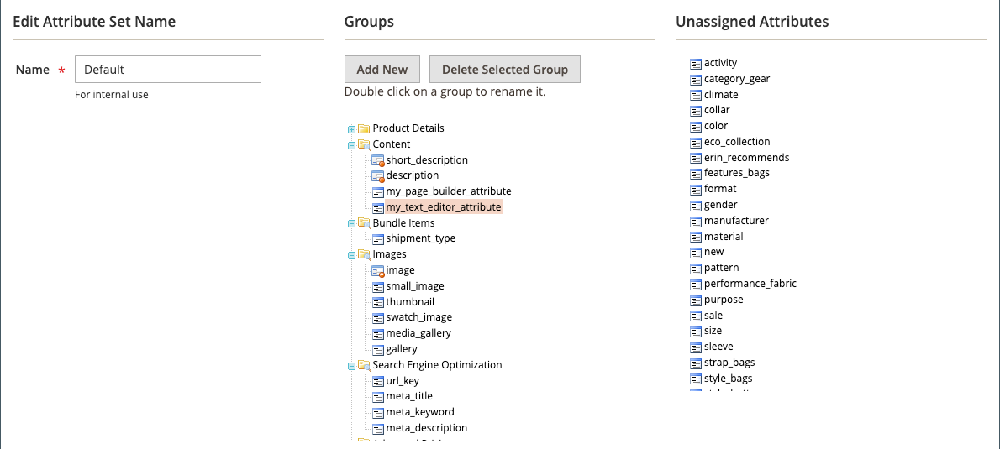

# [!DNL Page Builder] Tutorial, parte 3: contenido del catálogo

Este ejercicio muestra lo fácil que es agregar una lista de productos a una página, personalizar páginas de productos y crear un atributo personalizado que agregue la variable [!DNL Page Builder] espacio de trabajo a un conjunto de atributos de producto.

{width="600" zoomable="yes"}

Este ejercicio supone que ha completado [Parte 1: Página simple](1-simple-page.md) y [Parte 2: Bloques](2-blocks.md), incluidos los requisitos previos y los archivos de ejemplo descargados. Siga las tres partes de este ejercicio en orden.

## Parte 1: Añadir una lista de productos

[!DNL Page Builder] facilita la adición de una lista de productos al escenario. En este ejemplo, la lista de productos se agrega directamente a una página.

### Paso 1: Añadir una lista de productos a la fase

1. En el _Administrador_ barra lateral, vaya a **[!UICONTROL Content]** > _[!UICONTROL Elements]_>**[!UICONTROL Pages]**.

1. Busque el _Página simple_ que creó en el primer ejercicio y modificó en el segundo, y seleccione **[!UICONTROL Edit]** en el _[!UICONTROL Action]_columna.

1. Expandir  el **[!UICONTROL Content]** y haga clic en **[!UICONTROL Edit with Page Builder]** o dentro del área de previsualización de contenido.

1. En el [!DNL Page Builder] panel debajo de _[!UICONTROL Layout]_, arrastre un **[!UICONTROL Row]**hasta la parte superior del escenario.

1. En el [!DNL Page Builder] panel, expandir **[!UICONTROL Add Content]** y arrastre un **[!UICONTROL Products]** marcador de posición a la nueva fila.

   {width="600" zoomable="yes"}

### Paso 2: Componga la condición

1. Pase el ratón sobre el contenedor de productos vacío para mostrar la caja de herramientas y seleccione _Configuración_ ( {width="20"} ) icono.

   {width="600" zoomable="yes"}

1. Para **[!UICONTROL Select Products By]**, elija `Condition`.

1. Añada una condición:

   - Haga clic en _Añadir_ () icono.

   - En _[!UICONTROL Product Attribute]_, elija **[!UICONTROL Category]**.

     {width="600" zoomable="yes"}

   - Complete la _[!UICONTROL Category is]..._ haga clic en el icono Más (...) y, a continuación, haga clic en el botón _Selector_ () icono.

     {width="600" zoomable="yes"}

   - En el árbol de categorías, aumente el detalle hasta **Mujer > Tops** y seleccione la **Tees** casilla de verificación

     {width="600" zoomable="yes"}

   - Haga clic en la marca de verificación () icono.

     La ID de categoría correspondiente aparece en el campo para completar la condición.

### Paso 3: Completar la configuración

1. Introduzca el **[!UICONTROL Number of Products to Display]**.

   De forma predeterminada, la lista muestra cinco productos.

1. Complete los ajustes restantes según sea necesario.

   Si es necesario, utilice las descripciones de campo al final del [Añadir contenido: productos](products.md) página para referencia.

1. Cuando termine, haga clic en **[!UICONTROL Save]** para guardar la configuración y volver a [!DNL Page Builder] workspace.

   {width="600" zoomable="yes"}

1. En la esquina superior derecha del escenario, haga clic en _Cerrar pantalla completa_ ( {width="20"} ) icono.

   Al hacer clic en este icono, volverá a la _[!UICONTROL Content]_de la página con la vista previa.

1. En la esquina superior derecha, haga clic **[!UICONTROL Save]** flecha y elija **[!UICONTROL Save & Close]**.

## Parte 2: Personalizar la página del producto

>[!NOTE]
>
>Un usuario administrador debe tener [!UICONTROL Content] permisos para su [ámbito de función](../systems/permissions-user-roles.md) para ver [!UICONTROL Edit with Page Builder] y poder usar Page Builder.

En esta parte del ejercicio, aprenderá lo fácil que es personalizar una página de producto colocando un vídeo debajo del conjunto de pestañas en la página de producto. Proceso de actualización [página de categoría](../catalog/categories-content-settings.md) El contenido es básicamente el mismo.

1. En el _Administrador_ barra lateral, vaya a **[!UICONTROL Catalog]** > **[!UICONTROL Products]**.

1. Busque un producto simple que pueda utilizar para este ejemplo y ábralo en modo de edición.

1. Desplazarse hacia abajo y expandir  el **[!UICONTROL Content]** sección.

1. Junto a _[!UICONTROL Description]_, haga clic en **[!UICONTROL Edit with Page Builder]**.

   {width="600" zoomable="yes"}

   Si la descripción del producto se ha introducido anteriormente sin [!DNL Page Builder], la descripción actual aparece como HTML en un [Código de HTML](html-code.md) contenedor. Con la temática de Luma, la descripción del producto aparece en la pestaña Detalles.

1. En el [!DNL Page Builder] panel debajo de _[!UICONTROL Layout]_, arrastre un **[!UICONTROL Row]**al escenario, colocándolo debajo del contenedor de código de HTML.

   Busque que aparezca la guía roja cuando la fila esté en la posición correcta.

   {width="600" zoomable="yes"}

1. En el [!DNL Page Builder] panel, expandir **[!UICONTROL Media]** y arrastre un **[!UICONTROL Video]** marcador de posición a la nueva fila.

   {width="600" zoomable="yes"}

1. Pase el ratón sobre el contenedor de vídeo vacío para mostrar el cuadro de herramientas y elegir la _Configuración_ ( {width="20"} ) icono.

   {width="500" zoomable="yes"}

1. Introduzca el **[!UICONTROL Video URL]**.

   El vídeo se puede alojar en [YouTube][1] o [Vimeo][2]. El vídeo de este ejemplo se puede encontrar en YouTube en la siguiente dirección URL:

   `https://www.youtube.com/watch?v=ZpFrNyD4100`

   {width="500" zoomable="yes"}

1. Introduzca el **[!UICONTROL Maximum Width]** en píxeles para la visualización del vídeo.

   Si deja esta opción en blanco, el vídeo rellena el espacio disponible.

1. Clic **[!UICONTROL Save]** para guardar la configuración y volver a [!DNL Page Builder] workspace.

   {width="600" zoomable="yes"}

1. En la esquina superior derecha del escenario, haga clic en _Cerrar pantalla completa_ ( {width="20"} ) icono.

   Al hacer clic en este icono, volverá a la _[!UICONTROL Content]_de la página con la vista previa.

1. En la esquina superior derecha, haga clic **[!UICONTROL Save]** flecha y elija **[!UICONTROL Save & Close]**.

En la tienda, el vídeo aparece debajo del conjunto de pestañas. Para ver el aspecto de la página en un dispositivo móvil, puede cambiar el tamaño de la ventana.

{width="600" zoomable="yes"}

**¡Felicidades!** Ha completado la segunda parte del tutorial Contenido del catálogo. Conserve el trabajo que ha creado para poder consultarlo más adelante.

## Parte 3: Añadir atributos personalizados

Utilice el [!DNL Page Builder] atributo personalizado para agregar un completamente funcional [!DNL Page Builder] espacio de trabajo a una página de producto, que puede utilizar para crear contenido atractivo. En esta parte del ejercicio, aprenderá a crear un atributo personalizado utilizando [!DNL Page Builder] Tipo de entrada y aplíquelo a las páginas de producto del catálogo. Para obtener más información sobre estos atributos, consulte [Atributos del producto](../catalog/product-attributes.md).

### Paso 1: Crear un producto

Para evitar cambios en la tienda activa, cree un producto con las propiedades descritas.

1. En el _Administrador_ barra lateral, vaya a **[!UICONTROL Catalog]** > **[!UICONTROL Products]**.

1. En la esquina superior derecha, haga clic en **[!UICONTROL Add Product]**.

1. Cree el producto con las siguientes propiedades:

   - 
     [!UICONTROL Conjunto de atributos]: Default
   - [!UICONTROL Product Name]: Mi producto
   - 
     [!UICONTROL SKU]: Tutorial
   - 
     [!UICONTROL Price]: 75.00
   - 
     [!UICONTROL Quantity]: 100
   - [!UICONTROL Stock Status]: En stock
   - 
     [!UICONTROL Weight]: 1
   - [!UICONTROL Categories]: Mujer > Tops > Camisetas

1. En la esquina superior derecha, haga clic **[!UICONTROL Save]** flecha y elija **[!UICONTROL Save & Close]**.

### Paso 2: Crear atributos personalizados

En este paso, se crean dos nuevos atributos personalizados para mostrar cómo se define la variable [!DNL Page Builder] y se pueden utilizar los tipos de entrada del Editor de texto.

1. En el _Administrador_ barra lateral, vaya a **[!UICONTROL Stores]** > _[!UICONTROL Attributes]_>**[!UICONTROL Product]**.

1. En la esquina superior derecha, haga clic en **[!UICONTROL Add New Attribute]**.

1. Introduzca una **[!UICONTROL Default Label]** para el atributo.

   Para este ejemplo, utilice `My Page Builder Attribute` para la etiqueta.

1. Establecer **[!UICONTROL Catalog Input Type for Store Owner]** hasta `Page Builder`.

   Al crear un atributo personalizado, puede especificar el editor más adecuado para la aplicación como `Page Builder` o el estándar, WYSIWYG `Text Editor`.

   ![[!DNL Page Builder] Tipo de entrada](./assets/pb-attribute-page-builder.png){width="600" zoomable="yes"}

1. Expandir  el **[!UICONTROL Advanced Attribute Properties]** y realice la siguiente configuración:

   - [!UICONTROL Attribute Code]: introduzca un código de atributo en caracteres en minúsculas, utilizando guiones en lugar de espacios. Para este ejemplo, utilice `my_page_builder_attribute`.
   - [!UICONTROL Scope]: acepte el valor predeterminado, `Store View`.
   - [!UICONTROL Default Value]: introduzca un valor predeterminado para el atributo.
   - 
     [!UICONTROL Unique Value]: `No`
   - 
     [!UICONTROL Add to Column Options]: `No`
   - 
     [!UICONTROL Use in Filter Options]: `Yes`

1. En el _[!UICONTROL Attribute Information]_panel de la izquierda, elija **[!UICONTROL Storefront Properties]**y realice la siguiente configuración:

   - 
     [!UICONTROL Use for Promo Rule Conditions]: `Yes`
   - 
     [!UICONTROL Visible on Catalog Pages on Storefront]: `Yes`
   - 
     [!UICONTROL Used in Product Listing]: `Yes`

1. Cuando termine, haga clic en **[!UICONTROL Save Attribute]**.

1. Repita los pasos anteriores para crear un segundo atributo con las mismas propiedades básicas, pero con el tipo de entrada Editor de texto de la siguiente manera:

   - [!UICONTROL Default Label]: Atributo de mi editor de texto
   - [!UICONTROL Catalog Input Type for Store Owner]: Editor de texto
   - 
     [!UICONTROL Código de atributo]: `my_text_editor_attribute`

### Paso 3: Actualizar el conjunto de atributos del producto

1. En el _Administrador_ barra lateral, vaya a **[!UICONTROL Stores]** > _[!UICONTROL Attributes]_>**[!UICONTROL Attribute Set]**.

   Para este ejemplo, se agregan temporalmente los nuevos atributos al `default` conjunto de atributos. Al final de este ejercicio, elimine los atributos del conjunto de atributos, por lo que no afectará a su catálogo.

   >[!NOTE]
   >
   >Si no desea cambiar la tienda activa, puede continuar sin actualizar el conjunto de atributos.

1. Busque el _[!UICONTROL Default]_en la lista y haga doble clic en ella para abrirla en modo de edición.

1. En el _Atributos sin asignar_ , busque los nuevos atributos que ha creado y arrastre cada uno al _[!UICONTROL Groups]_columna, debajo de **[!UICONTROL Content]**.

   La ubicación del atributo en la variable [!UICONTROL Groups] determina dónde aparece en la página.

   {width="600" zoomable="yes"}

1. Clic **[!UICONTROL Save]** para volver a la lista Conjuntos de atributos.

1. Cuando se le solicite, haga clic en **[!UICONTROL Cache Management]** en la parte superior de la página y actualice cualquier caché no válida.

### Paso 4: Actualizar el producto

1. En el _Administrador_ barra lateral, vaya a **[!UICONTROL Catalog]** > **[!UICONTROL Products]**.

1. En la cuadrícula Productos, busque _Mi producto_ y ábralo en modo de edición.

1. Desplazarse hacia abajo y expandir  el **[!UICONTROL Content]** sección.

   En la parte superior de la sección, hay dos atributos estándar para el contenido del producto:

   - _Descripción breve_, que utiliza el WYSIWYG estándar [editor](../content-design/editor.md).
   - _Descripción_, que muestra el [!DNL Page Builder] vista previa.

   {width="600" zoomable="yes"}

   A medida que se desplaza hasta la mitad inferior de la sección, aparecen los dos atributos que ha creado y asignado:

   - _Mis [!DNL Page Builder] Atributo_, que muestra el [!DNL Page Builder] vista previa.
   - _Atributo de mi editor de texto_, que utiliza el editor WYSIWYG estándar.

   {width="600" zoomable="yes"}

1. En el **Atributo de mi editor de texto** editor, introduzca `Text Editor Attribute placeholder text`.

   - En la esquina superior derecha, haga clic **[!UICONTROL Save]** flecha y elija **[!UICONTROL Save & Close]**.

1. Para **Atributo de Mi Page Builder**, haga clic en **[!UICONTROL Edit with Page Builder]** y añada el texto de descripción:

   - En el [!DNL Page Builder] panel, expandir **[!UICONTROL Elements]** y arrastre un **[!UICONTROL Text object]** al escenario.

   - Entrar `Page Builder attribute placeholder text`.

   - En la esquina superior derecha del escenario, haga clic en _Cerrar pantalla completa_ ( {width="20"} ) icono.

     {width="600" zoomable="yes"}

1. Desplazarse arriba hasta **[!UICONTROL Description]**, haga clic en **[!UICONTROL Edit with Page Builder]** y agregue el texto que desee utilizando el mismo método que en el paso anterior.

1. En la esquina superior derecha de la página de producto, haga clic en **[!UICONTROL Save]** flecha y elija **[!UICONTROL Save & Close]**.

1. Si se le solicita, haga clic en **[!UICONTROL Cache Management]** en el mensaje en la parte superior de la página y actualice cualquier caché no válida.

### Paso 5: Ver el resultado

1. Navegue hasta la página de producto de muestra en la tienda.

   En este ejemplo, el producto se puede encontrar en la barra de navegación superior debajo de Mujeres > Tops > Camisetas.

1. Desplácese hacia abajo hasta el _Atributo de Mi Page Builder_ información.

   La posición de los atributos en la página del producto está determinada por la temática. En la temática de Luma, los nuevos atributos se encuentran justo después de la descripción del producto.

   ![[!DNL Page Builder] y los atributos del Editor de texto en la tienda](./assets/pb-storefront-product-attribute.png){width="600" zoomable="yes"}

Ha completado la [!DNL Page Builder] Ejercicio de contenido de catálogo. Conserve el trabajo que ha creado para poder consultarlo más adelante.

[1]: https://www.youtube.com/
[2]: https://vimeo.com/
