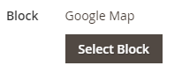

# Añadir contenido: bloquear

Utilice el _Bloquear_ tipo de contenido para añadir un activo existente [bloquear](../content-design/blocks.md) a la [[!DNL Page Builder] stage](workspace.md#stage). En el ejemplo siguiente, la primera columna contiene el bloque con un menú lateral para la página. La segunda columna contiene una imagen.

{width="600" zoomable="yes"}

{{$include /help/_includes/page-builder-save-timeout.md}}

## Bloquear caja de herramientas

| Herramienta | Icono | Descripción |
| --------- | -------- | ------------- |
| Mover |  | Mueve el contenedor de bloque y su contenido a otra posición del escenario. |
| Configuración |  | Abre la página Editar bloque, donde puede elegir el bloque y cambiar las propiedades del contenedor. |
| Hide |  | Oculta el contenedor de bloques actual y su contenido. |
| Mostrar |  | Muestra el contenedor de bloques oculto y su contenido. |
| Duplicar |  | Realiza una copia del contenedor de bloques y de su contenido. |
| Eliminar |  | Elimina el contenedor de bloques y su contenido del escenario. |

{style="table-layout:auto"}

{{$include /help/_includes/page-builder-hidden-element-note.md}}

## Añadir un bloque existente

1. Vaya a [!DNL Page Builder] espacio de trabajo en la página, bloque, bloque dinámico, producto o categoría de destino.

1. En el [!DNL Page Builder] panel, expandir **[!UICONTROL Add Content]** y arrastre un **[!UICONTROL Block]** marcador de posición al escenario.

   {width="600" zoomable="yes"}

1. Pase el ratón sobre el contenedor de bloques vacío para mostrar el cuadro de herramientas y elegir la _Configuración_ ( {width="25"} ) icono.

1. Haga clic **[!UICONTROL Select Block]**.

   {width="200"}

1. En la fila del bloque que desee agregar, haga clic en **[!UICONTROL Select]** en la última columna.

   {width="600" zoomable="yes"}

   El nombre del bloque seleccionado aparece en la página.

   {width="200"}

1. Complete los ajustes restantes según sea necesario, utilizando las descripciones de los campos al final de esta página para referencia.

1. Cuando termine, haga clic en **[!UICONTROL Save]** para aplicar la configuración de y volver a [!DNL Page Builder] workspace.

### Configuración avanzada

1. Para controlar la posición del bloque dentro del contenedor principal, elija una **[!UICONTROL Alignment]**:

   | Opción | Descripción |
   | ------ | ----------- |
   | `Default` | Aplica la configuración predeterminada de alineación especificada en la hoja de estilos de la temática actual. |
   | `Left` | Alinea la lista a lo largo del borde izquierdo del contenedor principal, con margen para cualquier relleno que se especifique. |
   | `Center` | Alinea la lista en el centro del contenedor principal, con margen para cualquier relleno que se especifique. |
   | `Right` | Alinea el bloque a lo largo del borde derecho del contenedor principal, con margen para cualquier relleno que se especifique. |

   {style="table-layout:auto"}

1. Establezca un **[!UICONTROL Border]** estilo que se aplica a los cuatro lados del contenedor de bloques:

   | Opción | Descripción |
   | ------ | ----------- |
   | `Default` | Aplica el estilo de borde predeterminado especificado por la hoja de estilos asociada. |
   | `None` | No proporciona ninguna indicación visible de los bordes del contenedor. |
   | `Dotted` | El borde del contenedor aparece como una línea de puntos. |
   | `Dashed` | El borde del contenedor aparece como una línea discontinua. |
   | `Solid` | El borde del contenedor aparece como una línea sólida. |
   | `Double` | El borde del contenedor aparece como una línea doble. |
   | `Groove` | El borde del contenedor aparece como una línea ranurada. |
   | `Ridge` | El borde del contenedor aparece como una línea discontinua. |
   | `Inset` | El borde del contenedor aparece como una línea de margen. |
   | `Outset` | El borde del contenedor aparece como una línea de inicio. |

   {style="table-layout:auto"}

1. Si establece un estilo de borde distinto de `None`, complete las opciones de visualización de bordes:

   | Opción | Descripción |
   | ------ |------------ |
   | [!UICONTROL Border Color] | Especifique el color seleccionando una muestra, haciendo clic en el selector de color o introduciendo un nombre de color válido o un valor hexadecimal equivalente. |
   | [!UICONTROL Border Width] | Introduzca el número de píxeles de la anchura de la línea del borde. |
   | [!UICONTROL Border Radius] | Introduzca el número de píxeles para definir el tamaño del radio que se utiliza para redondear cada esquina del borde. |

   {style="table-layout:auto"}

1. (Opcional) Especifique los nombres de **[!UICONTROL CSS classes]** de la hoja de estilos actual para aplicarla al contenedor.

   Separe los distintos nombres de clase con un espacio.

1. Introduzca valores, en píxeles, para **[!UICONTROL Margins and Padding]** para determinar los márgenes exteriores y el relleno interno del contenedor de bloques.

   Introduzca los valores correspondientes en el diagrama.

   | Área del contenedor | Descripción |
   | -------------- | ----------- |
   | [!UICONTROL Margins] | Cantidad de espacio en blanco que se aplica al borde exterior de todos los lados del contenedor. Opciones: `Top` / `Right` / `Bottom` / `Left` |
   | [!UICONTROL Padding] | Cantidad de espacio en blanco que se aplica al borde interior de todos los lados del contenedor. Opciones: `Top` / `Right` / `Bottom` / `Left` |

   {style="table-layout:auto"}

## Editar configuración de bloque

1. Pase el ratón sobre el contenedor de bloques y seleccione la opción _Configuración_ ( {width="25"} ) en el cuadro de herramientas.

   {width="600" zoomable="yes"}

1. Para elegir un bloque diferente, haga clic en **[!UICONTROL Select Block]**.

   - En la lista de bloques activos, haga clic en **[!UICONTROL Select]** el bloque que desea agregar.
   - Haga clic **[!UICONTROL Add Selected]**.

1. Actualice los ajustes restantes según sea necesario, utilizando las descripciones de los campos al final de esta página para referencia.

1. Cuando termine, haga clic en **[!UICONTROL Save]** para aplicar la configuración de y volver a [!DNL Page Builder] workspace.

## Duplicación de un bloque

1. Pase el ratón sobre el contenedor de bloques para mostrar el cuadro de herramientas y seleccione la opción _Duplicar_ () icono.

   El duplicado aparece justo debajo del original.

1. Para mover el nuevo bloque a una nueva posición, pase el ratón sobre el contenedor y, a continuación, haga clic en _Mover_ () en el cuadro de herramientas.

1. Seleccione y arrastre el bloque hasta que aparezca la guía roja en la nueva posición.

   Los bordes superior e inferior de cada contenedor aparecen como líneas discontinuas mientras se mueve el bloque.

## Quitar un bloque del escenario

1. Pase el ratón sobre el contenedor de bloques para mostrar el cuadro de herramientas y seleccione la opción _Eliminar_ () icono.

1. Cuando se le pida que confirme, haga clic en **[!UICONTROL OK]**.
