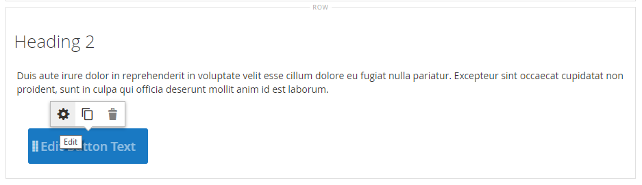

# Elementos: botones

Utilice el _Botones_ tipo de contenido para añadir un botón individual o un conjunto de botones en la [[!DNL Page Builder] stage](workspace.md#stage). Puede organizar los botones horizontal o verticalmente y agregarlos directamente a las filas, columnas, pestañas y titulares del escenario.

{width="600" zoomable="yes"}

{{$include /help/_includes/page-builder-save-timeout.md}}

## Cajas de herramientas

Cuando trabaja con el tipo de contenido Botones, agrega y edita botones individuales y el contenedor de botones que contiene uno o más botones. Cada una tiene su propia caja de herramientas que puede utilizar para diseñar botones en la [!DNL Page Builder] escenario.

### Cuadro de herramientas de botón individual

{width="500" zoomable="yes"}

| Herramienta | Icono | Descripción |
| --------- | -------- | -------------- |
| Configuración | {width="25"} | Abre la página Botón de edición, donde puede cambiar las propiedades del botón. |
| Duplicar | {width="25"} | Realiza una copia del botón. |
| Eliminar | {width="25"} | Elimina el botón del escenario. |

{style="table-layout:auto"}

### Cuadro de herramientas Contenedor de botones

{width="500" zoomable="yes"}

| Herramienta | Icono | Descripción |
| --------- | ----------------- | ----------- |
| Mover | {width="25"} | Mueve el contenedor de botón a otro lugar válido de la página. |
| Añadir | {width="25"} | Agrega un botón al contenedor. |
| (etiqueta) | Botón | Identifica el contenedor actual como un elemento de botón. |
| Configuración | {width="25"} | Abre la página Editar botones, donde puede cambiar las propiedades del contenedor. |
| Hide | {width="25"} | Oculta el contenedor de botón. |
| Mostrar | {width="25"} | Muestra el contenedor de botones oculto. |
| Duplicar | {width="25"} | Realiza una copia del contenedor de botones. |
| Eliminar | {width="25"} | Elimina el contenedor de botón y su contenido del escenario. |

{style="table-layout:auto"}

{{$include /help/_includes/page-builder-hidden-element-note.md}}

## Añadir un botón individual

1. En el [!DNL Page Builder] panel, expandir **[!UICONTROL Elements]** y arrastre un **[!UICONTROL Buttons]** marcador de posición a una fila, columna o ficha establecida en el escenario.

   {width="500" zoomable="yes"}

1. Pase el ratón sobre el botón para mostrar el cuadro de herramientas y seleccione _Configuración_ () icono.

1. Introduzca el **[!UICONTROL Button Text]** que se mostrará en el botón.

   {width="600" zoomable="yes"}

1. Establecer **[!UICONTROL Button Type]** a uno de los siguientes:

   | Tipo | Descripción |
   | ------ | ----------- |
   | `Primary` | Aplica el estilo del botón principal de la hoja de estilos actual. |
   | `Secondary` | Aplica el estilo del botón secundario de la hoja de estilos actual, si corresponde. |
   | `Link` | Crea un hipervínculo en lugar de un botón. |

   {style="table-layout:auto"}

   {width="500" zoomable="yes"}

1. Configure las variables **[!UICONTROL Button Link]** mediante uno de los siguientes tipos:

   - **[!UICONTROL URL]** : introduzca la dirección URL de destino para el vínculo.

     La dirección URL puede ser un vínculo relativo a un producto o a una página de la tienda, o bien una dirección URL completa.

     Ejemplo de URL relativa - `../luma-analog-watch.html`

     Ejemplo de URL completa: `http://mystore.com/luma-analog-watch.html`

     Si el vínculo va a un sitio web diferente, puede mantener la página actual abierta en la tienda abriendo el vínculo en una nueva pestaña del explorador.

     Para evitar que el visitante salga de su tienda, seleccione la opción **[!UICONTROL Open in new tab]** casilla de verificación

   - **[!UICONTROL Product]** : introduzca un nombre de producto (parcial o completo) o SKU y, a continuación, elija el nombre del producto en la lista.

     >[!NOTE]
     >
     >Los productos se muestran en la lista según la variable _Mostrar productos sin existencias_ configuración. Para comerciantes de varias fuentes que utilizan [Inventory management](../inventory-management/introduction.md), la lista de productos está limitada únicamente por la fuente asignada al sitio web predeterminado.

     {width="600" zoomable="yes"}

   - **[!UICONTROL Category]** : introduzca un nombre de categoría (parcial o completo) o haga clic en el campo en blanco para mostrar el árbol de categorías. A continuación, elija el nombre de la categoría en el árbol.

     {width="600" zoomable="yes"}

   - **[!UICONTROL Page]** : introduzca el nombre de una página de CMS (parcial o completa) o haga clic en el campo en blanco para mostrar la lista completa. A continuación, elija el nombre de la página en la lista de resultados de la búsqueda.

     {width="600" zoomable="yes"}

1. Complete la [configuración avanzada][advanced-settings] según sea necesario.

1. Cuando termine, haga clic en **[!UICONTROL Save]** en la esquina superior derecha para aplicar la configuración y volver a la [!DNL Page Builder] workspace.

## Añadir un conjunto de botones

En las secciones siguientes se describe una serie de pasos para comenzar con un botón individual y crear un conjunto de tres botones dentro de un contenedor de botones. Si aún no tiene un botón individual, siga las instrucciones anteriores para agregar un botón individual al escenario.

### Paso 1: Crear el segundo botón

1. Pase el ratón sobre el contenedor de botones para mostrar el cuadro de herramientas y seleccione _Añadir_ ( {width="20"} ) icono.

   {width="500" zoomable="yes"}

1. Escriba el texto que desea que aparezca en el segundo botón.

1. Haga clic en el nuevo botón para mostrar su cuadro de herramientas y seleccione _Configuración_ ( {width="20"} ) icono.

   {width="500" zoomable="yes"}

1. Establecer **[!UICONTROL Button Type]** hasta `Secondary`.

1. Configure las variables **[!UICONTROL Button Link]** según sea necesario.

   En el ejemplo siguiente, el vínculo es una dirección URL relativa que va a [Contáctenos.](../getting-started/store-details.md#contact-us-form) página.

   {width="600" zoomable="yes"}

1. Complete la [configuración avanzada][advanced-settings] según sea necesario.

1. Cuando termine, haga clic en **[!UICONTROL Save]** para aplicar la configuración de y volver a [!DNL Page Builder] workspace.

### Paso 2: crear el tercer botón

1. Haga clic de nuevo en el segundo botón del escenario y elija el _Duplicar_ ( {width="20"} ) icono.

   {width="500" zoomable="yes"}

1. Escriba el texto que desea que aparezca en el tercer botón.

1. Haga clic en el tercer botón para mostrar el cuadro de herramientas y seleccione _Configuración_ ( {width="20"} ) icono.

   {width="500" zoomable="yes"}

1. Actualice el **[!UICONTROL Button Link]** según sea necesario.

1. En la esquina superior derecha, haga clic en **[!UICONTROL Save]** para aplicar la configuración de y volver a [!DNL Page Builder] workspace.

### Paso 3: Actualizar el contenedor del botón

1. Pase el ratón sobre el contenedor de botones para mostrar el cuadro de herramientas y seleccione _Configuración_ ( {width="20"} ) icono.

   {width="500" zoomable="yes"}

1. En _[!UICONTROL Appearance]_, elija **[!UICONTROL Stacked]**.

1. Establecer **[!UICONTROL All Buttons are same size]** hasta `Yes`.

   {width="300"}

1. Actualice los ajustes restantes según sea necesario, utilizando las descripciones de [Cambiar la configuración de un contenedor de botones][button-container].

1. Cuando termine, haga clic en **[!UICONTROL Save]** para aplicar la configuración de y volver a [!DNL Page Builder] workspace.

   El conjunto completo de botones apilados aparece en el escenario, con un botón principal y dos botones secundarios.

   {width="500" zoomable="yes"}

## Mover un botón

1. Haga clic en el botón que desee mover.

1. Seleccione y arrastre el botón Mover ( {width="20"} ) icono, que aparece justo antes del texto del botón, a una nueva posición para el botón dentro del contenedor de botones.

   {width="500" zoomable="yes"}

## Cambiar la configuración de un botón

1. Haga clic en el botón del escenario para mostrar la caja de herramientas y elegir _Configuración_ ( {width="20"} ) icono.

   {width="500" zoomable="yes"}

1. Actualice la configuración estándar según sea necesario.

   - **[!UICONTROL Button Text]** : introduzca el texto que se mostrará en el botón (también se puede actualizar directamente desde el escenario).

   - **[!UICONTROL Button Type]** - Determina el formato del botón.

     | Tipo | Descripción |
     | ------ | ----------- |
     | `Primary` | Aplica el estilo del botón principal de la hoja de estilos actual. |
     | `Secondary` | Aplica el estilo del botón secundario de la hoja de estilos actual, si corresponde. |
     | `Link` | Crea un hipervínculo en lugar de un botón. |

     {style="table-layout:auto"}

   - **[!UICONTROL Button Link]** - Determina la página de destino que se sirve cuando se hace clic en el botón.

     | Opción | Descripción |
     | ------ | ----------- |
     | `URL` | Utiliza una dirección URL relativa o completa para identificar la página de destino. |
     | `Product` | Identifica la página de destino según el nombre del producto o el SKU. El nombre del producto se puede buscar en función de un nombre parcial o completo. A continuación, se elige el producto de la lista de resultados de búsqueda. |
     | `Category` | Identifica la página de destino como una categoría o subcategoría específica en el árbol de categorías. |
     | `Page` | Identifica la página de destino como una página CMS específica. |

     {style="table-layout:auto"}

1. Complete la [configuración avanzada][advanced-settings] según sea necesario.

1. Para guardar la configuración y volver a [!DNL Page Builder] workspace, haga clic en **[!UICONTROL Save]** en la esquina superior derecha.

## Cambiar la configuración de un contenedor de botones

1. Pase el ratón sobre el contenedor de botones para mostrar el cuadro de herramientas y seleccione _Configuración_ ( {width="20"} ) icono.

1. Actualice el **[!UICONTROL Appearance]** ajustes según sea necesario.

   - Utilice las opciones de disposición para mostrar los botones horizontal o verticalmente en el contenedor:

     | Opción | Descripción |
     | ------ | ----------- |
     | `Inline` | Organiza los botones horizontalmente. |
     | `Stacked` | Organiza los botones verticalmente. |

     {style="table-layout:auto"}

   - Configure las variables **[!UICONTROL All buttons are same size]** opción según sus preferencias.

     Cuando se establece en `Yes`, todos los botones del contenedor tienen un tamaño coherente, según la longitud del texto del botón más largo.

1. Complete la [Configuración avanzada][advanced-settings] según sea necesario.

1. Cuando termine, haga clic en **[!UICONTROL Save]** para aplicar la configuración de y volver a [!DNL Page Builder] workspace.

## Cambiar configuración avanzada

Puede modificar la variable _[!UICONTROL Advanced]_configuración de botones individuales y del contenedor de botones.

1. Para controlar la posición dentro del contenedor principal, elija la opción **[!UICONTROL Alignment]**:

   | Opción | Descripción |
   | ------ | ----------- |
   | `Default` | Aplica la configuración predeterminada de alineación especificada en la hoja de estilos de la temática actual. |
   | `Left` | Alinea el contenido a lo largo del borde izquierdo del contenedor principal, con margen para cualquier relleno que se especifique. |
   | `Center` | Alinea el contenido en el centro del contenedor principal, con margen para cualquier relleno que se especifique. |
   | `Right` | Alinea el contenido a lo largo del borde derecho del contenedor principal, con margen para cualquier relleno que se especifique. |

   {style="table-layout:auto"}

1. Configure las variables **[!UICONTROL Border]** estilo aplicado a los cuatro lados del contenedor de botones o botones:

   | Opción | Descripción |
   | ------ | ----------- |
   | `Default` | Aplica el estilo de borde predeterminado especificado por la hoja de estilos asociada. |
   | `None` | No proporciona ninguna indicación visible de los bordes del contenedor. |
   | `Dotted` | El borde del contenedor aparece como una línea de puntos. |
   | `Dashed` | El borde del contenedor aparece como una línea discontinua. |
   | `Solid` | El borde del contenedor aparece como una línea sólida. |
   | `Double` | El borde del contenedor aparece como una línea doble. |
   | `Groove` | El borde del contenedor aparece como una línea ranurada. |
   | `Ridge` | El borde del contenedor aparece como una línea discontinua. |
   | `Inset` | El borde del contenedor aparece como una línea de margen. |
   | `Outset` | El borde del contenedor aparece como una línea de inicio. |

   {style="table-layout:auto"}

1. Si establece un estilo de borde distinto de `None`, complete las opciones de visualización de bordes:

   | Opción | Descripción |
   | ------ |------------ |
   | [!UICONTROL Border Color] | Especifique el color seleccionando una muestra, haciendo clic en el selector de color o introduciendo un nombre de color válido o un valor hexadecimal equivalente. |
   | [!UICONTROL Border Width] | Introduzca el número de píxeles de la anchura de la línea del borde. |
   | [!UICONTROL Border Radius] | Introduzca el número de píxeles para definir el tamaño del radio que se utiliza para redondear cada esquina del borde. |

   {style="table-layout:auto"}

1. (Opcional) Especifique los nombres de **[!UICONTROL CSS classes]** de la hoja de estilos actual para aplicarla al contenedor de botones.

   Separe los distintos nombres de clase con un espacio.

1. Introduzca valores, en píxeles, para **[!UICONTROL Margins and Padding]** para determinar los márgenes externos y el relleno interno del contenedor de botones.

   Introduzca los valores correspondientes en el diagrama.

   | Área del contenedor | Descripción |
   | -------------- | ----------- |
   | [!UICONTROL Margins] | Cantidad de espacio en blanco que se aplica al borde exterior de todos los lados del contenedor. Opciones: `Top` / `Right` / `Bottom` / `Left` |
   | [!UICONTROL Padding] | Cantidad de espacio en blanco que se aplica al borde interior de todos los lados del contenedor. Opciones: `Top` / `Right` / `Bottom` / `Left` |

   {style="table-layout:auto"}

[advanced-settings]: #change-advanced-settings
[button-container]: #change-settings-for-a-button-container
