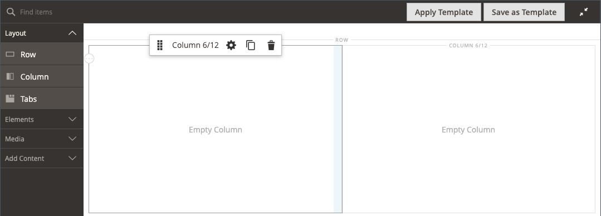

# Diseño: columna

Utilice el tipo de contenido _Column_ para dividir una página en varias columnas en la [[!DNL Page Builder] fase](workspace.md#stage). Cuando se agrega una columna a una fila o pestaña o directamente al escenario, el grupo de columnas se divide inicialmente en dos columnas de igual ancho. Puede agregar o quitar columnas según sea necesario. Se puede cambiar el tamaño de una columna arrastrando el borde entre dos columnas. La anchura de la siguiente columna se ajusta para rellenar el espacio disponible dentro de la fila, la pestaña o el escenario. Una sola columna amplía el ancho completo del escenario o su contenedor.

{width="600" zoomable="yes"}

{{$include /help/_includes/page-builder-save-timeout.md}}

## Actualizaciones en la versión 2.4.5

Las funcionalidades de Page Builder se actualizaron en la versión 2.4.5 para que los usuarios ahora usen _[!DNL Columns]_como contenedor principal para columnas individuales. Este nuevo contenedor también admite propiedades para el fondo y elimina la necesidad de ajustar las columnas en una fila. Reduce el marcado innecesario y proporciona un control más preciso sobre la visualización y la experiencia de la tienda.

Puede cambiar el diseño del contenedor [!DNL Columns] arrastrando una columna por encima o por debajo de otras columnas del grupo y apilarlas. Esto abre una nueva variedad de posibles combinaciones de diseños que se pueden lograr sin necesidad de que los desarrolladores los personalicen.

Vea este vídeo para ver una demostración de cómo se puede utilizar el contenedor [!DNL Columns] para restringir los diseños de página:

>[!VIDEO](https://video.tv.adobe.com/v/345828?quality=12&learn=on)

## Cuadro de herramientas Columna

Cada columna tiene una caja de herramientas de opciones que aparece al pasar el ratón por encima del contenedor.

| Herramienta | Icono | Descripción |
|--- |--- |--- |
| Mover | {width="25"} | Mueve la columna y su contenido a otra posición en relación con otras columnas. |
| (etiqueta) | Columna | Identifica el contenedor actual como una columna. Pase el ratón sobre el contenedor de columnas para ver el cuadro de herramientas. |
| Configuración | {width="25"} | Abre la página Editar columna, donde puede cambiar las propiedades del contenedor. |
| Duplicar | {width="25"} | Realiza una copia de la columna actual. |
| Eliminar | {width="25"} | Elimina la columna actual y su contenido. |

{style="table-layout:auto"}

## Cuadrícula de columnas

La [cuadrícula](workspace.md) garantiza que el contenido se alinee de manera consistente en una columna y ayuda a que la página se represente correctamente tanto en el escritorio como en los dispositivos móviles. Para obtener más información, consulte la sección [Herramientas de contenido avanzadas](setup.md) de la configuración de [!DNL Page Builder].

{width="500" zoomable="yes"}

En el siguiente ejemplo de dos columnas, los números entre paréntesis (6/12) en el borde superior de cada contenedor de columnas indican el número de divisiones de cuadrícula en cada columna y el número total de divisiones. En este caso, la columna es la anchura de seis unidades de cuadrícula de un total de 12.

{width="600" zoomable="yes"}

## Añadir una columna

1. En el panel [!DNL Page Builder] bajo _[!UICONTROL Layout]_, arrastre un(a)**[!UICONTROL Column]**al escenario.

   {width="600" zoomable="yes"}

   El grupo de columnas ahora se divide en dos columnas de igual anchura. Cada columna es un contenedor independiente para el contenido y tiene su propio conjunto de opciones de cuadro de herramientas.

   {width="600" zoomable="yes"}

1. En la esquina superior izquierda del grupo de columnas, haga clic en la herramienta _Cuadrícula_ () y ajuste el tamaño de la cuadrícula según sea necesario.

   Colocar el contenido en la cuadrícula ayuda a alinear el contenido de forma coherente y procesa la página correctamente tanto en el escritorio como en los dispositivos móviles. Para obtener más información, consulte la sección [Herramientas de contenido avanzadas](../configuration-reference/general/content-management.md) de la configuración de [!DNL Page Builder].

   {width="600" zoomable="yes"}

## Cambiar el tamaño de una columna

1. Pase el ratón sobre el borde entre dos columnas.

   El borde se resalta y aparece la caja de herramientas de la columna seleccionada.

   {width="600" zoomable="yes"}

1. Mantenga pulsado el botón del ratón para mostrar la cuadrícula y arrastre el borde a una nueva posición en la cuadrícula.

   El ancho de ambas columnas se ajusta para reflejar el cambio. La nueva anchura de cada columna aparece después de la etiqueta, como `4/12` (cuatro de 12) y `8/12` (ocho de 12).

   {width="600" zoomable="yes"}

## Eliminación de una columna

1. Pase el ratón sobre la columna que quiera quitar para mostrar el cuadro de herramientas y elija el icono _Quitar_ ({width="20"} ).

   {width="600" zoomable="yes"}

1. Si la columna contiene contenido, haga clic en **[!UICONTROL OK]** para confirmar.

   Para acelerar el proceso en el futuro, puede omitir el paso de confirmación seleccionando la casilla de verificación **[!UICONTROL Do not show this again]**.

   El grupo de columnas ahora tiene una sola columna (12/12) y cuadrícula. Dado que la cuadrícula sólo está disponible para columnas, puede utilizar esta técnica para mostrarla.

   {width="600" zoomable="yes"}

1. Si desea que el grupo de columnas amplíe la columna restante hasta el ancho completo de la fila o etapa:

   - Pase el ratón sobre la columna para ver el cuadro de herramientas y elija el icono _Configuración_ ( {width="20"} ).

   - Desplácese hacia abajo hasta la sección _[!UICONTROL Advanced]_y establezca los cuatro valores de **[!UICONTROL Padding]**en `0`.

     {width="600" zoomable="yes"}

   - En la esquina superior derecha, haga clic en **[!UICONTROL Save]** para cerrar la página _[!UICONTROL Edit Column]_.

1. Haga clic en el icono _Cerrar pantalla completa_ ({width="20"} ) en la esquina superior derecha del área de trabajo y, a continuación, haga clic en **[!UICONTROL Save]** en la esquina superior derecha.

## Cambiar configuración de columna

1. Pase el ratón sobre la columna para ver el cuadro de herramientas y elija el icono _Configuración_ ( {width="20"} ).

   {width="600" zoomable="yes"}

1. Cambie la configuración de **[!UICONTROL Appearance]** según sea necesario.

   - Elija la configuración de alineación que determina la posición de la columna en relación con su contenedor.

     | Opción | Descripción |
     | ------ | ----------- |
     | `Full Height` | La columna amplía la altura completa de su contenedor. |
     | `Top Aligned` | La columna se alinea en la parte superior de su contenedor. |
     | `Centered` | La columna se centra en el centro de su contenedor. |
     | `Bottom Aligned` | La columna se alinea en la parte inferior de su contenedor. |

     {style="table-layout:auto"}

   - Si es necesario, escriba **[!UICONTROL Minimum Height]** para la columna. Por ejemplo, puede establecer la altura mínima para que coincida con la altura de una imagen de fondo.

   - Si establece la altura mínima, establezca **[!UICONTROL Vertical Alignment]** para controlar la posición de los contenedores de contenido que se agregan a la columna (`Top`, `Center` o `Bottom`).

1. Cambie el fondo del contenido de la columna.

   - **[!UICONTROL Background Color]**: especifique el color eligiendo una muestra, haciendo clic en el selector de color o introduciendo un nombre de color válido o un valor hexadecimal equivalente. Esta configuración determina el color de fondo de la columna.

   - **[!UICONTROL Background Image]**: si es necesario, utilice las herramientas proporcionadas para elegir una imagen de fondo que aplicar a la columna:

     | Herramienta | Descripción |
     | ------ | ----------- |
     | [!UICONTROL Upload] | Carga un archivo de imagen desde el equipo local a la galería y, a continuación, lo aplica como imagen de fondo de la columna. |
     | [!UICONTROL Select from Gallery] | Le pide que elija una imagen existente de la galería como imagen de fondo para la columna. |
     | {width="25"} | Permite arrastrar la imagen al mosaico de la cámara o navegar a la imagen en el sistema de archivos local. |

     {style="table-layout:auto"}

   - **[!UICONTROL Background Mobile Image]**: si es necesario, utilice las mismas herramientas para elegir una imagen de fondo diferente para usarla en dispositivos móviles.

   - **[!UICONTROL Background Size]**: cambie esta configuración para determinar cómo se escala la imagen de fondo en relación con el ancho de la columna:

     | Opción | Descripción |
     | ------ | ----------- |
     | `Cover` | La imagen de fondo cubre el ancho completo de la columna. |
     | `Contain` | La imagen de fondo está limitada a la anchura del área de contenido. |
     | `Auto` | Aplica el tamaño de fondo predeterminado especificado en la hoja de estilos de la temática actual. |

     {style="table-layout:auto"}

   - **[!UICONTROL Background Position]**: cambie esta configuración para determinar el punto de anclaje de la imagen en relación con la columna. Opciones: `Top Left`, `Top Center`, `Top Right`, `Center Left`, `Center`, `Center Right`, `Bottom Left`, `Bottom Center` o `Bottom Right`

   - **[!UICONTROL Background Attachment]** - Cambie esta configuración para determinar cómo se mueve la imagen de fondo en relación con la página de desplazamiento:

     | Opción | Descripción |
     | ------ | ----------- |
     | `Scroll` | La imagen de fondo se sincroniza para moverse hacia abajo a medida que la página se desplaza. |
     | `Fixed` | (No disponible para móviles) La imagen de fondo no se mueve cuando el contenedor se desplaza por la imagen y está fijo en la posición de fondo especificada. |

     {style="table-layout:auto"}

   - **[!UICONTROL Background Repeat]**: si desea repetir la imagen de fondo para rellenar el espacio, cambie esta configuración `Yes`.

1. Actualice la configuración de _[!UICONTROL Advanced]_según sea necesario.

   - Para controlar la posición horizontal de los contenedores de contenido que se agregan a la columna, elija un **[!UICONTROL Alignment]**:

     | Opción | Descripción |
     | ------ | ----------- |
     | `Default` | Aplica la configuración predeterminada de alineación especificada en la hoja de estilos de la temática actual. |
     | `Left` | Alinea los contenedores de contenido a lo largo del borde izquierdo del contenedor de columnas, con margen para cualquier relleno que se especifique. |
     | `Center` | Alinea el contenedor de contenido en el centro del contenedor de columnas, con margen para cualquier relleno que se especifique. |
     | `Right` | Alinea el contenedor de contenido a lo largo del borde derecho del contenedor de columnas, con margen para cualquier relleno que se especifique. |

     {style="table-layout:auto"}

   - Establezca el estilo **[!UICONTROL Border]**, que se aplica a los cuatro lados del contenedor de columnas:

     | Opción | Descripción |
     | ------ | ----------- |
     | `Default` | Aplica el estilo de borde predeterminado especificado por la hoja de estilos asociada. |
     | `None` | No proporciona ninguna indicación visible de los bordes del contenedor. |
     | `Dotted` | El borde del contenedor aparece como una línea de puntos. |
     | `Dashed` | El borde del contenedor aparece como una línea discontinua. |
     | `Solid` | El borde del contenedor aparece como una línea sólida. |
     | `Double` | El borde del contenedor aparece como una línea doble. |
     | `Groove` | El borde del contenedor aparece como una línea ranurada. |
     | `Ridge` | El borde del contenedor aparece como una línea discontinua. |
     | `Inset` | El borde del contenedor aparece como una línea de margen. |
     | `Outset` | El borde del contenedor aparece como una línea de inicio. |

     {style="table-layout:auto"}

   - Si establece un estilo de borde distinto de `None`, complete las opciones de visualización de borde:

     | Opción | Descripción |
     | ------ |------------ |
     | [!UICONTROL Border Color] | Especifique el color seleccionando una muestra, haciendo clic en el selector de color o introduciendo un nombre de color válido o un valor hexadecimal equivalente. |
     | [!UICONTROL Border Width] | Introduzca el número de píxeles de la anchura de la línea del borde. |
     | [!UICONTROL Border Radius] | Introduzca el número de píxeles para definir el tamaño del radio que se utiliza para redondear cada esquina del borde. |

     {style="table-layout:auto"}

   - (Opcional) Especifique los nombres de **[!UICONTROL CSS classes]** de la hoja de estilos actual para aplicarlos al contenedor de columnas.

     Separe los distintos nombres de clase con un espacio.

   - Escriba valores, en píxeles, para que **[!UICONTROL Margins and Padding]** especifique los márgenes exteriores y el margen interior de la columna.

     Introduzca cada valor correspondiente en el diagrama de contenedor de columnas.

     | Área del contenedor | Descripción |
     | -------------- | ----------- |
     | [!UICONTROL Margins] | Cantidad de espacio en blanco que se aplica al borde exterior de todos los lados del contenedor. Opciones: `Top` / `Right` / `Bottom` / `Left` |
     | [!UICONTROL Padding] | Cantidad de espacio en blanco que se aplica al borde interior de todos los lados del contenedor. Opciones: `Top` / `Right` / `Bottom` / `Left` |

     {style="table-layout:auto"}

1. Una vez finalizado, haga clic en **[!UICONTROL Save]** para aplicar la configuración y volver al área de trabajo [!DNL Page Builder].

<!-- Last updated from includes: 2023-01-19 14:32:13 -->
