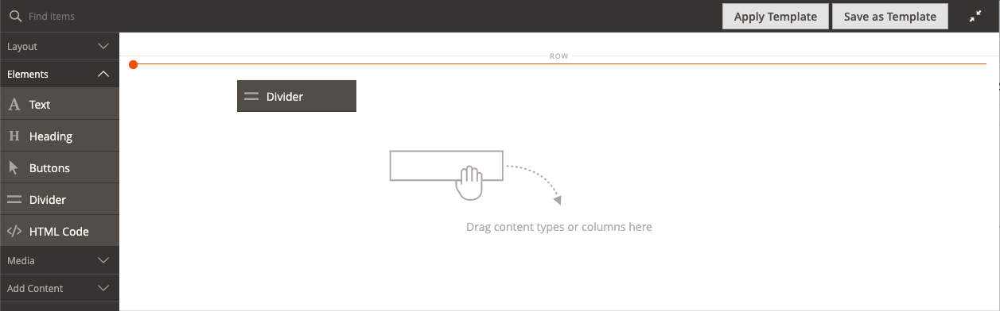

# Elementos: divisor

Utilice el tipo de contenido _Divider_ para agregar una regla como un salto visual entre secciones de contenido en la [[!DNL Page Builder] etapa](workspace.md#stage). Puede especificar el color de línea, el grosor y el ancho del divisor. También puede controlar la alineación, establecer los márgenes y el relleno y el formato del borde del contenedor. De forma predeterminada, el divisor es una regla de línea fina que amplía la anchura completa del contenedor, con margen para el relleno.

{width="500" zoomable="yes"}

Aunque la mayoría de los contenedores de divisor son invisibles, el siguiente ejemplo muestra el contenedor con un borde rojo discontinuo para que pueda ver la relación entre el divisor, el relleno y el contenedor. Puede ajustar el relleno en la parte superior e inferior del divisor para controlar el espaciado entre los elementos.

{width="500" zoomable="yes"}

{{$include /help/_includes/page-builder-save-timeout.md}}

## Cuadro de herramientas Divisor

| Herramienta | Icono | Descripción |
| ---- | --------------------| ------------|
| Mover | {width="25"} | Mueve el contenedor del divisor a otro lugar válido de la página. |
| (etiqueta) | DIVISOR | Identifica el contenedor actual como un elemento divisor. |
| Configuración | {width="25"} | Abre la página Editar divisor, donde puede cambiar las propiedades del divisor y su contenedor. |
| Hide | {width="25"} | Oculta el contenedor del divisor. |
| Mostrar | {width="25"} | Muestra el contenedor de divisores oculto. |
| Duplicar | {width="25"} | Realiza una copia del contenedor del divisor. |
| Eliminar | {width="25"} | Elimina el contenedor del divisor y su contenido del escenario. |

{style="table-layout:auto"}

{{$include /help/_includes/page-builder-hidden-element-note.md}}

## Añadir un divisor

1. En el panel [!DNL Page Builder], expanda **[!UICONTROL Elements]** y arrastre un marcador de posición **[!UICONTROL Divider]** a una fila, columna o conjunto de pestañas en el escenario.

   Utilice la guía roja como referencia al colocar el divisor antes o después de otro contenedor de contenido en el escenario.

   {width="600" zoomable="yes"}

   En el ejemplo siguiente, el divisor marca el comienzo de una nueva sección de texto.

   {width="500" zoomable="yes"}

1. Para especificar la configuración del nuevo divisor, siga el siguiente procedimiento.

## Cambio de la configuración del divisor

1. Pase el ratón sobre el contenedor del divisor para mostrar la caja de herramientas y elija el icono _Configuración_ ( {width="20"} ).

   {width="500" zoomable="yes"}

1. Cambie el divisor **[!UICONTROL Line Color]** mediante uno de los métodos siguientes:

   - Escriba un [nombre de color de HTML](https://en.wikipedia.org/wiki/Web_colors) válido. Por ejemplo, `Teal`.
   - Introduzca el valor de color hexadecimal. Por ejemplo, `#008080`.

   Una vez finalizado, haga clic en **[!UICONTROL Apply]**.

   {width="600" zoomable="yes"}

1. Escriba **[!UICONTROL Line Thickness]** en píxeles.

1. Para indicar la unidad de medida, escriba **[!UICONTROL Line Width]** seguido de `px` o `%`.

   {width="600" zoomable="yes"}

1. Actualice la configuración de _[!UICONTROL Advanced]_&#x200B;según sea necesario.

   - Para controlar la posición del divisor dentro del contenedor principal, elija **[!UICONTROL Alignment]**:

     | Opción | Descripción |
     | ------ | ----------- |
     | `Default` | Aplica la configuración predeterminada de alineación especificada en la hoja de estilos de la temática actual. |
     | `Left` | Alinea la lista a lo largo del borde izquierdo del contenedor principal, con margen para cualquier relleno que se especifique. |
     | `Center` | Alinea la lista en el centro del contenedor principal, con margen para cualquier relleno que se especifique. |
     | `Right` | Alinea el bloque a lo largo del borde derecho del contenedor principal, con margen para cualquier relleno que se especifique. |

     {style="table-layout:auto"}

     En el ejemplo siguiente, las opciones están configuradas para utilizar una alineación central para el divisor.

     {width="600" zoomable="yes"}

   - Establezca el estilo **[!UICONTROL Border]** aplicado a los cuatro lados del contenedor del divisor:

     | Opción | Descripción |
     | ------ | ----------- |
     | `Default` | Aplica el estilo de borde predeterminado especificado por la hoja de estilos asociada. |
     | `None` | No proporciona ninguna indicación visible de los bordes del contenedor. |
     | `Dotted` | El borde del contenedor aparece como una línea de puntos. |
     | `Dashed` | El borde del contenedor aparece como una línea discontinua. |
     | `Solid` | El borde del contenedor aparece como una línea sólida. |
     | `Double` | El borde del contenedor aparece como una línea doble. |
     | `Groove` | El borde del contenedor aparece como una línea ranurada. |
     | `Ridge` | El borde del contenedor aparece como una línea discontinua. |
     | `Inset` | El borde del contenedor aparece como una línea de margen. |
     | `Outset` | El borde del contenedor aparece como una línea de inicio. |

     {style="table-layout:auto"}

   - Si establece un estilo de borde distinto de `None`, complete las opciones de visualización de borde:

     | Opción | Descripción |
     | ------ |------------ |
     | [!UICONTROL Border Color] | Especifique el color seleccionando una muestra, haciendo clic en el selector de color o introduciendo un nombre de color válido o un valor hexadecimal equivalente. |
     | [!UICONTROL Border Width] | Introduzca el número de píxeles de la anchura de la línea del borde. |
     | [!UICONTROL Border Radius] | Introduzca el número de píxeles para definir el tamaño del radio que se utiliza para redondear cada esquina del borde. |

     {style="table-layout:auto"}

   - (Opcional) Especifique los nombres de **[!UICONTROL CSS classes]** de la hoja de estilos actual para aplicarlos al contenedor.

     Separe los distintos nombres de clase con un espacio.

   - Escriba valores, en píxeles, para que **[!UICONTROL Margins and Padding]** determine los márgenes exteriores y el margen interior del contenedor del divisor.

     Introduzca los valores correspondientes en el diagrama.

     | Área del contenedor | Descripción |
     | -------------- | ----------- |
     | [!UICONTROL Margins] | Cantidad de espacio en blanco que se aplica al borde exterior de todos los lados del contenedor. Opciones: `Top` / `Right` / `Bottom` / `Left` |
     | [!UICONTROL Padding] | Cantidad de espacio en blanco que se aplica al borde interior de todos los lados del contenedor. Opciones: `Top` / `Right` / `Bottom` / `Left` |

     {style="table-layout:auto"}

1. Una vez finalizado, haga clic en **[!UICONTROL Save]** para aplicar la configuración y volver al área de trabajo [!DNL Page Builder].

   {width="500" zoomable="yes"}

## Duplicación de un divisor

Para un divisor con formato y con una configuración específica, es más eficaz crear un duplicado en lugar de empezar de nuevo con un nuevo marcador de posición.

1. Pase el ratón sobre el contenedor del divisor para mostrar la caja de herramientas y elija el icono _Duplicar_ ( {width="20"} ).

   El contenedor de divisor duplicado aparece justo debajo del original.

   {width="500" zoomable="yes"}

1. Pase el ratón sobre el nuevo contenedor del divisor para ver la caja de herramientas y elija el icono _Mover_ ( {width="20"} ).

   {width="500" zoomable="yes"}

1. Seleccione y arrastre el divisor hasta que la guía roja marque la nueva posición.

   Los bordes superior e inferior de cada contenedor aparecen como líneas discontinuas mientras se mueve el divisor.

   {width="500" zoomable="yes"}

<!-- Last updated from includes: 2023-09-11 14:30:19 -->
