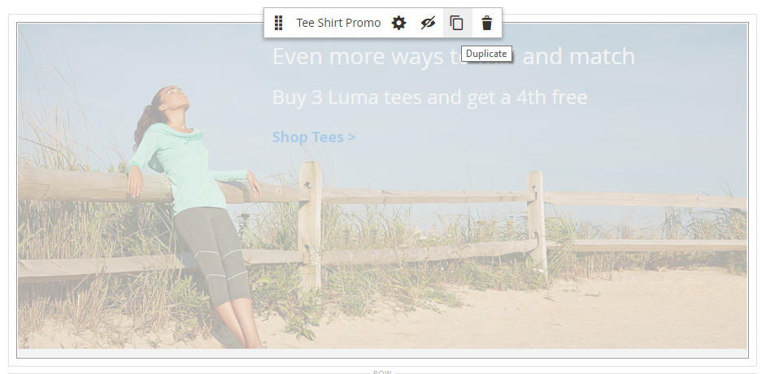

# Añadir contenido: bloque dinámico

Utilice el tipo de contenido Bloque dinámico para agregar un existente [bloque dinámico](../content-design/dynamic-blocks.md) a la [[!DNL Page Builder] stage](workspace.md#stage).

{width="700" zoomable="yes"}

{{$include /help/_includes/page-builder-save-timeout.md}}

## Cuadro de herramientas Bloque dinámico

| Herramienta | Icono | Descripción |
| --------- | ------------- | ----------------- |
| Mover | {width="25"} | Mueve el contenedor de bloque y su contenido a otra posición del escenario. |
| Configuración | {width="25"} | Abre el _Editar bloque_ , donde puede elegir el bloque y cambiar las propiedades del contenedor. |
| Hide | {width="25"} | Oculta el contenedor de bloques actual y su contenido. |
| Mostrar | {width="25"} | Muestra el contenedor de bloques oculto y su contenido. |
| Duplicar | {width="25"} | Realiza una copia del contenedor de bloques y de su contenido. |
| Eliminar | {width="25"} | Elimina el contenedor de bloques y su contenido del escenario. |

{style="table-layout:auto"}

{{$include /help/_includes/page-builder-hidden-element-note.md}}

## Añadir un bloque dinámico existente al escenario

1. Vaya a [!DNL Page Builder] espacio de trabajo en la página, bloque, producto o categoría de destino.

1. En el [!DNL Page Builder] panel, expandir **[!UICONTROL Add Content]** y arrastre un **[!UICONTROL Dynamic Block]** marcador de posición al escenario.

   {width="600" zoomable="yes"}

1. Pase el ratón sobre el contenedor de bloques dinámicos vacío para mostrar el cuadro de herramientas y elegir el _Configuración_ ( {width="20"} ) icono.

   {width="600" zoomable="yes"}

1. En el _Editar bloque dinámico_ página, haga clic en **[!UICONTROL Select Dynamic Block]** y utilice la lista para seleccionar el bloque.

   {width="600" zoomable="yes"}

   En la lista, busque el bloque dinámico que desea insertar y haga clic en **[!UICONTROL Select]**. A continuación, haga clic en **[!UICONTROL Add Selected]**.

   {width="600" zoomable="yes"}

   A continuación, aparece un resumen de la información del bloque dinámico.

   {width="600" zoomable="yes"}

1. Establecer **[!UICONTROL Template]** a uno de los siguientes:

   | Opción | Descripción |
   | ------ | ----------- |
   | `Dynamic Block Block Template` | Agrega un bloque independiente. |
   | `Dynamic Block Inline Template` | Inserta el contenido del bloque en el texto. |

   {style="table-layout:auto"}

   {width="200"}

1. Complete la Configuración avanzada según sea necesario.

1. Cuando termine, haga clic en **[!UICONTROL Save]** para aplicar la configuración de y volver a [!DNL Page Builder] workspace.

### Configuración avanzada

1. Para controlar la posición del bloque dinámico dentro del contenedor principal, elija una **[!UICONTROL Alignment]**:

   | Opción | Descripción |
   | ------ | ----------- |
   | `Default` | Aplica la configuración predeterminada de alineación especificada en la hoja de estilos de la temática actual. |
   | `Left` | Alinea la lista a lo largo del borde izquierdo del contenedor principal, con margen para cualquier relleno que se especifique. |
   | `Center` | Alinea la lista en el centro del contenedor principal, con margen para cualquier relleno que se especifique. |
   | `Right` | Alinea el bloque a lo largo del borde derecho del contenedor principal, con margen para cualquier relleno que se especifique. |

   {style="table-layout:auto"}

1. Configure las variables **[!UICONTROL Border]** estilo que se aplica a los cuatro lados del contenedor de bloques dinámico:

   | Opción | Descripción |
   | ------ | ----------- |
   | `Default` | Aplica el estilo de borde predeterminado especificado por la hoja de estilos asociada. |
   | `None` | No proporciona ninguna indicación visible de los bordes del contenedor. |
   | `Dotted` | El borde del contenedor aparece como una línea de puntos. |
   | `Dashed` | El borde del contenedor aparece como una línea discontinua. |
   | `Solid` | El borde del contenedor aparece como una línea sólida. |
   | `Double` | El borde del contenedor aparece como una línea doble. |
   | `Groove` | El borde del contenedor aparece como una línea ranurada. |
   | `Ridge` | El borde del contenedor aparece como una línea discontinua. |
   | `Inset` | El borde del contenedor aparece como una línea de margen. |
   | `Outset` | El borde del contenedor aparece como una línea de inicio. |

   {style="table-layout:auto"}

1. Si establece un estilo de borde distinto de `None`, complete las opciones de visualización de bordes:

   | Opción | Descripción |
   | ------ |------------ |
   | [!UICONTROL Border Color] | Especifique el color seleccionando una muestra, haciendo clic en el selector de color o introduciendo un nombre de color válido o un valor hexadecimal equivalente. |
   | [!UICONTROL Border Width] | Introduzca el número de píxeles de la anchura de la línea del borde. |
   | [!UICONTROL Border Radius] | Introduzca el número de píxeles para definir el tamaño del radio que se utiliza para redondear cada esquina del borde. |

   {style="table-layout:auto"}

1. (Opcional) Especifique los nombres de **[!UICONTROL CSS classes]** de la hoja de estilos actual para aplicarla al contenedor.

   Separe los distintos nombres de clase con un espacio.

1. Introduzca valores, en píxeles, para **[!UICONTROL Margins and Padding]** para determinar los márgenes exteriores y el relleno interno del contenedor de bloques dinámico.

   Introduzca los valores correspondientes en el diagrama.

   | Área del contenedor | Descripción |
   | -------------- | ----------- |
   | [!UICONTROL Margins] | Cantidad de espacio en blanco que se aplica al borde exterior de todos los lados del contenedor. Opciones: `Top` / `Right` / `Bottom` / `Left` |
   | [!UICONTROL Padding] | Cantidad de espacio en blanco que se aplica al borde interior de todos los lados del contenedor. Opciones: `Top` / `Right` / `Bottom` / `Left` |

   {style="table-layout:auto"}

## Editar configuración del contenedor de bloques dinámicos

1. Pase el ratón sobre el contenedor de bloques dinámicos para mostrar el cuadro de herramientas y elegir el _Configuración_ ( {width="20"} ) icono.

   {width="500" zoomable="yes"}

1. Si es necesario, cambie el bloque dinámico:

   - Haga clic **[!UICONTROL Select Dynamic Block]**.

     {width="20"}

   - En la lista de bloques dinámicos activos, haga clic en **[!UICONTROL Select]** para el bloque que desea agregar.

1. Actualice los ajustes restantes según sea necesario.

1. Cuando termine, haga clic en **[!UICONTROL Save]** para aplicar la configuración de y volver a [!DNL Page Builder] workspace.

## Duplicación de un bloque dinámico

1. Pase el ratón sobre el contenedor de bloques dinámicos para mostrar el cuadro de herramientas y elegir el _Duplicar_ ( {width="20"} ) icono.

   El duplicado aparece justo debajo del original.

   {width="500" zoomable="yes"}

1. Para mover el nuevo bloque dinámico a una posición diferente, pase el ratón sobre su contenedor y, a continuación, elija _Mover_ ( {width="20"} ) en el cuadro de herramientas.

1. Seleccione y arrastre el bloque dinámico hasta que aparezca la guía roja en la nueva posición.

   Los bordes superior e inferior de cada contenedor aparecen como líneas discontinuas mientras se mueve el bloque dinámico.

## Eliminación de un bloque dinámico del escenario

1. Pase el ratón sobre el contenedor de bloques dinámicos para mostrar el cuadro de herramientas y elegir el _Eliminar_ ( {width="20"} ) icono.

1. Cuando se le pida que confirme, haga clic en **[!UICONTROL OK]**.
