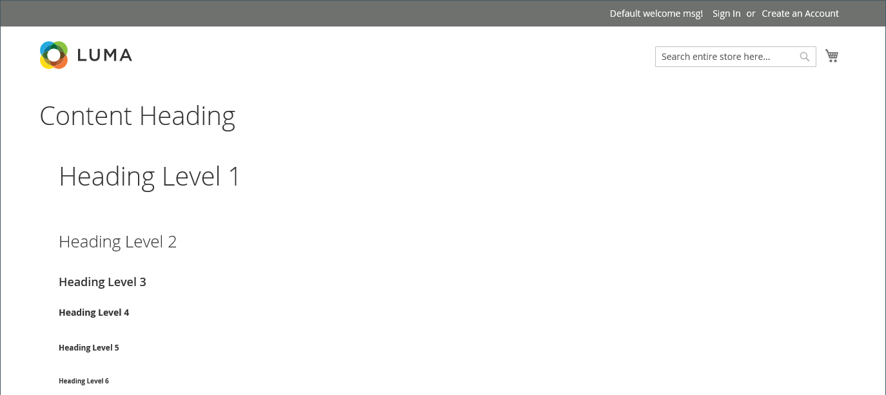

# Elementos: encabezado

Los niveles de encabezado establecen una jerarquía que organiza el contenido y ayuda a los motores de búsqueda a indexar cada página. Use el tipo de contenido _Encabezado_ en la [[!DNL Page Builder] fase](workspace.md#stage) para agregar un contenedor de texto con un nivel de encabezado de H1 a H6 a la fase. El formato de los encabezados depende de la hoja de estilos asociada al tema actual.

El campo [Encabezado de contenido](workspace.md) de la sección _[!UICONTROL Content]_&#x200B;se puede usar para agregar un encabezado H1 a la parte superior de la página. Sin embargo, el campo es un heredado de versiones anteriores de [!DNL Commerce] y se proporciona para admitir contenido antiguo. Este campo no aprovecha las características avanzadas de [!DNL Page Builder]. Se recomienda dejar en blanco el campo Encabezado de contenido y utilizar el tipo de contenido Encabezado [!DNL Page Builder] para agregar encabezados de cualquier nivel a la página.

El siguiente ejemplo muestra cómo aparecen el encabezado de contenido y el tipo de contenido de encabezado cuando se les aplica formato mediante la temática de Luma.

{width="700" zoomable="yes"}

Puede arrastrar un encabezado desde la sección _Elementos_ del panel [!DNL Page Builder] hasta una fila, columna o conjunto de pestañas del escenario. El nivel de encabezado y la alineación se pueden controlar desde la barra de herramientas del editor en el escenario o mediante el control _Settings_ ( {width="20"} ).

{{$include /help/_includes/page-builder-save-timeout.md}}

## Editor de encabezado

{width="500" zoomable="yes"}

## Cuadro de herramientas Contenedor de encabezado

Al igual que con todos los contenedores de contenido, la caja de herramientas aparece al pasar el ratón por encima del contenedor.

{width="500" zoomable="yes"}

| Herramienta | Icono | Descripción |
| --------- | ----------------- | ---------------------- |
| Mover | {width="25"} | Mueve el contenedor de encabezado a otro lugar válido de la página. |
| (etiqueta) | Encabezado | Identifica el contenedor actual como un encabezado. |
| Configuración | {width="25"} | Abre la página Editar encabezado, donde puede cambiar las propiedades del contenedor. |
| Hide | {width="25"} | Oculta el contenedor del encabezado. |
| Mostrar | {width="25"} | Muestra el contenedor de encabezados oculto. |
| Duplicar | {width="25"} | Realiza una copia del contenedor de encabezado. |
| Eliminar | {width="25"} | Elimina el contenedor de encabezado y su contenido del escenario. |

{style="table-layout:auto"}

{{$include /help/_includes/page-builder-hidden-element-note.md}}

## Añadir un encabezado

1. En el panel [!DNL Page Builder], expanda **[!UICONTROL Elements]** y arrastre un marcador de posición **[!UICONTROL Heading]** a una fila, columna o conjunto de pestañas en el escenario.

   {width="600" zoomable="yes"}

1. En el editor, escriba el texto del encabezado sobre el marcador de posición `Edit Heading Text`.

   De forma predeterminada, al texto del encabezado se le asigna un tipo de encabezado de nivel dos (H2).

   {width="500" zoomable="yes"}

1. En la barra de herramientas, elija el tipo de encabezado adecuado entre H1 y H6.

1. Cambie la alineación si es necesario.

## Editar configuración de encabezado

1. Pase el ratón sobre el contenedor del encabezado para ver la caja de herramientas y elija el icono _Configuración_ ( {width="20"} ).

   {width="500" zoomable="yes"}

1. Actualice el contenido del encabezado (**[!UICONTROL Heading Type]** y **[!UICONTROL Heading Text]**) si es necesario.

   También puede actualizar este contenido en el editor de encabezados.

1. Actualice la configuración de _[!UICONTROL Advanced]_&#x200B;según sea necesario.

   - Para controlar el posicionamiento del encabezado dentro del contenedor principal, elija un **[!UICONTROL Alignment]**:

     | Opción | Descripción |
     | ------ | ----------- |
     | `Default` | Aplica la configuración predeterminada de alineación especificada en la hoja de estilos de la temática actual. |
     | `Left` | Alinea la lista a lo largo del borde izquierdo del contenedor principal, con margen para cualquier relleno que se especifique. |
     | `Center` | Alinea la lista en el centro del contenedor principal, con margen para cualquier relleno que se especifique. |
     | `Right` | Alinea el bloque a lo largo del borde derecho del contenedor principal, con margen para cualquier relleno que se especifique. |

     {style="table-layout:auto"}

   - Establezca el estilo **[!UICONTROL Border]** aplicado a los cuatro lados del contenedor de encabezado:

     | Opción | Descripción |
     | ------ | ----------- |
     | `Default` | Aplica el estilo de borde predeterminado especificado por la hoja de estilos asociada. |
     | `None` | No proporciona ninguna indicación visible de los bordes del contenedor. |
     | `Dotted` | El borde del contenedor aparece como una línea de puntos. |
     | `Dashed` | El borde del contenedor aparece como una línea discontinua. |
     | `Solid` | El borde del contenedor aparece como una línea sólida. |
     | `Double` | El borde del contenedor aparece como una línea doble. |
     | `Groove` | El borde del contenedor aparece como una línea ranurada. |
     | `Ridge` | El borde del contenedor aparece como una línea discontinua. |
     | `Inset` | El borde del contenedor aparece como una línea de margen. |
     | `Outset` | El borde del contenedor aparece como una línea de inicio. |

     {style="table-layout:auto"}

   - Si establece un estilo de borde distinto de `None`, complete las opciones de visualización de borde:

     | Opción | Descripción |
     | ------ |------------ |
     | [!UICONTROL Border Color] | Especifique el color seleccionando una muestra, haciendo clic en el selector de color o introduciendo un nombre de color válido o un valor hexadecimal equivalente. |
     | [!UICONTROL Border Width] | Introduzca el número de píxeles de la anchura de la línea del borde. |
     | [!UICONTROL Border Radius] | Introduzca el número de píxeles para definir el tamaño del radio que se utiliza para redondear cada esquina del borde. |

     {style="table-layout:auto"}

   - (Opcional) Especifique los nombres de **[!UICONTROL CSS classes]** de la hoja de estilos actual para aplicarlos al contenedor.

     Separe los distintos nombres de clase con un espacio.

   - Escriba valores, en píxeles, para que **[!UICONTROL Margins and Padding]** determine los márgenes externos y el margen interno del contenedor de encabezado.

     Introduzca los valores correspondientes en el diagrama.

     | Área del contenedor | Descripción |
     | -------------- | ----------- |
     | [!UICONTROL Margins] | Cantidad de espacio en blanco que se aplica al borde exterior de todos los lados del contenedor. Opciones: `Top` / `Right` / `Bottom` / `Left` |
     | [!UICONTROL Padding] | Cantidad de espacio en blanco que se aplica al borde interior de todos los lados del contenedor. Opciones: `Top` / `Right` / `Bottom` / `Left` |

     {style="table-layout:auto"}

1. Una vez finalizado, haga clic en **[!UICONTROL Save]** para aplicar la configuración y volver al área de trabajo [!DNL Page Builder].

## Duplicación de un encabezado

Para un encabezado con formato y con una configuración específica, es más eficaz duplicarlo, en lugar de empezar de nuevo con un nuevo marcador de posición.

1. Pase el ratón sobre el contenedor del encabezado para mostrar la caja de herramientas y elija el icono _Duplicar_ ( {width="20"} ).

   El duplicado aparece justo debajo del original.

   {width="500" zoomable="yes"}

1. Pase el ratón sobre el nuevo contenedor de encabezados para mostrar la caja de herramientas y elija el icono _Mover_ ( {width="20"} ).

   {width="500" zoomable="yes"}

1. Seleccione y arrastre el encabezado hasta que la guía roja marque la nueva posición.

   Los bordes superior e inferior de cada contenedor aparecen como líneas discontinuas mientras se mueve el encabezado.

   {width="500" zoomable="yes"}

1. Si desea cambiar el nivel de encabezado, haga clic en el texto del encabezado y elija el nuevo nivel en la barra de herramientas del editor.

   {width="500" zoomable="yes"}
