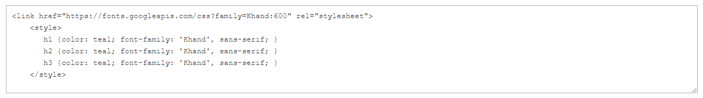

# Elementos: código del HTML

Utilice el _Código de HTML_ tipo de contenido para agregar fragmentos de código de HTML, CSS y JavaScript en la [[!DNL Page Builder] stage](workspace.md#stage). Por ejemplo, si desea agregar un HTML personalizado, declare una clase CSS que se pueda aplicar a un elemento de la página. O bien, es posible que desee agregar un fragmento de código para un logotipo, botón o banner que haya recibido de un proveedor de terceros.

## Cuadro de herramientas Código HTML

{width="500" zoomable="yes"}

| Herramienta | Icono | Descripción |
| --------- | ---------- | ----------------- |
| Mover | {width="25"} | Mueve el contenedor Código de HTML a otro lugar válido de la página. |
| Configuración | {width="25"} | Abre la página Editar código de HTML, donde puede cambiar las propiedades del contenedor. |
| Hide | {width="25"} | Oculta el contenedor Código de HTML. |
| Mostrar | {width="25"} | Muestra el contenedor de código de HTML oculto. |
| Duplicar | {width="25"} | Realiza una copia del contenedor Código de HTML. |
| Eliminar | {width="25"} | Elimina el contenedor de código del HTML y su contenido de la fase. |

{{$include /help/_includes/page-builder-hidden-element-note.md}}

## Añadir código de HTML

En el siguiente ejemplo se muestra cómo incrustar [Fuente Google][1] codificar y declarar clases de encabezados personalizados que anulen la hoja de estilos actual.

### Paso 1: Elegir una fuente de Google

1. Visite la [Google Fonts][1] y elija la familia de fuentes que desea utilizar.

1. Copie el código generado que se va a incrustar en el `<head>` de la página y péguela temporalmente en un editor de texto.

   - Incrustar código de fuente
   - Regla CSS

1. Agregue la regla de la familia de fuentes a cada clase de encabezado, incluyendo las clases de encabezado en una `<style>` etiqueta.

   Este código se ha pegado en [!DNL Page Builder].

   ```html
   <style>
      h1 {color: teal; font-family: 'Khand', sans-serif; }
      h2 {color: teal; font-family: 'Khand', sans-serif; }
      h3 {color: teal; font-family: 'Khand', sans-serif; }
   </style>
   ```

### Paso 2: Añadir el código a la página

1. En el _Administrador_ barra lateral de la tienda, vaya a **[!UICONTROL Content]** > _[!UICONTROL Elements]_>**[!UICONTROL Pages]**.

1. Busque la página donde la fuente va a estar disponible y ábrala en modo de edición.

1. Desplácese hacia abajo y expanda **[!UICONTROL Content]** sección.

1. En el [!DNL Page Builder] panel, expandir **[!UICONTROL Elements]** y arrastre un **[!UICONTROL HTML Code]** marcador de posición a una fila, columna o ficha establecida en el escenario.

   Utilice la guía roja para colocar el divisor antes o después de otro contenedor de contenido en la fila, columna o conjunto de pestañas.

   {width="600" zoomable="yes"}

1. Pase el ratón sobre el contenedor del HTML para mostrar el cuadro de herramientas y seleccione _Configuración_ ( {width="20"} ), icono.

1. En el cuadro de texto, pegue el código incrustado de Google Fonts y las declaraciones de estilo que ha preparado.

   Para facilitar la lectura, puede introducir algunos espacios para sangrar el código.

   {width="500" zoomable="yes"}

1. Actualice los ajustes restantes según sea necesario (consulte [Cambio de la configuración de código del HTML](#html-settings) para obtener más información).

1. En la esquina superior derecha, haga clic en **[!UICONTROL Save]** para aplicar la configuración de y volver a [!DNL Page Builder] workspace.

   La nueva fuente se procesa cuando la página se ve a través de un explorador.

### Paso 3: Previsualizar la página

1. En el _[!UICONTROL Currently Active]_sección, conjunto **[!UICONTROL Enable Page]**hasta `Yes`.

   {width="600" zoomable="yes"}

1. En la esquina superior derecha, haga clic **[!UICONTROL Save]** flecha y elija **[!UICONTROL Save & Close]**.

1. Busque la página en la cuadrícula y seleccione **[!UICONTROL View]** en el _[!UICONTROL Actions]_columna.

   {width="700" zoomable="yes"}

## Cambio de la configuración de código del HTML {#html-settings}

1. Pase el ratón sobre el contenedor del HTML para mostrar el cuadro de herramientas y seleccione _Configuración_ ( {width="20"} ) icono.

1. En el cuadro de texto, edite el código según sea necesario.

   HTML, CSS y código JavaScript son compatibles. Fragmentos de código que pertenecen a `<head>` de la página se puede introducir aquí.

   El editor también proporciona botones para insertar elementos especiales en el código:

   | Botón | Descripción |
   | ------ | ----------- |
   | Insertar widget... | Haga clic para insertar un widget en la posición del cursor en el cuadro de texto del HTML. |
   | Insertar imagen... | Haga clic aquí para insertar una imagen cargada o una imagen de la Galería en la posición del cursor en el cuadro de texto HTML. |
   | Insertar variable... | Haga clic aquí para insertar una variable en la posición del cursor en el cuadro de texto HTML. |

1. Actualice el _[!UICONTROL Advanced]_ajustes según sea necesario.

   - Para controlar la colocación del código dentro del contenedor principal, elija una **[!UICONTROL Alignment]**:

     | Opción | Descripción |
     | ------ | ----------- |
     | `Default` | Aplica la configuración predeterminada de alineación especificada en la hoja de estilos de la temática actual. |
     | `Left` | Alinea la lista a lo largo del borde izquierdo del contenedor principal, con margen para cualquier relleno que se especifique. |
     | `Center` | Alinea la lista en el centro del contenedor principal, con margen para cualquier relleno que se especifique. |
     | `Right` | Alinea el bloque a lo largo del borde derecho del contenedor principal, con margen para cualquier relleno que se especifique. |

     En el ejemplo siguiente, las opciones se establecen para utilizar una alineación central para el bloque de código procesado.

     {width="600" zoomable="yes"}

   - Configure las variables **[!UICONTROL Border]** estilo aplicado a los cuatro lados del contenedor de código:

     | Opción | Descripción |
     | ------ | ----------- |
     | `Default` | Aplica el estilo de borde predeterminado especificado por la hoja de estilos asociada. |
     | `None` | No proporciona ninguna indicación visible de los bordes del contenedor. |
     | `Dotted` | El borde del contenedor aparece como una línea de puntos. |
     | `Dashed` | El borde del contenedor aparece como una línea discontinua. |
     | `Solid` | El borde del contenedor aparece como una línea sólida. |
     | `Double` | El borde del contenedor aparece como una línea doble. |
     | `Groove` | El borde del contenedor aparece como una línea ranurada. |
     | `Ridge` | El borde del contenedor aparece como una línea discontinua. |
     | `Inset` | El borde del contenedor aparece como una línea de margen. |
     | `Outset` | El borde del contenedor aparece como una línea de inicio. |

   - Si establece un estilo de borde distinto de `None`, complete las opciones de visualización de bordes:

     | Opción | Descripción |
     | ------ |------------ |
     | [!UICONTROL Border Color] | Especifique el color seleccionando una muestra, haciendo clic en el selector de color o introduciendo un nombre de color válido o un valor hexadecimal equivalente. |
     | [!UICONTROL Border Width] | Introduzca el número de píxeles de la anchura de la línea del borde. |
     | [!UICONTROL Border Radius] | Introduzca el número de píxeles para definir el tamaño del radio que se utiliza para redondear cada esquina del borde. |

     {style="table-layout:auto"}

   - (Opcional) Especifique los nombres de **[!UICONTROL CSS classes]** de la hoja de estilos actual para aplicarla al contenedor.

     Separe los distintos nombres de clase con un espacio.

   - Introduzca valores, en píxeles, para **[!UICONTROL Margins and Padding]** para determinar los márgenes externos y el relleno interno del contenedor de código.

     Introduzca los valores correspondientes en el diagrama.

     | Área del contenedor | Descripción |
     | -------------- | ----------- |
     | [!UICONTROL Margins] | Cantidad de espacio en blanco que se aplica al borde exterior de todos los lados del contenedor. Opciones: `Top` / `Right` / `Bottom` / `Left` |
     | [!UICONTROL Padding] | Cantidad de espacio en blanco que se aplica al borde interior de todos los lados del contenedor. Opciones: `Top` / `Right` / `Bottom` / `Left` |

[1]: https://fonts.google.com/
