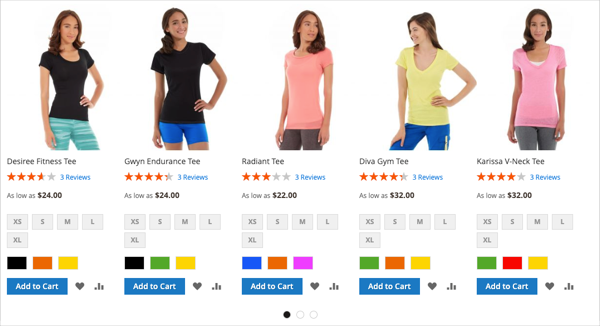
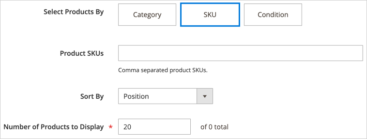

# Añadir contenido: productos

Utilice el tipo de contenido _Productos_ para agregar una lista de productos a la [[!DNL Page Builder] fase](workspace.md#stage), mediante un diseño de cuadrícula o carrusel. Use la herramienta [Agregar contenido: bloquear](block.md) para colocar el bloque en el escenario [!DNL Page Builder] y, a continuación, colocar una lista de productos dentro del bloque. También puede agregar la lista de productos directamente en una fila de una página.

## Directrices para utilizar el carrusel de productos

El carrusel de productos ofrece una forma potente y atractiva de mostrar sus productos. Para sacar el máximo partido a esto, se recomiendan las siguientes directrices:

- Agregue carruseles de productos directamente a los contenedores de ancho de página, como filas, pestañas o diseños de una columna. El uso de diseños de ancho de página garantiza la mejor visualización adaptable de los productos. [!DNL Page Builder] reduce el número de productos mostrados según la anchura de la página, no la anchura del contenedor.

- No agregue un carrusel de productos a una columna estrecha. Como se mencionó anteriormente, [!DNL Page Builder], de manera predeterminada, determina el número de productos que se mostrarán en función del ancho de página, no del ancho de columna.

- Si desea que el carrusel de productos se desplace continuamente, establezca **[!UICONTROL Autoplay]** y **[!UICONTROL Infinite Loop]** en `Yes`. Si la reproducción automática está establecida en `Yes` pero el bucle infinito está establecido en `No`, el desplazamiento automático se detiene al final de la lista de productos.

- Establezca **[!UICONTROL Carousel Mode]** en `Continuous` para resaltar, centrar y desplazar un producto a la vez dentro del carrusel. Los demás productos son visibles en la lista, pero transparentes para resaltar el producto centrado.

  {width="600"}

- Para mostrar y desplazar hasta cinco productos a la vez dentro del carrusel, mantenga **[!UICONTROL Carousel Mode]** establecido en `Default`.

  {width="600"}

Las siguientes instrucciones muestran cómo añadir una lista de productos a un bloque. A continuación, puede usar un [widget](../content-design/widgets.md) para colocar el bloque en una ubicación específica de cualquier página de su tienda.

{{$include /help/_includes/page-builder-save-timeout.md}}

## Cuadro de herramientas Productos

| Herramienta | Icono | Descripción |
| --------- | ------------- | ----------------- |
| Mover | {width="25"} | Mueve el contenedor de productos y su contenido a otra posición en el escenario. |
| Configuración | {width="25"} | Abre la página _Editar productos_, donde puede elegir la lista de productos y cambiar las propiedades del contenedor. |
| Hide | {width="25"} | Oculta el contenedor de productos actual y su contenido. |
| Mostrar | {width="25"} | Muestra el contenedor de productos ocultos y su contenido. |
| Duplicar | {width="25"} | Realiza una copia del contenedor de productos y de su contenido. |
| Eliminar | {width="25"} | Elimina el contenedor de productos y su contenido de la fase. |

{style="table-layout:auto"}

{{$include /help/_includes/page-builder-hidden-element-note.md}}

## Crear un bloque de lista de productos

1. En la barra lateral _Admin_, vaya a **[!UICONTROL Content]** > _[!UICONTROL Elements]_>**[!UICONTROL Blocks]**.

1. Haga clic en **[!UICONTROL Add New Block]**.

1. Escriba **[!UICONTROL Block Title]** y **[!UICONTROL Identifier]**.

1. Elija el **[!UICONTROL Store View]** en el que el bloque va a estar disponible.

1. Desplácese hacia abajo y haga clic en **[!UICONTROL Edit with Page Builder]** o dentro del área de vista previa de contenido para abrir el área de trabajo [!DNL Page Builder].

1. En el panel [!DNL Page Builder], expanda **[!UICONTROL Add Content]** y arrastre un marcador de posición **[!UICONTROL Products]** al escenario.

   {width="600" zoomable="yes"}

## Configuración del contenedor de lista de productos

Pase el ratón sobre el contenedor vacío de _Productos_ para ver la caja de herramientas y haga clic en el icono de _Configuración_ ({width="20"} ).

{width="500" zoomable="yes"}

Complete _Configuración_ según las siguientes secciones:

### Aspecto

1. Para determinar cómo se muestra la lista de productos en la página, elija uno de los tipos de aspecto visual:

   | Tipo | Descripción |
   | ---- | ----------- |
   | Cuadrícula de producto | Muestra los productos dentro de una cuadrícula que muestra cinco productos por fila (de forma predeterminada), con tantas filas como sea necesario para mostrar el número introducido en la configuración **[!UICONTROL Number of Products to Display]**. |
   | Carrusel de productos | Muestra los productos dentro de un carrusel (también conocido como control deslizante). El carrusel muestra hasta cinco productos por diapositiva.   **Alerta de capacidad de respuesta**: al seleccionar esta apariencia, es mejor agregar el tipo de contenido Productos directamente a una fila, pestaña o diseño de una columna donde sea adaptable, mostrando menos productos por lado en pantallas más pequeñas. Si lo agrega a tipos de contenido que son más estrechos que el ancho de la página (como una columna estrecha), el carrusel muestra más productos por diapositiva de los que permite el contenedor, independientemente del tamaño de pantalla. |

   {style="table-layout:auto"}

   {width="300"}

   Si elige el carrusel de productos, también debe configurar [Configuración de carrusel](#carousel-settings).

1. Para **[!UICONTROL Select Products By]**, elija el método de selección de productos:

   Puede seleccionar sus productos por categoría, SKU o condición. Estas opciones se excluyen mutuamente. Por ejemplo, no puede seleccionar la opción Categoría, utilizar el selector Categoría y, a continuación, cambiar a la opción Condición para agregar algunas condiciones. Los productos se seleccionan según lo que haya establecido para _una_ de estas tres opciones.

   - **[!UICONTROL Category]**: elija esta opción para mostrar los productos usando una categoría seleccionada.

     {width="500"}

     Cuando se selecciona, esta opción proporciona un selector **[!UICONTROL Category]**. Haga clic en la flecha y explore en profundidad la categoría de productos que desea mostrar. Por ejemplo, en los datos de ejemplo de [!DNL Commerce], si explora y selecciona _Mujeres > Tops > Tees_, se muestran todos los productos de esa categoría.

     {width="500"}

   - **[!UICONTROL SKU]**: elija esta opción para mostrar los productos usando uno o más SKU

     Cuando se selecciona, esta opción proporciona un cuadro de texto **[!UICONTROL Product SKUs]** en el que debe introducir una lista de SKU separados por comas para que se muestren.

     {width="500"}

   - **[!UICONTROL Condition]**: elija esta opción para mostrar los productos según una o varias condiciones que haya definido.

     Al seleccionarlo, hay herramientas disponibles para añadir condiciones a la selección de productos. Por ejemplo, puede seleccionar solo productos con un Género establecido en Unisex.

     {width="500"}

     >[!NOTE]
     >
     >Al seleccionar la opción Categoría o SKU, se proporciona la opción **[!UICONTROL Sort By]** de `Position`. Con esta opción de ordenación, los productos aparecen en el mismo orden en que aparecen en el catálogo. 
     >
     >En la opción Categoría, al ordenar por posición, se muestran los productos en el mismo orden en que aparecen en el catálogo. Para la opción SKU, al ordenar por posición, se muestran los productos en el orden en que se escriben en el cuadro de texto **[!UICONTROL Product SKUs]**.

1. Para **[!UICONTROL Sort By]**, elija el criterio de ordenación para los productos de la lista:

   | Opción | Descripción |
   | ------ | ----------- |
   | `Position` (solo para opciones de categoría y SKU) | Al seleccionar la opción Categoría, la posición muestra los productos en el mismo orden que su posición en el catálogo. Al seleccionar la opción SKU, la posición muestra los productos en el mismo orden que los SKU en el cuadro de texto SKU del producto. |
   | `Newest products first` | Ordena los productos por la fecha en que se agregaron al catálogo, mostrando primero los productos con las fechas de entrada más recientes. |
   | `Oldest products first` | Ordena los productos por la fecha en que se agregaron al catálogo, mostrando primero los productos con las fechas de entrada más antiguas. |
   | `Name: A - Z` | Ordena los productos en orden alfabético. |
   | `Name: Z - A` | Ordena los productos en orden alfabético inverso. |
   | `SKU: ascending` | Ordena los productos por SKU en orden alfanumérico. |
   | `SKU: descending` | Ordena los productos por SKU en orden alfanumérico inverso. |
   | `Stock: low stock first` | Ordena los productos del stock más bajo al más alto disponible. |
   | `Stock: high stock first` | Ordena los productos del stock más alto al más bajo disponible. |
   | `Price: high to low` | Ordena los productos de mayor a menor precio. |
   | `Price: low to high` | Ordena los productos del precio más bajo al más alto. |

   {style="table-layout:auto"}

   {width="300"}

1. Escriba **[!UICONTROL Number of Products to Display]** en el carrusel o cuadrícula.

   Los valores pueden estar comprendidos entre `1` y `999`. El valor predeterminado es `5` para una cuadrícula y `20` para un carrusel.

   >[!NOTE]
   >
   >Es posible que algunos productos de la configuración de Categoría, SKU o Condición no aparezcan en la cuadrícula o el carrusel de productos. Por ejemplo, los productos desactivados, los productos marcados como no visibles, los productos sin existencias y los productos asignados a otro sitio web no se muestran.

   >[!IMPORTANT]
   >
   >Los precios de los productos configurables, agrupados y agrupados (precio dinámico) no están definidos en el Administrador. Por lo tanto, estos productos no se muestran en **[!UICONTROL Preview]** si los productos están filtrados por precio. Estos productos no se pueden pedir correctamente en **[!UICONTROL Preview]** si se solicitan por precio.

### Configuración de carrusel

1. Para determinar cómo se muestran los productos dentro del carrusel, elija **[!UICONTROL Carousel Mode]**:

   | Opción | Descripción |
   | ------ | ----------- |
   | `Default` | El carrusel muestra cinco productos por diapositiva de forma predeterminada y reduce ese número según sea necesario. |
   | `Continuous` | El carrusel muestra cinco productos por diapositiva de forma predeterminada (con la mitad de un producto a la derecha y a la izquierda), pero centra y desplaza un producto a la vez en un bucle infinito. Los productos a la derecha e izquierda del producto centrado se atenúan para que se resalte el producto central. |

   {style="table-layout:auto"}

   Si cambia entre estos dos modos, se conservarán los demás ajustes del carrusel, excepto el ajuste **[!UICONTROL Infinite Loop]**, que siempre se establece en `Yes` en modo continuo y el campo se desactiva.

   {width="600" zoomable="yes"}

1. Si es necesario, establezca la opción **[!UICONTROL Autoplay]** en `Yes`.

   Cuando la reproducción automática está activada, el carrusel comienza a desplazarse automáticamente cuando se carga la página. Si deja la configuración predeterminada (`No`), el cliente debe hacer clic en el desplazamiento por diapositivas (puntos o flechas) para mostrar cada diapositiva en secuencia.

   Si habilita esta característica, escriba **[!UICONTROL Autoplay Speed]** para especificar el retardo en milisegundos entre cada diapositiva. El valor predeterminado es `4000` (4 segundos).

1. Si es necesario, establezca la opción **[!UICONTROL Infinite Loop]** en `Yes`.

   Cuando el bucle infinito está habilitado, la presentación con diapositivas se reproduce indefinidamente mientras la página está abierta. Si deja la configuración predeterminada (`No`), la presentación con diapositivas se reproducirá solo una vez.

   >[!NOTE]
   >
   >Si establece **[!UICONTROL Infinite Loop]** en `No` y **[!UICONTROL Autoplay]** en `Yes`, la reproducción automática se detiene al final del número de productos que se van a mostrar.

1. Si es necesario, establezca la opción **[!UICONTROL Show Arrows]** en `Yes`.

   Cuando esta opción está habilitada, cada diapositiva incluye _siguiente_ y _anterior_ flechas de navegación a la izquierda y a la derecha. Si deja la configuración predeterminada (`No`), las diapositivas no mostrarán flechas de navegación.

1. Si es necesario, establezca la opción **[!UICONTROL Show Dots]** en `No`.

   Cuando se establece la configuración predeterminada (`Yes`), aparecen puntos de navegación en la parte inferior del control deslizante del carrusel. Si desactiva esta configuración, el deslizador del carrusel no mostrará puntos de navegación.

### Avanzadas

1. Para controlar el posicionamiento de la lista Productos dentro del contenedor principal, elija **[!UICONTROL Alignment]**:

   | Opción | Descripción |
   | ------ | ----------- |
   | `Default` | Aplica la configuración predeterminada de alineación especificada en la hoja de estilos de la temática actual. |
   | `Left` | Alinea la lista a lo largo del borde izquierdo del contenedor principal, con margen para cualquier relleno que se especifique. |
   | `Center` | Alinea la lista en el centro del contenedor principal, con margen para cualquier relleno que se especifique. |
   | `Right` | Alinea la lista a lo largo del borde derecho del contenedor principal, con margen para cualquier relleno que se especifique. |

   {style="table-layout:auto"}

1. Establezca el estilo **[!UICONTROL Border]** que se aplica a los cuatro lados del contenedor Productos:

   | Opción | Descripción |
   | ------ | ----------- |
   | `Default` | Aplica el estilo de borde predeterminado especificado por la hoja de estilos asociada. |
   | `None` | No proporciona ninguna indicación visible de los bordes del contenedor. |
   | `Dotted` | El borde del contenedor aparece como una línea de puntos. |
   | `Dashed` | El borde del contenedor aparece como una línea discontinua. |
   | `Solid` | El borde del contenedor aparece como una línea sólida. |
   | `Double` | El borde del contenedor aparece como una línea doble. |
   | `Groove` | El borde del contenedor aparece como una línea ranurada. |
   | `Ridge` | El borde del contenedor aparece como una línea discontinua. |
   | `Inset` | El borde del contenedor aparece como una línea de margen. |
   | `Outset` | El borde del contenedor aparece como una línea de inicio. |

   {style="table-layout:auto"}

1. Si establece un estilo de borde distinto de `None`, complete las opciones de visualización de borde:

   | Opción | Descripción |
   | ------ |------------ |
   | [!UICONTROL Border Color] | Especifique el color seleccionando una muestra, haciendo clic en el selector de color o introduciendo un nombre de color válido o un valor hexadecimal equivalente. |
   | [!UICONTROL Border Width] | Introduzca el número de píxeles de la anchura de la línea del borde. |
   | [!UICONTROL Border Radius] | Introduzca el número de píxeles para definir el tamaño del radio que se utiliza para redondear cada esquina del borde. |

   {style="table-layout:auto"}

1. (Opcional) Especifique los nombres de **[!UICONTROL CSS classes]** de la hoja de estilos actual para aplicarlos al contenedor.

   Separe los distintos nombres de clase con un espacio.

1. Escriba valores, en píxeles, para que **[!UICONTROL Margins and Padding]** determine los márgenes externos y el relleno interno del contenedor de productos.

   Introduzca los valores correspondientes en el diagrama.

   | Área del contenedor | Descripción |
   | -------------- | ----------- |
   | [!UICONTROL Margins] | Cantidad de espacio en blanco que se aplica al borde exterior de todos los lados del contenedor. Opciones: `Top` / `Right` / `Bottom` / `Left` |
   | [!UICONTROL Padding] | Cantidad de espacio en blanco que se aplica al borde interior de todos los lados del contenedor. Opciones: `Top` / `Right` / `Bottom` / `Left` |

## Guardar y previsualizar en el escenario

En la esquina superior derecha, haga clic en **[!UICONTROL Save]** para aplicar la configuración y volver al área de trabajo [!DNL Page Builder].

Si configuró un carrusel de productos, debería tener un aspecto similar al siguiente ejemplo:

{width="600"}

Ahora puedes usar un [widget](../content-design/widgets.md) para colocar este bloque donde quieras que aparezca en la tienda. O bien, puede usar [Agregar contenido - Bloquear](block.md) para agregar el bloque a una página, ficha o bloque existente.

<!-- Last updated from includes: 2023-09-11 14:30:19 -->
