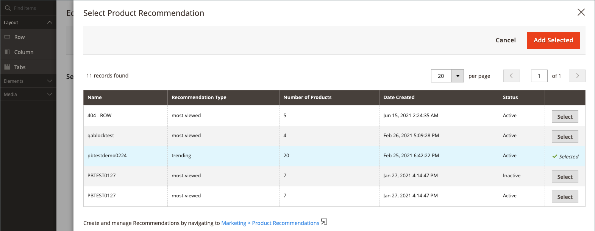
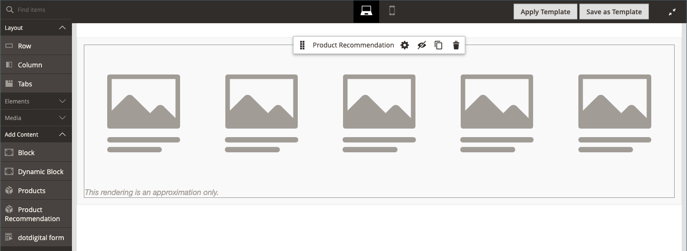

# Añadir contenido: recomendaciones de productos

Use el tipo de contenido _Product Recommendations_ para agregar una [unidad de recomendación](https://experienceleague.adobe.com/en/docs/commerce/product-recommendations/admin/create) activa y existente a la [[!DNL Page Builder] fase](workspace.md#stage) para una página de CMS, un bloque o un bloque dinámico.

>[!NOTE]
>
>El tipo de contenido [!DNL Page Builder] _Product Recommendations_ se admite en Adobe Commerce 2.4.4 y versiones posteriores y está disponible en [Product Recommendations metapackage versiones 3.0.x o posteriores](https://commercemarketplace.adobe.com/magento-product-recommendations.html). Para agregar compatibilidad con [!DNL Page Builder] para Product Recommendations, [consulte la información de instalación](https://experienceleague.adobe.com/en/docs/commerce/product-recommendations/getting-started/install-configure). **Este tipo de contenido no está disponible para Magento Open Source.**

{{$include /help/_includes/page-builder-save-timeout.md}}

## Cuadro de herramientas Recomendaciones de productos

| Herramienta | Icono | Descripción |
| --- | --| --- |
| Mover | {width="25"} | Mueve el contenedor de recomendación de producto y su contenido a otra posición del escenario. |
| Configuración | {width="25"} | Abre la página Editar recomendación de producto, donde puede elegir la unidad de recomendación y cambiar las propiedades del contenedor. |
| Hide | {width="25"} | Oculta el contenedor de recomendación de producto actual y su contenido. |
| Mostrar | {width="25"} | Muestra el contenedor de recomendación de producto oculto y su contenido. |
| Duplicar | {width="25"} | Crea una copia duplicada del contenedor de recomendación de productos y su contenido. |
| Eliminar | {width="25"} | Elimina el contenedor de recomendación de producto y su contenido de la fase. |

{style="table-layout:auto"}

{{$include /help/_includes/page-builder-hidden-element-note.md}}

## Agregar una unidad de recomendación existente

1. Asegúrese de que ya ha [creado una unidad de recomendación](https://experienceleague.adobe.com/en/docs/commerce/product-recommendations/admin/create) para el tipo de página [!DNL Page Builder].

>[!NOTE]
>
>Solo puede crear unidades de recomendación para el tipo de página [!DNL Page Builder] en la vista de tienda predeterminada.

1. Abra la página, el bloque o el bloque dinámico en modo de edición.

1. Expanda la sección _[!UICONTROL Content]_&#x200B;y haga clic en **[!UICONTROL Edit with Page Builder]**&#x200B;o dentro del área de vista previa de contenido para abrir el área de trabajo [!DNL Page Builder].

1. En el panel [!DNL Page Builder] bajo _[!UICONTROL Layout]_, arrastre un marcador de posición **[!UICONTROL Row]**&#x200B;al escenario.

1. En el panel [!DNL Page Builder] bajo _[!UICONTROL Add Content]_, arrastre un marcador de posición **[!UICONTROL Product Recommendation]**&#x200B;a la fila.

   {width="600" zoomable="yes"}

1. Realice una de las siguientes acciones:

   - Haga clic en **[!UICONTROL Edit Product Recommendation]**.
   - Pase el ratón sobre el contenedor vacío para ver la caja de herramientas y haga clic en el icono _Configuración_ ().

   {width="600" zoomable="yes"}

1. En la sección _[!UICONTROL Selection]_, haga clic en **[!UICONTROL Select]**.

1. En la lista de recomendaciones de productos activas, busque la fila con la unidad de recomendación que desee agregar y haga clic en **[!UICONTROL Select]** en la última columna.

   {width="600" zoomable="yes"}

1. En la esquina superior derecha, haga clic en **[!UICONTROL Add Selected]**.

   El nombre de la recomendación de producto seleccionada aparece en la sección _[!UICONTROL Selection]_&#x200B;de la página&#x200B;_[!UICONTROL Edit Product Recommendation]_.

1. Realice los cambios necesarios en la [configuración avanzada](#advanced-settings).

   {width="600" zoomable="yes"}

1. Cuando termine, haga lo siguiente:

   - Si trabaja con una ventana del explorador totalmente maximizada, haga clic en el icono _Cerrar pantalla completa_ () en la esquina superior derecha del área de trabajo.

   - Haga clic en **[!UICONTROL Save]** para aplicar la configuración y volver al área de trabajo [!DNL Page Builder].

   Cuando vuelva al escenario, las imágenes de marcador de posición del producto aparecerán en el contenedor.

## Editar configuración de unidad de recomendación

1. Pase el ratón sobre el contenedor de la unidad de recomendación para ver la caja de herramientas y haga clic en el icono _Configuración_ ().

   {width="600" zoomable="yes"}

1. Realice los cambios necesarios en la [configuración avanzada](#advanced-settings).

1. Una vez finalizado, haga clic en **[!UICONTROL Save]** para aplicar la configuración y volver al área de trabajo [!DNL Page Builder].

## Duplicación de una unidad de recomendación

1. Pase el ratón sobre el contenedor de unidades de recomendación para ver la caja de herramientas y haga clic en el icono _Duplicar_ () de la caja de herramientas.

   El duplicado aparece justo debajo del original.

1. Para mover la unidad de recomendación duplicada a una nueva posición, pase el ratón sobre el contenedor y haga clic en el icono _Mover_ () de la caja de herramientas.

1. Seleccione y arrastre la unidad de recomendación hasta que aparezca la guía roja en la nueva posición.

   Los bordes superior e inferior de cada contenedor aparecen como líneas discontinuas mientras se mueve la unidad de recomendación.

## Quitar una unidad de recomendación de la fase

1. Pase el ratón sobre el contenedor de la unidad de recomendación y haga clic en el icono _Quitar_ () de la caja de herramientas.

1. Cuando se le pida que confirme, haga clic en **[!UICONTROL OK]**.

## Configuración avanzada

1. Para controlar la colocación de la unidad de Product Recommendations en el contenedor principal, elija **[!UICONTROL Alignment]**:

   | Opción | Descripción |
   | ------ | ----------- |
   | `Default` | Aplica la configuración predeterminada de alineación especificada en la hoja de estilos de la temática actual. |
   | `Left` | Alinea la unidad a lo largo del borde izquierdo del contenedor principal, con margen para cualquier relleno que se especifique. |
   | `Center` | Alinea la unidad en el centro del contenedor principal, con margen para cualquier relleno que se especifique. |
   | `Right` | Alinea la unidad a lo largo del borde derecho del contenedor principal, con margen para cualquier relleno que se especifique. |

   {style="table-layout:auto"}

1. Establezca el estilo **[!UICONTROL Border]** que se aplica a los cuatro lados de la unidad Recomendaciones de productos:

   | Opción | Descripción |
   | ------ | ----------- |
   | `Default` | Aplica el estilo de borde predeterminado especificado por la hoja de estilos asociada. |
   | `None` | No proporciona ninguna indicación visible de los bordes de la unidad. |
   | `Dotted` | El borde de la unidad aparece como una línea de puntos. |
   | `Dashed` | El borde de la unidad aparece como una línea discontinua. |
   | `Solid` | El borde de la unidad aparece como una línea sólida. |
   | `Double` | El borde de la unidad aparece como una línea doble. |
   | `Groove` | El borde de la unidad aparece como una línea ranurada. |
   | `Ridge` | El borde de la unidad aparece como una línea discontinua. |
   | `Inset` | El borde de la unidad aparece como una línea de margen. |
   | `Outset` | El borde de la unidad aparece como una línea de inicio. |

   {style="table-layout:auto"}

1. Si establece un estilo de borde distinto de `None`, complete las opciones de visualización de borde:

   | Opción | Descripción |
   | ------ |------------ |
   | [!UICONTROL Border Color] | Especifique el color seleccionando una muestra, haciendo clic en el selector de color o introduciendo un nombre de color válido o un valor hexadecimal equivalente. |
   | [!UICONTROL Border Width] | Introduzca el número de píxeles de la anchura de la línea del borde. |
   | [!UICONTROL Border Radius] | Introduzca el número de píxeles para definir el tamaño del radio que se utiliza para redondear cada esquina del borde. |

   {style="table-layout:auto"}

1. (Opcional) Especifique los nombres de **[!UICONTROL CSS classes]** de la hoja de estilos actual para aplicarlos a la unidad.

   Separe los distintos nombres de clase con un espacio.

1. Escriba valores, en píxeles, para que **[!UICONTROL Margins and Padding]** determine los márgenes externos y el relleno interno de la unidad.

   Introduzca los valores correspondientes en el diagrama.

   | Área del contenedor | Descripción |
   | ------ | ----------- |
   | [!UICONTROL Margins] | Cantidad de espacio en blanco que se aplica al borde exterior de todos los lados de la unidad. Opciones: `Top` / `Right` / `Bottom` / `Left` |
   | [!UICONTROL Padding] | Cantidad de espacio en blanco que se aplica al borde interior de todos los lados de la unidad. Opciones: `Top` / `Right` / `Bottom` / `Left` |

   {style="table-layout:auto"}

<!-- Last updated from includes: 2023-09-11 14:30:19 -->
