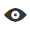
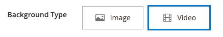

# Diseño - Fila

Utilice el tipo de contenido _Row_ para agregar una fila en la [[!DNL Page Builder] etapa](workspace.md#stage).

{{$include /help/_includes/page-builder-save-timeout.md}}

## Cuadro de herramientas Fila

El cuadro de herramientas de fila aparece cuando pasa el ratón por encima del contenedor de filas. El cuadro de herramientas incluye opciones para mover, ocultar, duplicar, editar o quitar la fila. La selección de la configuración determina el aspecto, el fondo y el diseño de la fila. Se pueden arrastrar elementos de contenido adicionales a la fila desde el panel [!DNL Page Builder] de la izquierda.

{width="600" zoomable="yes"}

| Herramienta | Icono | Descripción |
| --------- | ---------- | ----------- |
| Mover | {width="25"} | Mueve la fila a otra posición en relación con otras filas del escenario. |
| (etiqueta) | [!UICONTROL Row] | Identifica el contenedor de contenido actual como una fila. Pase el ratón sobre el contenedor para ver la caja de herramientas. |
| Configuración | {width="25"} | Abre la página Editar fila, donde puede cambiar las propiedades del contenedor. |
| Hide | {width="25"} | Oculta la fila actual. |
| Mostrar | {width="25"} | Muestra la fila oculta. |
| Duplicar | {width="25"} | Realiza una copia de la fila. |
| Eliminar | {width="25"} | Elimina el contenedor de filas y su contenido de la fase. |

{style="table-layout:auto"}

{{$include /help/_includes/page-builder-hidden-element-note.md}}

## Añadir una fila

1. En el panel [!DNL Page Builder] bajo _[!UICONTROL Layout]_, arrastre un nuevo(a)**[!UICONTROL Row]**al escenario, justo debajo de la primera fila.

1. Para dar formato a la fila, pasa el ratón sobre el contenedor de filas para mostrar el cuadro de herramientas y elige el icono _Configuración_ ( {width="20"} ).

   Utilice las secciones siguientes para obtener información detallada sobre cómo completar la configuración disponible.

   {width="600" zoomable="yes"}

## Cambiar configuración de fila

1. Pase el ratón sobre el contenedor de filas para mostrar la caja de herramientas y elija el icono _Configuración_ ( {width="20"} ).

   {width="600" zoomable="yes"}

1. Utilice las secciones siguientes para obtener información detallada sobre la actualización de la configuración disponible.

1. Una vez finalizado, haga clic en **[!UICONTROL Save]** para aplicar la configuración y volver al área de trabajo [!DNL Page Builder].

## Aspecto

Use la configuración _Apariencia_ para determinar cómo se muestra el contenido en la fila.

{width="600" zoomable="yes"}

- Para determinar cómo aparece el color de fondo o la imagen de fondo en relación con el contenedor y la anchura del área de contenido, elija la alineación:

  | Opción | Descripción |
  | ------ | ----------- |
  | [!UICONTROL Contained] | El color de fondo o la imagen están limitados al ancho de página máximo definido por la temática. |
  | [!UICONTROL Full Width] | Limita el contenido al ancho de página máximo definido por la temática. El color de fondo o la imagen no están limitados y amplían el ancho completo de la fila. |
  | [!UICONTROL Full Bleed] | El contenido, la imagen de fondo o el color no están limitados y amplían el ancho completo de la fila. La opción de sangrado completo solo se puede usar con [temas](../content-design/themes.md) que admitan el diseño. |

  {style="table-layout:auto"}

- Escriba **[!UICONTROL Minimum Height]** para la fila. Este valor puede ser un número con cualquier unidad CSS válida (como `100px`, `50%`, `50em`, `100vh`) o un cálculo (como `100vh - 237px`).

  Por ejemplo, puede establecer la altura mínima de una fila para ampliar la altura completa de la página, lo que le ofrece opciones atractivas para imágenes y vídeos de fondo de página completa.

- Elija una configuración de **[!UICONTROL Vertical Alignment]** para alinear cualquier contenedor de contenido que se agregue a la fila (Superior, Centro o Inferior).

## Contexto

Existen muchas opciones para definir la visualización de fondo de una fila. Puede aplicar un color simple o una imagen de fondo, y administrar efectos más sofisticados.

### Color de fondo

Especifique el color de fondo eligiendo una muestra, haciendo clic en el selector de color o introduciendo un nombre de color válido o un valor hexadecimal equivalente. Esta configuración determina el color de fondo de la fila. También puede ajustar la opacidad del color.

{width="200"}

Puede establecer el valor de una de las tres maneras siguientes:

- Un nombre de color predefinido, como `White`
- El valor hexadecimal del color, como `#ffffff`
- El valor rgba del color, con un porcentaje de opacidad, como `rgba(255, 255, 255, 0.75)`

Si desea elegir un color, haga clic en la muestra a la izquierda del cuadro _Sin color_.

{width="600" zoomable="yes"}

Si hace clic en el cuadro de color para abrir de nuevo el selector de color, el cuadro situado debajo del control deslizante mostrará los valores actuales de rojo, verde, azul y alfa (rgba). El último número indica el porcentaje de opacidad actual como decimal. Puede utilizar el control deslizante para ajustar la opacidad o introducir el valor decimal deseado.

{width="600" zoomable="yes"}

>[!NOTE]
>
>[!DNL Page Builder] también admite una capa de transparencia, o _canal alfa_, en imágenes de fondo que se pueden usar para crear fondos con distintos grados de opacidad.

### [!UICONTROL Background Type]

Un tipo de fondo puede ser una imagen o un vídeo. [!DNL Page Builder] toma el valor predeterminado de `Image` y muestra varias configuraciones de imagen. Si selecciona `Video`, [!DNL Page Builder] intercambia la configuración de la imagen por la configuración del vídeo. Ambos tipos de fondo se describen de la siguiente manera.

{width="200"}

### Configuración del tipo de imagen

Si establece _[!UICONTROL Background Type]_en `Image`, utilice la siguiente configuración para definir la visualización de la imagen de fondo.

{width="600" zoomable="yes"}

- **[!UICONTROL Background Image]**: si es necesario, utilice las herramientas proporcionadas para elegir una imagen de fondo que aplicar a la fila:

  | Opción | Descripción |
  | ------ | ----------- |
  | [!UICONTROL Upload] | Carga un archivo de imagen desde el equipo local a la galería y, a continuación, lo aplica como imagen de fondo de la fila. |
  | [!UICONTROL Select from Gallery] | Le pide que elija una imagen existente de la galería como imagen de fondo para la fila. |
  | {width="25"} | Permite arrastrar la imagen al mosaico de la cámara o navegar a la imagen en el sistema de archivos local. |

  {style="table-layout:auto"}

- **[!UICONTROL Background Mobile Image]**: si es necesario, utilice las mismas herramientas para elegir una imagen de fondo diferente para usarla en dispositivos móviles.

- **[!UICONTROL Background Size]** - Establezca esta opción para determinar cómo se escala la imagen de fondo en relación con el ancho de la fila:

  | Opción | Descripción |
  | ------ | ----------- |
  | `Cover` | La imagen de fondo cubre el ancho completo de la fila. |
  | `Contain` | La imagen de fondo está limitada a la anchura del área de contenido. |
  | `Auto` | Aplica el tamaño de la hoja de estilos actual. |

  {style="table-layout:auto"}

  {width="250"}

- **[!UICONTROL Background Position]** - Establezca esta opción para determinar cómo se ancla la imagen de fondo en relación con la fila:

  | Punto de ancla | Posición |
  | ------ | ----------- |
  | `Top` | Izquierda/Centro/Derecha |
  | `Center` | Izquierda/Centro/Derecha |
  | `Bottom` | Izquierda/Centro/Derecha |

  {style="table-layout:auto"}

  El punto de ancla es como un pin de inserción que adjunta la imagen a la fila en la posición de fondo especificada.

- **[!UICONTROL Background Attachment]**: establezca el tipo de datos adjuntos para determinar cómo se mueve la imagen de fondo en relación con la página de desplazamiento:

  | Opción | Descripción |
  | ------ | ----------- |
  | `Scroll` | La imagen de fondo adjunta se sincroniza para moverse hacia abajo a medida que la página se desplaza. Utilice Fondo paralaje para controlar la velocidad de desplazamiento. |
  | `Fixed` | (No disponible para móviles) La imagen de fondo no se mueve cuando el contenedor se desplaza por la imagen y está fijo en la posición de fondo especificada. |

  {style="table-layout:auto"}

- **[!UICONTROL Background Repeat]** - Se establece en `Yes` para repetir la imagen de fondo y rellenar el espacio disponible en la fila.

### Configuración del tipo de vídeo

Si establece el _Tipo de fondo_ en `Video`, use la siguiente configuración para definir la visualización de la imagen de fondo.

- **[!UICONTROL Video URL]**: escriba una dirección URL de vídeo válida. Las direcciones URL de vídeo válidas pueden ser vínculos a:

   - Vídeos de YouTube: `https://youtu.be/CoDhMRUUjeI`
   - Vídeos de Vimeo: `https://vimeo.com/190156113`
   - Archivos de vídeo válidos (`.mp4` se recomienda): `https://myvideos.com/spiral.mp4`

  {width="300"}

- **[!UICONTROL Overlay Color]**: seleccione un color para aplicar un matiz transparente al vídeo.

- **[!UICONTROL Infinite Loop]** - Se estableció en `No` para que el vídeo se reproduzca una vez y se detenga. Cuando esta opción está establecida en `Yes` (predeterminada), el vídeo se repite en un bucle infinito.

- **[!UICONTROL Lazy Load]** - Se establece en `No` para que el vídeo se cargue con la página, incluso cuando no esté visible. Cuando esta opción se establece en `Yes` (predeterminada), el vídeo se carga desde el origen solo cuando está visible en la pantalla.

- **[!UICONTROL Play Only When Visible]** - Se establece en `No` para que el vídeo comience a reproducirse inmediatamente después de cargarse, independientemente de si está visible o no. Cuando esta opción se establece en `Yes` (predeterminada), el vídeo solo se reproducirá cuando esté visible.

- **[!UICONTROL Fallback Image]**: si es necesario, especifique una imagen para que se muestre en la pantalla antes de que se cargue el vídeo y si, por algún motivo, el vídeo no se carga.

## Fondo de paralaje

Utilice estas opciones para controlar la velocidad de una imagen de fondo o un vídeo de desplazamiento en relación con el desplazamiento de la página. El fondo se puede configurar para que se desplace más lentamente para crear una sensación de inmersión.

- Establecer **Habilitar fondo de paralaje** en `Yes`.
- Escriba **Velocidad de paralaje** como un valor decimal entre `-1.0` y `2.0`.

{width="600" zoomable="yes"}

## Avanzadas

- Para controlar la posición horizontal de los contenedores de contenido que se agregan a la fila, elija un **[!UICONTROL Alignment]**:

  | Opción | Descripción |
  | ------ | ----------- |
  | `Default` | Aplica la configuración predeterminada de alineación especificada en la hoja de estilos de la temática actual. |
  | `Left` | Alinea los contenedores de contenido a lo largo del borde izquierdo del contenedor de filas, con margen para cualquier relleno que se especifique. |
  | `Center` | Alinea el contenedor de contenido en el centro del contenedor de filas, con margen para cualquier relleno que se especifique. |
  | `Right` | Alinea el contenedor de contenido a lo largo del borde derecho del contenedor de filas, con margen para cualquier relleno que se especifique. |

  {style="table-layout:auto"}

- Establezca el estilo **[!UICONTROL Border]** que se aplica a los cuatro lados del contenedor de filas:

  | Opción | Descripción |
  | ------ | ----------- |
  | `Default` | Aplica el estilo de borde predeterminado especificado por la hoja de estilos asociada. |
  | `None` | No proporciona ninguna indicación visible de los bordes del contenedor. |
  | `Dotted` | El borde del contenedor aparece como una línea de puntos. |
  | `Dashed` | El borde del contenedor aparece como una línea discontinua. |
  | `Solid` | El borde del contenedor aparece como una línea sólida. |
  | `Double` | El borde del contenedor aparece como una línea doble. |
  | `Groove` | El borde del contenedor aparece como una línea ranurada. |
  | `Ridge` | El borde del contenedor aparece como una línea discontinua. |
  | `Inset` | El borde del contenedor aparece como una línea de margen. |
  | `Outset` | El borde del contenedor aparece como una línea de inicio. |

  {style="table-layout:auto"}

- Si establece un estilo de borde distinto de `None`, complete las opciones de visualización de borde:

  {width="600" zoomable="yes"}

  | Opción | Descripción |
  | ------ |------------ |
  | [!UICONTROL Border Color] | Especifique el color seleccionando una muestra, haciendo clic en el selector de color o introduciendo un nombre de color válido o un valor hexadecimal equivalente. |
  | [!UICONTROL Border Width] | Introduzca el número de píxeles de la anchura de la línea del borde. |
  | [!UICONTROL Border Radius] | Introduzca el número de píxeles para definir el tamaño del radio que se utiliza para redondear cada esquina del borde. |

  {style="table-layout:auto"}

  La fila del ejemplo siguiente tiene un radio de borde de 15.

  {width="500"}

- (Opcional) Especifique los nombres de **[!UICONTROL CSS classes]** de la hoja de estilos actual para aplicarlos al contenedor de filas.

  Separe los distintos nombres de clase con un espacio.

- Escriba valores, en píxeles, para que **[!UICONTROL Margins and Padding]** especifique los márgenes exteriores y el margen interior de la fila.

  Introduzca cada valor correspondiente en el diagrama del contenedor de filas.

  | Área del contenedor | Descripción |
  | -------------- | ----------- |
  | [!UICONTROL Margins] | Cantidad de espacio en blanco que se aplica al borde exterior de todos los lados del contenedor. Opciones: `Top` / `Right` / `Bottom` / `Left` |
  | [!UICONTROL Padding] | Cantidad de espacio en blanco que se aplica al borde interior de todos los lados del contenedor. Opciones: `Top` / `Right` / `Bottom` / `Left` |

  {style="table-layout:auto"}

  {width="600" zoomable="yes"}

<!-- Last updated from includes: 2023-09-11 14:30:19 -->
