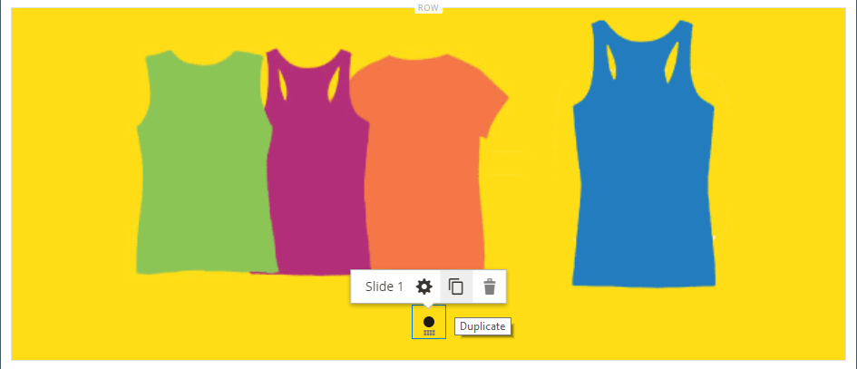
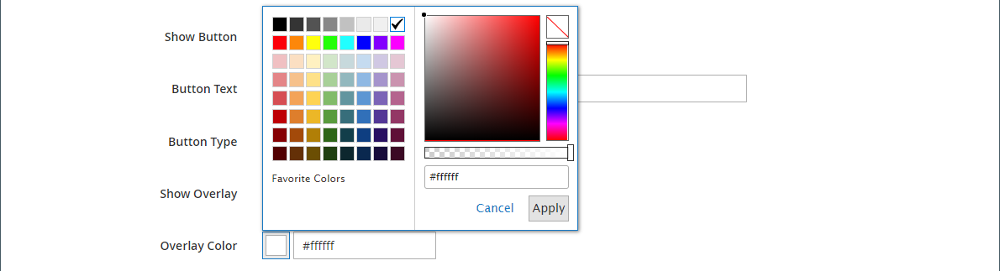
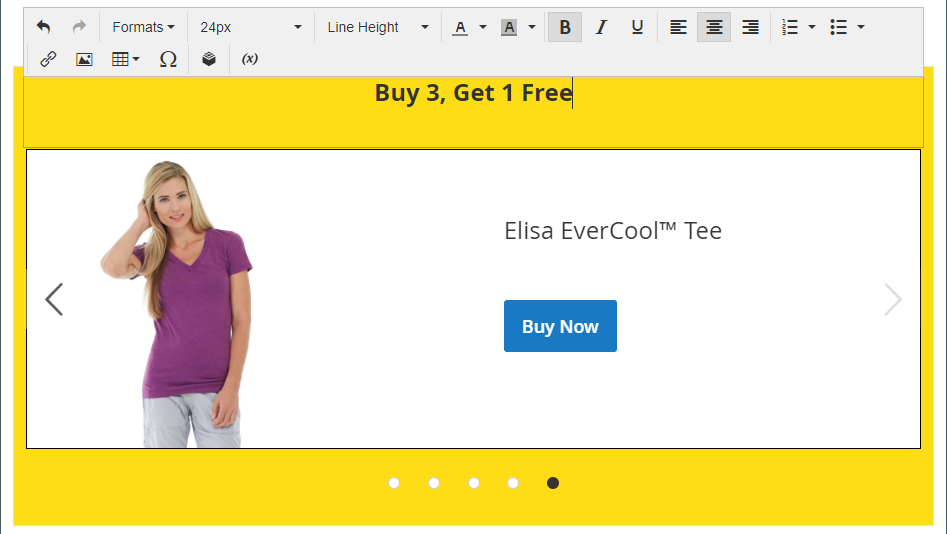

# Medios: deslizador

Utilice el _Regulador_ tipo de contenido para agregar una presentación de imágenes a la [[!DNL Page Builder] stage](workspace.md#stage). Puede cargar imágenes nuevas o elegir imágenes existentes de la galería o del catálogo de productos. Se puede configurar un control deslizante para que se reproduzca automáticamente o se controle manualmente con los botones de navegación. Para asociar el control deslizante a una promoción específica, consulte [Bloque dinámico](dynamic-block.md).

{width="700" zoomable="yes"}

{{$include /help/_includes/page-builder-save-timeout.md}}

## Cajas de herramientas

Cuando se trabaja con el tipo de contenido Regulador, se agregan y editan diapositivas individuales y el contenedor deslizante que contiene una o más diapositivas. Cada diapositiva tiene su propia caja de herramientas que se utiliza para diseñar diapositivas en la [!DNL Page Builder] escenario.

## Cuadro de herramientas de diapositiva individual

{width="500" zoomable="yes"}

| Herramienta | Icono | Descripción |
|--- |--- |--- |
| Mover | {width="25"} | Mueve la diapositiva a otra posición en el control deslizante. |
| (etiqueta) | Diapositiva # | Identifica el número de la diapositiva actual. |
| Configuración | {width="25"} | Abre el _[!UICONTROL Edit Slide]_, donde puede cambiar las propiedades de la diapositiva actual. |
| Duplicar | {width="25"} | Realiza una copia de la diapositiva actual. |
| Eliminar | {width="25"} | Elimina la diapositiva actual del regulador. |

{style="table-layout:auto"}

## Cuadro deslizante

| Herramienta | Icono | Descripción |
|--- |--- |--- |
| Mover | {width="25"} | Mueve el control deslizante a otra posición del escenario. |
| (etiqueta) | [!UICONTROL Slider] | Identifica el contenedor del control deslizante. |
| Configuración | {width="25"} | Abre el _[!UICONTROL Edit Slider]_, donde puede cambiar las propiedades del vídeo y del contenedor. |
| Hide | {width="25"} | Oculta el control deslizante actual. |
| Mostrar | {width="25"} | Muestra el control deslizante oculto. |
| Duplicar | {width="25"} | Realiza una copia del control deslizante. |
| Eliminar | {width="25"} | Elimina el control deslizante del escenario. |

{style="table-layout:auto"}

{{$include /help/_includes/page-builder-hidden-element-note.md}}

## Agregar una diapositiva individual

1. Abra la página, el bloque o el bloque dinámico donde desee colocar el control deslizante y expanda el **[!UICONTROL Content]** sección.

1. En el [!DNL Page Builder] panel, expandir **[!UICONTROL Media]** y arrastre un **[!UICONTROL Slider]** marcador de posición a una fila, columna o ficha del escenario.

   En el ejemplo siguiente, el color de fondo de la fila es amarillo (`#fffd16`).

   {width="600" zoomable="yes"}

   El contenedor del deslizador se muestra en el escenario con una sola diapositiva vacía.

1. Haga clic en el contenedor del control deslizante para mostrar el [editor de texto](../content-design/editor.md) e introduzca el contenido para la primera diapositiva.

   También puede incluir contenido de titular más complejo mediante el [Contenido](#content) configuración.

1. Haga clic en el punto de navegación situado en la parte inferior del control deslizante para mostrar el cuadro de herramientas de la diapositiva individual y seleccione _Configuración_ ( {width="20"} ) icono.

   Los deslizadores tienen dos cajas de herramientas. Asegúrese de utilizar la caja de herramientas de diapositivas situada en la parte inferior.

1. Complete la configuración según sea necesario en las siguientes secciones:

   - [[!UICONTROL Appearance]](#appearance)
   - [[!UICONTROL Background]](#background)
   - [[!UICONTROL Content]](#content)
   - [[!UICONTROL Search Engine Optimization]](#seo)
   - [[!UICONTROL Advanced]](#advanced)

1. Cuando termine, haga clic en **[!UICONTROL Save]** para aplicar la configuración de y volver a [!DNL Page Builder] workspace.

## Agregar más diapositivas

En las secciones siguientes se describe una serie de pasos para comenzar con una diapositiva individual y crear un control deslizante adaptable que incluya características y vínculos a productos específicos. Si todavía no tiene una diapositiva individual, siga las instrucciones anteriores para agregar una diapositiva individual al escenario.

Para agregar diapositivas, utilice uno o una combinación de los métodos siguientes:

### Método 1: duplicar una diapositiva existente

Puede ahorrar tiempo duplicando una diapositiva que ya se haya configurado con la configuración necesaria.

1. Haga clic en el punto de navegación situado debajo de la diapositiva para mostrar el cuadro de herramientas y elegir _Duplicar_ ( {width="20"} ) icono.

   {width="500" zoomable="yes"}

1. Haga clic en el punto de navegación de la nueva diapositiva y para mostrar el cuadro de herramientas y elegir _Configuración_ ( {width="20"} ) icono.

1. Modifique la configuración, según sea necesario, según las siguientes secciones:

   - [[!UICONTROL Appearance]](#appearance)
   - [[!UICONTROL Background]](#background)
   - [[!UICONTROL Content]](#content)
   - [[!UICONTROL Advanced]](#advanced)

1. Cuando termine, haga clic en **[!UICONTROL Save]** para aplicar la configuración de y volver a [!DNL Page Builder] workspace.

### Método 2: añadir una nueva diapositiva en blanco

1. Pase el ratón sobre el contenedor del deslizador situado en la parte superior para mostrar el cuadro de herramientas y seleccione _Añadir_ ( {width="20"} ) icono.

   {width="500" zoomable="yes"}

   Se agrega una nueva diapositiva en blanco con su propio punto de navegación y cuadro de herramientas al control deslizante y se muestra en el escenario.

   {width="500" zoomable="yes"}

1. Haga clic en el punto de navegación de la nueva diapositiva y para mostrar el cuadro de herramientas y elegir _Configuración_ ( {width="20"} ) icono.

1. Modifique la configuración, según sea necesario, según las siguientes secciones:

   - [[!UICONTROL Appearance]](#appearance)
   - [[!UICONTROL Background]](#background)
   - [[!UICONTROL Content]](#content)
   - [[!UICONTROL Advanced]](#advanced)

1. Cuando termine, haga clic en **[!UICONTROL Save]** en la esquina superior derecha para cerrar el _[!UICONTROL Edit Slide]_página.

### Agregar un widget en una diapositiva

Puede añadir cualquiera [tipo de widgets](../content-design/widgets.md#widget-types) a la diapositiva en un [!DNL Page Builder] Realice la fase siguiendo estos pasos:

1. [Creación del widget](../content-design/widget-create.md) que desee ver en una diapositiva.

1. Abra la página, el bloque o el bloque dinámico donde desee colocar el control deslizante y expanda el **[!UICONTROL Content]** sección.

1. En el [!DNL Page Builder] panel, expandir **[!UICONTROL Media]** y arrastre un **[!UICONTROL Slider]** marcador de posición a una fila, columna o ficha del escenario.

1. Haga clic en el contenedor del control deslizante para mostrar el [editor de texto](../content-design/editor.md) y haga clic en _Insertar widget_ ( {width="20"} ) icono.

1. Seleccione el **[!UICONTROL Widget Type]** lo necesitas.

1. Especifique la configuración, que es diferente según el tipo de widget

   {width="600" zoomable="yes"}

1. Cuando termine, haga clic en **[!UICONTROL Insert Widget]** en la esquina superior derecha.

1. Modifique el resto de configuraciones según sea necesario.

1. Cuando termine, haga clic en **[!UICONTROL Save]** en la esquina superior derecha.

   {width="600" zoomable="yes"}

### Ver cada diapositiva

Para mostrar cada diapositiva en el escenario, haga clic en el siguiente punto debajo de la diapositiva mostrada actualmente.

{width="500" zoomable="yes"}

La diapositiva del ejemplo anterior tiene una imagen de fondo, una imagen móvil transparente y una imagen en línea que se ha agregado desde el editor de texto. Esta técnica funciona bien en dispositivos móviles al desactivar la imagen de fondo y mostrar solo la imagen en línea más pequeña. La diapositiva de producto de este ejemplo tiene la siguiente configuración adicional:

| Opción | Ejemplo de configuración |
|--- |--- |
| [!UICONTROL Appearance] | `Collage Right` |
| [!UICONTROL Background Color] | `#ffffff` (Blanco) |
| [!UICONTROL Background Image] | La imagen de esta diapositiva se guardó desde la página de producto y se cargó en la galería. |
| [!UICONTROL Mobile Background Image] | La imagen de fondo móvil es una imagen transparente con un cuadrado de 10 píxeles. El uso de una imagen en blanco para móviles reemplaza eficazmente la imagen de fondo estándar con una imagen invisible. |
| [!UICONTROL Background Size] | `Auto` |
| [!UICONTROL Message Text] | `Minerva LumaTech&trade; V-Tee` (Alinear al centro) con la imagen insertada a una escala del 40% (Alinear al centro) |
| [!UICONTROL Link] | `Product` |
| [!UICONTROL Show Button] | `Always` |
| [!UICONTROL Button Text] | `Buy Now` |
| [!UICONTROL Show Overlay] | `Never Show` |
| [!UICONTROL Alignment] | `Center` (para alinear el botón) |
| [!UICONTROL Border] | `Solid` |
| [!UICONTROL Border Color] | `#000000` (Negro) |
| [!UICONTROL Border Width] | `1 px` |

{style="table-layout:auto"}

## Cambiar la configuración de diapositiva individual

1. Cambie la presentación del control deslizante en el escenario y vea la diapositiva que desee cambiar.

1. En el cuadro de herramientas de diapositivas individual, elija la opción _Configuración_ ( {width="20"} ) y complete la configuración, según sea necesario, según las secciones siguientes.

1. En la esquina superior derecha, haga clic en **[!UICONTROL Save]** para aplicar la configuración de y volver a [!DNL Page Builder] workspace.

### [!UICONTROL Appearance]

1. Elija uno de los siguientes tipos de colocación de diapositivas:

   | Tipo | Descripción |
   | ---- | ----------- |
   | `Poster` | Centra el contenido de la diapositiva en el contenedor del control deslizante. Si se utiliza, la superposición amplía la anchura completa del control deslizante. |
   | `Collage Left` | Coloca el contenido de la diapositiva en un área definida del lado izquierdo del contenedor del control deslizante. Si se utiliza la superposición, solo se cubre el área definida. |
   | `Collage Center` | Coloca el contenido de la diapositiva en un área definida centrada en el contenedor del control deslizante. Si se utiliza la superposición, solo se cubre el área definida. |
   | `Collage Right` | Coloca el contenido de la diapositiva en un área definida en el lado derecho del contenedor del control deslizante. Si se utiliza la superposición, solo se cubre el área definida. |

   {style="table-layout:auto"}

   {width="600" zoomable="yes"}

1. Introduzca el **[!UICONTROL Slide Name]**.

   Cuando se trabaja en modo de edición, el nombre de la diapositiva aparece como información sobre herramientas encima del punto de navegación. El nombre de la diapositiva no es visible desde la tienda.

   {width="500" zoomable="yes"}

1. Introduzca el **[!UICONTROL Minimum Height]** para la diapositiva.

   La altura mínima puede ser un número con cualquier unidad CSS válida (como `100px`, `50%`, `50em`, `100vh`) o un cálculo (como `100vh - 237px`).

   Por ejemplo, puede establecer la altura mínima de la diapositiva para cubrir toda la altura de la página y, a continuación, utilizar imágenes y vídeos de fondo para obtener opciones de diseño atractivas.

   >[!NOTE]
   >
   >Cuando la diapositiva está ajustada a la altura completa de la página (100 vh), el control deslizante que contiene la diapositiva también amplía la altura completa de la página para ajustarse a la altura de la diapositiva.

## [!UICONTROL Background]

Existen muchas opciones para definir la visualización de fondo de una diapositiva. Puede aplicar un color simple o una imagen de fondo, y administrar efectos más sofisticados.

### [!UICONTROL Background Color]

Especifique el color de fondo eligiendo una muestra, haciendo clic en el selector de color o introduciendo un nombre de color válido o un valor hexadecimal equivalente. Esta configuración determina el color de fondo de la fila. También puede ajustar la opacidad del color.

{width="200"}

Puede establecer el valor de una de las tres maneras siguientes:

- Un nombre de color predefinido, como `White`
- El valor hexadecimal del color, como `#ffffff`
- El valor de rgba para el color, con un porcentaje de opacidad, como `rgba(255, 255, 255, 0.75)`

Si desea elegir un color, haga clic en la muestra a la izquierda del _Sin color_ cuadro.

{width="600" zoomable="yes"}

Si hace clic en el cuadro de color para abrir de nuevo el selector de color, el cuadro situado debajo del control deslizante mostrará los valores actuales de rojo, verde, azul y alfa (rgba). El último número indica el porcentaje de opacidad actual como decimal. Puede utilizar el control deslizante para ajustar la opacidad o introducir el valor decimal deseado.

{width="600" zoomable="yes"}

>[!NOTE]
>
>[!DNL Page Builder] también admite una capa de transparencia, o _canal alfa_, en imágenes de fondo que pueden utilizarse para crear fondos con distintos grados de opacidad.

### [!UICONTROL Background Type]

Un tipo de fondo puede ser una imagen o un vídeo. [!DNL Page Builder] el valor predeterminado es `Image` y muestra varios ajustes de imagen. Si selecciona `Video`, [!DNL Page Builder] cambia la configuración de la imagen por la configuración del vídeo. Ambas configuraciones de tipo de fondo se describen en las secciones siguientes.

{width="400"}

### Configuración del tipo de imagen

Si establece la variable _[!UICONTROL Background Type]_hasta `Image`, utilice la siguiente configuración para definir la visualización de la imagen de fondo.

{width="600" zoomable="yes"}

- **[!UICONTROL Background Image]** - Si es necesario, utilice las herramientas proporcionadas para elegir una imagen de fondo para aplicarla al titular:

  | Herramienta | Descripción |
  | ---- | ----------- |
  | [!UICONTROL Upload] | Carga un archivo de imagen desde el equipo local a la galería y, a continuación, lo aplica como imagen de fondo para el titular. |
  | [!UICONTROL Select from Gallery] | Le pide que elija una imagen existente de la galería como imagen de fondo para el titular. |
  | {width="25"} | Permite arrastrar la imagen al mosaico de la cámara o navegar a la imagen en el sistema de archivos local. |

  {style="table-layout:auto"}

- **[!UICONTROL Background Mobile Image]** : Si es necesario, utilice las mismas herramientas para elegir una imagen de fondo diferente para utilizarla en la visualización en dispositivos móviles.

- **[!UICONTROL Background Size]** - Elija la escala de la imagen de fondo en relación con la anchura del titular:

  | Opción | Descripción |
  | ------ | ----------- |
  | `Cover` | La imagen de fondo cubre la anchura completa del titular. |
  | `Contain` | La imagen de fondo está limitada a la anchura del área de contenido. |
  | `Auto` | Aplica el tamaño de la hoja de estilos actual. |

  {style="table-layout:auto"}

  {width="400"}

- **[!UICONTROL Background Position]** - Elija cómo se ancla la imagen de fondo en relación con el banner:

  | Punto de ancla | Posición |
  | ------------ | -------- |
  | `Top` | Izquierda/Centro/Derecha |
  | `Center` | Izquierda/Centro/Derecha |
  | `Bottom` | Izquierda/Centro/Derecha |

  {style="table-layout:auto"}

  El punto de ancla es como un pin de inserción que adjunta la imagen al titular en la posición de fondo especificada.

- **[!UICONTROL Background Repeat]** - Si desea repetir la imagen de fondo para rellenar el espacio, cambie este ajuste `Yes`.

### Configuración del tipo de vídeo

Si establece la variable _Tipo de fondo_ hasta `Video`, utilice la siguiente configuración para definir la visualización de la imagen de fondo.

- **[!UICONTROL Video URL]** : introduzca una URL de vídeo válida. Las direcciones URL de vídeo válidas pueden ser vínculos a:

   - Vídeos de YouTube: `https://youtu.be/CoDhMRUUjeI`
   - Vídeos de Vimeo: `https://vimeo.com/190156113`
   - Archivos de vídeo válidos (`.mp4` se recomienda): `https://myvideos.com/spiral.mp4`

  {width="500"}

- **[!UICONTROL Overlay Color]** - Seleccione un color para aplicar un tinte transparente al vídeo.

- **[!UICONTROL Infinite Loop]** - Configurado como `No` para que el vídeo se reproduzca una vez y se detenga. Cuando esta opción se establece en `Yes` (valor predeterminado), el vídeo se repite en un bucle infinito.

- **[!UICONTROL Lazy Load]** - Configurado como `No` para que el vídeo se cargue con la página, incluso cuando no esté visible. Cuando esta opción se establece en `Yes` (opción predeterminada), el vídeo se carga desde el origen solo cuando está visible en la pantalla.

- **[!UICONTROL Play Only When Visible]** - Configurado como `No` para que el vídeo comience a reproducirse inmediatamente después de cargarse, independientemente de si está visible. Cuando esta opción se establece en `Yes` (opción predeterminada), el vídeo solo se reproducirá cuando esté visible.

- **[!UICONTROL Fallback Image]** - Si es necesario, especifique una imagen para mostrar en la pantalla antes de que se cargue el vídeo y si el vídeo no se carga por alguna razón.

## [!UICONTROL Content]

Puede modificar el contenido de la diapositiva directamente en el escenario o al cambiar la configuración. La configuración proporciona funciones de contenido más complejas, como vínculos de diapositivas y botones, y superposiciones. La posición del contenido refleja el [Aspecto](#appearance) configuración de ubicación.

### Contenido sencillo en el escenario

1. Haga clic en el marcador de posición o en el texto existente e introduzca el nuevo texto que desea que aparezca en la diapositiva.

   La barra de herramientas del editor aparece encima del cuadro de texto.

1. Utilice la barra de herramientas del editor para introducir y dar formato al texto, así como para insertar elementos como vínculos, imágenes y widgets.

   {width="500" zoomable="yes"}

### Contenido complejo en la configuración

1. Haga clic en el punto de navegación situado en la parte inferior del control deslizante para mostrar el cuadro de herramientas de la diapositiva individual y seleccione _Configuración_ ( {width="20"} ) icono.

1. En el _[!UICONTROL Content]_, introduzca la **[!UICONTROL Message Text]**que desea que aparezca con la diapositiva.

1. Desplácese hacia abajo hasta el _[!UICONTROL Content]_y utilice la sección **[!UICONTROL Message Text]**editor para introducir y dar formato al texto del banner.

   También puede insertar elementos, como vínculos de texto, imágenes y widgets.

1. Aplique formato al texto según sea necesario mediante la barra de herramientas del editor.

   La primera diapositiva de este ejemplo tiene una imagen de fondo, pero no contiene texto de mensaje. El `Buy 3 Get 1 Free` el texto situado encima del control deslizante se encuentra en un contenedor de texto (que se añadirá más adelante).

1. Si es necesario, especifique un **[!UICONTROL Link]** para la diapositiva.

   El vínculo es la página de destino que aparece cuando el cliente hace clic en el área de la diapositiva. Puede utilizar uno de los tres tipos de vínculos:

   - **[!UICONTROL URL]** : Vínculos a una dirección URL relativa o completa.

   - **[!UICONTROL Product]** : identifica la página de destino según el nombre del producto o el SKU. Busque el producto por nombre en función de un nombre parcial o completo. Elija el producto de la lista de resultados de búsqueda.

     {width="600" zoomable="yes"}

   - **[!UICONTROL Category]** : identifica la página de destino como una categoría o subcategoría específica en el árbol de categorías. Busque la categoría en función de un nombre parcial o completo. Elija la categoría de la sección expandida del árbol mostrado.

     {width="600" zoomable="yes"}

   - **[!UICONTROL Page]** : identifica la página de destino como una página de contenido específica. Busque la página en función de un nombre parcial o completo. Elija la página en la lista de resultados de la búsqueda.

     {width="600" zoomable="yes"}

   

   A partir de la versión 2.4.1, [!DNL Page Builder] ya no admite la vinculación de la diapositiva y los vínculos dentro del texto anidado debido a problemas con la visualización en la tienda. Si utiliza un vínculo en _[!UICONTROL Message Text]_, no puede configurar _[!UICONTROL Link]_ opción. Si prefiere utilizar un solo vínculo para toda la diapositiva, puede quitar todos los vínculos del texto.

   {width="300"}
   

   Si desea evitar que el visitante salga de su tienda, seleccione la opción **[!UICONTROL Open in new tab]** casilla de verificación Cuando se desactiva la casilla de verificación, el destino vinculado se abre en la misma pestaña del explorador, lo que podría sacar al visitante de la tienda.

1. Si es necesario, agregue un botón para pedir a los clientes que sigan el vínculo.

   La diapositiva _Aspecto_ position coloca un solo vínculo o botón debajo del texto. Complete las propiedades del vínculo o del botón que desee agregar.

   {width="600" zoomable="yes"}

   >[!NOTE]
   >
   >También puede utilizar varios botones o vínculos añadiendo una [bloquear](block.md) al titular. Para evitar conflictos, mantenga todos los vínculos o botones en el bloque independiente y no agregue un vínculo o botón directamente al titular.

   - Establecer **[!UICONTROL Show Button]** a uno de los siguientes:

     | Opción | Descripción |
     | ------ | ----------- |
     | `Always` | En la diapositiva siempre aparece un botón. |
     | `On Hover` | Un botón aparece en la diapositiva sólo al pasar el ratón por encima. |
     | `Never Show` | Nunca aparece un botón en la diapositiva. |

     {style="table-layout:auto"}

   - Introduzca el **[!UICONTROL Button Text]** para mostrar en el botón.

   - Establecer **[!UICONTROL Button Type]** a uno de los siguientes:

     | Opción | Descripción |
     | ------ | ----------- |
     | `Primary` | Aplica el estilo del botón principal de la hoja de estilos actual. |
     | `Secondary` | Aplica el estilo del botón secundario de la hoja de estilos actual, si corresponde. |
     | `Link` | Crea un hipervínculo en lugar de un botón. |

     {style="table-layout:auto"}

     El estilo de botón del tema actual determina el formato del botón. Normalmente, un botón principal tiene un color de fondo más prominente que un botón secundario.

1. Establecer **[!UICONTROL Show Overlay]** a uno de los siguientes:

   | Opción | Descripción |
   | ------ | ----------- |
   | `Always` | La superposición siempre es visible. |
   | `On Hover` | La superposición solo aparece al pasar el ratón por encima. |
   | `Never Show` | La superposición no es visible. |

   {style="table-layout:auto"}

   Puede utilizar una superposición para aplicar un color de fondo al área de contenido activo definida por la configuración Aspecto. La imagen de fondo de la diapositiva permanece visible durante todo el ancho de la diapositiva.

   {width="600" zoomable="yes"}

   Si elige mostrar una superposición, configure el **[!UICONTROL Overlay Color]**:

   - Haga clic en _Sin color_ muestra y elija una muestra.
   - En el **[!UICONTROL Color]** , introduzca un nombre de color válido o un valor hexadecimal.

   {width="600" zoomable="yes"}

## [!UICONTROL Search Engine Optimization] {#seo}

El texto de esta configuración es visible para los motores de búsqueda y mejora la forma en que se indexa la página.

- Para **[!UICONTROL Alternative Text]**, introduzca un _alt_ descripción de texto de las herramientas de accesibilidad digital para mostrar.

  El uso de texto alternativo es una práctica recomendada de accesibilidad y es obligatorio por ley en algunas configuraciones regionales. En HTML, la variable `alt` es un subconjunto del atributo `image` etiqueta: `<image title="tooltip" alt="description" src="image.jpg">`.

- Para **[!UICONTROL Title Attribute]**, introduzca el texto que se mostrará como información sobre herramientas al pasar el ratón por encima.

  Como práctica recomendada, elija un título descriptivo y con muchas palabras clave para mejorar la forma en que los motores de búsqueda indexan la imagen. En HTML, la variable `title` es un subconjunto del atributo `image` etiqueta: `<image title="tooltip" alt="description" src="image.jpg">`.

## [!UICONTROL Advanced]

1. Para controlar la posición horizontal del contenido añadido a la diapositiva, elija la **[!UICONTROL Alignment]**:

   | Opción | Descripción |
   | ------ | ----------- |
   | `Default` | Aplica la configuración predeterminada de alineación especificada en la hoja de estilos de la temática actual. |
   | `Left` | Alinea el contenido a lo largo del borde izquierdo de la diapositiva, con margen para cualquier relleno que se especifique. |
   | `Center` | Alinea el contenido en el centro de la diapositiva, con margen para cualquier relleno que se especifique. |
   | `Right` | Alinea el contenido a lo largo del borde derecho de la diapositiva, con margen para cualquier relleno que se especifique. |

   {style="table-layout:auto"}

1. Configure las variables **[!UICONTROL Border]** estilo que se aplica a los cuatro lados de la diapositiva:

   | Opción | Descripción |
   | ------ | ----------- |
   | `Default` | Aplica el estilo de borde predeterminado especificado por la hoja de estilos asociada. |
   | `None` | No proporciona ninguna indicación visible de los bordes de la diapositiva. |
   | `Dotted` | El borde del contenedor aparece como una línea de puntos. |
   | `Dashed` | El borde del contenedor aparece como una línea discontinua. |
   | `Solid` | El borde del contenedor aparece como una línea sólida. |
   | `Double` | El borde del contenedor aparece como una línea doble. |
   | `Groove` | El borde del contenedor aparece como una línea ranurada. |
   | `Ridge` | El borde del contenedor aparece como una línea discontinua. |
   | `Inset` | El borde del contenedor aparece como una línea de margen. |
   | `Outset` | El borde del contenedor aparece como una línea de inicio. |

   {style="table-layout:auto"}

1. Si establece un estilo de borde distinto de `None`, complete las opciones de visualización de bordes:

   {width="600" zoomable="yes"}

   | Opción | Descripción |
   | ------ |------------ |
   | [!UICONTROL Border Color] | Especifique el color seleccionando una muestra, haciendo clic en el selector de color o introduciendo un nombre de color válido o un valor hexadecimal equivalente. |
   | [!UICONTROL Border Width] | Introduzca el número de píxeles de la anchura de la línea del borde. |
   | [!UICONTROL Border Radius] | Introduzca el número de píxeles para definir el tamaño del radio que se utiliza para redondear cada esquina del borde. |

   {style="table-layout:auto"}

1. (Opcional) Especifique los nombres de **[!UICONTROL CSS classes]** de la hoja de estilos actual para aplicarla a la diapositiva.

   Separe los distintos nombres de clase con un espacio.

1. Introduzca valores, en píxeles, para **[!UICONTROL Margins and Padding]** para especificar los márgenes exteriores y el relleno interno de la diapositiva.

   Introduzca cada valor correspondiente en el diagrama de diapositivas.

   | Área del contenedor | Descripción |
   | -------------- | ----------- |
   | [!UICONTROL Margins] | Cantidad de espacio en blanco que se aplica al borde exterior de todos los lados de la diapositiva. |
   | [!UICONTROL Padding] | Cantidad de espacio en blanco que se aplica al borde interior de todos los lados de la diapositiva. |

   {style="table-layout:auto"}

## Añadir un título de control deslizante

Si desea un título sobre el deslizador, simplemente añada un [Tipo de contenido de texto] encima del control deslizante. A continuación, dé formato al texto según sea necesario.

1. En el [!DNL Page Builder] panel, expandir **[!UICONTROL Elements]** y arrastre un **Texto** marcador de posición a una fila, columna o ficha establecida en el escenario.

   A medida que arrastra, una guía roja marca el punto de inserción encima del control deslizante.

   {width="600" zoomable="yes"}

1. Utilice el editor para dar formato al texto según sea necesario.

   {width="500" zoomable="yes"}

## Cambiar configuración del control deslizante

1. Pase el ratón sobre el contenedor del control deslizante para mostrar la caja de herramientas principal y seleccione _Configuración_ ( {width="20"} ) icono.

   {width="500" zoomable="yes"}

1. Introduzca el **[!UICONTROL Minimum Height]** para la diapositiva.

   La altura mínima puede ser un número con cualquier unidad CSS válida (como `100px`, `50%`, `50em`, `100vh`) o un cálculo (como `100vh - 237px`).

   Por ejemplo, puede establecer la altura mínima de un control deslizante para ampliar la altura completa de la página, lo que le ofrece opciones atractivas para imágenes y vídeos de fondo de página completa.

   {width="400"}

1. Si desea que el control deslizante comience cuando se cargue la página, establezca **[!UICONTROL Autoplay]** hasta `Yes` y establecer **[!UICONTROL Autoplay Speed]** al número de milisegundos del retardo entre diapositivas.

   De forma predeterminada, la velocidad se establece en 4000 ms, es decir, cuatro segundos. Si establece la reproducción automática en `No`, la primera diapositiva aparece de forma predeterminada y el cliente debe hacer clic en el desplazamiento por diapositivas (puntos o flechas) para mostrar la siguiente diapositiva en secuencia.

   {width="600" zoomable="yes"}

1. Para suavizar la transición de una diapositiva a la siguiente, establezca **[!UICONTROL Fade]** hasta `Yes`.

   Con el fundido, las diapositivas parecen permanecer en su lugar, pero el contenido cambia suavemente de una a otra. Sin fundido, puede ver el movimiento horizontal de una diapositiva a la siguiente.

   {width="600" zoomable="yes"}

1. Para que la presentación se repita indefinidamente mientras la página está abierta, establezca **[!UICONTROL Infinite Loop]** hasta `Yes`.

1. Para elegir el tipo de controles de navegación para el control deslizante, haga lo siguiente:

   - Para incluir _Siguiente_ y _Anterior_ flechas en el lado izquierdo y derecho de cada diapositiva, establezca **[!UICONTROL Show Arrows]** hasta `Yes`.

   - Para incluir un conjunto de puntos de navegación debajo del control deslizante, establezca **[!UICONTROL Show Dots]** hasta `Yes`.

   {width="600" zoomable="yes"}

1. Complete la [Avanzadas](#slider-advanced) ajustes del regulador según sea necesario.

1. Cuando termine, haga clic en **[!UICONTROL Save]** para aplicar la configuración de y volver a [!DNL Page Builder] workspace.

### Avanzado: regulador {#slider-advanced}

1. Para controlar el posicionamiento de las diapositivas dentro del contenedor del control deslizante principal, elija **[!UICONTROL Alignment]**:

   | Opción | Descripción |
   | ------ | ----------- |
   | `Default` | Aplica la configuración predeterminada de alineación especificada en la hoja de estilos de la temática actual. |
   | `Left` | Alinea las diapositivas a lo largo del borde izquierdo del contenedor del control deslizante, teniendo en cuenta el relleno especificado. |
   | `Center` | Alinea las diapositivas en el centro del contenedor del control deslizante, teniendo en cuenta el relleno especificado. |
   | `Right` | Alinea las diapositivas a lo largo del borde derecho del contenedor del control deslizante, teniendo en cuenta el relleno especificado. |

   {style="table-layout:auto"}

1. Configure las variables **[!UICONTROL Border]** estilo que se aplica a los cuatro lados del contenedor del control deslizante:

   | Opción | Descripción |
   | ------ | ----------- |
   | `Default` | Aplica el estilo de borde predeterminado especificado por la hoja de estilos asociada. |
   | `None` | No proporciona ninguna indicación visible de los bordes del contenedor. |
   | `Dotted` | El borde del contenedor aparece como una línea de puntos. |
   | `Dashed` | El borde del contenedor aparece como una línea discontinua. |
   | `Solid` | El borde del contenedor aparece como una línea sólida. |
   | `Double` | El borde del contenedor aparece como una línea doble. |
   | `Groove` | El borde del contenedor aparece como una línea ranurada. |
   | `Ridge` | El borde del contenedor aparece como una línea discontinua. |
   | `Inset` | El borde del contenedor aparece como una línea de margen. |
   | `Outset` | El borde del contenedor aparece como una línea de inicio. |

   {style="table-layout:auto"}

1. Si establece un estilo de borde distinto de `None`, complete las opciones de visualización de bordes:

   | Opción | Descripción |
   | ------ |------------ |
   | [!UICONTROL Border Color] | Especifique el color seleccionando una muestra, haciendo clic en el selector de color o introduciendo un nombre de color válido o un valor hexadecimal equivalente. |
   | [!UICONTROL Border Width] | Introduzca el número de píxeles de la anchura de la línea del borde. |
   | [!UICONTROL Border Radius] | Introduzca el número de píxeles para definir el tamaño del radio que se utiliza para redondear cada esquina del borde. |

   {style="table-layout:auto"}

1. (Opcional) Especifique los nombres de **[!UICONTROL CSS classes]** de la hoja de estilos actual para aplicarla al contenedor del regulador.

   Separe los distintos nombres de clase con un espacio.

1. Introduzca valores, en píxeles, para **[!UICONTROL Margins and Padding]** para determinar los márgenes exteriores y el relleno interno del contenedor de control deslizante.

   Introduzca los valores correspondientes en el diagrama.

   | Área del contenedor | Descripción |
   | -------------- | ----------- |
   | [!UICONTROL Margins] | Cantidad de espacio en blanco que se aplica al borde exterior de todos los lados del contenedor. |
   | [!UICONTROL Padding] | Cantidad de espacio en blanco que se aplica al borde interior de todos los lados del contenedor. |

   {style="table-layout:auto"}

## Pruebe el regulador

1. Abra la página donde ha incluido el control deslizante, establezca **[!UICONTROL Enable Page]** hasta `Yes`.

1. En la esquina superior derecha, haga clic **[!UICONTROL Save]** flecha y elija **[!UICONTROL Save & Close]**.

1. Busque la página en _Páginas_ cuadrícula y seleccionar **[!UICONTROL View]** en el _[!UICONTROL Action]_columna.

   {width="600" zoomable="yes"}

   Al obtener una vista previa del control deslizante, cambie el tamaño de la ventana para poder ver cómo aparece en un dispositivo móvil.

   {width="400" zoomable="yes"}
