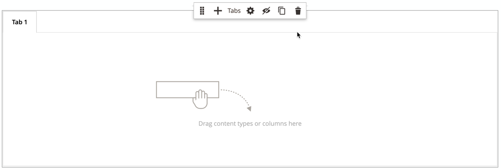

# Diseño: fichas

Use el tipo de contenido _Tabs_ para agregar un conjunto de pestañas en la [[!DNL Page Builder] etapa](workspace.md#stage). Al arrastrar el marcador de posición de pestañas desde el panel al escenario, aparece inicialmente una sola pestaña predeterminada. Puede agregar más pestañas para crear un conjunto completo. La anchura del conjunto de pestañas viene determinada por la anchura de su contenedor principal y la configuración de relleno.

{width="500" zoomable="yes"}

{{$include /help/_includes/page-builder-save-timeout.md}}

## Cajas de herramientas

Cuando trabaja con el tipo de contenido _Tabs_, agrega y edita fichas individuales y el contenedor de fichas que contiene una o más fichas. Cada ficha tiene su propia caja de herramientas que se utiliza para diseñar fichas en el escenario [!DNL Page Builder].

### Cuadro de herramientas de ficha individual

{width="500" zoomable="yes"}

| Herramienta | Icono | Descripción |
|--- |--- |--- |
| Mover | {width="25"} | Este control situado junto a la etiqueta de la ficha se utiliza para mover la ficha individual a otra posición en el conjunto de fichas. |
| Configuración | {width="25"} | Abre la página Editar fichas, donde puede cambiar las propiedades de la ficha individual. |
| Duplicar | {width="25"} | Realiza una copia de la pestaña. |
| Eliminar | {width="25"} | Elimina la pestaña del conjunto de pestañas. |

{style="table-layout:auto"}

### Cuadro de herramientas Contenedor de pestañas

{width="500" zoomable="yes"}

| Herramienta | Icono | Descripción |
|--- |--- |--- |
| Mover | {width="25"} | Mueve el conjunto de fichas a otra posición en la cuadrícula del contenedor principal. |
| Añadir | {width="25"} | Agrega una pestaña al conjunto de pestañas. |
| (etiqueta) | [!UICONTROL Tabs] | Identifica el contenedor actual como un conjunto de pestañas. Pase el ratón por encima del borde superior del contenedor para ver el cuadro de herramientas. |
| Configuración | {width="25"} | Abre la página Editar ficha, donde puede cambiar las propiedades del contenedor. |
| Hide | {width="25"} | Oculta el contenedor de pestañas. |
| Mostrar | {width="25"} | Muestra el contenedor de pestañas oculto. |
| Duplicar | {width="25"} | Realiza una copia de la ficha actual. |
| Eliminar | {width="25"} | Elimina el conjunto de pestañas actual del escenario. |

{style="table-layout:auto"}

{{$include /help/_includes/page-builder-hidden-element-note.md}}

## Añadir una pestaña individual

1. En el panel [!DNL Page Builder] bajo _[!UICONTROL Layout]_, arrastre el marcador de posición **[!UICONTROL Tabs]**directamente al escenario o a una fila o columna del escenario.

   {width="600" zoomable="yes"}

1. Haga clic en la etiqueta **[!UICONTROL Tab 1]** para mostrar el cuadro de herramientas de fichas individuales y elija el icono _Configuración_ ( {width="20"} ).

1. Escriba **[!UICONTROL Tab Name]** que desee usar como etiqueta.

   {width="600" zoomable="yes"}

1. Si es necesario, escriba **[!UICONTROL Minimum Height]** en la ficha.

   Este valor puede ser un número con cualquier unidad CSS válida (como `100px`, `50%`, `50em`, `100vh`) o un cálculo (como `100vh - 237px`).

1. Elija una configuración de **[!UICONTROL Vertical Alignment]** para alinear cualquier contenedor de contenido que se agregue a la pestaña (Superior, Centro o Inferior).

1. Si es necesario, configure las demás opciones utilizando las siguientes secciones como guía:

   - [[!UICONTROL Background]][background]
   - [[!UICONTROL Advanced]][advanced]

1. En la esquina superior derecha, haga clic en **[!UICONTROL Save]** para aplicar la configuración y volver al área de trabajo [!DNL Page Builder].

## Agregar un conjunto de pestañas

Los pasos siguientes comienzan con una pestaña individual y crean un conjunto de tres pestañas dentro de un contenedor de pestañas. Si todavía no tiene una pestaña individual, siga las instrucciones anteriores para agregar una sola pestaña al escenario.

1. Pase el ratón sobre el contenedor de pestañas para mostrar la caja de herramientas y elija el icono _Agregar_ ( {width="20"} ).

1. Haga clic en la etiqueta **[!UICONTROL Tab 2]** para mostrar el cursor e introduzca su propia etiqueta para la pestaña.

1. Vuelva a hacer clic en la segunda ficha del escenario y elija el icono _Duplicar_ ( {width="20"} ).

1. Haga clic en la etiqueta YourName **[!UICONTROL Copy]** para mostrar el cursor e introduzca su propia etiqueta para la tercera pestaña.

{width="600" zoomable="yes"}

## Mover una pestaña dentro del conjunto

1. Haga clic en la ficha que desee mover.

1. Seleccione y arrastre el icono _Mover_ ({width="20"} ), que aparece justo antes del texto de la etiqueta de la pestaña, a una nueva posición dentro del conjunto de pestañas.

## Adición de contenido a una pestaña

Puede cambiar cualquier tipo de contenido en una pestaña, igual que en una fila. Siga estos pasos para agregar un tipo de contenido de texto como ejemplo.

1. Haga clic en la pestaña donde desee añadir el contenido.

1. En el panel [!DNL Page Builder], expanda **[!UICONTROL Elements]** y arrastre un marcador de posición **Texto** a la pestaña.

1. Introduzca o pegue texto en el editor y utilice la barra de herramientas del editor para darle formato según sea necesario.

   Consulte [Elementos - Texto](text.md) para obtener más información acerca de cómo trabajar con el tipo de contenido de texto.

   {width="500" zoomable="yes"}

1. En la esquina superior derecha, haga clic en **[!UICONTROL Save]**.

## Cambiar la configuración de ficha individual

1. Pase el ratón sobre una ficha individual para ver la caja de herramientas y elija el icono _Configuración_ ( {width="20"} ).

1. Si es necesario, cambie cualquiera de las configuraciones básicas de la pestaña:

   - **[!UICONTROL Tab Name]** - Escriba texto revisado para la etiqueta de tabulación. También puede modificar la etiqueta directamente en el escenario.

   - **[!UICONTROL Minimum Height]**: escriba como píxeles si desea anular la altura automática. Por ejemplo, puede establecer la altura mínima para que coincida con la altura de una imagen de fondo para garantizar que la imagen completa sea visible.

   - **[!UICONTROL Vertical Alignment]**: elija la posición vertical de los contenedores de contenido que se agregan a la pestaña.

1. Cambie el resto de la configuración según sea necesario mediante las siguientes secciones para obtener más información.

1. Una vez finalizado, haga clic en **[!UICONTROL Save]** para aplicar la configuración y volver al área de trabajo [!DNL Page Builder].

### Contexto

- **[!UICONTROL Background Color]**: especifique el color de fondo eligiendo una muestra, haciendo clic en el selector de color o introduciendo un nombre de color válido o un valor hexadecimal equivalente. Esta configuración determina el color de fondo de la fila. También puede ajustar la opacidad del color.

  {width="200"}

  Puede introducir un valor de tres formas:

   - Un nombre de color predefinido, como `White`

   - El valor hexadecimal del color, como `#ffffff`

   - El valor rgba del color, con un porcentaje de opacidad, como `rgba(255, 255, 255, 0.75)`

  Si desea elegir un color, haga clic en la muestra a la izquierda del cuadro _Sin color_.

  {width="600" zoomable="yes"}

  Si hace clic en el cuadro de color para abrir de nuevo el selector de color, el cuadro situado debajo del control deslizante mostrará los valores actuales de rojo, verde, azul y alfa (rgba). El último número indica el porcentaje de opacidad actual como decimal. Puede utilizar el control deslizante para ajustar la opacidad o introducir el valor decimal deseado.

  {width="600" zoomable="yes"}

  >[!NOTE]
  >
  >[!DNL Page Builder] también admite una capa de transparencia, o _canal alfa_, en imágenes de fondo que se pueden usar para crear fondos con distintos grados de opacidad.

- **[!UICONTROL Background Image]**: si es necesario, utilice las herramientas proporcionadas para elegir una imagen de fondo que aplicar a la pestaña:

  | Herramienta | Descripción |
  |--- |--- |
  | [!UICONTROL Upload] | Carga un archivo de imagen desde el equipo local a la galería y, a continuación, lo aplica como imagen de fondo de la ficha. |
  | [!UICONTROL Select from Gallery] | Le pide que elija una imagen existente de la galería como imagen de fondo para la ficha. |
  | {width="25"} | Permite arrastrar la imagen al mosaico de la cámara o navegar a la imagen en el sistema de archivos local. |

  {style="table-layout:auto"}

- **[!UICONTROL Background Mobile Image]**: si es necesario, utilice las mismas herramientas para elegir una imagen de fondo diferente para usarla en dispositivos móviles.

- **[!UICONTROL Background Size]**: elija cómo se escalará la imagen de fondo en relación con la anchura de la pestaña:

  | Opción | Descripción |
  |--- |--- |
  | `Cover` | La imagen de fondo cubre el ancho completo de la pestaña. |
  | `Contain` | La imagen de fondo está limitada a la anchura del área de tabulación. |
  | `Auto` | Aplica el tamaño de la hoja de estilos actual. |

  {style="table-layout:auto"}

- **[!UICONTROL Background Position]** - Elija cómo se ancla la imagen de fondo en relación con la pestaña: `Top Left` / `Top Center` / `Top Right` / `Center Left` / `Center` / `Center Right` / `Bottom Left` / `Bottom Center` / `Bottom Right`

- **[!UICONTROL Background Attachment]** - Elija el tipo de archivo adjunto para determinar cómo se mueve la imagen de fondo en relación con la página de desplazamiento:

  | Opción | Descripción |
  | --- | --- |
  | `Scroll` | La imagen de fondo adjunta se sincroniza para moverse hacia abajo a medida que la página se desplaza. |
  | `Fixed` | (No disponible para móviles) La imagen de fondo no se mueve cuando el contenedor se desplaza por la imagen y está fijo en la posición de fondo especificada. |

  {style="table-layout:auto"}

- **[!UICONTROL Background Repeat]** - Se establece en `Yes` para repetir la imagen de fondo y rellenar el espacio disponible en la pestaña.

### Avanzadas

- Para controlar la alineación horizontal de los contenedores de contenido que se agregan a la ficha, elija un **[!UICONTROL Alignment]**

  | Opción | Descripción |
  | --- | --- |
  | `Default` | Aplica la configuración predeterminada de alineación especificada en la hoja de estilos de la temática actual. |
  | `Left` | Alinea los contenedores de contenido a lo largo del borde izquierdo de la pestaña, con margen para cualquier relleno que se especifique. |
  | `Center` | Alinea el contenedor de contenido en el centro de la ficha, con margen para cualquier relleno que se especifique. |
  | `Right` | Alinea el contenedor de contenido a lo largo del borde derecho de la pestaña, con margen para cualquier relleno que se especifique. |

  {style="table-layout:auto"}

- Establezca el estilo **[!UICONTROL Border]** que se aplica a los cuatro lados del contenedor de pestañas:

  | Opción | Descripción |
  | --- | --- |
  | `Default` | Aplica el estilo de borde predeterminado especificado por la hoja de estilos asociada. |
  | `None` | No proporciona ninguna indicación visible de los bordes del contenedor. |
  | `Dotted` | El borde del contenedor aparece como una línea de puntos. |
  | `Dashed` | El borde del contenedor aparece como una línea discontinua. |
  | `Solid` | El borde del contenedor aparece como una línea sólida. |
  | `Double` | El borde del contenedor aparece como una línea doble. |
  | `Groove` | El borde del contenedor aparece como una línea ranurada. |
  | `Ridge` | El borde del contenedor aparece como una línea discontinua. |
  | `Inset` | El borde del contenedor aparece como una línea de margen. |
  | `Outset` | El borde del contenedor aparece como una línea de inicio. |

  {style="table-layout:auto"}

- Si establece un estilo de borde distinto de `None`, complete las opciones de visualización de borde:

  {width="600" zoomable="yes"}

  | Opción | Descripción |
  | ------ |------------ |
  | [!UICONTROL Border Color] | Especifique el color seleccionando una muestra, haciendo clic en el selector de color o introduciendo un nombre de color válido o un valor hexadecimal equivalente. |
  | [!UICONTROL Border Width] | Introduzca el número de píxeles de la anchura de la línea del borde. |
  | [!UICONTROL Border Radius] | Introduzca el número de píxeles para definir el tamaño del radio que se utiliza para redondear cada esquina del borde. |

  {style="table-layout:auto"}

  La fila del ejemplo siguiente tiene un radio de borde de 15.

  {width="500"}

- (Opcional) Especifique los nombres de **[!UICONTROL CSS classes]** de la hoja de estilos actual para aplicarlos al contenedor de columnas.

  Separe los distintos nombres de clase con un espacio.

- Escriba valores, en píxeles, para que **[!UICONTROL Margins and Padding]** especifique los márgenes exteriores y el margen interior de la columna.

  Introduzca cada valor correspondiente en el diagrama del contenedor de pestañas.

  | Área del contenedor | Descripción |
  | -------------- | ---------- |
  | [!UICONTROL Margins] | Cantidad de espacio en blanco que se aplica al borde exterior de todos los lados del contenedor. Opciones: `Top` / `Right` / `Bottom` / `Left` |
  | [!UICONTROL Padding] | Cantidad de espacio en blanco que se aplica al borde interior de todos los lados del contenedor. Opciones: `Top` / `Right` / `Bottom` / `Left` |

  {style="table-layout:auto"}

## Cambiar configuración del conjunto de pestañas

1. Pase el ratón sobre el borde superior del contenedor del conjunto de pestañas para mostrar la caja de herramientas y elija el icono _Configuración_ ( {width="20"} ).

1. Si es necesario, cambie **[!UICONTROL Default Active Tab]**.

   Elija la pestaña del conjunto que desea que esté activa cuando se cargue la página.

1. Escriba **[!UICONTROL Minimum Height]**, en píxeles, si desea anular la altura automática del conjunto de pestañas.

1. Para colocar las fichas de navegación en la parte superior del conjunto de fichas, elija **[!UICONTROL Tab Navigation Alignment]** (`Left`, `Center` o `Right`).

   {width="500" zoomable="yes"}

1. Defina las opciones avanzadas para el conjunto de pestañas:

   - Para controlar la posición del conjunto de pestañas dentro del contenedor principal, elija un **[!UICONTROL Alignment]**:

     | Opción | Descripción |
     | ------ | ---------- |
     | `Default` | Aplica la configuración predeterminada de alineación especificada en la hoja de estilos de la temática actual. |
     | `Left` | Alinea el conjunto de pestañas a lo largo del borde izquierdo del contenedor principal, con margen para cualquier relleno que se especifique. |
     | `Center` | Alinea el conjunto de pestañas en el centro del contenedor principal, con margen para cualquier relleno que se especifique. |
     | `Right` | Alinea el conjunto de pestañas a lo largo del borde derecho del contenedor principal, con margen para cualquier relleno que se especifique. |

     {style="table-layout:auto"}

   - Establezca el estilo **[!UICONTROL Border]** aplicado a los cuatro lados del contenedor de pestañas:

     | Opción | Descripción |
     | ------ | ---------- |
     | `Default` | Aplica el estilo de borde predeterminado especificado por la hoja de estilos asociada. |
     | `None` | No proporciona ninguna indicación visible de los bordes del contenedor. |
     | `Dotted` | El borde del contenedor aparece como una línea de puntos. |
     | `Dashed` | El borde del contenedor aparece como una línea discontinua. |
     | `Solid` | El borde del contenedor aparece como una línea sólida. |
     | `Double` | El borde del contenedor aparece como una línea doble. |
     | `Groove` | El borde del contenedor aparece como una línea ranurada. |
     | `Ridge` | El borde del contenedor aparece como una línea discontinua. |
     | `Inset` | El borde del contenedor aparece como una línea de margen. |
     | `Outset` | El borde del contenedor aparece como una línea de inicio. |

     {style="table-layout:auto"}

   - Si establece un estilo de borde distinto de `None`, complete las opciones de visualización de borde:

     | Opción | Descripción |
     | ------ |------------ |
     | [!UICONTROL Border Color] | Especifique el color seleccionando una muestra, haciendo clic en el selector de color o introduciendo un nombre de color válido o un valor hexadecimal equivalente. |
     | [!UICONTROL Border Width] | Introduzca el número de píxeles de la anchura de la línea del borde. |
     | [!UICONTROL Border Radius] | Introduzca el número de píxeles para definir el tamaño del radio que se utiliza para redondear cada esquina del borde. |

     {style="table-layout:auto"}

   - (Opcional) Especifique los nombres de **[!UICONTROL CSS classes]** de la hoja de estilos actual para aplicarlos al contenedor de pestañas.

     Separe los distintos nombres de clase con un espacio.

   - Escriba valores, en píxeles, para que **[!UICONTROL Margins and Padding]** determine los márgenes externos y el relleno interno del contenedor de fichas.

     Introduzca los valores correspondientes en el diagrama del contenedor de pestañas.

     | Área del contenedor | Descripción |
     | -------------- | ---------- |
     | [!UICONTROL Margins] | Cantidad de espacio en blanco que se aplica al borde exterior de todos los lados del contenedor. Opciones: `Top` / `Right` / `Bottom` / `Left` |
     | [!UICONTROL Padding] | Cantidad de espacio en blanco que se aplica al borde interior de todos los lados del contenedor. Opciones: `Top` / `Right` / `Bottom` / `Left` |

     {style="table-layout:auto"}

1. Una vez finalizado, haga clic en **[!UICONTROL Save]** para aplicar la configuración y volver al área de trabajo [!DNL Page Builder].

[background]: #background
[advanced]: #advanced

<!-- Last updated from includes: 2023-09-11 14:30:19 -->
