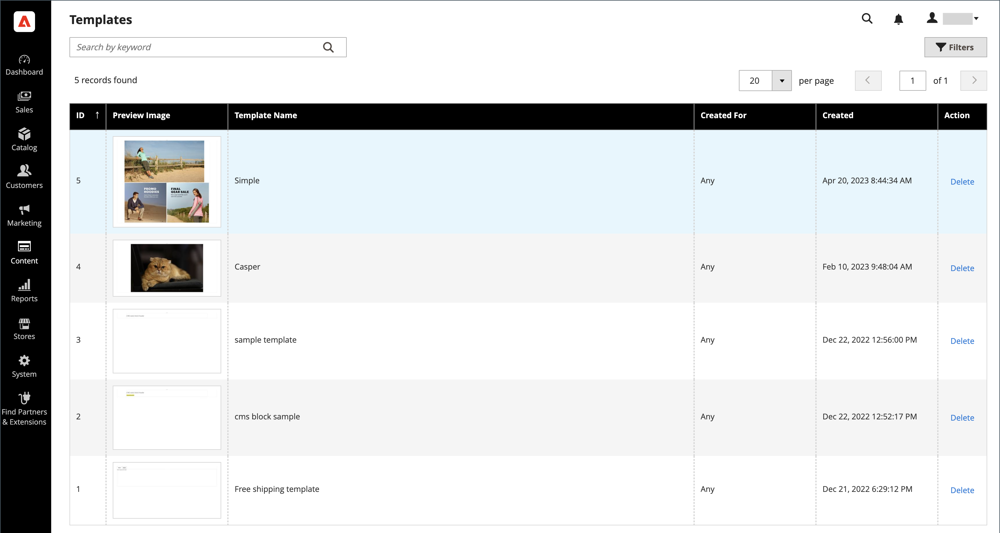

# [!DNL Page Builder] plantillas

Las plantillas son contenedores que guardan contenido de [!DNL Page Builder] y diseños de páginas, bloques, bloques dinámicos, atributos de productos y descripciones de categorías existentes. El uso de plantillas le ahorra tiempo y esfuerzo al crear contenido (o reemplazar contenido antiguo). Por ejemplo, puede guardar el contenido existente de [!DNL Page Builder] como una plantilla y luego aplicar esa plantilla (con todo su contenido y diseños) a otra área para crear rápidamente el contenido de [!DNL Page Builder].

## Acceso a plantillas

En la barra lateral _Admin_, vaya a **[!UICONTROL Content]** > _[!UICONTROL Elements]_>**[!UICONTROL Templates]**.

{width="700" zoomable="yes"}

## Guardar contenido de [!DNL Page Builder] como plantilla

1. Vaya a [[!DNL Page Builder] stage](workspace.md#stage) y acceda al contenido que desea guardar como plantilla.

   Puede ser una descripción de página, bloque, bloque dinámico, atributo de producto o categoría.

1. Encima del escenario, haga clic en **[!UICONTROL Save as Template]** en la parte superior derecha.

   ![[!DNL Page Builder] fase con el botón Guardar como plantilla](./assets/pb-templates-saveastemplate-button.png){width="600" zoomable="yes"}

   Esta acción muestra el diálogo _[!UICONTROL Save Content as Template]_.

   ![[!DNL Page Builder] cuadro de diálogo Guardar como plantilla](./assets/pb-templates-save-dialog.png){width="400" zoomable="yes"}

1. Para **[!UICONTROL Template Name]**, escriba un nombre único para la plantilla.

   Se requiere un nombre único para que se pueda buscar, seleccionar y aplicar a otra área de contenido según sea necesario.

1. Si es necesario, establezca **Creado para** para asignar la plantilla a un tipo de área de contenido en particular.

   Al agregar esta asignación, se puede filtrar y encontrar más fácilmente cuando desee aplicar esa plantilla más adelante. Pero no limita su uso a esa área. Puede usar cualquier plantilla en cualquier lugar donde se permita el contenido de [!DNL Page Builder].

1. Haga clic en **[!UICONTROL Save]**.

   Aparecerá un mensaje de confirmación que indica que se ha guardado la plantilla.

## Aplicar una plantilla

Puede aplicar una plantilla a un área de contenido [!DNL Page Builder] (página, bloque, bloque dinámico, atributo de producto o descripción de categoría).

1. Desplácese hasta el área de contenido en la que desee aplicar la plantilla.

1. En el área de contenido, haga clic en **[!UICONTROL Apply Template]** en la parte superior derecha.

   ![[!DNL Page Builder] Botón Aplicar plantilla](./assets/pb-templates-applytemplate-button.png){width="600" zoomable="yes"}

1. Elija una plantilla de la cuadrícula _[!UICONTROL Apply Template]_&#x200B;y haga clic en **[!UICONTROL Apply]**&#x200B;al final de la fila.

   Para ver la plantilla completa, puede hacer clic en la imagen en miniatura de la plantilla. Esta acción expande la imagen para que pueda ver toda la plantilla según sea necesario.

   ![[!DNL Page Builder] Aplicar cuadrícula de plantilla](./assets/pb-templates-apply-slideout-nofilters.png){width="600" zoomable="yes"}

## Eliminación de una plantilla

1. En la barra lateral _Admin_, vaya a **[!UICONTROL Content]** > **[!UICONTROL Templates]**.

1. En la página _Plantillas_, elija una plantilla y haga clic en **[!UICONTROL Delete]** al final de la fila.

   Para ver la plantilla completa, puede hacer clic en la imagen en miniatura de la plantilla. Esta acción expande la imagen para que pueda ver toda la plantilla según sea necesario.

1. Cuando se le solicite, confirme la eliminación de la plantilla.

## Filtrar plantillas

La cuadrícula _Aplicar plantilla_ y la cuadrícula de página _Plantillas_ proporcionan dos formas de filtrar la cuadrícula de plantillas:

- Utilice el cuadro de búsqueda de la parte superior izquierda para filtrar la cuadrícula por el nombre de la plantilla, en función del texto introducido.

- Haga clic en **[!UICONTROL Filters]** para abrir las opciones de filtros, donde puede filtrar las plantillas por:

   - Un rango de ID de plantilla (**[!UICONTROL ID]**)
   - Un intervalo de fechas de creación (**[!UICONTROL Created]**)
   - El nombre de la plantilla (**[!UICONTROL Template Name]**)
   - El área de contenido designada (**[!UICONTROL Created For]**)

![[!DNL Page Builder] Aplicar cuadrícula de plantilla](./assets/pb-templates-apply-slideout-withfilters.png){width="600" zoomable="yes"}

## Demostración de plantillas de contenido

Vea este vídeo para obtener más información sobre las plantillas de contenido de Page Builder:

>[!VIDEO](https://video.tv.adobe.com/v/3410841?quality=12&learn=on&captions=spa)
